# АННОТАЦИЯ

В данном руководстве приведены сведения, необходимые для установки и
эксплуатации компонента пользовательского веб-интерфейса для
администраторов\
«Jatoba data safe» (далее по тексту -- компонент или JDS).

Степени важности примечаний, применяемые в документе:

|                                                                                     |                                                               |
|-------------------------------------------------------------------------------------|---------------------------------------------------------------|
|  | **Важная информация** -- указания, требующие особого внимания |

|                                                         |                                                                                    |
|---------------------------------------------------------|------------------------------------------------------------------------------------|
|  | **Дополнительная информация** -- указания, позволяющие упростить работу с изделием |

|                                                         |                                                                                     |
|---------------------------------------------------------|-------------------------------------------------------------------------------------|
|  | Для СУБД «Jatoba» версии ядра 4, 5, 6 и 18 используется версия компонента --- 2.11. |

:::warning[Важная информация]
Для сертифицированной версии СУБД «Jatoba» поддерживается работа только на ОС, указанных в формуляре на поставку!
:::

# СОДЕРЖАНИЕ

- [АННОТАЦИЯ](#аннотация)
- [СОДЕРЖАНИЕ](#содержание)
- [Назначение компонента](#назначение-компонента)
  - [Структура документации компонента](#структура-документации-компонента)
  - [Функциональные возможности](#функциональные-возможности)
  - [Требования к среде функционирования](#требования-к-среде-функционирования)
  - [Компоненты, используемые для работы JDS](#компоненты-используемые-для-работы-jds)
  - [Разделы JDS, совместимые с СУБД PostgreSQL](#разделы-jds-совместимые-с-субд-postgresql)
- [Установка и настройка](#установка-и-настройка)
  - [Аутентификация пользователей JDS](#аутентификация-пользователей-jds)
    - [Ролевая модель JDS](#ролевая-модель-jds)
    - [Модель ролевой консолидации JDS и целевой СУБД](#модель-ролевой-консолидации-jds-и-целевой-субд)
    - [Создание пользователей JDS](#создание-пользователей-jds)
    - [Подключения LDAP](#подключения-ldap)
      - [Создание пользователя JDS c LDAP аутентификацией](#создание-пользователя-jds-c-ldap-аутентификацией)
      - [Создание пользователей JDS из группы c LDAP аутентификацией](#создание-пользователей-jds-из-группы-c-ldap-аутентификацией)
      - [LDAP аутентификация пользователей JDS](#ldap-аутентификация-пользователей-jds)
      - [Обновление настроек LDAP аутентификации пользователей JDS с версии 2.9 на 2.10 JDS](#обновление-настроек-ldap-аутентификации-пользователей-jds-с-версии-29-на-210-jds)
  - [Вкладка «Безопасность». Парольная политика JDS](#вкладка-безопасность-парольная-политика-jds)
    - [Запрет на использование пароля из списка популярных](#запрет-на-использование-пароля-из-списка-популярных)
    - [Смена пароля пользователя JDS администратором](#смена-пароля-пользователя-jds-администратором)
    - [Смена пароля пользователем JDS](#смена-пароля-пользователем-jds)
    - [Блокирование пользователя JDS администратором](#блокирование-пользователя-jds-администратором)
    - [Разблокирование пользователя JDS](#разблокирование-пользователя-jds)
  - [Вкладка «Источники данных»](#вкладка-источники-данных)
    - [Информирование о неполном перечне наблюдаемых СУБД](#информирование-о-неполном-перечне-наблюдаемых-субд)
  - [Установка прав доступа к конфигурационным файлам](#установка-прав-доступа-к-конфигурационным-файлам)
    - [Установка прав доступа к конфигурационному файлу appsettings.json](#установка-прав-доступа-к-конфигурационному-файлу-appsettingsjson)
    - [Установка параметров в конфигурационного файле appsettings.json JDS](#установка-параметров-в-конфигурационного-файле-appsettingsjson-jds)
- [Раздел «Ландшафт» (Landscape)](#раздел-ландшафт-landscape)
  - [Навигация в разделе «Ландшафт»](#навигация-в-разделе-ландшафт)
    - [Список СУБД](#список-субд)
    - [Дерево инфраструктуры](#дерево-инфраструктуры)
  - [Хост. Вкладка «Обзор»](#хост-вкладка-обзор)
- [Раздел «Ландшафт». СУБД. Вкладка «Обзор»](#раздел-ландшафт-субд-вкладка-обзор)
- [Раздел «Ландшафт». СУБД. Вкладка «Список БД»](#раздел-ландшафт-субд-вкладка-список-бд)
- [Раздел «Ландшафт». СУБД. Вкладка «Параметры СУБД»](#раздел-ландшафт-субд-вкладка-параметры-субд)
  - [Шаблоны](#шаблоны)
    - [Создание шаблона](#создание-шаблона)
    - [Импорт шаблона](#импорт-шаблона)
    - [Применение шаблона к СУБД](#применение-шаблона-к-субд)
- [Раздел «Ландшафт». СУБД. Вкладка «Правила доступа»](#раздел-ландшафт-субд-вкладка-правила-доступа)
- [Раздел «Ландшафт». СУБД. Вкладка «Доступные расширения»](#раздел-ландшафт-субд-вкладка-доступные-расширения)
- [Раздел «Ландшафт». СУБД. Вкладка «Роли СУБД»](#раздел-ландшафт-субд-вкладка-роли-субд)
  - [Список пользователей](#список-пользователей)
  - [Создание роли](#создание-роли)
    - [Вкладка «Основные параметры» (Main settings);](#вкладка-основные-параметры-main-settings)
    - [Вкладка «Атрибуты»](#вкладка-атрибуты)
    - [Вкладка «Роли и группы» (Roles and groups)](#вкладка-роли-и-группы-roles-and-groups)
    - [Вкладка «Привилегии» (Privileges)](#вкладка-привилегии-privileges)
    - [Назначения](#назначения)
    - [Вкладка «SQL»](#вкладка-sql)
  - [Редактирование роли](#редактирование-роли)
  - [Недоступные функциональные возможности. «Работа с блокировками»](#недоступные-функциональные-возможности-работа-с-блокировками)
  - [Удаление роли](#удаление-роли)
  - [Псевдороль «Public»](#псевдороль-public)
- [Раздел «Ландшафт». СУБД. Вкладка «Список событий» (Event List)](#раздел-ландшафт-субд-вкладка-список-событий-event-list)
  - [Выбор служебной БД](#выбор-служебной-бд)
  - [Фильтр событий](#фильтр-событий)
  - [Просмотр списка событий](#просмотр-списка-событий)
  - [Выбор столбцов (Columns)](#выбор-столбцов-columns)
  - [Сортировка списка событий](#сортировка-списка-событий)
  - [Полнотекстовый поиск событий](#полнотекстовый-поиск-событий)
- [Раздел «Ландшафт». СУБД. Вкладка «Проблемы и решения» (Problems \& Solutions)](#раздел-ландшафт-субд-вкладка-проблемы-и-решения-problems--solutions)
  - [Вкладка «Правила сканирования»](#вкладка-правила-сканирования)
  - [Режим сканирования](#режим-сканирования)
  - [Вкладка «Задачи»](#вкладка-задачи)
  - [Работа нескольких пользователей с подразделом «Проблемы и решения» (Problems \& Solutions)](#работа-нескольких-пользователей-с-подразделом-проблемы-и-решения-problems--solutions)
- [Раздел «Ландшафт». СУБД. Вкладка «Активность БД» (DB Activity)](#раздел-ландшафт-субд-вкладка-активность-бд-db-activity)
  - [Вкладка «Сессии» (Session)](#вкладка-сессии-session)
    - [Завершение сессии (End session)](#завершение-сессии-end-session)
  - [Вкладка «Блокировки» (Locks)](#вкладка-блокировки-locks)
    - [Завершение заблокированной сессии](#завершение-заблокированной-сессии)
  - [Вкладка «Подключения»](#вкладка-подключения)
- [Раздел «Ландшафт». СУБД. Вкладка «LDAP синхронизация» (LDAP Sync)](#раздел-ландшафт-субд-вкладка-ldap-синхронизация-ldap-sync)
  - [Табличная часть «Профили» (Profiles)](#табличная-часть-профили-profiles)
    - [Создание профиля синхронизации с Active Directory](#создание-профиля-синхронизации-с-active-directory)
    - [Создание профиля синхронизации с ALD Pro](#создание-профиля-синхронизации-с-ald-pro)
    - [Создание профиля синхронизации с FreeIPA](#создание-профиля-синхронизации-с-freeipa)
    - [Создание профиля синхронизации с Samba](#создание-профиля-синхронизации-с-samba)
    - [Настройка LDAPS для сервера СУБД в ОС семейства Windows и GNU/Linux](#настройка-ldaps-для-сервера-субд-в-ос-семейства-windows-и-gnulinux)
    - [Редактирование и удаление профиля синхронизации](#редактирование-и-удаление-профиля-синхронизации)
  - [Табличная часть «Маппинг» (Mappings)](#табличная-часть-маппинг-mappings)
    - [Создание профиля маппинга Active Directory](#создание-профиля-маппинга-active-directory)
    - [Создание профиля маппинга ALD Pro](#создание-профиля-маппинга-ald-pro)
    - [Создание профиля маппинга FreeIPA](#создание-профиля-маппинга-freeipa)
    - [Создание профиля маппинга Samba](#создание-профиля-маппинга-samba)
    - [Редактирование и удаление профиля маппинга](#редактирование-и-удаление-профиля-маппинга)
  - [Табличная часть «Журнал» (Log)](#табличная-часть-журнал-log)
- [Раздел «Ландшафт». СУБД. Вкладка «Парольные политики» (Password policies)](#раздел-ландшафт-субд-вкладка-парольные-политики-password-policies)
  - [Вкладка «Управление политиками» (Policy management)](#вкладка-управление-политиками-policy-management)
  - [Вкладка «Привязка ролей» (Role Binding)](#вкладка-привязка-ролей-role-binding)
  - [Вкладка «Работа с блокировками»](#вкладка-работа-с-блокировками)
    - [Вкладка «securityprofile»](#вкладка-securityprofile)
    - [Вкладка «checksum»](#вкладка-checksum)
- [Раздел «Ландшафт». БД. Вкладка «Обзор»](#раздел-ландшафт-бд-вкладка-обзор)
- [Раздел «Ландшафт». БД. Вкладка «Расширения»](#раздел-ландшафт-бд-вкладка-расширения)
  - [Установка расширения в БД](#установка-расширения-в-бд)
    - [Удаление расширений БД](#удаление-расширений-бд)
  - [БД. Установка расширения pg\_profile](#бд-установка-расширения-pg_profile)
    - [Вкладка «Настройки сервера»](#вкладка-настройки-сервера)
    - [Вкладка «Параметры»](#вкладка-параметры)
  - [БД. Установка расширения securityprofile (парольные политики)](#бд-установка-расширения-securityprofile-парольные-политики)
  - [БД. Установка расширения ja\_csum (контроль целостности)](#бд-установка-расширения-ja_csum-контроль-целостности)
- [Раздел «Ландшафт». БД. Вкладка «Матрица доступа» (Access matrix)](#раздел-ландшафт-бд-вкладка-матрица-доступа-access-matrix)
  - [Выбор субъектов](#выбор-субъектов)
  - [Фильтр «Матрицы доступа»](#фильтр-матрицы-доступа)
- [Раздел «Ландшафт». БД. Вкладка «Анализ рисков» (User Risk)](#раздел-ландшафт-бд-вкладка-анализ-рисков-user-risk)
  - [Выбор схемы данных (Schema)](#выбор-схемы-данных-schema)
  - [Отображение матрицы](#отображение-матрицы)
  - [Диаграмма](#диаграмма)
- [Раздел «Ландшафт». Вкладка «Кластеры jaDog»](#раздел-ландшафт-вкладка-кластеры-jadog)
  - [Навигация в разделе](#навигация-в-разделе)
    - [Вкладка «Обзор» параметров узла](#вкладка-обзор-параметров-узла)
    - [Вкладка «Обзор» кластера](#вкладка-обзор-кластера)
    - [Вкладка «Список узлов»](#вкладка-список-узлов)
    - [Вкладка «Параметры»](#вкладка-параметры-1)
  - [Подключение к существующему кластеру](#подключение-к-существующему-кластеру)
  - [Создание кластера](#создание-кластера)
  - [Подключение узла кластера](#подключение-узла-кластера)
    - [Каскадная репликация](#каскадная-репликация)
  - [Активация/деактивация PublicIP кластера](#активациядеактивация-publicip-кластера)
  - [Назначение узлу роли Мастер](#назначение-узлу-роли-мастер)
  - [Удаление узла](#удаление-узла)
  - [Дата-центр](#дата-центр)
    - [Подготовительные действия для создания кластера](#подготовительные-действия-для-создания-кластера)
    - [Создание/удаление Дата-центров](#созданиеудаление-дата-центров)
    - [Присоединение узлов кластера к Дата-центру](#присоединение-узлов-кластера-к-дата-центру)
  - [Отключение кластера от JDS](#отключение-кластера-от-jds)
  - [Режим «технического обслуживания» (maintenance)](#режим-технического-обслуживания-maintenance)
  - [Реинициализация (Reinit) неработоспособного узла (DIED)](#реинициализация-reinit-неработоспособного-узла-died)
- [Раздел «Мониторинг» (Monitoring)](#раздел-мониторинг-monitoring)
  - [Библиотека виджетов](#библиотека-виджетов)
  - [Добавление панели виджетов](#добавление-панели-виджетов)
  - [Панель виджетов для кластера ja\_Hipe\_Cluster](#панель-виджетов-для-кластера-ja_hipe_cluster)
  - [Панель виджетов для кластера jaDog](#панель-виджетов-для-кластера-jadog)
  - [Уведомления. Информирование о заданном значении показателя](#уведомления-информирование-о-заданном-значении-показателя)
- [Раздел «Анализ запросов» (Query analysis)](#раздел-анализ-запросов-query-analysis)
  - [Вкладка «Запросы»](#вкладка-запросы)
  - [Вкладка «Мегазапросы»](#вкладка-мегазапросы)
  - [Вкладка «Блокировки»](#вкладка-блокировки)
  - [Вкладка «Ошибки»](#вкладка-ошибки)
    - [Вкладка «по хостам»](#вкладка-по-хостам)
    - [Вкладка «по ошибкам»](#вкладка-по-ошибкам)
  - [Вкладка «Статистика»](#вкладка-статистика)
  - [Вкладка «Настройки»](#вкладка-настройки)
  - [Форматирование запроса](#форматирование-запроса)
  - [Добавление плана запроса](#добавление-плана-запроса)
    - [Форматированное текстовое представление плана запроса](#форматированное-текстовое-представление-плана-запроса)
    - [Сравнительные диаграммы плана запроса](#сравнительные-диаграммы-плана-запроса)
    - [Функциональная диаграмма плана запроса](#функциональная-диаграмма-плана-запроса)
    - [Модель плана запроса](#модель-плана-запроса)
    - [Диаграмма отношений таблиц](#диаграмма-отношений-таблиц)
    - [Автоматические рекомендации по повышению качества запросов](#автоматические-рекомендации-по-повышению-качества-запросов)
- [Подраздел «Подключения JDS» (JDS connections)](#подраздел-подключения-jds-jds-connections)
- [Раздел «Резервное копирование» (Backup)](#раздел-резервное-копирование-backup)
  - [Настройки для ProBackUp](#настройки-для-probackup)
  - [Вкладка «Хранилища»](#вкладка-хранилища)
  - [Вкладка «Резервные копии»](#вкладка-резервные-копии)
  - [Восстановление резервной копии](#восстановление-резервной-копии)
- [Раздел «Снимки и отчеты» (Snapshots \& Reports)](#раздел-снимки-и-отчеты-snapshots--reports)
  - [Вкладка «Снимки» (Snapshots)](#вкладка-снимки-snapshots)
  - [Вкладка «Baseline»](#вкладка-baseline)
  - [Вкладка «Отчеты» (Reports)](#вкладка-отчеты-reports)
- [Раздел «Уведомления» (Notifications)](#раздел-уведомления-notifications)
  - [Подраздел «Настройки» (Settings)](#подраздел-настройки-settings)
    - [Сервисы Email (Email services)](#сервисы-email-email-services)
    - [Сервисы Zulip (Zulip services)](#сервисы-zulip-zulip-services)
      - [Настройка бота Zulip](#настройка-бота-zulip)
      - [Создание Zulip подключения](#создание-zulip-подключения)
    - [Настройки обработки (Processing settings)](#настройки-обработки-processing-settings)
  - [Подраздел «Подписки и каналы событий» (Subscriptions and event channels)](#подраздел-подписки-и-каналы-событий-subscriptions-and-event-channels)
    - [Ошибки БД](#ошибки-бд)
    - [События учетных записей](#события-учетных-записей)
    - [Произвольный текст](#произвольный-текст)
    - [Канал событий программного компонента JDS](#канал-событий-программного-компонента-jds)
  - [Подраздел «Сообщения» (Messages)](#подраздел-сообщения-messages)
    - [Очередь (queue)](#очередь-queue)
      - [Отправка сообщений](#отправка-сообщений)
    - [Обработчики (Handlers)](#обработчики-handlers)
  - [Журнал сообщений (Message log)](#журнал-сообщений-message-log)
- [Журналы событий JDS](#журналы-событий-jds)
- [Сообщения об ошибках](#сообщения-об-ошибках)
  - [Ошибка при проверке подключения к цели: 28P01](#ошибка-при-проверке-подключения-к-цели-28p01)
  - [Ошибка при проверке подключения к цели](#ошибка-при-проверке-подключения-к-цели)
  - [Ошибка настройке конфигурационного файла: 28000](#ошибка-настройке-конфигурационного-файла-28000)
  - [Ошибка при получении списка записей журнала ldapsync](#ошибка-при-получении-списка-записей-журнала-ldapsync)
  - [Ошибка при получении списка профилей ldapsync](#ошибка-при-получении-списка-профилей-ldapsync)
  - [Ошибка при создании профиля ldapsync](#ошибка-при-создании-профиля-ldapsync)
  - [Ошибка при создании/обновления маппинга ldapsync](#ошибка-при-созданииобновления-маппинга-ldapsync)
  - [Ошибка при создании одноименного профиля ldapsync](#ошибка-при-создании-одноименного-профиля-ldapsync)
  - [Ошибка выполнения синхронизации](#ошибка-выполнения-синхронизации)
  - [Сообщение «Синхронизация частично выполнена»](#сообщение-синхронизация-частично-выполнена)
  - [Ошибка при добавлении в кластер Master узла](#ошибка-при-добавлении-в-кластер-master-узла)
  - [Ошибка при создании канала событий](#ошибка-при-создании-канала-событий)
  - [Дублирование сообщений при рассылке уведомлений](#дублирование-сообщений-при-рассылке-уведомлений)
  - [Резервное копирование](#резервное-копирование)
- [Термины и определения {#термины-и-определения .ListParagraph}](#термины-и-определения-термины-и-определения-listparagraph)
- [Перечень сокращений {#перечень-сокращений .ListParagraph}](#перечень-сокращений-перечень-сокращений-listparagraph)

Назначение компонента
=====================

Компонент пользовательского веб-интерфейса для администраторов «Jatoba
data safe» предназначен для администраторов СУБД, специалистов по
безопасности и аудиторов безопасности.

Разделы «Матрица доступа» и «Анализ рисков» используются, для:

-   проведения оперативного контроля назначенных прав и привилегий
    пользователям, администраторам и лицам, обеспечивающим
    функционирование информационной системы;

-   расследования инцидентов безопасности;

-   формирования аттестационной документации для АРМ и проведения ЕТК, в
    частности для документа -- разрешительная система доступа;

-   сертификационной документации Системы менеджмента информационной
    безопасности (далее -- СМИБ) (ISO/IEC 27001);

-   прохождения ежегодного аудита органом по сертификации СМИБ.

Раздел «Ландшафт» позволяет управлять кластером серверов СУБД. Раздел
представляет собой графическое отображение управления компонентом
«jaDog».

Раздел «Список событий (Event List)» предназначен для просмотра событий
безопасности. Разработан с учетом требований ГОСТ Р 59548 -- 2022
«Защита информации. Регистрация событий безопасности. Требования к
регистрируемой информации».

Для функционирования раздела требуется, чтобы на целевой СУБД был
установлен компонент «ja\_Log», обеспечивающий передачу событий
безопасности в служебную СУБД. Компонент «pgAudit» при этом обеспечивает
расширенную регистрацию событий безопасности.

Раздел «Снимки и отчеты (Snapshots & Reports)» предназначен для создания
снимков состояния БД (Snapshots) и получения отчетов. Формирование
статической информации выполняется компонентом «pg\_Profile».

Раздел «Проблемы и решения (Problems & Solutions)» представляет собой
интеллектуальный инструмент, который позволяет определять ряд проблем,
существующих в целевой СУБД.

Раздел «Анализ запросов» предназначен для визуализации плана запроса
средствами Pg-explain;

Раздел «Активность БД» предназначен для мониторинга активности СУБД;

Раздел «Подключения JDS» предназначен для отображения количества
подключений к компоненту.

Раздел «LDAP синхронизация (LDAP Sync)» предназначен для графического
отображения операций по синхронизации учетных записей cо службами
каталогов и учетных записей целевой СУБД. Для выполнения синхронизации
требуется, чтобы расширение было установлено на целевой СУБД.

Раздел «Уведомления» (Notifications)» предназначен для:

-   настройки сервисов отправки сообщений (Zulip) и писем (Email);

-   настройки периодичности отправки сообщений и писем;

-   формированию подписок на события безопасности пользователей JDS;

-   отправки сообщений и писем;

-   отправки писем с вложениями пользователям JDS подписанным на события
    безопасности.

Раздел «Ландшафт» предназначен для управления СУБД.
Раздел «Роли СУБД» предназначен для администрирования ролей целевой
СУБД.

Раздел «Парольные политики» предназначен для управления:

-   парольными политиками на целевой СУБД;

-   блокированием/разблокированием ролей.

Раздел «Резервное копирование» предназначен для управления резервными
копиями.

Структура документации компонента
---------------------------------

Документация компонента имеет распределенную структуру.

Установка компонента описана в документе «Руководство по установке».

Подготовка хостов и развертывание СУБД «Jatoba», настройка SSH и SSL
соединений описана в документе «Руководство по безопасности».

Подготовка хоста для подключения к разделу «Мониторинг» описана в
документе «Поддержка мониторинга СУБД».

Подготовка хоста для подключения к разделу «Анализ запросов» описана в
документе «Поддержка мониторинга СУБД в части анализа запросов».

Функциональные возможности компонента JDS описаны в настоящем документе.

Функциональные возможности
--------------------------

Компонент пользовательского веб-интерфейса обладает следующими
функциональными возможностями:

-   просмотр событий безопасности;

-   управление кластером СУБД;

-   формирование матрицы привилегий пользователей;

-   формирование матрицы системных привилегий пользователей;

-   формирование отчетов о СУБД;

-   синхронизация учетных записей пользователей;

-   управление ролями в целевой СУБД;

-   управление парольными политиками в целевой СУБД.

Клиентское приложение выполнено в форме веб-приложения и работает по
клиент-серверной технологии. Возможна клиент-серверная и локальная
установка.

При клиент-серверной установке компонент будет использовать СУБД как
служебную со служебной БД, а остальные СУБД будут для него в качестве
целевых СУБД.

Схема работы компонента при клиент-серверном варианте представлена на\
рисунке Рисунок 1.1.

Рисунок 1.1 -- Схема работы компонента при клиент-серверном варианте

При локальной установке на сервере СУБД станет для компонента основной.

В каждом из вариантов использования компонент JDS использует служебную
БД «jdsdb».

Схема работы компонента при локальной установке представлена на рисунке
Рисунок 1.2.

Рисунок 1.2 -- Схема работы компонента при локальной установке

Функциональная возможность по сбору событий безопасности с компонентом
«ja\_Log» и просмотру в разделе JDS «Event List» подразумевает хранение
их в служебной БД «ja\_log». В клиент-серверной установке выбирается
менее нагруженная СУБД с достаточным размером дискового пространства.
При локальной установке должна учитываться дополнительная нагрузка на
СУБД при сборе событий безопасности и размер свободного дискового
пространства.

<table>
<tbody>
<tr class="odd">
<td></td>
<td>Использование компонента JDS в локальной установке допустимо, но не является желательной. 
Рекомендуется использовать распределенную структуру, когда у компонента JDS есть своя служебная СУБД «Jatoba», т.е. клиент-серверный вариант, как описано выше.</td>
</tr>
</tbody>
</table>

Требования к среде функционирования
-----------------------------------

Компонент JDS поставляется в составе сертифицированной и коммерческой
версии СУБД «Jatoba».

Сертифицированная версия СУБД «Jatoba» может использоваться в значимых
объектах критической информационной инфраструктуры 1 категории, в
государственных информационных системах 1 класса защищенности, в
автоматизированных системах управления производственными и
технологическими процессами 1 класса защищенности, в информационных
системах персональных данных при необходимости обеспечения 1 уровня
защищенности персональных данных, в информационных системах общего
пользования II класса, для которых должна использоваться
сертифицированная ОС.

Компонент JDS функционирует под управлением ОС, указанных в таблице 1.1
документа «Руководство по установке СУБД Jatoba» 643.72410666.00067-08
97 01

Компонент JDS СУБД «Jatoba» устанавливается на ЭВМ с процессорами,
имеющими архитектуру x86, x86-64 и AMD64, удовлетворяющие следующим
аппаратным требованиям, указанным в таблице Таблица 1.1.

Таблица 1.1 -- Аппаратные требования к ЭВМ, на которых фукционируют
клиентская и серверная части СУБД

<table>
<thead>
<tr class="header">
<th><strong>Параметр</strong></th>
<th><strong>Характеристика</strong></th>
<th><blockquote>

<strong>Сертифицированная ОС</strong>

</blockquote></th>
</tr>
</thead>
<tbody>
<tr class="odd">
<td><blockquote>

<strong>Требования к аппаратному обеспечению сервера JDS</strong>

</blockquote></td>
<td></td>
<td></td>
</tr>
<tr class="even">
<td>ОЗУ</td>
<td>Не менее 2 Гб</td>
<td></td>
</tr>
<tr class="odd">
<td>Свободный объем жесткого диска</td>
<td>
Минимальный объем от 40 Гб

Рекомендуемый объем от 100 Гб
</td>
<td></td>
</tr>
<tr class="even">
<td>Устройства видео вывода</td>
<td>Монитор и видеоадаптер с поддержкой HD и Full HD</td>
<td></td>
</tr>
<tr class="odd">
<td>Тип процессора и минимальная тактовая частота процессора</td>
<td>64-разрядный процессор Intel или AMD 3 ГГц или больше</td>
<td></td>
</tr>
<tr class="even">
<td>Минимальное количество ядер</td>
<td>4</td>
<td></td>
</tr>
<tr class="odd">
<td>Устройства ввода-вывода</td>
<td>Стандартные 105-клавишная клавиатура и манипулятор «мышь» с USB, либо PS/2 интерфейсами</td>
<td></td>
</tr>
<tr class="even">
<td>Адаптер Ethernet</td>
<td>100 Мбит/с</td>
<td></td>
</tr>
<tr class="odd">
<td><blockquote>

<strong>Требования к программному обеспечению сервера JDS</strong>

</blockquote></td>
<td></td>
<td></td>
</tr>
<tr class="even">
<td>Поддерживаемые платформы</td>
<td><ul>
<li><blockquote>

win-x86;

</blockquote></li>
</ul></td>
<td><blockquote>



</blockquote></td>
</tr>
<tr class="odd">
<td></td>
<td><ul>
<li><blockquote>

win-x64;

</blockquote></li>
</ul></td>
<td><blockquote>



</blockquote></td>
</tr>
<tr class="even">
<td></td>
<td><ul>
<li><blockquote>

linux-x64

</blockquote></li>
</ul></td>
<td><blockquote>

Х

</blockquote></td>
</tr>
<tr class="odd">
<td>СУБД</td>
<td>Защищенная система управления базами данных «Jatoba»</td>
<td></td>
</tr>
<tr class="even">
<td>Веб-сервер</td>
<td>IIS 10</td>
<td><blockquote>



</blockquote></td>
</tr>
<tr class="odd">
<td></td>
<td>nginx</td>
<td><blockquote>

Х

</blockquote></td>
</tr>
<tr class="even">
<td>Компоненты</td>
<td><blockquote>

ASP.NET Core 6.0 Runtime (v6.0.1) – Windows Hosting Bundle Installer

</blockquote></td>
<td><blockquote>



</blockquote></td>
</tr>
<tr class="odd">
<td>Internet браузер</td>
<td><ul>
<li><blockquote>

Google Chrome;

</blockquote></li>
</ul></td>
<td><blockquote>

Х

</blockquote></td>
</tr>
<tr class="even">
<td></td>
<td><ul>
<li><blockquote>

Яндекс.Браузер;

</blockquote></li>
</ul></td>
<td><blockquote>

Х

</blockquote></td>
</tr>
<tr class="odd">
<td></td>
<td><ul>
<li><blockquote>

Chromium;

</blockquote></li>
</ul></td>
<td><blockquote>

Х

</blockquote></td>
</tr>
<tr class="even">
<td></td>
<td><ul>
<li><blockquote>

Opera;

</blockquote></li>
</ul></td>
<td><blockquote>

Х

</blockquote></td>
</tr>
<tr class="odd">
<td></td>
<td><ul>
<li><blockquote>

Mozilla Firefox.

</blockquote></li>
</ul></td>
<td><blockquote>

Х

</blockquote></td>
</tr>
</tbody>
</table>

|                                                                                     |                                                                                                                                                                                                   |
|-------------------------------------------------------------------------------------|---------------------------------------------------------------------------------------------------------------------------------------------------------------------------------------------------|
| {width="0.2513888888888889in" height="0.2513888888888889in"} | При использовании функциональной возможности по централизованному сбору событий безопасности с целевых СУБД в служебную СУБД JDS рекомендуется использовать дополнительное дисковое пространство. |

Компоненты, используемые для работы JDS 
----------------------------------------

Корректная работа компонента JDS гарантируется с компонентами, входящими
в поставку Изделия, и версии которых не ниже приведенных таблице Таблица
1.2.

Таблица 1.2 -- Версии компонент, совместимых с JDS

<table>
<thead>
<tr class="header">
<th><strong>Разделы JDS</strong></th>
<th><strong>Используемые компоненты</strong></th>
<th><strong>Версия ядра/компонента</strong></th>
</tr>
</thead>
<tbody>
<tr class="odd">
<td>Мониторинг</td>
<td>node_exporter</td>
<td>1.8.0-2159</td>
</tr>
<tr class="even">
<td></td>
<td>postgres_exporter</td>
<td>0.18.1</td>
</tr>
<tr class="odd">
<td></td>
<td>sql_exporter</td>
<td>0.18.6</td>
</tr>
<tr class="even">
<td></td>
<td>Prometheus</td>
<td>3.5.0</td>
</tr>
<tr class="odd">
<td></td>
<td>аlertmanager</td>
<td>0.27.0-3083</td>
</tr>
<tr class="even">
<td>Анализ рисков (User Risk)</td>
<td></td>
<td></td>
</tr>
<tr class="odd">
<td>Кластеры (Clusters)</td>
<td>ja_Dog</td>
<td>4.1</td>
</tr>
<tr class="even">
<td>События безопасности (Event List)</td>
<td>ja_Log</td>
<td>2.1</td>
</tr>
<tr class="odd">
<td>Матрица доступа (Access Matrix)</td>
<td></td>
<td>Х</td>
</tr>
<tr class="even">
<td>
Снимки и отчеты

(Snapshots &amp; Reports)
</td>
<td>pg_Profile</td>
<td>4.2</td>
</tr>
<tr class="odd">
<td>
Проблемы и решения

(Problems &amp; Solutions)
</td>
<td></td>
<td>Х</td>
</tr>
<tr class="even">
<td>Анализ запросов</td>
<td>pg-explain</td>
<td>1.6.2</td>
</tr>
<tr class="odd">
<td></td>
<td>pg-explain-db</td>
<td>1.6.0</td>
</tr>
<tr class="even">
<td></td>
<td>pg-monitor</td>
<td>1.6.5</td>
</tr>
<tr class="odd">
<td></td>
<td>pg-monitor-collector</td>
<td>1.6.5</td>
</tr>
<tr class="even">
<td></td>
<td>pg-monitor-dispatcher</td>
<td>1.6.5</td>
</tr>
<tr class="odd">
<td>Активность БД</td>
<td></td>
<td>Х</td>
</tr>
<tr class="even">
<td>Подключения JDS</td>
<td></td>
<td>Х</td>
</tr>
<tr class="odd">
<td>
LDAP синхронизация

(LDAP Sync)
</td>
<td>ja_Sync_Ldap</td>
<td>1.3.2</td>
</tr>
<tr class="even">
<td></td>
<td>JDV</td>
<td>1.5.0</td>
</tr>
<tr class="odd">
<td></td>
<td>securityprofile</td>
<td>2.4</td>
</tr>
<tr class="even">
<td>Ландшафт</td>
<td></td>
<td>Х</td>
</tr>
<tr class="odd">
<td>Роли СУБД</td>
<td>securityprofile</td>
<td>2.4</td>
</tr>
<tr class="even">
<td></td>
<td>JDV</td>
<td>1.5.0</td>
</tr>
<tr class="odd">
<td>Уведомления (Notifications)</td>
<td>ja_Log</td>
<td>1.1</td>
</tr>
<tr class="even">
<td>Парольные политики</td>
<td>securityprofile</td>
<td>2.4</td>
</tr>
<tr class="odd">
<td></td>
<td>ja_CSum</td>
<td>1.1</td>
</tr>
<tr class="even">
<td>Резервное копирование</td>
<td>pg_ProBackup</td>
<td>2.5.15</td>
</tr>
</tbody>
</table>

Сопоставление разделов JDS и компонентов целевой СУБД, обеспечивающих их
функционирование, представлено на рисунке Рисунок 1.3.

Рисунок 1.3 -- Компоненты целевой СУБД, требуемые для работы разделов
JDS

Разделы JDS, совместимые с СУБД PostgreSQL
------------------------------------------

|                                                         |                                                                                                               |
|---------------------------------------------------------|---------------------------------------------------------------------------------------------------------------|
| {width="0.25in" height="0.25in"} | Данный пункт не содержит в себе конкретных инструкций по развертыванию сторонних компонент, совместимых с JDS |

Функциональные возможности «Jatoba data safe» позволяют проводить
мониторинг и администрирование инсталляции СУБД под управлением
GNU/Linux:

-   СУБД «Jatoba»;

-   СУБД PostgreSQL.

В качестве служебной СУБД компонент «Jatoba data safe» может
использовать любую из вышеперечисленных СУБД. Для установки должен
использоваться инсталляционный скрипт install.sh, как описано в
документе «Руководство по установке». Скрипт обнаружит подходящую СУБД,
создаст служебную БД и пользователя.

Доступность разделов JDS при мониторинге СУБД PostgreSQL и используемые
компоненты приведены в таблице Таблица 1.3.

Таблица 1.3 -- Доступные разделы JDS при мониторинге СУБД PostgreSQL и
используемые при этом компоненты

<table>
<thead>
<tr class="header">
<th><strong>Разделы JDS</strong></th>
<th><strong>Доступность раздела при мониторинге PostgreSQL</strong></th>
<th><strong>JDS 2.11</strong></th>
<th><strong>Используемые компоненты 
PostgreSQL</strong></th>
<th><strong>Используемые компоненты 
Jatoba</strong></th>
</tr>
</thead>
<tbody>
<tr class="odd">
<td>Мониторинг</td>
<td>Х</td>
<td>Х</td>
<td>node_exporter</td>
<td>jatoba&lt;ver&gt;-node-exporter</td>
</tr>
<tr class="even">
<td></td>
<td></td>
<td></td>
<td>postgres_exporter</td>
<td>jatoba&lt;ver&gt;-postgres-exporter</td>
</tr>
<tr class="odd">
<td></td>
<td></td>
<td></td>
<td>sql_exporter</td>
<td>jatoba&lt;ver&gt;-sql-exporter</td>
</tr>
<tr class="even">
<td></td>
<td></td>
<td></td>
<td>prometheus</td>
<td>jatoba&lt;ver&gt;-prometheus</td>
</tr>
<tr class="odd">
<td></td>
<td></td>
<td></td>
<td>аlertmanager</td>
<td>jatoba&lt;ver&gt;-аlertmanager</td>
</tr>
<tr class="even">
<td>Анализ рисков (User Risk)</td>
<td>Х</td>
<td>Х</td>
<td>Не требует установки компонент</td>
<td>Не требует установки компонент</td>
</tr>
<tr class="odd">
<td>Кластеры jaDog (Clusters)</td>
<td></td>
<td>Х</td>
<td></td>
<td>Не применим jatoba&lt;ver&gt;-jadog</td>
</tr>
<tr class="even">
<td>События безопасности (Event List)</td>
<td></td>
<td>Х</td>
<td></td>
<td>Не применим jatoba&lt;ver&gt;-ja-log</td>
</tr>
<tr class="odd">
<td>
Матрица доступа

(Access Matrix)
</td>
<td>Х</td>
<td>Х</td>
<td>Не требует установки компонент</td>
<td>Не требует установки компонент</td>
</tr>
<tr class="even">
<td>
Снимки и отчеты

(Snapshots &amp; Reports)
</td>
<td>Х</td>
<td>Х</td>
<td>pg_Profile</td>
<td>Не применим jatoba&lt;ver&gt;-pg-profile</td>
</tr>
<tr class="odd">
<td>Проблемы и решения (Problems &amp; Solutions)</td>
<td>Х</td>
<td>Х</td>
<td>Не требует установки компонент</td>
<td>Не требует установки компонент</td>
</tr>
<tr class="even">
<td>Анализ запросов</td>
<td>Х</td>
<td>Х</td>
<td>auto_explain</td>
<td>auto_explain,</td>
</tr>
<tr class="odd">
<td></td>
<td></td>
<td></td>
<td>pgaudit</td>
<td>Не применим jatoba&lt;ver&gt;-pgaudit</td>
</tr>
<tr class="even">
<td></td>
<td></td>
<td></td>
<td>pg-repack</td>
<td>Не применим jatoba&lt;ver&gt;-pg-repack</td>
</tr>
<tr class="odd">
<td></td>
<td></td>
<td></td>
<td>pg-explain</td>
<td>Не применим pg-explain</td>
</tr>
<tr class="even">
<td></td>
<td></td>
<td></td>
<td>pg-explain-db</td>
<td>Не применим pg-explain-db</td>
</tr>
<tr class="odd">
<td></td>
<td></td>
<td></td>
<td>pg-monitor</td>
<td>Не применим pg-monitor</td>
</tr>
<tr class="even">
<td></td>
<td></td>
<td></td>
<td>pg-monitor-collector</td>
<td>Не применим pg-monitor-collector</td>
</tr>
<tr class="odd">
<td></td>
<td></td>
<td></td>
<td>pg-monitor-dispatcher</td>
<td>Не применим pg-monitor-dispatcher</td>
</tr>
<tr class="even">
<td>Активность БД</td>
<td>Х</td>
<td>Х</td>
<td>Не требует установки компонент</td>
<td>Не требует установки компонент</td>
</tr>
<tr class="odd">
<td>Подключения JDS</td>
<td>Х</td>
<td>Х</td>
<td>Не требует установки компонент</td>
<td>Не требует установки компонент</td>
</tr>
<tr class="even">
<td>
LDAP синхронизация

(LDAP Sync)
</td>
<td></td>
<td>Х</td>
<td></td>
<td>Не применим jatoba&lt;ver&gt;-ja-sync-ldap</td>
</tr>
<tr class="odd">
<td>Роли СУБД</td>
<td>Х</td>
<td>Х</td>
<td>Не требует установки компонент</td>
<td>Не требует установки компонент</td>
</tr>
<tr class="even">
<td>Уведомления (Notifications)</td>
<td></td>
<td>Х</td>
<td></td>
<td>Набор компонентов не применим</td>
</tr>
<tr class="odd">
<td>Парольные политики</td>
<td></td>
<td>Х</td>
<td></td>
<td>Не применим jatoba&lt;ver&gt;-securityprofile</td>
</tr>
</tbody>
</table>

Примечание:

Х -- Знак обозначает доступность раздел компонента JDS.

 -- Знак обозначает недоступность раздела компонента JDS или отсутствие
пакета (компонента) для СУБД PostgreSQL.

Пакеты компонентов могут быть использованы, как из репозитория СУБД
«Jatoba», так и из репозитория сторонних разработчиков. Использование
репозитория СУБД «Jatoba» полностью не представляется возможным, т.к.
компоненты разрабатывались специально для нее.

Доступность разделов, приведенных в таблице Таблица 1.3, схематично
отражена на рисунке Рисунок 1.4.

Рисунок 1.4 -- Перечень разделов JDS, доступных для работы с СУБД
PostgreSQL

Разделы «Анализ рисков», «Матрица доступа», «Активность БД»,
«Подключения JDS» и «Роли СУБД» используют SQL-запросы к БД и поэтому не
требуют установки дополнительных компонент.

Как было сказано выше, для раздела «Мониторинг» могут использоваться
компоненты как из репозитория СУБД «Jatoba», так и из репозитория
сторонних разработчиков. Функциональные возможности раздела описаны в
разделе 20 настоящего документа. Установка и настройка компонент описана
в документе «Руководство по настройке. Часть 28. Поддержка мониторинга
СУБД».

Раздел «Анализ запросов» будет доступен при использовании компонент
сторонних разработчиков.

Установка и настройка
=====================

Установка компонента «Jatoba Data Safe» полностью описана в документе
«Руководство по установке» в одноименном разделе.

Установка компонента происходит в два этапа:

1)  создание служебной БД на базе СУБД (БД) «Jatoba»;

2)  установка компонента JDS (см. документ «Руководстве по установке»).

<table>
<tbody>
<tr class="odd">
<td></td>
<td>
СУБД «Jatoba» должна быть установлена в первую очередь.

Для служебной БД JDS обязательно должен быть установлен параметр:

<blockquote>

standard_conforming_strings=on

Параметр устанавливается автоматически при установке.

</blockquote></td>
</tr>
</tbody>
</table>

Служебная БД будет хранить будет хранить учетные записи пользователей,
технические учетные записи и обеспечивать меры безопасности.

Установка и настройка служебной СУБД описана в документах:

-   «Защищенная система управления базами данных «Jatoba». Руководство
    по установке. 643.72410666.00067-08 95 01»;

-   «Защищенная система управления базами данных «Jatoba». Руководство
    администратора. 643.72410666.00067-08 97 01».

В качестве метода аутентификации должен использоваться метод «password».

Аутентификация пользователей JDS
--------------------------------

Реализована двухкомпонентная ролевая модель.

Первым компонентом выступает ролевая модель JDS, в которую включена
доступность разделов.

Вторым компонентом ролевой модели является набор ролей в целевых СУБД,
которым предоставлены необходимые права и привилегии при инициализации
компонент и расширений СУБД.

При использовании ролевой модели пользователь JDS не будет знать учетных
данных для доступа к инсталляции СУБД, что обеспечивает безопасный
доступ к конфиденциальным данным.

### Ролевая модель JDS 

Компонент JDS для доступа разделам использует встроенную ролевую модель.
В ролевой модели предустановлены:

-   Администратор СУБД - обеспечивающий эффективное функционирование,
    безопасность, резервное копирование и оптимизации работы СУБД;

-   Аудитор - выполняющий внутренний или внешний комплексный аудит
    систем ИБ, в том числе СУБД;

-   Администратор ИБ - обеспечивающий защиту информации в
    автоматизированных ИС, контроль доступа, мониторинг и расследование
    инцидентов.

-   Разработчик БД -- выполняющий разработку программного кода для
    манипулирования данными в БД, оптимизации работы БД в
    автоматизированных ИС.

{width="7.086805555555555in"
height="2.374307742782152in"}

Рисунок 2.1 -- Роли JDS

Для каждой роли назначены не изменяемые права доступа к разделам
компонента описанные в таблице Таблица 2.1.

Таблица 2.1 -- Назначенные права

| **Раздел**    | **Подраздел**             | **Роль**               |             |                      |                    |
|---------------|---------------------------|------------------------|-------------|----------------------|--------------------|
|               |                           | **Администратор СУБД** | **Аудитор** | **Администратор ИБ** | **Разработчик БД** |
| **Меню JDS ** | Ландшафт (СУБД)           | Управление             | Просмотр    | Просмотр             | Просмотр           |
|               | Ландшафт (Кластеры jaDog) | Управление             | Нет доступа | Нет доступа          | Нет доступа        |
|               | Мониторинг                | Управление             | Управление  | Управление           | Управление         |
|               | Анализ запросов           | Управление             | Нет доступа | Нет доступа          | Управление         |
|               | Подключения JDS           | Управление             | Нет доступа | Управление           | Нет доступа        |
|               | Резервное копирование     | Управление             | Просмотр    | Просмотр             | Нет доступа        |
|               | Снимки и отчеты           | Управление             | Нет доступа | Управление           | Управление         |
|               | Уведомления               | Управление             | Нет доступа | Управление           | Нет доступа        |
|               | Настройки                 | Управление             | Нет доступа | Нет доступа          | Нет доступа        |
| **Меню СУБД** | Обзор                     | Управление             | Просмотр    | Просмотр             | Просмотр           |
|               | Список БД                 | Управление             | Управление  | Управление           | Управление         |
|               | Параметры СУБД            | Управление             | Просмотр    | Просмотр             | Нет доступа        |
|               | Правила доступа           | Управление             | Просмотр    | Просмотр             | Нет доступа        |
|               | Доступные расширения      | Управление             | Нет доступа | Нет доступа          | Нет доступа        |
|               | Настройки для probackup   | Управление             | Нет доступа | Нет доступа          | Нет доступа        |
|               | Роли СУБД                 | Управление             | Нет доступа | Управление           | Нет доступа        |
|               | Список событий            | Управление             | Управление  | Управление           | Нет доступа        |
|               | Проблемы и решения        | Управление             | Нет доступа | Нет доступа          | Нет доступа        |
|               | Активность БД             | Управление             | Нет доступа | Управление           | Нет доступа        |
|               | LDAP синхронизация        | Управление             | Нет доступа | Нет доступа          | Нет доступа        |
|               | Парольные политики        | Управление             | Просмотр    | Управление           | Нет доступа        |
| **Меню БД**   | Обзор                     | Управление             | Просмотр    | Просмотр             | Просмотр           |
|               | Расширения                | Управление             | Нет доступа | Нет доступа          | Нет доступа        |
|               | Матрица доступа           | Управление             | Управление  | Управление           | Нет доступа        |
|               | Анализ рисков             | Управление             | Управление  | Управление           | Нет доступа        |

Предустановленные роли имеют атрибут «системные».

Дополнительно возможно создать специализированные роли, для которых
назначить особый набор прав доступа к каждому из подразделов. Набор прав
варьируется в зависимости от функциональной возможности их назначения.
Если такая возможность отсутствует, то название во вкладке помечено
серым цветом.

{width="7.086805555555555in"
height="4.211701662292214in"}

Рисунок 2.2 -- Создание специализированной роли

Назначенные права доступа для роли возможно:

-   просмотреть при нажатии на гиперссылку роли в модальном окне

-   изменить через контекстное меню в строке роли.

{width="7.085094050743657in"
height="2.3955227471566056in"}

Рисунок 2.3 -- Окно просмотра назначенных прав доступа

### Модель ролевой консолидации JDS и целевой СУБД

В модели ролевой консолидации пользователь JDS получив доступ к разделам
дальнейшие действия в целевой СУБД выполняет от имени и с правами
привилегированного пользователя.

{width="7.086805555555555in"
height="2.478636264216973in"}

Рисунок 2.4 - Модель ролевой консолидации

При этом действия каждого пользователя регистрируются в журнале событий
компонента.

### Создание пользователей JDS

Создание пользователей возможно от имени и с правами администратора
компонента JDS и доступно на вкладке «Пользователи» раздела «Настройки».
Если подключения к целевым СУБД были созданы ранее, то по умолчанию они
будут доступны пользователю с ролью «Администратор» и находиться в
списке.

Вызов окна создания пользователей компонента JDS доступен через
пиктограмму «Add», как представлено на рисунке Рисунок 2.5.

{width="7.086805555555555in" height="2.05in"}

Рисунок 2.5 -- Вкладка «Пользователи» («Users»)

В открывшимся окне потребуется установить параметры, приведенные в
таблице Таблица 2.2

Таблица 2.2 -- Параметры создания пользователя

| **№** | **Параметр**      | **Параметр (ENG)** | **Обязательность параметра** | **Тип поля**      |
|-------|-------------------|--------------------|------------------------------|-------------------|
| 1     | Логин             | Username           | Обязательный                 | Текстовое         |
| 2     | Пароль            | Password           | Обязательный                 | Текстовое         |
| 3     | Повторить пароль  | Repeat password    | Обязательный                 | Текстовое         |
| 4     | Роль              | Role               | Обязательный                 | Выпадающий список |
| 5     | Фамилия           | Last name          | Обязательный                 | Текстовое         |
| 6     | Имя               | First name         | Обязательный                 | Текстовое         |
| 7     | Отчество          | Middle name        | Необязательный               | Текстовое         |
| 8     | Эл. адрес         | E-mail             | Необязательный               | Текстовое         |
| 9     | Телефон           | Phone              | Необязательный               | Текстовое         |
| 10    | Лимит подключений | Connection limit   | Обязательный                 | Текстовое         |

При успешном создании пользователя, его учетная запись появится в списке
пользователей JDS.

Далее станут доступны операции по корректировке учетной записи
пользователя через контекстное меню:

-   Сменить пароль (Change password);

-   Редактировать;

-   Удалить (Delete).

### Подключения LDAP 

JDS поддерживает подключение пользователя компонента из активных
каталогов, таких как: Active Directory, FreeIPA, ALD Pro и Samba
используя отдельную группу пользователей LDAP.

<table>
<tbody>
<tr class="odd">
<td></td>
<td>
Во избежание проблем с подключением, рекомендуется в дереве каталогов LDAP проводить преднастройку - создание отдельной группы пользователей LDAP, для упрощения подключения и добавления пользователей, например ограничивать базы поиска до &quot;ou=users, dc=da, dc=lan&quot; (ActiveDirectory/SAMBA) или до определенной группы (cn=my_group, dc=da, dc=lan) для FreeIPA и ALDPro.

Примеры создания групп пользователей приведены в документе «Руководство по настройке. Часть 8. Синхронизация учетных записей служб каталогов и СУБД. Компонент «ja_Sync_LDAP».
</td>
</tr>
</tbody>
</table>

В рассматриваемом примере будет использоваться база поиска до
\"ou=users, dc=da, dc=lan\".

Перед настройкой подключения, если требуется подключение по доменному
имени, на хосте с JDS прописывается подключение к активному каталогу
командой:

> nano /etc/hosts

Внести IP-адрес и имя активного каталога.

Например

> 10.116.101.114 dc.domain.test

{width="6.697673884514436in"
height="3.0923501749781277in"}

Рисунок 2.6 -- Редактирование конфигурационного файла подключений

Вкладка «Подключения LDAP» находится в разделе «Настройки».

Создание подключения к активному каталогу выполняется нажатием кнопки
«Добавить подключение», которое вызовет окно «Создание подключения».

{width="7.086805555555555in"
height="3.076388888888889in"}

Рисунок 2.7 - Окно «Новое подключение»

Устанавливаются следующие параметры:

-   Источник: тип ОС активного каталога Active Directory, FreeIPA, ALD
    Pro или Samba

-   Домен: \* - IP-адрес или DNS имя хоста активного каталога;

-   Порт: \* - порт подключения;

-   База пользователей: \* - база поиска активного каталога, в которой
    может использоваться организационная группа (ou) и/или группа (cn);

-   Логин: \* - имя пользователя, имеющего административные привилегии;

-   Пароль: \* - пароль пользователя;

-   Сертификат: - сертификат в формате \*.pfx.

**Схема атрибутов**

-   Схема атрибутов: - схема устройства каталога LDAP того или иного
    типа. Устанавливается автоматически в зависимости от выбранного типа
    активного каталога

-   Идентификатор объекта: \* - атрибут, значение которого является
    уникальным идентификатором объекта в дереве структуры каталогов
    LDAP.

**Атрибуты пользователей**

-   Отображаемое имя: \* - атрибут, значение которого используется для
    отображения записи пользователя в дереве структуры каталогов LDAP.

-   Имя аккаунта: \* - атрибут, значение которого содержит имя
    пользователя, под которым он входит в систему и проходит
    аутентификацию.

**Атрибуты Групп**

-   Отображаемое имя: \* - атрибут группы, значение которого
    используется для отображения записи группы в дереве структуры
    каталогов LDAP;

-   Имя аккаунта: \*- атрибут группы, значение которого содержит имя,
    под которым она зарегистрирована в дереве каталогов LDAP.;

-   Пользователи в группе: \* - атрибут группы, значение которого
    содержит информацию о пользователях, состоящих в этой группе.

Созданное подключение отразится в общем списке подключений.

#### Создание пользователя JDS c LDAP аутентификацией

Пользователь JDS с LDAP аутентификацией создаётся во вкладке
«Пользователи» раздела «Настройки». В окне «Создание пользователя»
выбирается Вкладка «LDAP» и из выпадающих списков устанавливаются
параметры:

-   Домен-сервер: \* - сервер активного каталога;

-   Пользователь \* - пользователь активного каталога;

-   Роль: \* - назначаемая роль пользователю в JDS;

> Дополнительно устанавливается «Лимит подключений».

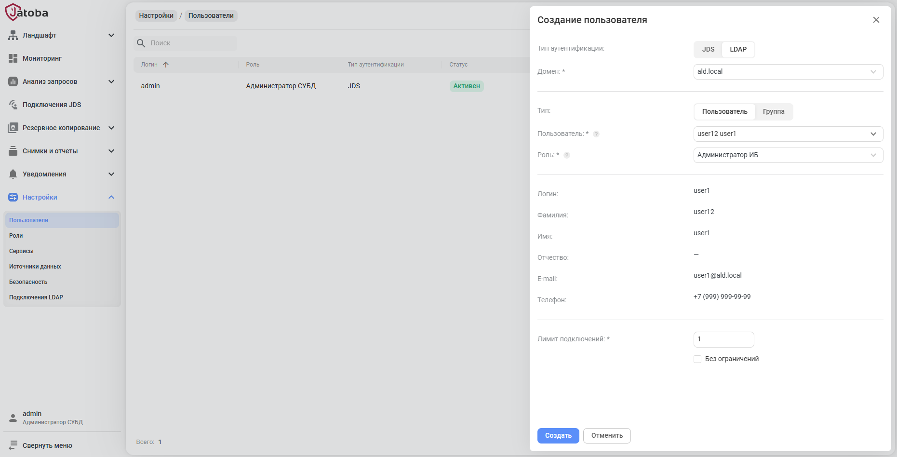{width="7.086805555555555in"
height="3.609722222222222in"}

Рисунок 2.8 -- Окно «Создание пользователя» JDS с LDAP аутентификацией

Остальные данные пользователя будут загружены автоматически.

#### Создание пользователей JDS из группы c LDAP аутентификацией

Для создания пользователей JDS из группы активного каталога c LDAP
аутентификацией создаётся группа пользователей во вкладке «Пользователи»
раздела «Настройки».

В окне «Создание пользователя» выбирается вкладка «LDAP» и «Группа». Из
выпадающих списков устанавливаются параметры:

-   Домен-сервер: \* - сервер активного каталога;

-   Группа \* - группа активного каталога;

-   Роль: \* - назначаемая роль группе пользователей в JDS;

Автоматически загрузятся данные о группе, количестве пользователей и
выведется список пользователей.

Выбор пользователей из группы недоступен.

> Дополнительно устанавливается «Лимит подключений».

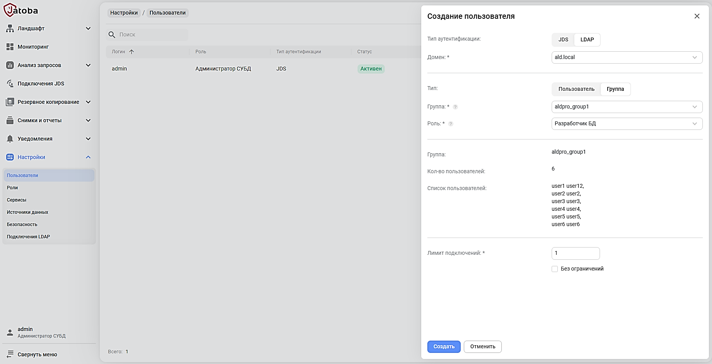{width="7.086805555555555in"
height="3.627083333333333in"}

Рисунок 2.9 -- Создание группы пользователей с LDAP аутентификацией

После нажатия кнопки «Создать» выполнится синхронизация с группой
активного каталога.

В последствии если один или несколько пользователей будут удалены из
пользователей JDS, то при повторном создании пользователей JDS из той же
группы будут выбраны для синхронизации отсутствующие в списке
пользователей JDS пользователи активного каталога.

#### LDAP аутентификация пользователей JDS

На стартовой странице JDS для LDAP аутентификации пользователи должны
выбрать вкладку «LDAP», сервер LDAP, ввести логин (имя пользователя) и
пароль активного каталога.

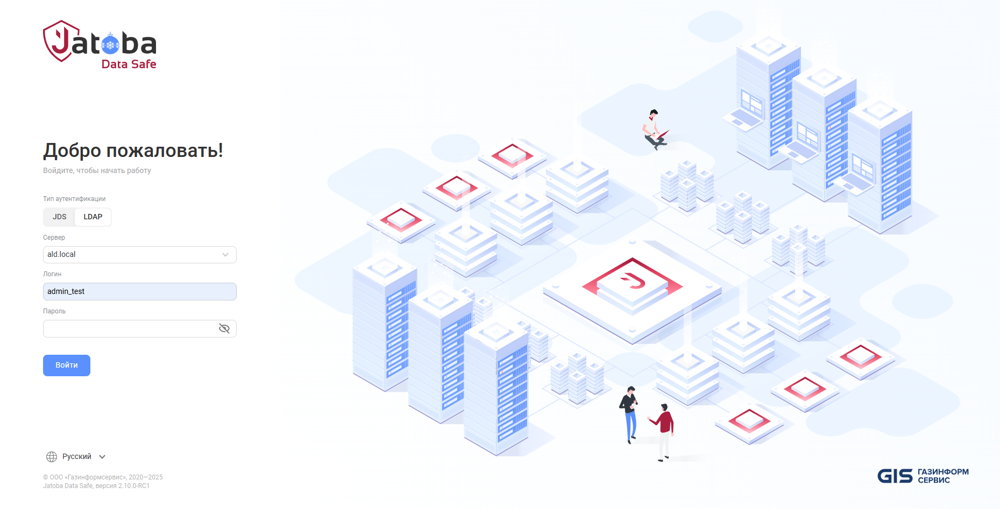{width="7.086805555555555in"
height="3.6104166666666666in"}

Рисунок 2.10 -- LDAP аутентификация

#### Обновление настроек LDAP аутентификации пользователей JDS с версии 2.9 на 2.10 JDS

В связи с расширением функциональности подключения и чтения LDAP
каталогов в части работ с группами пользователей, при переходе с JDS
версии 2.9 на 2.10 и выше, необходимо обеспечить обновление параметров
подключения к LDAP серверам по набору параметров по умолчанию, а именно
по схеме атрибутов \"Active Directory\".

Если подключение к LDAP серверу в версии JDS 2.9 было сделано к типу
каталогов Active Directory (Microsoft), при миграции данных на версию
JDS 2.10 и выше, никаких дополнительных действий по настройке
подключения не требуется. В ином случае, администратору необходимо
авторизоваться под локальной учетной записью JDS и в форме
редактирования подключения указать нужный тип LDAP каталога - FreeIPA,
ALDPro или Samba.

Вкладка «Безопасность». Парольная политика JDS
----------------------------------------------

Парольная политика компонента JDS основана на требованиях, установленных
Приказом ФСТЭК России от 11.02.2013 N 17, к мерам безопасности:

-   ИАФ.4 «Идентификация и аутентификация пользователей, являющихся
    работниками оператора» и усилениям к мере ИАФ.4 (1г, 2);

-   (УПД.6) «Ограничение неуспешных попыток входа в информационную
    систему (доступа к информационной системе)»;

-   Усиление УПД.1(3б) «автоматическое блокирование неактивных
    (неиспользуемых) учетных записей пользователей после периода времени
    неиспользования более 45 дней».

Настройка парольной политики компонента доступна администратору
компонента во вкладке «Безопасность» раздела «Настройки».

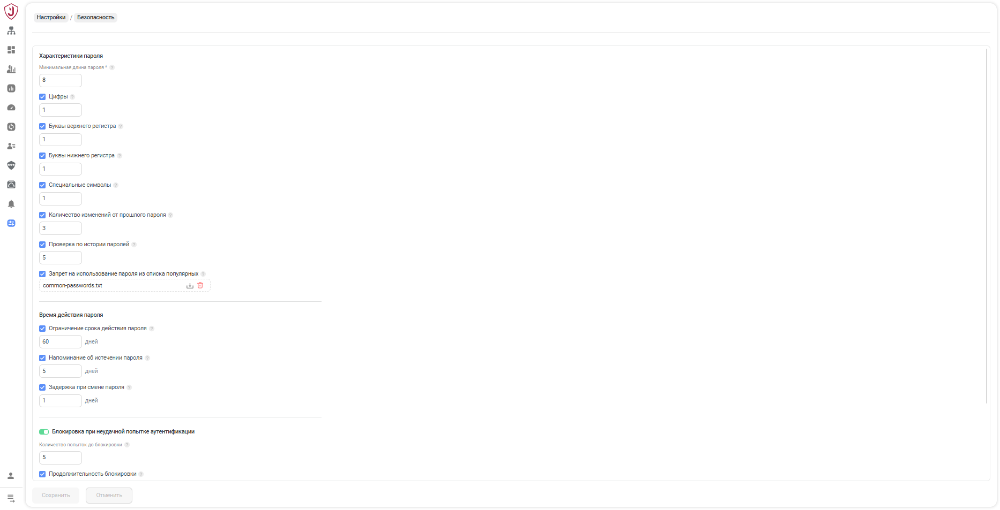{width="7.086805555555555in"
height="3.6194444444444445in"}

Рисунок 2.11 - Вкладка «Безопасность»

По умолчанию устанавливаются парольные политики, приведенные в таблице
Таблица 2.3.

Таблица 2.3 -- Парольные политики для пользователей JDS

<table>
<thead>
<tr class="header">
<th><strong>№</strong></th>
<th><strong>Параметр</strong></th>
<th><strong>Описание параметра</strong></th>
<th><blockquote>

<strong>Мин-е знач-е</strong>

</blockquote></th>
<th><blockquote>

<strong>Мак-е знач-е</strong>

</blockquote></th>
<th><blockquote>

<strong>Значение по умолчанию</strong>

</blockquote></th>
</tr>
</thead>
<tbody>
<tr class="odd">
<td>1</td>
<td><blockquote>

Минимальная длина пароля

</blockquote></td>
<td><blockquote>

Минимальная допустимая длина пароля

</blockquote></td>
<td><blockquote>

6

</blockquote></td>
<td><blockquote>

255

</blockquote></td>
<td><blockquote>

8

</blockquote></td>
</tr>
<tr class="even">
<td>2</td>
<td><blockquote>

Цифры

</blockquote></td>
<td><blockquote>

Обязательное использование цифр в пароле, в количестве не менее

</blockquote></td>
<td><blockquote>

1

</blockquote></td>
<td><blockquote>

255

</blockquote></td>
<td><blockquote>

1

</blockquote></td>
</tr>
<tr class="odd">
<td>3</td>
<td><blockquote>

Буквы нижнего регистра

</blockquote></td>
<td><blockquote>

Обязательное использование символов нижнего регистра в пароле, в количестве не менее

</blockquote></td>
<td><blockquote>

1

</blockquote></td>
<td><blockquote>

255

</blockquote></td>
<td><blockquote>

1

</blockquote></td>
</tr>
<tr class="even">
<td>4</td>
<td><blockquote>

Буквы верхнего регистра

</blockquote></td>
<td><blockquote>

Обязательное использование символов верхнего регистра в пароле, в количестве не менее

</blockquote></td>
<td><blockquote>

1

</blockquote></td>
<td><blockquote>

255

</blockquote></td>
<td><blockquote>

1

</blockquote></td>
</tr>
<tr class="odd">
<td>5</td>
<td><blockquote>

Специальные символы

</blockquote></td>
<td><blockquote>

Обязательное использование специальных символов в пароле из набора \!&quot;#$%&amp;()*+,-./:;&lt;=&gt;?@[]^_'{|}~, в количестве не менее

</blockquote></td>
<td><blockquote>

1

</blockquote></td>
<td><blockquote>

255

</blockquote></td>
<td><blockquote>

1

</blockquote></td>
</tr>
<tr class="even">
<td>6</td>
<td><blockquote>

Количество изменений от прошлого пароля

</blockquote></td>
<td><blockquote>

Минимальное количество изменений в новом пароле по сравнению со старым

</blockquote></td>
<td><blockquote>

1

</blockquote></td>
<td><blockquote>

255

</blockquote></td>
<td><blockquote>

3

</blockquote></td>
</tr>
<tr class="odd">
<td>7</td>
<td><blockquote>

Проверка по истории паролей

</blockquote></td>
<td><blockquote>

Количество последних использованных паролей, с которыми не должен совпадать задаваемый пароль

</blockquote></td>
<td><blockquote>

1

</blockquote></td>
<td><blockquote>

30

</blockquote></td>
<td><blockquote>

5

</blockquote></td>
</tr>
<tr class="even">
<td>8</td>
<td><blockquote>

Запрет на использование пароля из списка популярных

</blockquote></td>
<td><blockquote>

Пароль не должен совпадать ни с одним из списка популярных паролей

</blockquote></td>
<td><blockquote>

0

</blockquote></td>
<td><blockquote>

1

</blockquote></td>
<td><blockquote>

1

</blockquote></td>
</tr>
<tr class="odd">
<td>9</td>
<td><blockquote>

Ограничение срока действия пароля

</blockquote></td>
<td><blockquote>

По истечении срока действия пароль должен быть сменен, дней

</blockquote></td>
<td><blockquote>

1

</blockquote></td>
<td><blockquote>

int_max

</blockquote></td>
<td><blockquote>

60

</blockquote></td>
</tr>
<tr class="even">
<td>10</td>
<td><blockquote>

Напоминание об истечении пароля

</blockquote></td>
<td><blockquote>

При входе в систему напоминать пользователю о скором истечении срока действия пароля

</blockquote></td>
<td><blockquote>

1

</blockquote></td>
<td><blockquote>

int_max

</blockquote></td>
<td><blockquote>

5

</blockquote></td>
</tr>
<tr class="odd">
<td>11</td>
<td><blockquote>

Задержка при смене пароля

</blockquote></td>
<td><blockquote>

Минимальный срок действия пароля, срок до истечения которого пароль нельзя сменить, дней

</blockquote></td>
<td><blockquote>

1

</blockquote></td>
<td><blockquote>

int_max

</blockquote></td>
<td><blockquote>

1

</blockquote></td>
</tr>
<tr class="even">
<td>12</td>
<td><blockquote>

Количество попыток до блокировки

</blockquote></td>
<td><blockquote>

После указанного количества неправильно введенного пароля учетная запись временно блокируется

</blockquote></td>
<td><blockquote>

1

</blockquote></td>
<td><blockquote>

int_max

</blockquote></td>
<td><blockquote>

5

</blockquote></td>
</tr>
<tr class="odd">
<td>13</td>
<td><blockquote>

Продолжительность блокировки

</blockquote></td>
<td><blockquote>

Продолжительность блокировки учетной записи

</blockquote></td>
<td><blockquote>

1

</blockquote></td>
<td><blockquote>

int_max

</blockquote></td>
<td><blockquote>

15

</blockquote></td>
</tr>
<tr class="even">
<td>14</td>
<td><blockquote>

Блокировка учетной записи при отсутствии активности

</blockquote></td>
<td><blockquote>

Блокировать неиспользуемую учетную запись по истечении указанного периода

</blockquote></td>
<td><blockquote>

1

</blockquote></td>
<td><blockquote>

int_max

</blockquote></td>
<td><blockquote>

45

</blockquote></td>
</tr>
<tr class="odd">
<td>15</td>
<td><blockquote>

Блокировка администратора при длительном отсутствии

</blockquote></td>
<td><blockquote>

Применять правила блокировки неиспользуемых учетных записей для учетной записи по умолчанию «admin»

</blockquote></td>
<td><blockquote>

0

</blockquote></td>
<td><blockquote>

1

</blockquote></td>
<td><blockquote>

0

</blockquote></td>
</tr>
</tbody>
</table>

Внесённые изменения вступают в силу сразу после сохранения.

### Запрет на использование пароля из списка популярных

Парольные политики компонента JDS имеют параметр «Запрет на
использование пароля из списка популярных».

Проверка используемых паролей выполняется по встроенному файлу
common-passwords.txt, содержащему список запрещенных паролей. Список
возможно изменить или дополнить. Скачав имеющийся файл и внести в него
изменения или загрузив свой файл.

При загрузке файла:

-   Осуществляется проверка на расширение имени файла. Если расширение
    не \'.txt\', загрузка блокируется;

-   Распознается кодировка файла (UTF-8, UTF-16-LE, UTF-16-BE). Для
    файлов без BOM предполагается кодировка UTF-8.

Для файлов без BOM (Byte Order Mark) осуществляется проверка на
«двоичность»: количество байт \"перевод строки\" не должно быть менее
1/100 от общего количества байт. Данная проверка исходит из
предполагаемого содержимого файла (список «популярных» паролей), в
котором скорее всего средняя длина пароля не будет больше 100 символов.
Если обнаружен двоичный файл, загрузка блокируется.

При отображении страницы политики безопасности JDS:

-   Если ранее был сохранен файл с расширением не \'.txt\', его
    расширение меняется на \'.txt\'.

-   При скачивании файла, если ранее был сохранен файл с расширением не
    \'.txt\', его расширение меняется на \'.txt\'.

### Смена пароля пользователя JDS администратором

Согласно установленной ролевой модели, встроенной учетной записи «admin»
и пользователям с ролью «Администратор СУБД» доступна функциональная
возможность смены пароля всем категориям пользователей JDS без ввода
текущего пароля.

Смена пароля выполняется через контекстное меню в строке пользователя.

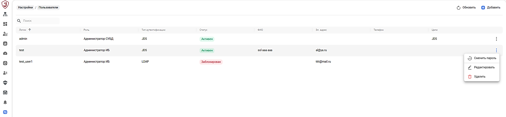{width="7.086805555555555in"
height="1.6402777777777777in"}

Рисунок 2.12 -- Контекстное меню в строке пользователя JDS

При выборе опции «Сменить пароль» откроется окно «Смена пароля».
Установите или сгенерируйте новый пароль и подтвердите его.

При вводе пароля будет отображаться подсказка по установленным
требованиям к парольной политике, которые устанавливаются во вкладке
«Безопасность».

Вводимая аутентификационная информация будет скрыта, что соответствует
мере защиты информации (ИАФ.5) «Защита обратной связи при вводе
аутентификационной информации», установленной Приказом ФСТЭК России от
11.02.2013 N 17.

Смена пароля пользователя через служебную БД компонента JDS невозможна.

### Смена пароля пользователем JDS

Поле первичной идентификации, при первом входе в компонент, пользователь
JDS обязан сменить присвоенный ему пароль. При этом, в целях
безопасности, ему не будет доступна и известна аутентификационная
информация для доступа к целевой СУБД.

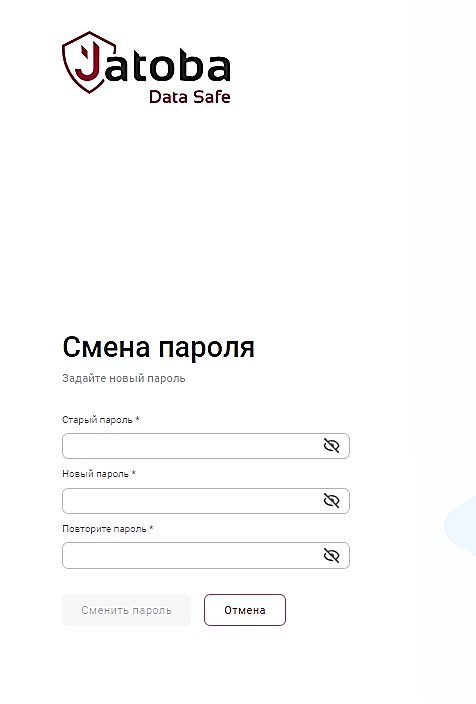{width="2.189583333333333in"
height="3.3117913385826774in"}

Рисунок 2.13 -- Смена пользователем JDS выданного пароля при первом
входе

Смена собственного пароля для всех пользователей компонента JDS доступна
через пиктограмму текущего пользователя, расположенную в левом углу
окна.

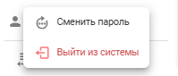{width="2.0729166666666665in"
height="0.8854166666666666in"}

Рисунок 2.14 -- Пиктограмма текущего пользователя

При истечении срока действия пароля пользователь будет периодически
получать сообщение о смене пароля.

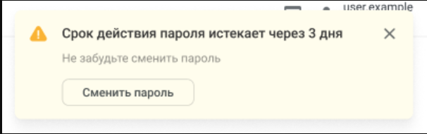{width="4.756944444444445in"
height="1.2674015748031495in"}

Рисунок 2.15 -- Сообщение о смене пароля

Сменить собственный пароль в JDS доступно и через раздел «Настройки» -
вкладка «Пользователи».

В контекстном меню в строке пользователя выбрав опцию «Сменить пароль».

В окне «Смена пароля» вводится и подтверждается новый пароль.
Аутентификационная информация пользователя будет автоматически изменена.

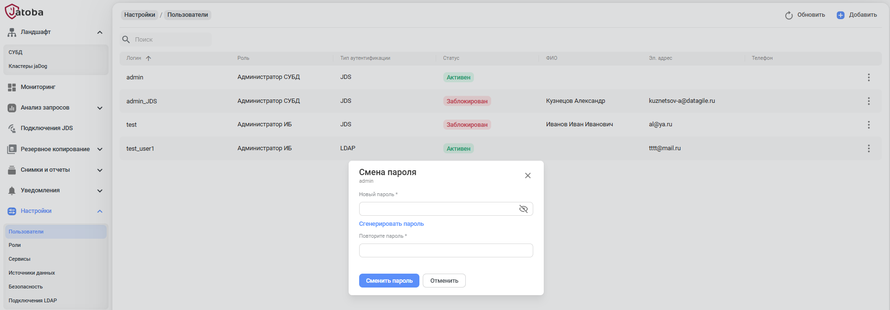{width="7.086805555555555in"
height="2.467361111111111in"}

Рисунок 2.16 -- Окно смены пароля пользователя JDS

При этом не потребуется повторный вход в компонент JDS.

### Блокирование пользователя JDS администратором

Пользователь JDS, как с парольной, так и с LDAP аутентификацией, может
быть заблокирован администратором принудительно. Такая блокировка
выполняется в карточке пользователя через операцию «Редактировать» во
вкладке «Пользователи» раздела «Настройки».

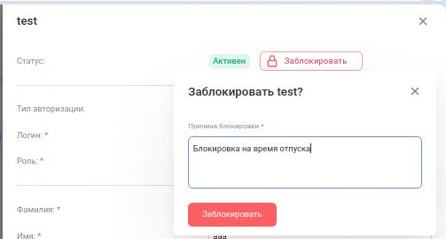{width="3.203371609798775in"
height="1.7077919947506561in"}

Рисунок 2.17 -- Принудительное блокирование пользователя JDS

Ввод комментария является обязательным. Далее она будет отражаться в
карточке пользователя.

### Разблокирование пользователя JDS 

Пользователь JDS может быть заблокирован:

-   компонентом в следствии нарушения парольных политик;

-   администратором компонента;

-   администратором домена.

Статус пользователя отображается в одноименном столбце во вкладке
«Пользователи» раздела «Настройки».

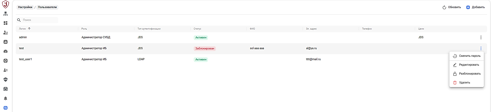{width="7.086805555555555in"
height="1.6277777777777778in"}

Рисунок 2.18 -- Разблокировка пользователя JDS

Разблокирование пользователя JDS выполняется администратором компонента
через контекстное меню.

Разблокировка LDAP - пользователя JDS недоступна, если он был
заблокирован администратором домена.

Вкладка «Источники данных»
--------------------------

Вкладка «Источники данных» в разделе «Настройки» используется для
раздела «Мониторинг», описанного в п. 3 настоящего документа.

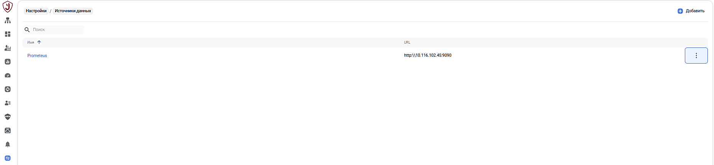{width="7.086805555555555in"
height="1.6395833333333334in"}

Рисунок 2.19 -- Вкладка «Источники данных»

В качестве источника данных используется система «PROMETHEUS», для
подключения к которой потребуется указать имя подключения и URL с
используемым портом.

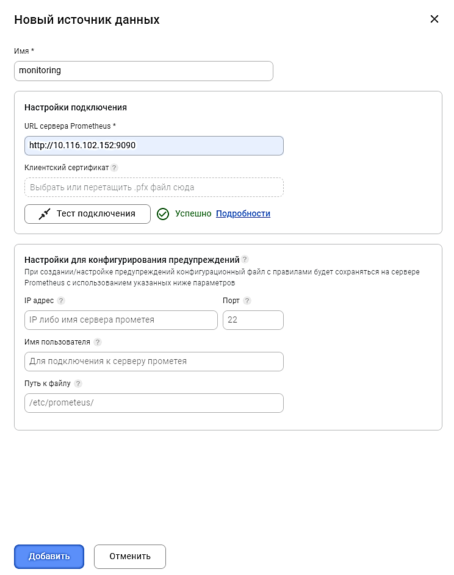{width="3.0755621172353456in"
height="3.8983245844269465in"}

Рисунок 2.20 -- Окно добавления нового источника данных

Установив параметры подключения, требуется проверить доступность
источника. Нажатие на кнопку «Тест подключения» проверить доступность
источника и сформирует дополнительную информацию по источнику, доступную
по гиперссылке «Подробности».

При тестировании соединения в момент создания нового подключения к
системе «PROMETHEUS» предоставляется подробная информация о настроенных
экспортерах, а также адреса серверов СУБД, наблюдаемых соответствующими
экспортерами.

Таким образом предоставляется информация о подключении требуемого
инстанса системы «PROMETHEUS», правильно ли настроена система и
подключены ли к ней желаемые базы.

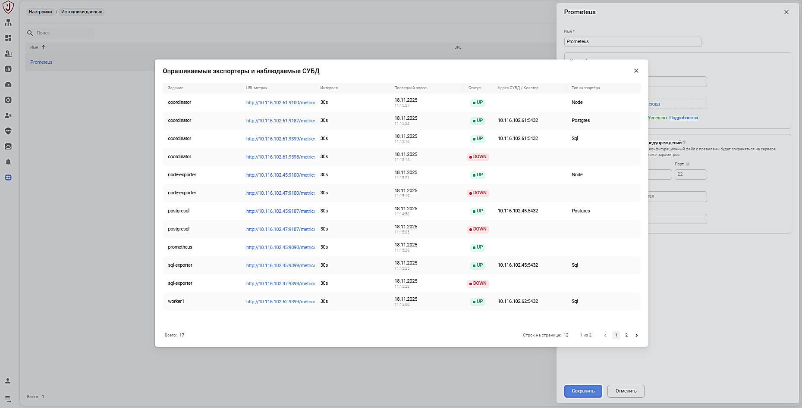{width="7.086805555555555in"
height="3.6104166666666666in"}

Рисунок 2.21 -- Окно «Опрашиваемые экспортеры и наблюдаемые СУБД»

Перечень полей окна «Опрашиваемые экспортеры и наблюдаемые СУБД»
приведен в таблице Таблица 2.4.

Таблица 2.4 - Перечень полей

<table>
<thead>
<tr class="header">
<th><blockquote>

<strong>Столбец</strong>

</blockquote></th>
<th><blockquote>

<strong>Примечание</strong>

</blockquote></th>
</tr>
</thead>
<tbody>
<tr class="odd">
<td><blockquote>

<strong>Задание</strong>

</blockquote></td>
<td><blockquote>

<strong> </strong>

</blockquote></td>
</tr>
<tr class="even">
<td><blockquote>

<strong>URL метрик</strong>

</blockquote></td>
<td><blockquote>

Активная ссылка, открывается в новой вкладке браузера

</blockquote></td>
</tr>
<tr class="odd">
<td><blockquote>

<strong>Интервал</strong>

</blockquote></td>
<td><blockquote>

 Интервал опроса

</blockquote></td>
</tr>
<tr class="even">
<td><blockquote>

<strong>Последний опрос</strong>

</blockquote></td>
<td><blockquote>

 Временная метка последнего опроса

</blockquote></td>
</tr>
<tr class="odd">
<td><blockquote>

 * всплывающая подсказка

</blockquote></td>
<td><blockquote>

Отображать длительность опроса в формате: &quot;Длительность: 99.9 с&quot;/&quot;Duration: 99.9 s&quot;

</blockquote></td>
</tr>
<tr class="even">
<td><blockquote>

<strong>Статус</strong>

</blockquote></td>
<td><blockquote>

Статус экспортера:

</blockquote>
<ul>
<li><blockquote>

UP - последний опрос экспортёра вернул метрики, экспортёр работоспособен;

</blockquote></li>
<li><blockquote>

DOWN - последний опрос экспортёра вернул ошибку

</blockquote></li>
</ul></td>
</tr>
<tr class="odd">
<td><blockquote>

 * всплывающая подсказка

</blockquote></td>
<td><blockquote>

В случае статуса DOWN отображать информацию об ошибке

</blockquote></td>
</tr>
<tr class="even">
<td><blockquote>

<strong>Адрес СУБД</strong>

</blockquote></td>
<td><blockquote>

Адрес СУБД получаемый из метрик Prom-QL запросом:

</blockquote>
<ul>
<li><blockquote>

pg_static (для postgres_exporter);

</blockquote></li>
<li><blockquote>

pg_server  (для sql_exporter).

</blockquote></li>
</ul></td>
</tr>
<tr class="odd">
<td><blockquote>

<strong>Тип экспортера</strong>

</blockquote></td>
<td><blockquote>

Тип экспортёра определяемый сочетанием названия метрики и содержимым метки <strong>instance</strong>:

</blockquote>
<ul>
<li><blockquote>

pg_static для postgres_exporter;

</blockquote></li>
<li><blockquote>

pg_server для sql_exporter;

</blockquote></li>
<li><blockquote>

node_os_info для node_exporter;

</blockquote></li>
<li><blockquote>

windows_os_info для windows_exporter;

</blockquote></li>
</ul></td>
</tr>
</tbody>
</table>

### Информирование о неполном перечне наблюдаемых СУБД

После настройки источника данных компонент определит полный перечень
возможных для мониторинга объектов.

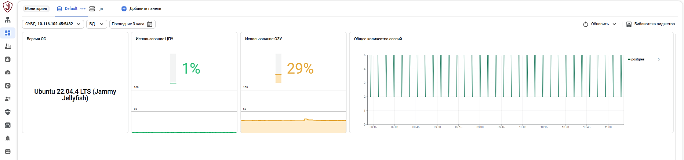{width="7.086805555555555in"
height="1.6611111111111112in"}

Рисунок 2.22 -- Поле «Источник данных»

В поле выбора «Источника данных» (СУБД) появится предупредительный знак,
если в область мониторинга были не включены все инстансы системе
«PROMETHEUS».

Наведение курсора на предупредительный знак, появится всплывающая
подсказка.

Перейдя по гиперссылке «Вкладка «Источники данных» откроется одноименный
раздел компонента, где выбрав любое из подключений и протестировав его в
окне «Опрашиваемые экспортеры и наблюдаемые СУБД» будет выведен полный
список (см. Рисунок 2.21).

Установка прав доступа к конфигурационным файлам
------------------------------------------------

### Установка прав доступа к конфигурационному файлу appsettings.json

Установка прав доступа к конфигурационному файлу appsettings.json
выполняется администратором ИС.

Для администраторов ОС устанавливаются полные права, а для пользователей
ОС устанавливаются права на чтение и выполнение.

Файл расположен по пути в:

-   ОС семейства Windows

> C:\\Programm Files\\GIS\\JDS\\appsettings.json

-   В GNU Linux

> /opt/jds/appsettings.json

### Установка параметров в конфигурационного файле appsettings.json JDS

|                                                         |                                                                 |
|---------------------------------------------------------|-----------------------------------------------------------------|
| {width="0.25in" height="0.25in"} | Описание раздела актуально для версии компонента JDS 2.3 и выше |

В конфигурационного файле appsettings.json устанавливаются основные
параметры работы компонента.

**Remove expired refresh tokens**

Проверка актуальности токенов, выдаваемых пользователям компонента,
выполняется пакетным сценарием «Remove expired refresh tokens».

«Remove expired refresh tokens» по установленному интервалу времени,
управляемого программным планировщиком Quartz.AspNetCore, в служебной БД
JDS выполняет периодическую проверку таблицы «refreshtokens» для
удаления записей.

Записи удаляются, если значение «refreshtokens.ExpireAT» меньше времени
начала выполнения проверки.

По умолчанию установлены параметры:

> \"AccessTokenExpiration\": 480, \"RefreshTokenExpiration\": 960

При необходимости измените параметры жизни «AccessTokenExpiration» и
«RefreshTokenExpiration». Истечение срока действия
«RefreshTokenExpiration» должно превышать «AccessTokenExpiration».

Таблица 2.5 -- Параметры пакетного сценария «Remove expired refresh
tokens»

<table>
<thead>
<tr class="header">
<th><strong>Параметр</strong></th>
<th><strong>Значение</strong></th>
<th><strong>Единица измерения</strong></th>
<th><strong>Описание</strong></th>
</tr>
</thead>
<tbody>
<tr class="odd">
<td>JobKey</td>
<td>Remove expired refresh tokens</td>
<td></td>
<td>Наименование пакетного сценария</td>
</tr>
<tr class="even">
<td>Active</td>
<td>True</td>
<td></td>
<td>
Параметр определяющий статус выполнения Job.

Допускаются значения:

<ul>
<li><blockquote>

True – включен;

</blockquote></li>
<li><blockquote>

False – отключен.

</blockquote></li>
</ul></td>
</tr>
<tr class="odd">
<td>Interval</td>
<td>10080</td>
<td>Минуты</td>
<td>Периодичность запуска. Значение по умолчанию - 7 дней.</td>
</tr>
</tbody>
</table>

Раздел «Ландшафт» (Landscape)
=============================

|                                                         |                                                                                                                                                                                     |
|---------------------------------------------------------|-------------------------------------------------------------------------------------------------------------------------------------------------------------------------------------|
| {width="0.25in" height="0.25in"} | Подготовка хостов и развертывание СУБД «Jatoba», настройка SSH и SSL соединений, подключение хостов и СУБД к разделу «Ландшафт», описана в документе «Руководство по безопасности». |

Раздел «Ландшафт» предназначен для:

-   получения общей информации о хосте СУБД;

-   получения общей информации о СУБД;

-   управления конфигурационными файлами СУБД;

-   установки и управления расширениями СУБД.

Доступен раздел в компоненте, только для пользователя с ролью
«Администратор СУБД».

Добавление элементов во вкладку «Обзор» имеет иерархическую структуру и
требует аутентификационную информацию для SQL, SSL и SSH соединения.

|                                                                                     |                                                                                                                                                  |
|-------------------------------------------------------------------------------------|--------------------------------------------------------------------------------------------------------------------------------------------------|
| {width="0.2513888888888889in" height="0.2513888888888889in"} | Не рекомендуется добавлять в раздел «Ландшафт» служебную СУБД «Jatoba» используемую компонентом JDS, а также проводить операции со служебной БД. |

Управление хостом, в том числе и конфигурационными файлами требуют
настройки SSH -- соединения.

Таблица 3.1 -- Требуемые параметры для подключения целевой СУБД

<table>
<thead>
<tr class="header">
<th><strong>Уровень иерархии</strong></th>
<th><strong>Параметр</strong></th>
<th><strong>Значение</strong></th>
<th></th>
</tr>
</thead>
<tbody>
<tr class="odd">
<td><strong>Хост</strong></td>
<td></td>
<td></td>
<td></td>
</tr>
<tr class="even">
<td></td>
<td>IP-адрес или FQDN-имя </td>
<td></td>
<td></td>
</tr>
<tr class="odd">
<td></td>
<td>Имя учётной записи</td>
<td>jdscontrol</td>
<td></td>
</tr>
<tr class="even">
<td></td>
<td>Порт для управления по SSH</td>
<td>22</td>
<td></td>
</tr>
<tr class="odd">
<td></td>
<td>Описание</td>
<td>Произвольное</td>
<td></td>
</tr>
<tr class="even">
<td></td>
<td><strong>СУБД</strong></td>
<td></td>
<td></td>
</tr>
<tr class="odd">
<td></td>
<td>Элемент-родитель:</td>
<td>IP-адрес хоста</td>
<td></td>
</tr>
<tr class="even">
<td></td>
<td>Тип элемента: *</td>
<td>СУБД</td>
<td></td>
</tr>
<tr class="odd">
<td></td>
<td>Название СУБД: *</td>
<td>IP-адрес хоста и порт</td>
<td></td>
</tr>
<tr class="even">
<td></td>
<td>Имя сервиса *</td>
<td></td>
<td></td>
</tr>
<tr class="odd">
<td></td>
<td>Порт *</td>
<td>5432</td>
<td></td>
</tr>
<tr class="even">
<td></td>
<td>Папка data*</td>
<td></td>
<td></td>
</tr>
<tr class="odd">
<td></td>
<td>Папка для резервных копий конфигурации: *</td>
<td></td>
<td></td>
</tr>
<tr class="even">
<td></td>
<td>Сертификат УЦ</td>
<td></td>
<td></td>
</tr>
<tr class="odd">
<td></td>
<td>Описание</td>
<td></td>
<td></td>
</tr>
<tr class="even">
<td></td>
<td>Имя служебной БД *</td>
<td>postgres</td>
<td></td>
</tr>
<tr class="odd">
<td></td>
<td>Режим шифрования</td>
<td>Disable/ Allow/ Prefer/ Require/ VerityCA/ VerityFull</td>
<td></td>
</tr>
<tr class="even">
<td></td>
<td>Проверять сертификат СУБД на отзыв:</td>
<td>флаг</td>
<td></td>
</tr>
<tr class="odd">
<td></td>
<td>Способ аутентификации</td>
<td>
Пароль/

SSL-сертификат
</td>
<td></td>
</tr>
<tr class="even">
<td></td>
<td>Пароль</td>
<td>Имя роли администратора СУБД: *</td>
<td>postgres</td>
</tr>
<tr class="odd">
<td></td>
<td>Пароль *</td>
<td></td>
<td></td>
</tr>
<tr class="even">
<td></td>
<td>SSL-сертификат</td>
<td>Имя роли администратора СУБД: *</td>
<td>postgres</td>
</tr>
<tr class="odd">
<td></td>
<td>Сертификат пользователя: *</td>
<td></td>
<td></td>
</tr>
<tr class="even">
<td></td>
<td>Пароль закрытого ключа:</td>
<td></td>
<td></td>
</tr>
<tr class="odd">
<td><strong>Кластеры</strong></td>
<td>Название</td>
<td>Имя кластера</td>
<td></td>
</tr>
<tr class="even">
<td></td>
<td>Адрес</td>
<td>Публичный IP-адрес</td>
<td></td>
</tr>
<tr class="odd">
<td></td>
<td>Порт REST API</td>
<td>54443 (Custom)</td>
<td></td>
</tr>
<tr class="even">
<td></td>
<td>Сертификат пользователя</td>
<td>Контейнер pfx</td>
<td></td>
</tr>
</tbody>
</table>

Навигация в разделе «Ландшафт»
------------------------------

Навигация в разделе организована по принципу «хлебные крошки»
(breadcrumbs).

В виде иерархической цепочки от имени раздела до уровня сущности СУБД, с
возможностью перехода по уровням иерархии и выбора сущностей СУБД.

Переходы снабжены подсказками.

Раздел «СУБД» имеет две вкладки:

-   «Список СУБД»;

-   «Дерево инфраструктуры».

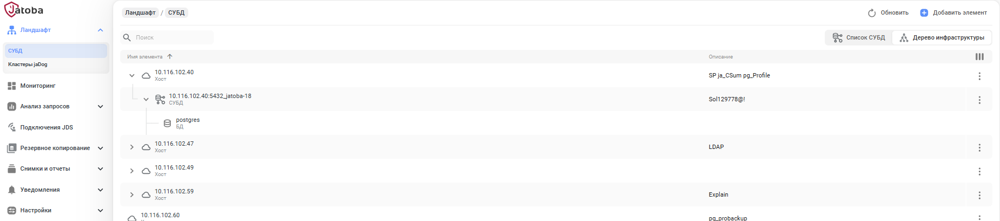{width="7.086805555555555in"
height="1.5729166666666667in"}

Рисунок 3.1 -- Структура раздела «Ландшафт»

При переходе пользователя на очередную страницу, если приложение не
может отобразить страницу, то отображается страница ошибки 404.

### Список СУБД

Во вкладке «Список СУБД» выводится список подключенных к JDS СУБД.

В списке отображается пиктограмма с значениями состояния СУБД
аналогичными состоянию в карточке СУБД/Обзор (см. р. 4 Раздел
«Ландшафт». СУБД. Вкладка «Обзор»):

-   Зеленый цвет -- «Работает»;

-   Желтый цвет -- «Остановлена»;

-   Красный цвет -- «Неизвестно».

В период загрузки данных о состоянии СУБД пиктограмма бесцветная.

Время последнего обновления вначале показывает время загрузки списка
СУБД, а после загрузки состояния СУБД:

-   для недоступной СУБД - время обновляется на время
    получения результата неуспешной попытки подключения к СУБД;

-   для СУБД, для которой успешно выполнилась команда systemctl status -
    время изменения статуса на текущий статус, которое
    возвращает systemctl.

По умолчанию, автоматическое обновление состояния СУБД во вкладе
выключено. Обновление состояния СУБД доступно в ручном режиме через
кнопку «Обновить» и в автоматическом. Периоды автоматического обновления
составляют 30 сек, 1мин и 5мин.

Переход по гиперссылке СУБД выведет во вкладку «Обзор» и меню доступных
действий, таких как:

-   Назначение ролей;

-   Параметры СУБД;

-   Правила доступа;

-   Доступные расширения;

-   Настройка для ProBackup;

-   Роли СУБД;

-   Проблемы и решения;

-   Активность БД;

-   LDAP синхронизация;

-   Парольные политики.

Отражаемый в верхней строке путь, позволяет перемещаться по разделу, в
строке с именем СУБД из выпадающего списка выбрать подключенную СУБД и
перейти к ней.

### Дерево инфраструктуры

Во вкладке «Дерево инфраструктуры» отображается иерархическая,
древовидная структура хостов, СУБД и БД. В данной инфраструктуре
доступны основные операции такие как:

-   Добавление СУБД;

-   Редактирование параметров СУБД;

-   Обновление содержания вкладки.

В левой части окна дублируются основные меню.

Во вкладке «Дерево инфраструктуры» возможно перейти до уровня БД на
котором доступны

-   Вкладка «Обзор» БД;

-   Меню «Расширения»;

-   Матрица доступа;

-   Анализ рисков.

Хост. Вкладка «Обзор»
---------------------

Предварительно подготовив целевой хост для управления, т.е. установив
SSH-соединение, становится доступна операция добавления хоста в разделе
«Ландшафт».

В результате на уровне иерархии объектов, типа «Хост», во вкладке
«Обзор» отобразится состояние подключения по SSH протоколу и основная
информация о хосте.

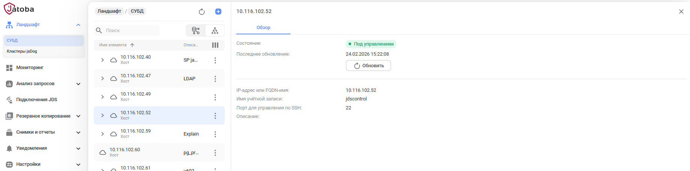{width="7.086805555555555in"
height="1.7652777777777777in"}

Рисунок 3.2 - Хост. Вкладка «Обзор»

Возможны 3 состояния хоста:

-   \"Под управлением\" - успешный пробный вход на хост по протоколу
    SSH;

-   \"Ошибка аутентификации\"- неуспешный пробный вход на хост по
    протоколу SSH;

-   \"Недоступен\" - таймаут при попытке входа на хост по протоколу SSH.

Раздел «Ландшафт». СУБД. Вкладка «Обзор» 
=========================================

После подключения СУБД станет доступной и откроется вкладка «Обзор».

Во вкладке «Обзор» доступна общая информация о СУБД и управление службой
СУБД на хосте:

-   включение/отключение автозапуска службы в ОС;

-   обновление состояния службы;

-   остановка службы;

-   перезапуск службы.

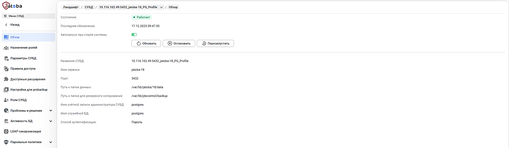{width="7.086805555555555in"
height="2.0631944444444446in"}

Рисунок 4.1 -- Вкладка «Обзор»

Переход во вкладку доступен по пути:

-   Раздел Ландшафт → СУБД → Дерево инфраструктуры → Хост → СУБД →
    Вкладка «Обзор»;

-   Раздел Ландшафт → Список СУБД → Вкладка «Обзор».

При переходе не обязательно точно наводить курсор на объект.

Раздел «Ландшафт». СУБД. Вкладка «Список БД»
============================================

Вкладка «Список БД» предназначена для просмотра основных данных БД
текущей СУБД.

Переход во вкладку доступен по пути:

-   Раздел Ландшафт → СУБД → Дерево инфраструктуры → Хост → СУБД →
    Вкладка «Список БД».

При переходе не обязательно точно наводить курсор на объект.

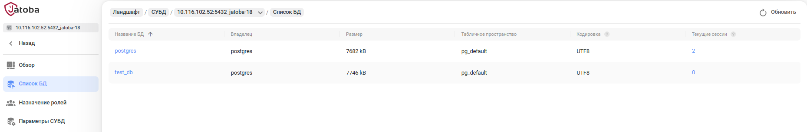{width="7.086805555555555in"
height="1.1666666666666667in"}

Рисунок 5.1 - Вкладка «Список БД»

Во вкладке отображается список БД и основные данные о них:

-   Название БД;

-   Владелец;

-   Размер;

-   Табличное пространство;

-   Кодировка;

-   Текущие сессии.

Поля «Название БД» и «Активность БД» оснащены гиперссылками.

Переход по гиперссылке поля «Название БД» откроет вкладку «Обзор» и
сделает доступным переход к вкладкам:

-   «Расширения» (р. 16);

-   «Анализ рисков» (р. 18);

-   «Матрица доступа» (р. 17).

Переход по гиперссылке поля «Текущие сессии» откроет вкладку «Активность
БД» -- «Сессии» (п.п. 12.1).

Раздел «Ландшафт». СУБД. Вкладка «Параметры СУБД»
=================================================

|                                                                                     |                                                                                                                                                                                                                                                                                                                                                                                                                                                                          |
|-------------------------------------------------------------------------------------|--------------------------------------------------------------------------------------------------------------------------------------------------------------------------------------------------------------------------------------------------------------------------------------------------------------------------------------------------------------------------------------------------------------------------------------------------------------------------|
| {width="0.2513888888888889in" height="0.2513888888888889in"} | Перед редактированием конфигурационных файлов СУБД «Jatoba» убедитесь, что компонент контроля целостности «ja\_CSum» отключен или переведен в режим информирования (permissive). Поскольку, «ja\_CSum» функционируя совместно компонентом парольных политик «SecurityProfile», пересчитав контрольные суммы конфигурационных файлов и найдя в них расхождения с эталонными значениями, передаст команду компоненту «SecurityProfile» на блокирование пользователей СУБД. |

Во вкладке «Параметры СУБД» доступно изменение значений
конфигурационного файла «postgresql.conf».

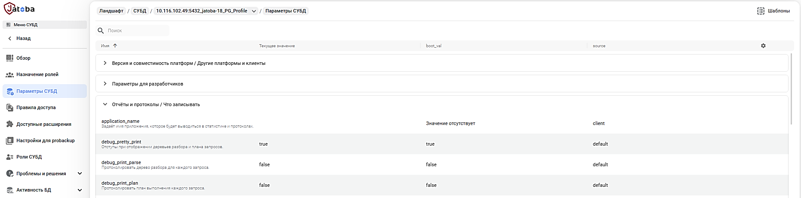{width="7.086805555555555in"
height="1.7534722222222223in"}

Рисунок 6.1 - Вкладка «Параметры СУБД»

Список параметров оснащен полнотекстовым поиском и сгруппирован по
разделам.

Вкладка «Параметры СУБД» предоставляет набор данных:

-   значение редактируемой величины;

-   единица измерения текущего значения;

-   тип данных текущего значения;

-   величина минимального значения;

-   величина максимального значения.

Изменение конкретного параметра доступно через пиктограмму в модальном
окне.

Применение новых значений выполняется через:

-   SQL-команду «ALTER SYSTEM»;

-   Изменением конфигурационного файла, т.е. его перезаписью.

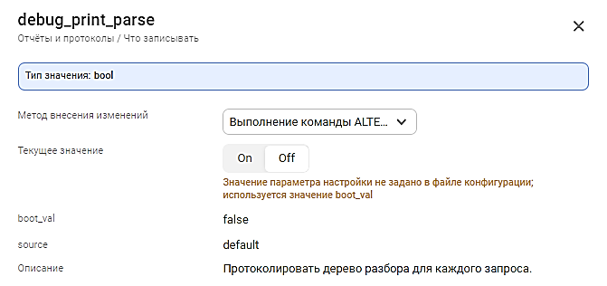{width="3.769456474190726in"
height="1.7751837270341206in"}

Рисунок 6.2 -- Окно изменение параметра

Внесенные изменения не применяются автоматически, они отразятся в списке
параметров и дополнительно будет выведено информационное сообщение в
верхней строке.

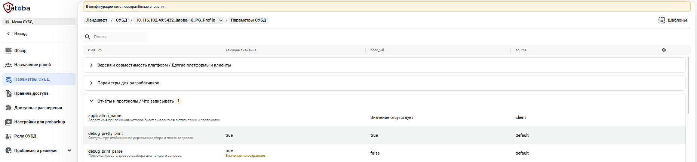{width="7.086805555555555in"
height="1.6576388888888889in"}

Рисунок 6.3 -- Индикация о внесенных изменениях

Внесенные изменения отразятся в конфигурационного файла
«postgresql.conf» отдельной строкой с комментарием о приложении внесшим
изменение, дате и времени, а также о учетной записи компонента от имени
и с правами которого внесены изменения.

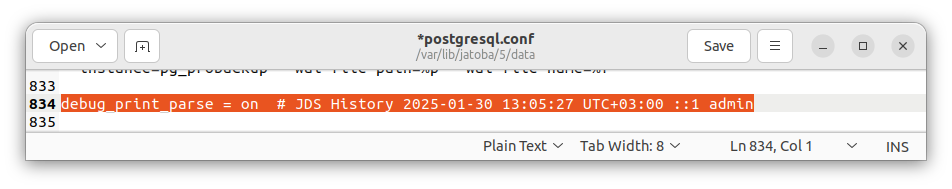

Рисунок 6.4 -- Строка параметра измененная средствами компонента JDS

Шаблоны
-------

Функциональная возможность изменения конфигурации целевых СУБД,
позволяет оперативно применять, как шаблоны параметров, так и отдельные
параметры, с целью:

-   масштабирования типовых параметров;

-   конфигурирования СУБД под определенный тип нагрузки;

-   оперативного изменения набора параметров.

Имеющиеся шаблоны параметров доступны для всех СУБД, подключенных к
разделу «Ландшафт».

Окно «Шаблоны параметров» вызывается кнопкой «Шаблоны», в котором
доступно создание и импорт шаблона для конфигурационного файла
«postgresql.conf» целевой СУБД.

### Создание шаблона

Создание шаблона конфигурации СУБД доступно в окне «Создание шаблона»
вызываемое кнопкой «Создать». В окне обязательно указывается название
шаблона и дополнительно его описание.

Созданный шаблон будет пуст и иметь статус «Не соответствует». Параметр
или параметры добавляются через кнопку «плюс» в строке шаблона.

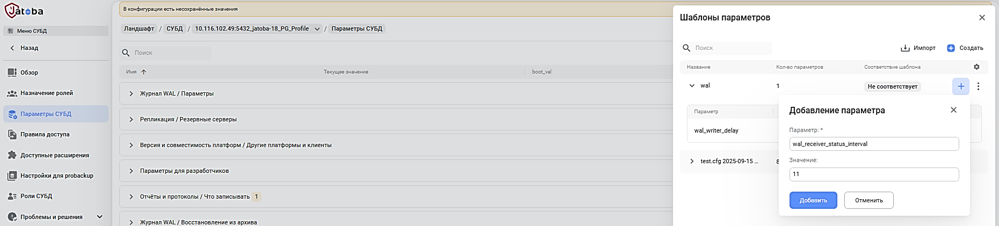{width="7.086805555555555in"
height="1.6041666666666667in"}

Рисунок 6.5 -- Добавление параметра в шаблон

После добавления параметр отразится в выпадающем списке шаблона.

Значение параметра будет автоматически проанализировано и установлен
статус, как для всего шаблона, так и для параметра в частности.

### Импорт шаблона

В качестве импорта шаблона допустимо использовать:

-   имеющийся конфигурационный файл «postgresql.conf»;

-   сгенерированный конфигурационный файл утилитой «ja\_tune» при
    консольном запуске утилиты, как описано в документе «Руководство по
    установке»;

-   любой текстовый файл в кодировке ANSI размером не более 100 кб.

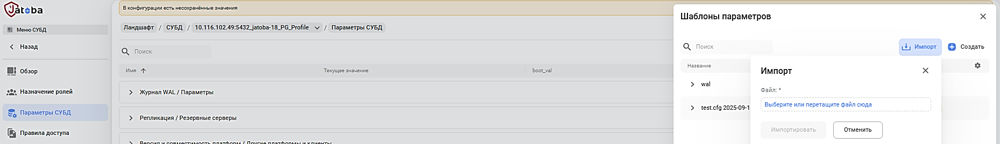{width="7.086805555555555in"
height="1.0256944444444445in"}

Рисунок 6.6 -- Окно «Импорт»

Выбор шаблона параметров выполняется через обзор файловой системы хоста
или перетаскиванием файла в окно «Импорт».

При импорте он будет проанализирован. Сравниваются «Значения текущей
СУБД» и «Значения шаблона». Разница в значениях будет отмечена красным
крестом. В строке шаблона будет указано количество параметров и статус
проведенного анализа.

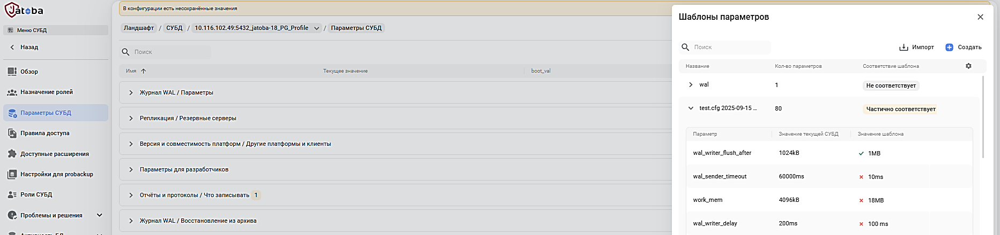

Рисунок 6.7 -- Параметры импортированного шаблона конфигурации

К имени шаблона автоматически добавляется дата и время импорта.

Далее параметры могут быть изменены, удалены через кнопки в строке
параметра, а также добавлены через меню в строке шаблона.

### Применение шаблона к СУБД

Применение шаблона выполняется через опцию «Применить к текущей СУБД», в
контекстном меню шаблона.

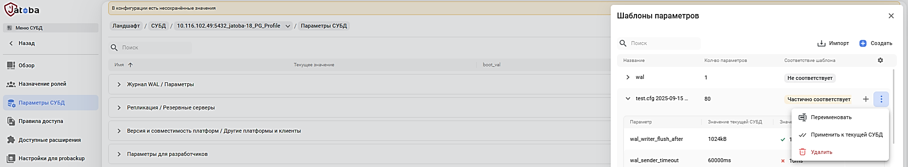

Рисунок 6.8 -- Контекстное меню шаблона

Применение шаблона выполняется двумя методами:

-   «По месту хранения параметра»;

-   «Выполнение команды ALTER SYSTEM».

При выборе метода «ALTER SYSTEM» параметры будут дозаписаны в
конфигурационный файл «postgresql.auto.conf», который имеет приоритет в
выполнении.

{width="6.7456649168853895in"
height="2.4784722222222224in"}

Рисунок 6.9 - Конфигурационный файл «postgresql.auto.conf» с
дозаписанными параметрами

При выборе метода «По месту хранения параметра» компонент определит:

-   расположение параметра, т.е. в «postgresql.conf» или в
    «postgresql.auto.conf»;

-   попытается записать его;

-   при невозможности записи параметра выведет информационное окно с
    описанием причин.

В случае, если компоненту не удалось применить шаблон, следует:

-   устранить причину неприменимости;

-   изменить метод применения.

Автоматически определится и выведется информационное сообщение о
необходимости перезагрузки СУБД.

Раздел «Ландшафт». СУБД. Вкладка «Правила доступа»
==================================================

|                                                                                     |                                                                                                                                                                                                                                                                                                                                                                                                                                                                          |
|-------------------------------------------------------------------------------------|--------------------------------------------------------------------------------------------------------------------------------------------------------------------------------------------------------------------------------------------------------------------------------------------------------------------------------------------------------------------------------------------------------------------------------------------------------------------------|
| {width="0.2513888888888889in" height="0.2513888888888889in"} | Перед редактированием конфигурационных файлов СУБД «Jatoba» убедитесь, что компонент контроля целостности «ja\_CSum» отключен или переведен в режим информирования (permissive). Поскольку, «ja\_CSum» функционируя совместно компонентом парольных политик «SecurityProfile», пересчитав контрольные суммы конфигурационных файлов и найдя в них расхождения с эталонными значениями, передаст команду компоненту «SecurityProfile» на блокирование пользователей СУБД. |

Во кладке «Правила доступа» доступно изменение значений
конфигурационного файла «pg\_hba.conf», в котором устанавливаются
параметры аутентификации в СУБД.

Табличная часть вкладки отображает установленные параметры
аутентификации.

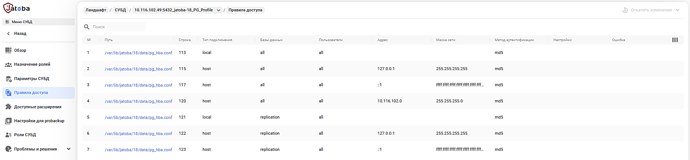{width="7.086805555555555in"
height="1.6576388888888889in"}

Рисунок 7.1 -- Вкладка «Правила доступа»

Они целиком отражают структуру конфигурационного файла «pg\_hba.conf».

Нажатие на гиперссылку в столбце «Путь» вызовет редактор, в котором
доступны стандартные функции редактирования и «горячих клавиш».

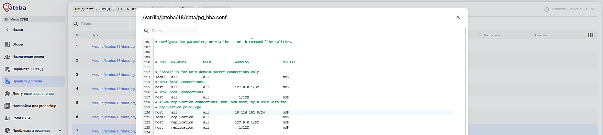{width="7.086805555555555in"
height="1.601388888888889in"}

Рисунок 7.2 - Редактор конфигурационного файла «pg\_hba.conf»

Внесенные изменения сохраняются по кнопке «Сохранить». При первой
операции по редактированию конфигурационного файла «pg\_hba.conf»
сохранятся две резервные копии. В первой резервной копии будет храниться
исходный файл до редактирования. Во второй резервной копии будет
храниться новый измененный файл.

На данном шаге сработает защитный механизм проверки файла на ошибки.
Если ошибки отсутствуют, кнопка «Применить изменения» будет
разблокирована, по ее нажатию производится выполнение SQL-команды: 

> SELECT pg\_reload\_conf();

Целевая СУБД применит внесенные изменения без полной перезагрузки.

Конфигурационный файл «pg\_hba.conf» целевой СУБД храниться на хосте
служебной СУБД JDS. Таким образом реализуется функциональная возможность
управления резервными копиями конфигурационного файла.

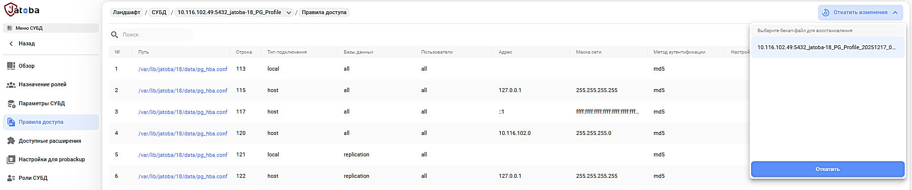{width="7.086805555555555in"
height="1.4819444444444445in"}

Рисунок 7.3 -- Окно «Откатить изменения»

Имя файл резервной копии имеет вид
\<service\>\_ГГГГММДД\_ЧЧММСС.hba.bak, где:

-   \<servicename\> - имя сервиса СУБД на целевом хосте;

Их может быть несколько. Имя совпадает с именем сервиса, используемым в
утилите systemctl:

> systemctl status \<servicename\>.service

-   ГГГГММДД - строковое представление даты создания резервной копии;

-   ЧЧММСС - строковое представление времени создания резервной копии.

Имеющиеся резервные копии конфигурационного файл «pg\_hba.conf» возможно
восстановить (откатить). Для этого требуется:

-   нажать кнопку «Откатить изменения» находящейся в правом верхнем углу
    окна «Правила доступа», как показано на рисунке Рисунок 7.3;

-   выбрать требуемую резервную копию;

-   нажать кнопку «Откатить».

Изменения применяться автоматически.

Сохранение резервных копий и их восстановление выполняется от имени и с
правами учетной записи ОС «jdscontrol» по протоколу SSH.

Раздел «Ландшафт». СУБД. Вкладка «Доступные расширения»
=======================================================

Список доступных расширений СУБД отображается во вкладке «Доступные
расширения».

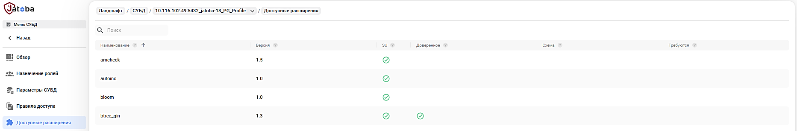{width="7.086805555555555in"
height="1.1743055555555555in"}

Рисунок 8.1 -- Вкладка доступные расширения

Список формируется выборкой из представлений
«pg\_available\_extension\_versions» и «pg\_available\_extensions».
Расширения идентифицируются по их наименованию в
поле «pg\_available\_extension\_versions.name».

Вкладка «Доступные расширения» предназначена для отображения списка
расширений доступных на выбранной СУБД для их установки в БД.

|                                                         |                                                                                                                                                                                           |
|---------------------------------------------------------|-------------------------------------------------------------------------------------------------------------------------------------------------------------------------------------------|
| {width="0.25in" height="0.25in"} | Если в общем списке требуемое расширение не отображается и контекстный поиск в одноименном поле не дал результатов, это означает, что не установлен пакет расширения (компонента) в СУБД. |

Если в общем списке требуемое расширение не отображается и контекстный
поиск в одноименном поле не дал результатов, это означает, что не
установлен пакет расширения (компонента) в СУБД.

Также отображается информация какие требования предъявляют расширения к
своему окружению и порядку установки.

Расширения устанавливаются в разделе «Ландшафт», на уровне БД во вкладке
«Расширения» (см. р. 16).

Влияние параметров прав в расширении на возможность управления
пользователем этим расширением представлено в таблице Таблица 8.1

Таблица 8.1 -- Влияние параметров на возможность управления расширениями

<table>
<thead>
<tr class="header">
<th><strong>Пользователь</strong></th>
<th><strong>Расширение</strong></th>
<th></th>
<th></th>
</tr>
</thead>
<tbody>
<tr class="odd">
<td>
с правами,

но без SU
</td>
<td>с правами SU</td>
<td><strong>(SU)</strong></td>
<td><strong>(Доверенное)</strong></td>
</tr>
<tr class="even">
<td></td>
<td></td>
<td>Требование суперпользователя</td>
<td>Возможность выполнить под SU</td>
</tr>
<tr class="odd">
<td>Запрет</td>
<td>Выполнение под текущим суперпользователем</td>
<td>X</td>
<td></td>
</tr>
<tr class="even">
<td>Выполнение под текущим пользователем</td>
<td>Выполнение под текущим суперпользователем</td>
<td></td>
<td>X</td>
</tr>
<tr class="odd">
<td>Выполнение под начальным суперпользователем</td>
<td>Выполнение под текущим суперпользователем</td>
<td>X</td>
<td>X</td>
</tr>
<tr class="even">
<td>Выполнение под текущим пользователем</td>
<td>Выполнение под текущим суперпользователем</td>
<td></td>
<td></td>
</tr>
</tbody>
</table>

Раздел «Ландшафт». СУБД. Вкладка «Роли СУБД» 
=============================================

Раздел «Роли СУБД» предназначен для:

-   создания ролей;

-   редактирования ролей;

-   назначения атрибутов и привилегий ролей.

Список пользователей
--------------------

Выбор раздела «Роли СУБД» откроет пустое окно списка пользователей.
После выбора цели и БД отразится полный список пользователей целевой
СУБД.

Список пользователей состоит из столбцов:

-   «Роль» (Role);

-   «ID»;

-   «Тип» (Type);

-   «Атрибуты» (Attributes);

-   «Доступные базы данных» (Available database);

-   «Назначения».

В столбце «Роли» отражаются роли пользователей в алфавитном порядке и
роли, включающие в себя другие роли (групповые роли). По умолчанию в
начале списка находится псевдороль «public».

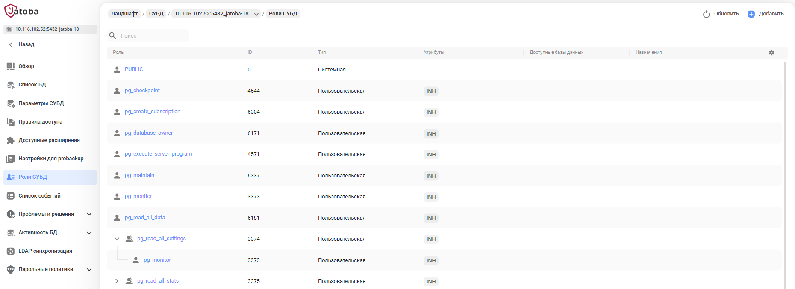{width="7.086805555555555in"
height="2.5756944444444443in"}

Рисунок 9.1 -- Окно списка пользователей

Групповые роли отображаются с дополнительной пиктограммой и отображаются
в форме иерархического списка.

В столбце «ID» отображаются автоматически присвоенные СУБД номера
учетных записей.

Столбец «Type» отображает два типа учетных записей:

-   пользовательская (Custom);

-   системная (System).

Столбец «Attributes» отображает атрибуты присвоенные роли в форме
аббревиатур, приведенных в таблице Таблица 17.1. Наведение курсора на
пиктограмму аббревиатуры вызовет контекстную подсказку с полным
наименованием атрибута.

Столбец «Доступные базы данных» (Available database) отображает БД
доступные для подключения пользователем.

Столбец «Назначения» отражает роль, которая используется для подключения
к целевой СУБД и сбора снимков и отчетов.

Создание роли
-------------

Окно создание роли вызывается нажатием кнопки «Добавить» (Add),
расположенной в правом верхнем углу окна. Окно включает в себя 5
вкладок:

-   «Основные параметры» (Main settings);

-   «Атрибуты» (Attributes);

-   «Роли и группы» (Roles and groups);

-   «Привилегии» (Privileges);

-   «SQL».

### Вкладка «Основные параметры» (Main settings);

В вкладке «Основные параметры» выведены поля:

-   «Имя» (Name);

-   «Описание» (Description);

-   «Пароль» (Password);

-   «Подтверждение пароля» (Repeat password);

|                                                                                     |                                                |
|-------------------------------------------------------------------------------------|------------------------------------------------|
| {width="0.2513888888888889in" height="0.2513888888888889in"} | Ввод имени пользователя является обязательным. |

В поле «Имя» вводится имя создаваемой роли длиной не менее двух
символов. Случайно вставленные символы пробела при генерации SQL-команды
будут усечены.

При вводе имени пользователя, становится доступной кнопка «Сохранить» и
генерируется SQL-команда:

> CREATE ROLE \[user\_name\];

В поле «Описание» вводится описание создаваемой роли длиной до 255
символов.

|                                                         |                                                   |
|---------------------------------------------------------|---------------------------------------------------|
| {width="0.25in" height="0.25in"} | Ввод описания пользователя является обязательным. |

В поле «Пароль» вводится пароль для создаваемого пользователя длиной от
6 до 50 символов.

В поле «Подтверждение пароля» вводится идентичный пароль задаваемому.

<table>
<tbody>
<tr class="odd">
<td></td>
<td>
Ввод пароля для роли может производится при создании роли.

При редактировании роли функциональная возможность смены пароля недоступна.
</td>
</tr>
</tbody>
</table>

Нажатие кнопки «Сохранить» сгенерирует SQL-команду:

> ALTER ROLE \[name\_role\] PASSWORD \[password role\];

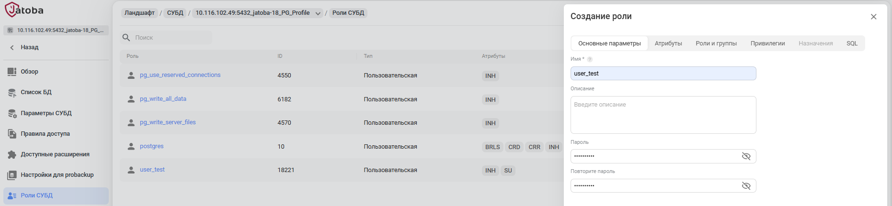{width="7.086805555555555in"
height="1.6402777777777777in"}

Рисунок 9.2 -- Вкладка «Основные параметры» (Main settings)

### Вкладка «Атрибуты»

На вкладке «Атрибуты» (Attributes) выведены:

-   флаги:

<!-- -->

-   SUPERUSER;

-   INHERIT;

-   CREATEROLE;

-   CREATEDB;

-   LOGIN;

-   REPLICATION;

-   BypassRls.

<!-- -->

-   поля:

<!-- -->

-   Квота соединений (Connection limit);

-   Действительна до (Valid util).

Установкой флагов назначаются атрибуты создаваемой роли.

|                                                                                     |                                                                                                             |
|-------------------------------------------------------------------------------------|-------------------------------------------------------------------------------------------------------------|
| {width="0.2513888888888889in" height="0.2513888888888889in"} | Доступно назначение только тех атрибутов, которые назначены ассоциированной роли СУБД для пользователя JDS. |

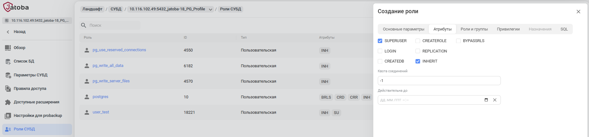{width="7.086805555555555in"
height="1.663888888888889in"}

Рисунок 9.3 - Вкладка «Атрибуты» (Attributes)

В поле «Квота соединений» устанавливается значение количества соединений
для роли. Доступно установить значения приведенные в таблице Таблица
9.1.

> Таблица 9.1 -- Допустимые значения квоты соединений

| **Значение**                                            | **Описание**                                                      |
|---------------------------------------------------------|-------------------------------------------------------------------|
| -1                                                      | нет ограничений                                                   |
| 0                                                       | соединение запрещено                                              |
| Целое положительное число                               | Количество соединений                                             |
| {width="0.25in" height="0.25in"} | Ввод значения квоты соединений для роли не является обязательным. |

В поле «Действительна до» (Valid util) устанавливается дата и время
действия роли, с точностью до минуты. Параметр используется для
временных учетных записей.

Ввод значения доступен через окно календаря или вручную.

|                                                         |                                                             |
|---------------------------------------------------------|-------------------------------------------------------------|
| {width="0.25in" height="0.25in"} | Ввод даты и времени действия роли не является обязательным. |

### Вкладка «Роли и группы» (Roles and groups)

В вкладке «Роли и группы» отображаются два поля:

-   «Участники группы»;

-   «Входит в группы».

При добавлении ролей в поле «Участники группы» роль станет «групповой» и
включенные в нее роли унаследуют атрибуты и привилегии роли.

Добавление участников группы выполняется нажатием кнопки «Добавить
роль», которое вызовет окно добавления ролей (см. рис. Рисунок 9.4).
Выбор ролей выполняется, через поле поиска или вручную установкой
флагов. Нажатие кнопки «Добавить» внесет выбранные роли в поле
«Участники группы».

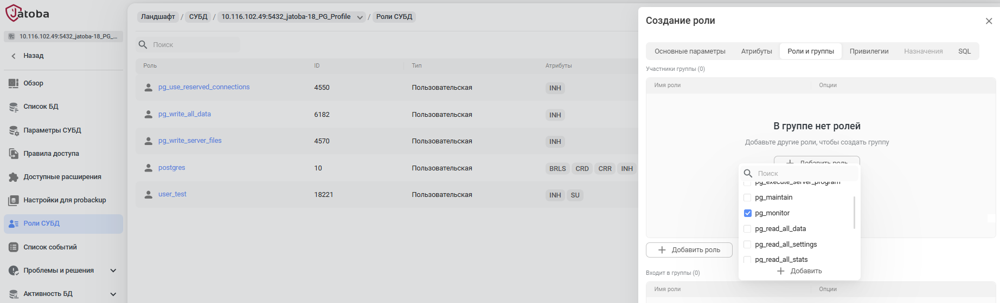{width="7.086805555555555in"
height="2.152083333333333in"}

Рисунок 9.4 -- Окно добавления ролей

При добавлении роли в поле «Входит в группы» она станет участником
«групповой роли» и унаследует атрибуты и привилегии роли в которую она
входит.

Добавление роли в группы выполняется нажатием кнопки «Добавить в
группу», которое вызовет окно добавления ролей (см. рис. Рисунок 9.4).
Выбор ролей выполняется, через поле поиска или вручную установкой
флагов. Нажатие кнопки «Добавить» внесет выбранные роли в поле «Входит в
группы».

Структура ролей в СУБД имеет иерархическую структуру и не допускает
«закольцованности», т.е. в случае добавление вышестоящей роли в
нижестоящую по иерархии, нижестоящая роль изменит свой статус и станет
вышестоящей.

**Например**

Созданы роли:

-   role\_1;

-   role\_2;

-   role\_3.

**Шаг 1.**

Добавим роль «role\_2» в состав роли «role\_1» SQL-командой:

> GRANT \"role\_1\" TO \"role\_2\";

Рисунок 9.5 -- Выполнение SQL-команды добавления роли «role\_2» в состав
роли «role\_1»

После чего роль «role\_1» станет групповой и образуется иерархия ролей.
В иерархии ролей роль «role\_1» займет первый уровень, а роль «role\_2»
займет второй уровень.

Рисунок 9.6 -- Иерархия ролей при шаге 1

**Шаг 2.**

На втором шаге групповую роль «role\_1» добавим в состав роли «role\_3»
SQL-командой:

> GRANT \"role\_3\" TO \"role\_1\";

Рисунок 9.7 -- Выполнение SQL-команды добавления роли «role\_1» в состав
роли «role\_3»

После чего иерархия ролей изменится. Роль «role\_3» станет групповой и
займет первый уровень. На втором уровне иерархии в нее будет входить
групповая роль «role\_1». На третьем уровне иерархии находится простая
роль «role\_2», входящая в состав групповой роли «role\_1», как
представлено на рисунке Рисунок 9.8.

Рисунок 9.8 -- Иерархия ролей при шаге 2

**Шаг 3.**

На третьем шаге включим в состав роли «role\_2» третьего уровня,
групповую роль «role\_3» первого уровня SQL-командой:

> GRANT \"role\_2\" TO \"role\_3\";

Рисунок 9.9 - Выполнение SQL-команды добавления роли «role\_3» в состав
роли «role\_2»

Возникнет ошибка:

> Ошибка при обновлении роли БД: Ошибка \'0LP01: role \"role\_2\" is a
> member of role \"role\_3\"\' при выполнении SQL-команды \'GRANT
> \"role\_2\" TO \"role\_3\";\'!

{width="7.0201060804899384in"
height="0.39306321084864393in"}

Рисунок 9.10 -- Всплывающее сообщение об ошибке

Ошибка возникнет из-за нарушения иерархии ролей.

Рисунок 9.11 -- Ошибка построения иерархии ролей. Закольцованность
структуры

|                                                         |                                                                     |
|---------------------------------------------------------|---------------------------------------------------------------------|
| {width="0.25in" height="0.25in"} | Действия по формированию групповых ролей не является обязательными. |

### Вкладка «Привилегии» (Privileges)

Во вкладке назначаются привилегии и системные привилегии пользователей
на объекты СУБД.

Объекты БД представлены в виде структурированного иерархического списка.

Привилегии последовательно назначаются во всех БД, как на типы объектов,
так и на сами объекты БД.

Назначаемые привилегий представлены в таблице Таблица 9.2.

Таблица 9.2 -- Назначаемые привилегии

<table>
<thead>
<tr class="header">
<th><strong>Объекты доступа</strong></th>
<th><strong>Привилегии пользователей</strong></th>
<th><blockquote>

<strong>Сокращенные аббревиатуры в DB roles</strong>

</blockquote></th>
<th><blockquote>

<strong>Аббревиатуры в User Risk и Access Matrix</strong>

</blockquote></th>
<th><strong>Наименование привилегий и системных привилегий пользователей</strong></th>
<th></th>
<th></th>
</tr>
</thead>
<tbody>
<tr class="odd">
<td><strong>БД</strong></td>
<td>CONNECT</td>
<td><strong>CnDB</strong></td>
<td><strong>CnDB</strong></td>
<td>CONNECT DATABASE</td>
<td></td>
<td></td>
</tr>
<tr class="even">
<td></td>
<td>CREATE</td>
<td><strong>CrDB</strong></td>
<td><strong>CrDB</strong></td>
<td>CREATE DATABASE</td>
<td></td>
<td></td>
</tr>
<tr class="odd">
<td></td>
<td>TEMPORARY</td>
<td><strong>TDB</strong></td>
<td><strong>TDB</strong></td>
<td>TEMPORARY DATABASE</td>
<td></td>
<td></td>
</tr>
<tr class="even">
<td></td>
<td>
<strong>Схема</strong>

(SCHEMA)
</td>
<td>CREATE</td>
<td><strong>Cr</strong></td>
<td><strong>CrSc</strong></td>
<td>CREATE SCHEMA</td>
<td></td>
</tr>
<tr class="odd">
<td></td>
<td></td>
<td>USAGE</td>
<td><strong>Us</strong></td>
<td><strong>USc</strong></td>
<td>USAGE SCHEMA</td>
<td></td>
</tr>
<tr class="even">
<td></td>
<td></td>
<td>Таблица</td>
<td>SELECT</td>
<td><strong>S</strong></td>
<td><strong>STb</strong></td>
<td>SELECT TABLE</td>
</tr>
<tr class="odd">
<td></td>
<td></td>
<td></td>
<td>INSERT</td>
<td><strong>In</strong></td>
<td><strong>ITb</strong></td>
<td>INSERT TABLE</td>
</tr>
<tr class="even">
<td></td>
<td></td>
<td></td>
<td>UPDATE</td>
<td><strong>Up</strong></td>
<td><strong>UpTb</strong></td>
<td>UPDATE TABLE</td>
</tr>
<tr class="odd">
<td></td>
<td></td>
<td></td>
<td>DELETE</td>
<td><strong>D</strong></td>
<td><strong>DTb</strong></td>
<td>DELETE TABLE</td>
</tr>
<tr class="even">
<td></td>
<td></td>
<td></td>
<td>REFERENCES</td>
<td><strong>R</strong></td>
<td><strong>RTb</strong></td>
<td>REFERENCES TABLE</td>
</tr>
<tr class="odd">
<td></td>
<td></td>
<td></td>
<td>TRIGGER</td>
<td><strong>Tr</strong></td>
<td><strong>Tr</strong></td>
<td>-</td>
</tr>
<tr class="even">
<td></td>
<td></td>
<td></td>
<td>TRUNCATE</td>
<td><strong>TrTb</strong></td>
<td></td>
<td>TRUNCATE TABLE</td>
</tr>
<tr class="odd">
<td></td>
<td></td>
<td>
Представление

(View)
</td>
<td>SELECT</td>
<td><strong>S</strong></td>
<td><strong>S</strong></td>
<td>Select</td>
</tr>
<tr class="even">
<td></td>
<td></td>
<td></td>
<td>INSERT</td>
<td><strong>In</strong></td>
<td><strong>In</strong></td>
<td>Insert</td>
</tr>
<tr class="odd">
<td></td>
<td></td>
<td></td>
<td>UPDATE</td>
<td><strong>Up</strong></td>
<td><strong>UP</strong></td>
<td>Update</td>
</tr>
<tr class="even">
<td></td>
<td></td>
<td></td>
<td>DELETE</td>
<td><strong>D</strong></td>
<td><strong>D</strong></td>
<td>Delete</td>
</tr>
<tr class="odd">
<td></td>
<td></td>
<td></td>
<td>REFERENCES</td>
<td><strong>R</strong></td>
<td><strong>R</strong></td>
<td>-</td>
</tr>
<tr class="even">
<td></td>
<td></td>
<td></td>
<td>TRIGGER</td>
<td><strong>Tr</strong></td>
<td><strong>Tr</strong></td>
<td>-</td>
</tr>
<tr class="odd">
<td></td>
<td></td>
<td>
Мат.представления

(Materialized View)
</td>
<td>SELECT</td>
<td><strong>S</strong></td>
<td><strong>S</strong></td>
<td>Select</td>
</tr>
<tr class="even">
<td></td>
<td></td>
<td></td>
<td>INSERT</td>
<td><strong>In</strong></td>
<td><strong>In</strong></td>
<td>Insert</td>
</tr>
<tr class="odd">
<td></td>
<td></td>
<td></td>
<td>UPDATE</td>
<td><strong>UP</strong></td>
<td><strong>UP</strong></td>
<td>Update</td>
</tr>
<tr class="even">
<td></td>
<td></td>
<td></td>
<td>DELETE</td>
<td><strong>D</strong></td>
<td><strong>D</strong></td>
<td>Delete</td>
</tr>
<tr class="odd">
<td></td>
<td></td>
<td></td>
<td>REFERENCES</td>
<td><strong>R</strong></td>
<td><strong>R</strong></td>
<td>-</td>
</tr>
<tr class="even">
<td></td>
<td></td>
<td></td>
<td>TRIGGER</td>
<td><strong>Tr</strong></td>
<td><strong>Tr</strong></td>
<td>-</td>
</tr>
<tr class="odd">
<td></td>
<td></td>
<td>
Функция

(FUNCTION)
</td>
<td>EXECUTE</td>
<td><strong>E</strong></td>
<td><strong>EFn</strong></td>
<td>EXECUTE FUNCTION</td>
</tr>
<tr class="even">
<td></td>
<td></td>
<td>
Последовательность

(Sequence)
</td>
<td>SELECT</td>
<td><strong>S</strong></td>
<td><strong>SSq</strong></td>
<td>SELECT SEQUENCE</td>
</tr>
<tr class="odd">
<td></td>
<td></td>
<td></td>
<td>UPDATE</td>
<td><strong>Up</strong></td>
<td><strong>UpSq</strong></td>
<td>UPDATE SEQUENCE</td>
</tr>
<tr class="even">
<td></td>
<td></td>
<td></td>
<td>USAGE</td>
<td><strong>Us</strong></td>
<td><strong>USq</strong></td>
<td>USAGE SEQUENCE</td>
</tr>
<tr class="odd">
<td></td>
<td></td>
<td>Типы данных (TYPE)</td>
<td>USAGE</td>
<td><strong>Us</strong></td>
<td><strong>UTy</strong></td>
<td>USAGE TYPE</td>
</tr>
<tr class="even">
<td></td>
<td>
<strong>Языки</strong>

(LANGUAGE)
</td>
<td>USAGE</td>
<td><strong>Us</strong></td>
<td><strong>ULn</strong></td>
<td>USAGE LANGUAGE</td>
<td></td>
</tr>
<tr class="odd">
<td></td>
<td><strong>Foreign Server</strong></td>
<td>USAGE</td>
<td><strong>Us</strong></td>
<td><strong>UFS</strong></td>
<td>USAGE FOREIGN SERVER</td>
<td></td>
</tr>
<tr class="even">
<td></td>
<td><strong>Foreign Data Wrapper</strong></td>
<td>USAGE</td>
<td><strong>Us</strong></td>
<td><strong>UFDW</strong></td>
<td>USAGE FOREIGN DATA WRAPPER</td>
<td></td>
</tr>
<tr class="odd">
<td></td>
<td>
<strong>Табличное пространство</strong>

(Tablespace)
</td>
<td>USAGE</td>
<td><strong>Us</strong></td>
<td><strong>Us</strong></td>
<td>Usage</td>
<td></td>
</tr>
<tr class="even">
<td></td>
<td></td>
<td>CREATE</td>
<td><strong>Cr</strong></td>
<td><strong>CrTS</strong></td>
<td>CREATE TABLESPACE</td>
<td></td>
</tr>
<tr class="odd">
<td></td>
<td><strong>Large Objects</strong></td>
<td>SELECT</td>
<td><strong>S</strong></td>
<td><strong>SLO</strong></td>
<td>SELECT LARGE OBJECT</td>
<td></td>
</tr>
<tr class="even">
<td></td>
<td></td>
<td>UPDATE</td>
<td><strong>Up</strong></td>
<td><strong>UpLO</strong></td>
<td>UPDATE LARGE OBJECT</td>
<td></td>
</tr>
</tbody>
</table>

Требуемый объект доступно найти или по имени в строке поиска или
спускаясь по списку объектов БД.

Пиктограмма вызова окна назначения привилегий появляется при наведении
курсора на правую сторону строки объекта.

Для каждого из типов объектов и непосредственно объектов, окно
назначения привилегий имеет собственный набор привилегий, как
представлено в таблице Таблица 9.2.

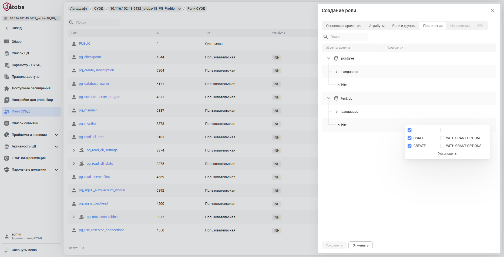{width="7.086805555555555in"
height="3.627083333333333in"}

Рисунок 9.12 -- Окно назначение привилегий

Привилегии устанавливаются или снимаются флагами в строке наименования
привилегии.

Флагами, расположенными в первой строке, устанавливаются или снимаются
все доступные привилегии.

Уже назначенные привилегии отображаются аббревиатурами.

|                                                                                     |                                                                                                                                        |
|-------------------------------------------------------------------------------------|----------------------------------------------------------------------------------------------------------------------------------------|
| {width="0.2513888888888889in" height="0.2513888888888889in"} | Аббревиатуры в разделе «DB roles» частично отличаются от аббревиатур привилегий используемых в разделах JDS User Risk и Access Matrix. |

### Назначения

Вкладка предназначена для настройки доступа к целевой СУБД и сбора
снимков и отчетов (см. р. 24).

По умолчанию используется привилегированный пользователь СУБД
«postgres». Вкладка активна для уже имеющейся роли с атрибутом Login.

Для такой роли доступно назначение ее для:

-   подключения к СУБД установив параметр «Суперпользователь»;

-   подключения к серверу pg\_profile.

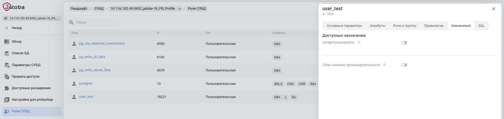{width="7.086805555555555in"
height="1.6861111111111111in"}

Рисунок 9.13 -- Выбор назначения роли

Выбрав назначение для новой роли назначение для роли «postgres»
автоматически отзовется.

Станут доступны настройки параметров аутентификации.

Компонент pg\_profile не поддерживает метод аутентификации по
сертификатам и поэтому вкладка «SSL-сертификат» недоступна.

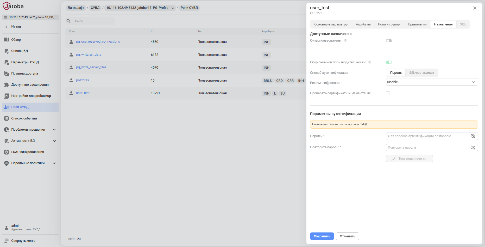{width="7.086805555555555in"
height="3.6173611111111112in"}

Рисунок 9.14 - Вкладка «Назначение ролей»

Установив для роли назначение «Суперпользователь», станут доступны
настройки аутентификации по паролю и по SSL-сертификату.

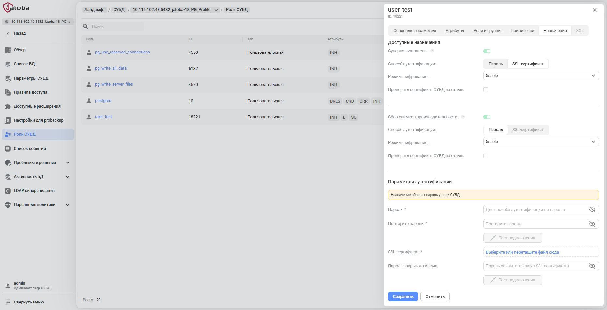{width="7.086805555555555in"
height="3.6215277777777777in"}

Рисунок 9.15 -- Вкладка настройки аутентификации по SSL-сертификату

<table>
<tbody>
<tr class="odd">
<td></td>
<td>
После регистрации СУБД в дереве инфраструктуры приложения JDS, в случае установки на этой СУБД экземпляра pg_profile, обязательно требуется выполнить переназначение «Сбор снимков производительности» на другую роль, не являющуюся ролью с правами SU (суперпользователь).

Это переназначение необходимо выполнить по двум причинам:

<ol type="1">
<li>
Только при назначении другой роли на «Сбор снимков производительности», будут назначены специфические привилегии (см. ниже пункт «Для назначения» Сбор снимков производительности)
</li>
<li>
Выполнение требований ИБ, где необходимо минимизировать привилегии у роли, не требующей использования привилегии SU.
</li>
</ol></td>
</tr>
</tbody>
</table>

### Вкладка «SQL»

В вкладке «SQL» отображаются сформированные SQL-команды доступные только
для ознакомления.

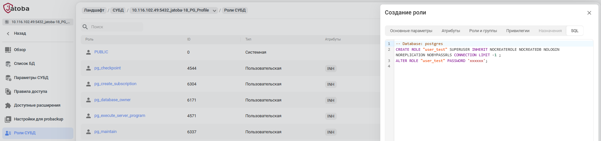{width="7.086805555555555in"
height="1.6729166666666666in"}

Рисунок 9.16 -- Вкладка «SQL»

Команды формируются в логической последовательности выполнения.

Пользователь создается после нажатия кнопки «Сохранить» (Save). При
успешном выполнении будет выведено информационное сообщение.

{width="2.7327471566054244in"
height="0.5297025371828521in"}

Рисунок 9.17 -- Сообщение о создании роли

Редактирование роли
-------------------

Окно редактирования роли вызывается нажатием на имени роли или выбором
кнопки редактирования в строке роли.

На всех вкладках будут отражены ранее установленные права и привилегии.

На вкладе «Основные параметры» доступна функциональная возможность смены
пароля пользователя СУБД с помощью кнопки «Задать пароль».

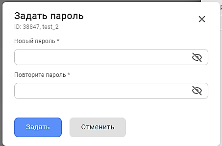

Рисунок 9.18 -- Смена пароля пользователя СУБД

Смена пароля пользователя произойдет сразу, после нажатия кнопки
«Задать», без отражения SQL-команды на вкладке «SQL».

Недоступные функциональные возможности. «Работа с блокировками»
---------------------------------------------------------------

Во вкладке «Роли СУБД» недоступна функциональная возможность
блокирования/разблокирования пользователей СУБД. Данная функциональность
реализована во вкладке «Парольные политики» см. п.п. 14.3 «Вкладка
«Работа с блокировками».

Удаление роли
-------------

Кнопка удаления роли появляется при наведении на строку роли в карточке
списка ролей. Нажатие на кнопку вызывает модальное окно «Удаление роли»
(см. рис. Рисунок 9.19).

Удаление роли потребует подтверждения нажатием кнопки «ОK».

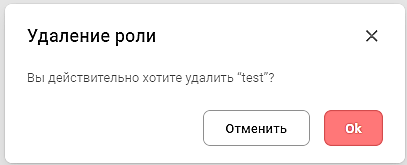

Рисунок 9.19 -- Окно «Удаление роли»

Корректное удаление роли доступно после снятия назначенных привилегий и
переназначения владельца созданных объектов от имени и с правами
удаляемой роли. В силу указанной причины, если зависимости существуют,
то компонент выведет окно сообщения «Конфликты зависимостей».

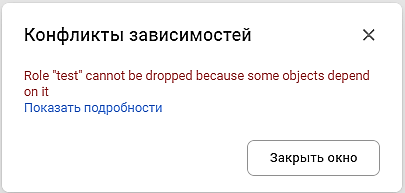{width="3.209403980752406in"
height="1.529420384951881in"}

Рисунок 9.20 - Окно сообщения «Конфликты зависимостей»

Нажатие на гиперссылку «Показать подробности» расширит окно. В окне
будут показаны объектовые привилегии и SQL-команда для снятия
зависимостей. SQL-команду возможно скопировать в буфер обмена через
пиктограмму.

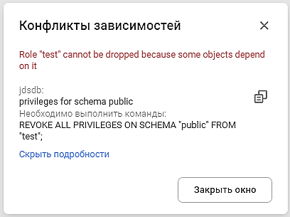{width="2.992130358705162in"
height="2.2367639982502188in"}

Рисунок 9.21 -- Окно «Конфликты зависимостей» с выводом подробной
информации

Псевдороль «Public»
-------------------

Псевдороль «Public» отображается первой в общем списке ролей и имеет
статус «System». Для нее недоступна операция удаления, но возможно
снятие/назначение привилегий.

Раздел «Ландшафт». СУБД. Вкладка «Список событий» (Event List)
==============================================================

«Список событий» предназначен для просмотра событий безопасности каждой
из установок (instance) СУБД.

Вкладка Event List служит для просмотра событий выбранного сервера СУБД
с целью:

-   обнаружения ошибок в работе СУБД;

-   получения отладочной информации;

-   выявления и расследования инцидентов безопасности;

-   получения информации о действиях отдельных пользователей, как
    рядовых пользователей, так и администраторов (РСБ.8), в том числе
    полнотекстовой записи привилегированных команд (РСБ.2а).

JDS обладает функциональной возможностью просмотра событий с целевых
СУБД. События собираются в служебной БД компонента «ja\_Log».

Подробно настройка сбора событий СУБД описано в документе «Руководство
по настройке. Часть 12. Централизованный сбор записей событий СУБД.
Компонент «ja\_Log». 643.72410666.00067-08 98 01-12».

Выбор служебной БД 
-------------------

Выбор служебной БД выполняется нажатием кнопки выпадающего списка выбора
цели, расположенной в левом верхнем углу окна.

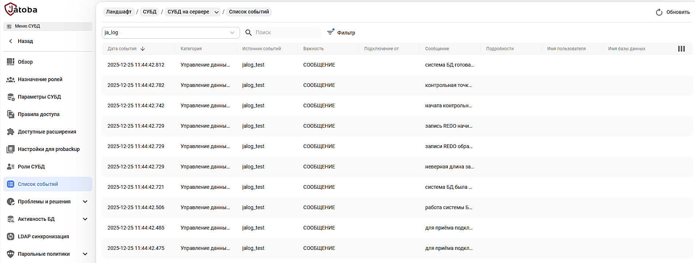{width="7.020562117235346in"
height="2.6593022747156607in"}

Рисунок 10.1 -- Вкладка «Список событий»

Корректная работа раздела обеспечивается установленным компонентом
«ja\_Log» версии не ниже 3.0. При версии ниже рекомендуется провести
процедуру обновления компонента «ja\_Log».

В противном случае выбор цели будет не доступен.

В разделе «Список событий» (Event List) возможно выбрать только один
сервер СУБД.

Цель добавляется через раздел «Ландшафт». В случае если компонент ранее
был установлен на хосте, то в целях добавится автоматически. При
удалении компонента, цель удаляется из выпадающего списка целей.

Фильтр событий
--------------

По умолчанию компонент отобразит список событий за последний месяц.
Данный параметр установлен по умолчанию в фильтре событий.

Перечень событий ограничивается только теми, которые обладают
определенными характеристиками.

Используемые поля и их параметры приведены в таблице Таблица 10.1.

Таблица 10.1 -- Поля фильтра событий

<table>
<thead>
<tr class="header">
<th><blockquote>

<strong>Наименование</strong>

</blockquote></th>
<th><blockquote>

<strong>Наименование ENG</strong>

</blockquote></th>
<th><blockquote>

<strong>Тип поля</strong>

</blockquote></th>
<th><blockquote>

<strong>Обязат.</strong>

</blockquote></th>
<th><blockquote>

<strong>Ограничения (max)</strong>

</blockquote></th>
<th><blockquote>

<strong>Значение по умолчанию</strong>

</blockquote></th>
</tr>
</thead>
<tbody>
<tr class="odd">
<td><blockquote>

Дата события

</blockquote></td>
<td><blockquote>

Event date

</blockquote></td>
<td><blockquote>

календарь для выбора периода

</blockquote></td>
<td><blockquote>

Х

</blockquote></td>
<td><blockquote>

1 мес.

</blockquote></td>
<td><blockquote>

Сегодня

</blockquote></td>
</tr>
<tr class="even">
<td><blockquote>

Название задачи агента

</blockquote></td>
<td><blockquote>

Agent task name

</blockquote></td>
<td><blockquote>

текстовое

</blockquote></td>
<td><blockquote>

─

</blockquote></td>
<td><blockquote>

20

</blockquote></td>
<td></td>
</tr>
<tr class="odd">
<td><blockquote>

Важность

</blockquote></td>
<td><blockquote>

Severity

</blockquote></td>
<td><blockquote>

выпадающий список

</blockquote></td>
<td><blockquote>

─

</blockquote></td>
<td></td>
<td></td>
</tr>
<tr class="even">
<td><blockquote>

Категория

</blockquote></td>
<td><blockquote>

Category

</blockquote></td>
<td><blockquote>

выпадающий список

</blockquote></td>
<td><blockquote>

─

</blockquote></td>
<td></td>
<td></td>
</tr>
<tr class="odd">
<td><blockquote>

Имя БД

</blockquote></td>
<td><blockquote>

Database name

</blockquote></td>
<td><blockquote>

текстовое

</blockquote></td>
<td><blockquote>

─

</blockquote></td>
<td><blockquote>

20

</blockquote></td>
<td></td>
</tr>
<tr class="even">
<td><blockquote>

Имя пользователя

</blockquote></td>
<td><blockquote>

User name

</blockquote></td>
<td><blockquote>

текстовое

</blockquote></td>
<td><blockquote>

─

</blockquote></td>
<td><blockquote>

20

</blockquote></td>
<td></td>
</tr>
<tr class="odd">
<td><blockquote>

Имя приложения

</blockquote></td>
<td><blockquote>

Application name

</blockquote></td>
<td><blockquote>

текстовое

</blockquote></td>
<td><blockquote>

─

</blockquote></td>
<td><blockquote>

20

</blockquote></td>
<td></td>
</tr>
<tr class="even">
<td><blockquote>

Подключение от

</blockquote></td>
<td><blockquote>

Connection from

</blockquote></td>
<td><blockquote>

текстовое

</blockquote></td>
<td><blockquote>

─

</blockquote></td>
<td><blockquote>

30

</blockquote></td>
<td></td>
</tr>
<tr class="odd">
<td><blockquote>

SQLstate код

</blockquote></td>
<td><blockquote>

SQLstate code

</blockquote></td>
<td><blockquote>

текстовое

</blockquote></td>
<td><blockquote>

─

</blockquote></td>
<td><blockquote>

8

</blockquote></td>
<td></td>
</tr>
</tbody>
</table>

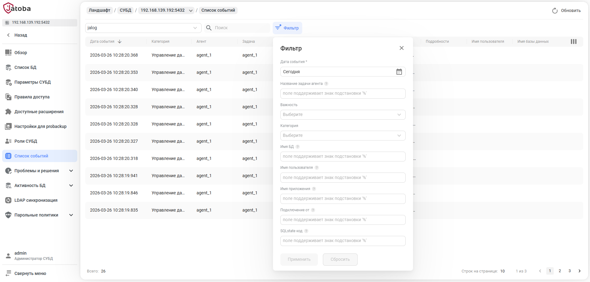{width="7.086805555555555in"
height="3.3895833333333334in"}

Рисунок 10.2 -- Фильтр событий

**Дата события**

Поле «Дата события» имеет календарь, в котором предустановлены периоды:

-   Свой период;

-   Последний 1 час;

-   Последние 6 часов;

-   Последние 24 часа;

-   Последние 2 суток;

-   Последние 7 суток;

-   Последние 30 суток;

-   Сегодня;

-   Вчера;

-   Текущая неделя;

-   Прошлая неделя.

**Важность**

В поле «Важность» допустимо выбрать одно или все значения, либо оставить
поле пустым.

Выбираются значения:

-   Отладка;

-   Сообщение;

-   Информация;

-   Замечание;

-   Предупреждение;

-   Ошибка;

-   Важно;

-   Паника.

**Категория**

В поле устанавливается выбор событий по следующим категориям, которые
соответствуют мерам защиты информации:

-   Управление доступом (УПД);

-   Идентификация (ИАФ);

-   Управление данными;

-   Контроль целостности (ОЦЛ);

-   Регистрация событий безопасности (РСБ);

-   Кластеризация (ОДТ);

-   Резервное копирование (ОДТ);

-   Прочее;

-   Контроль целостности данных (ОЦЛ).

**SQLstate код**

Доступно использование знака подстановки «%» для замены любого
количества любых символов, в полях фильтра списка событий.

Просмотр списка событий
-----------------------

Установленный временной диапазон сформирует список событий (рис. Рисунок
10.3).

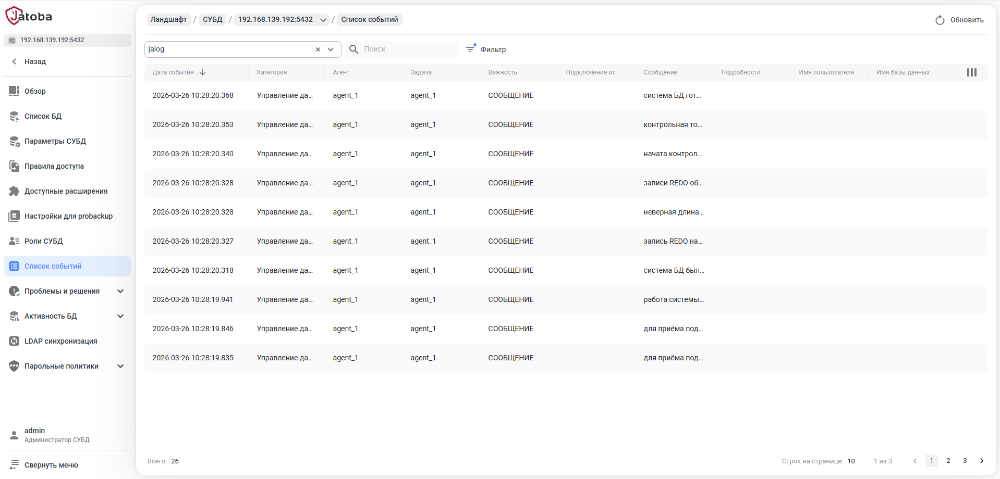{width="7.086805555555555in"
height="3.3986111111111112in"}

Рисунок 10.3 -- Список событий

В правой нижней части окна расположены пиктограммы страниц списка
событий.

Выбор столбцов (Columns)
------------------------

Пиктограмма «Столбцы» (Columns) расположена в правом верхнем углу окна.

При нажатии на нее раскроется меню со списком столбцов, приведенных в
таблице Таблица 10.2.

Таблица 10.2 -- Список столбцов

| **Наименование (RU)**                                   | **Наименование (ENG)**                                       | **По умолчанию** |
|---------------------------------------------------------|--------------------------------------------------------------|------------------|
| Идентификатор события                                   | **ID**                                                       | Х                |
| Агент                                                   | **Agent**                                                    | Х                |
| Задача                                                  | **Task**                                                     | Х                |
| Файл                                                    | **File**                                                     | Х                |
| Категория события                                       | **Category**                                                 | Х                |
| Дата события                                            | **Event data**                                               | Х                |
| Важность                                                | **Severity**                                                 | Х                |
| Подключение от                                          | **Connection from**                                          | Х                |
| Сообщение                                               | **Message**                                                  | Х                |
| Подробности                                             | **Detail**                                                   | Х                |
| Имя пользователя                                        | **User name**                                                | Х                |
| Имя базы данных                                         | **Database name**                                            | Х                |
| Время вставки в лог                                     | **LOG insertion time**                                       |                  |
| Идентификатор процесса                                  | **Process ID**                                               |                  |
| Идентификатор сессии                                    | **Session ID**                                               |                  |
| Номер строки каждой сессии                              | **Per-session line number**                                  |                  |
| Тег команды                                             | **Command tag**                                              |                  |
| Время начала сессии                                     | **Session start time**                                       |                  |
| Виртуальный идентификатор транзакции                    | **Virtual transaction ID**                                   |                  |
| Идентификатор транзакции                                | **Regular transaction ID**                                   |                  |
| SQLSTATE Код                                            | **SQLSTATE code**                                            |                  |
| Подсказка                                               | **Hint**                                                     |                  |
| Внутренний запрос                                       | **Internal query that led to the error**                     |                  |
| Номер символа внутреннего запроса, где произошла ошибка | **Internal query character number where the error occurred** |                  |
| Контекст                                                | **Error context**                                            |                  |
| Запрос пользователя                                     | **User query that led to the error**                         |                  |
| Номер символа в запросе пользователя                    | **User query character number where the error occurred**     |                  |
| Расположение ошибки в исходном коде                     | **The location of the error in the PostgreSQL source code**  |                  |
| Имя приложения                                          | **Application name**                                         |                  |
| Тип процесса СУБД                                       | **DBMS process type**                                        |                  |

|                                                         |                                                                                                                                            |
|---------------------------------------------------------|--------------------------------------------------------------------------------------------------------------------------------------------|
| {width="0.25in" height="0.25in"} | Соответствие событий СУБД категориям мер защиты приказов ФСТЭК России приведено в Приложении к документу «Реализация функций безопасности» |

Выбор столбцов осуществляется установкой флажков.

При использовании расширения «pgAudit» в столбец «Message» включаются
дополнительные столбцы, представленные в таблице Таблица 10.3.

Таблица 10.3 -- Структура столбца «Error message»

| **Наименование основного столбца** | **Наименование дополнительного столбца** | **Описание**                       |
|------------------------------------|------------------------------------------|------------------------------------|
| **Error message**                  | Сообщение об ошибке                      |                                    |
|                                    | **Event recording type**                 | Тип записи события                 |
|                                    | **Expression No.**                       | № выражения                        |
|                                    | **Subexpression No.**                    | № подвыражения                     |
|                                    | **Event class**                          | Класс события                      |
|                                    | **SQL operation**                        | SQL - операция                     |
|                                    | **DB object type**                       | Тип объекта БД                     |
|                                    | **DB object name**                       | Имя объекта БД                     |
|                                    | **Full text of the SQL query (script)**  | Полный текст SQL-запроса (скрипта) |
|                                    | **SQL query parameters (script)**        | Параметры SQL-запроса (скрипта)    |

Сортировка списка событий
-------------------------

Сортировка событий возможна по каждому выбранному столбцу и вызывается
нажатием на выбранный столбец:

-   1 нажатие -- сортировка по возрастанию;

-   2 нажатия -- сортировка по убыванию;

-   3 нажатия -- отмена сортировки.

Полнотекстовый поиск событий
----------------------------

Полнотекстовый поиск событий осуществляется через строку поиска,
представленную на рисунке Рисунок 10.4. В поиск включаются все столбцы
таблицы, включая не отображаемые в текущий момент. Запись отображается
при условии, что:

-   условие выполняется хотя бы для одного из столбцов;

-   выполняются и условия поиска, и условия фильтрации.

Поиск ограничивается 30 регистронезависимыми символами.

События фильтруются по нажатию клавиши «Ввод».

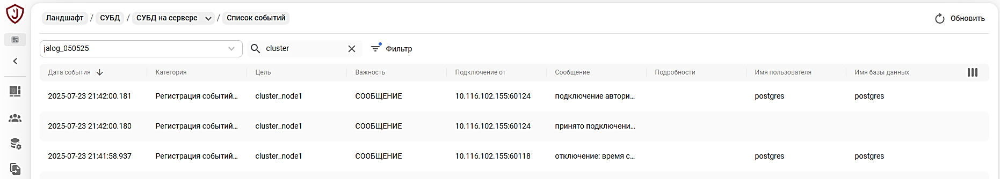{width="7.086805555555555in"
height="1.2715277777777778in"}

Рисунок 10.4 -- Строка поиска и вывод

Раздел «Ландшафт». СУБД. Вкладка «Проблемы и решения» (Problems & Solutions)
============================================================================

«Problems & Solutions» это инструмент, который позволяет определять ряд
проблем, существующих в целевой СУБД. Для определения проблемы созданы
скрипты (скрипт обнаружения) и для исправления проблемы -- динамические
скрипты (шаблон таблетки).

Функциональные возможности подраздела доступны на уровне целевой СУБД в
разделе «Ландшафт».

Вкладка «Правила сканирования»
------------------------------

При первом открытии вкладки компонент JDS предложит создать первое
правило сканирования.

Нажатие на пиктограмму «Создать» вызовет окно «Создание правила
сканирования».

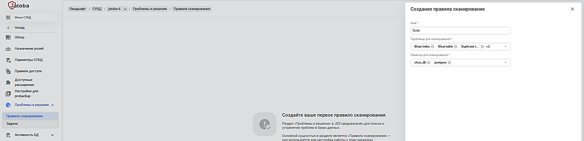{width="7.086805555555555in"
height="1.7173611111111111in"}

Рисунок 11.1 -- Выпадающий список проблем для сканирования

В выпадающем списке доступен множественный выбор проблем для
сканирования, представленных в таблице Таблица 11.1.

Таблица 11.1 -- Перечень определяемых проблем в СУБД

| **Проблемы**              | **Описание проблемы**                                          |
|---------------------------|----------------------------------------------------------------|
| Bloat index               | Индекс, занимающий дополнительное пространство                 |
| Bloat table               | Таблица фрагментирована и занимает дополнительное пространство |
| Duplicate index           | Дублированные индексы, занимающие дополнительное пространство  |
| Missing Foreign Key index | Пропущенный индекс внешнего ключа                              |
| Not analyzed table        | Не анализированные таблицы более 100 дней                      |
| Not vacuumed table        | Таблица дефрагментирована и содержит много мертвых строк       |
| Sequence Limit            | Предел последовательности                                      |
| Unused index              | Давно не использованные индексы, переполненные таблицы         |

Следующим шагом выбираются объекты сканирования.

В качестве объектов сканирования могут быть базы данных целиком и/или
схемы данных. При выборе объектов доступен множественный выбор.

Правило сканирования сохраняется нажатием на кнопку «Сохранить».

Созданные правила сканирования отображаются в общем списке.

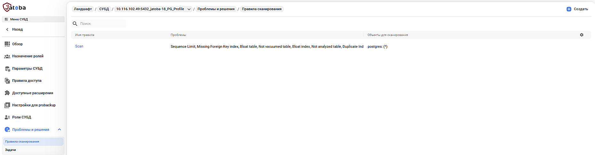{width="7.086805555555555in" height="1.85625in"}

Рисунок 11.2 -- Список созданных правил сканирования

Режим сканирования
------------------

Переход в режим сканирования выполняется при нажатии на гиперссылку в
имени правила сканирования в одноименной вкладке.

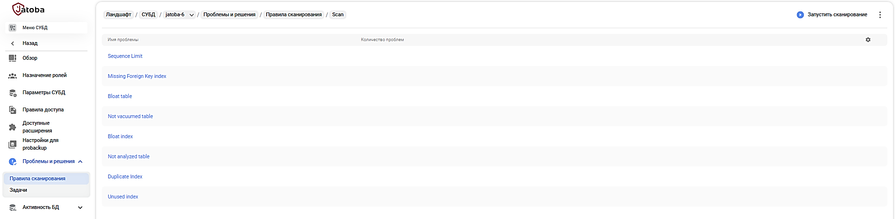{width="7.086805555555555in"
height="1.742361111111111in"}

Рисунок 11.3 -- Вкладка «Результаты сканирования»

Сканирование возможно:

-   По всем проблемам через пиктограмму «Запустить сканирование»
    находящейся в правом верхнем углу окна;

-   Выборочное сканирование через одноименную пиктограмму в строке
    проблемы.

В случае если сканирование проводилось ранее, то просмотреть результаты
возможно через нажатие на гиперссылку в имени проблемы.

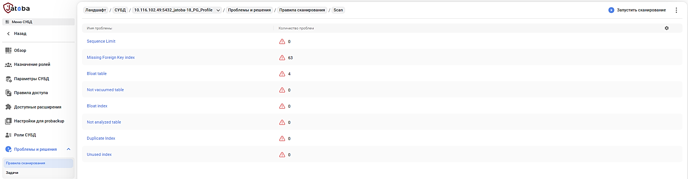{width="7.086805555555555in"
height="1.8534722222222222in"}

Рисунок 11.4 -- Список ранее найденных проблем

Для выявленных проблем отображается их статус в виде пиктограмм.

Таблица 11.2 -- Описание пиктограмм

| **Пиктограмма**                                                                      | **Описание**                                                                      |
|--------------------------------------------------------------------------------------|-----------------------------------------------------------------------------------|
| {width="0.5755708661417323in" height="0.5889566929133858in"} | Найдена проблема                                                                  |
| {width="0.5210640857392825in" height="0.4785279965004374in"} | Запланировано исправление                                                         |
| {width="0.5533748906386702in" height="0.5030675853018373in"} | Поставлена в очередь                                                              |
| {width="0.5208333333333334in" height="0.5716458880139983in"} | Исправление запущено                                                              |
| {width="0.25in" height="0.25in"}                              | Для проблемы «Duplicate Index» отображается дополнительная информация об объектах |

Перейдя по гиперссылке в имени проблемы отобразится их перечень, в
котором доступен поиск по любым значениям.

При сканировании объектов компонент определяет возможные варианты
исправления. В результате, компонент предоставляет предопределённый,
оптимальный вариант решения и предоставляет выбор решения проблемы
пользователю.

Варианты решения проблем представлены на схеме Рисунок 11.5.

Рисунок 11.5 -- Схема возможных вариантов исправления

Каждая из найденных проблем лечится индивидуально, т.к. требует
квалифицированного подхода. Для этого необходимо нажать на строке
проблемы. Тем самым вызвать окно «Исправление проблемы».

В открывшимся окне доступен:

-   выбор параметров исправления;

-   просмотр SQL-команды исправления;

-   выбор временного диапазона выполнения задачи;

-   указание комментария.

При установленном флаге «Выполнить сейчас» задача исправления выполнится
немедленно.

Снятый флаг активирует установку даты и времени выполнения исправления в
календаре.

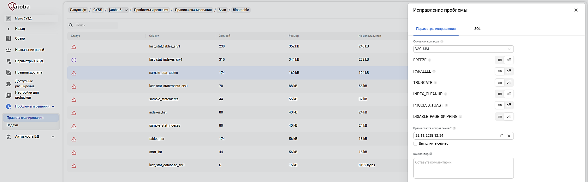{width="7.086805555555555in"
height="2.202777777777778in"}

Рисунок 11.6 -- Установка параметров и даты исправления проблемы

Каждый из параметров окна оснащен интерактивной подсказкой.

Для каждой проблемы предоставляются разработанные варианты исправления.

SQL-команды отображаются во вкладке SQL и не доступны для
редактирования.

{width="3.245615704286964in"
height="1.002678258967629in"}

Рисунок 11.7 -- Отображение выполняемых SQL-команд

Вкладка «Задачи»
----------------

Выбранные проблемы для исправления передаются в общий список на вкладке
«Задачи».

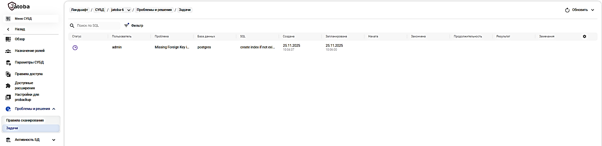{width="7.086805555555555in"
height="1.7256944444444444in"}

Рисунок 11.8 -- Список задач на вкладке «Задачи»

В списке задач доступно:

-   выполнить контекстный поиск по SQL через поле «Поиск»;

-   отфильтровать список через меню «Фильтр»;

-   просмотреть информацию о продолжительности выполнения задачи;

-   обновить список задач или установить автоматическое обновление во
    временном диапазоне:

<!-- -->

-   30 секунд;

-   1 минута;

-   5 минут.

В меню «Фильтр» доступен выбор по полям:

-   Пользователи;

-   Проблемы;

-   Статусы;

-   Создана;

-   Запланирована;

-   Начата.

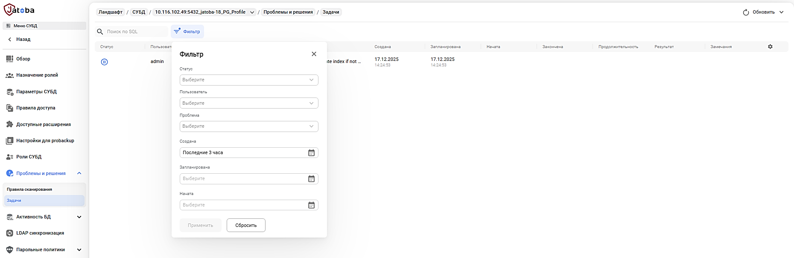{width="7.086805555555555in"
height="2.3090277777777777in"}

Рисунок 11.9 -- Окно «Фильтр»

Задачи в списке могут иметь статус:

-   Запланирована;

-   Поставлена в очередь;

-   Запущена;

-   Завершена успешно;

-   Завершена с предупреждением;

-   Завершена с ошибкой;

-   Отменена.

В поле выбора периода отображения задач по умолчанию установлен период
«Последние 3 часа».

Доступен выбор параметров:

-   Свой период;

-   Последние 5 минут;

-   Последние 20 минут;

-   Последний 1 час;

-   Последние 3 часа;

-   Последние 6 часов;

-   Последние 12 часов;

-   Последние 24 часа;

-   Последние 7 суток;

-   Последние 30 суток

-   Сегодня;

-   Сегодня до наст. момента;

-   Вчера;

-   Этот день на прошлой неделе;

-   Текущая неделя;

-   Текущая неделя до наст. момента;

-   Прошлая неделя.

В случае, когда задача завершилась с ошибкой, при клике на неё
открывается окно с основными параметрами, рекомендациями и пояснениями в
силу каких причин исправление не было произведено.

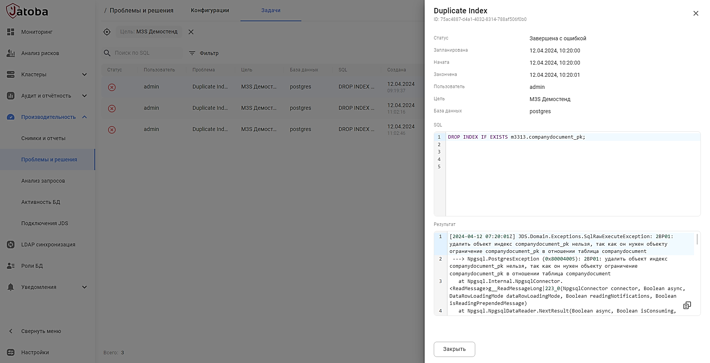{width="2.8479997812773403in"
height="3.6305555555555555in"}

Рисунок 11.10 -- Общая информация о задаче и рекомендациями по
исправлению

В случае, когда временные затраты на исправление проблемы велики,
исправление проблемы выполняется в асинхронном режиме используя
функциональные возможности службы «jds-doctor.service», вне зависимости
от активности компонента JDS.

Служба «jds-doctor.service» является планировщиком задач раздела
«Проблемы и решения». Служба оснащена журналом событий и
конфигурационным файлом.

Запланированную задачу возможно отменить, нажав на нее в списке задач и
в открывшемся окне, нажав кнопку «Отменить задачу».

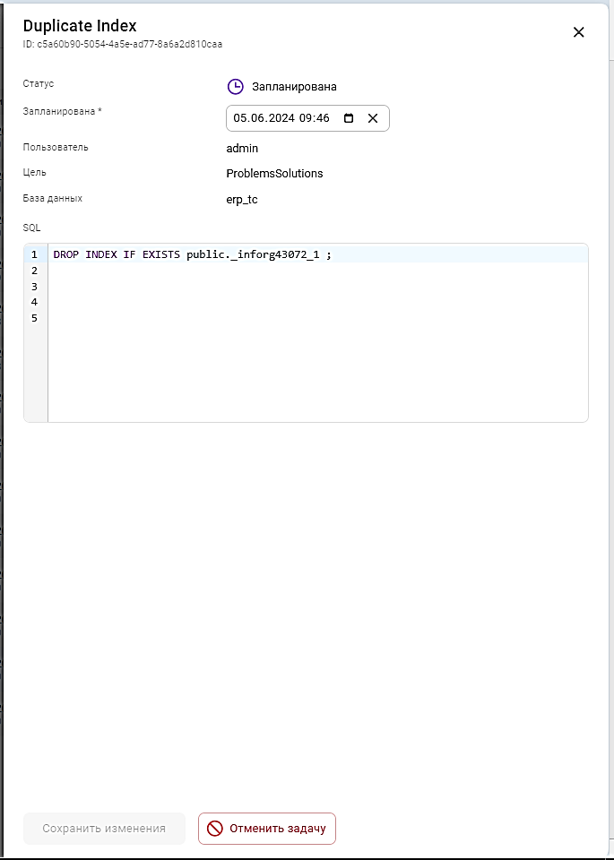{width="2.2465277777777777in"
height="3.206681977252843in"}

Рисунок 11.11 -- Отмена запланированной задачи

При этом обязательно указывается комментарий с причинами отмены в
одноименном поле во всплывающем окне «Отмена задачи».

|                                                         |                                                                        |
|---------------------------------------------------------|------------------------------------------------------------------------|
| {width="0.25in" height="0.25in"} | Задачи со статусом «Поставлена в очередь» и «Запущена» отменить нельзя |

Задачи со статусом «Запланирована» доступны для редактирования.

Работа нескольких пользователей с подразделом «Проблемы и решения» (Problems & Solutions)
-----------------------------------------------------------------------------------------

Подраздел «Проблемы и решения» (Problems & Solutions) может быть
доступен пользователям, имеющим административные функции в СУБД и
имеющим доступ к разделу.

При входе в подраздел станут доступны созданные конфигурации и
рекомендации для исправления.

Рекомендации для исправления отображаются для всех пользователей,
имеющих доступ к разделу «Проблемы и решения» (Problems & Solutions) и
доступны функциональные возможности по решению обнаруженных проблем.

Раздел «Ландшафт». СУБД. Вкладка «Активность БД» (DB Activity)
==============================================================

Вкладка «Активность БД» (DB Activity) предназначена для:

-   мониторинга активности в СУБД;

-   получения информации о выполняющихся сессиях/процессах, существующих
    блокировках;

-   завершения сессий;

-   выявления подозрительной активности пользователей.

Может использоваться в случаях, когда пользователь(и) СУБД сообщает(ют),
что:

-   операция «зависла»;

-   СУБД потеряла производительность;

-   типичные операции выполняются дольше обычного;

-   зависла сессия, не позволяющая подсоединиться повторно, и требуется
    ее снять;

-   требуется разобраться по каким причинам «зависла» его операция.

Вкладка доступна в разделе «Ландшафт» при переходе на уровень СУБД.

Вкладка «Сессии» (Session)
--------------------------

При выборе цели компонент JDS автоматически отобразит текущие сессии.

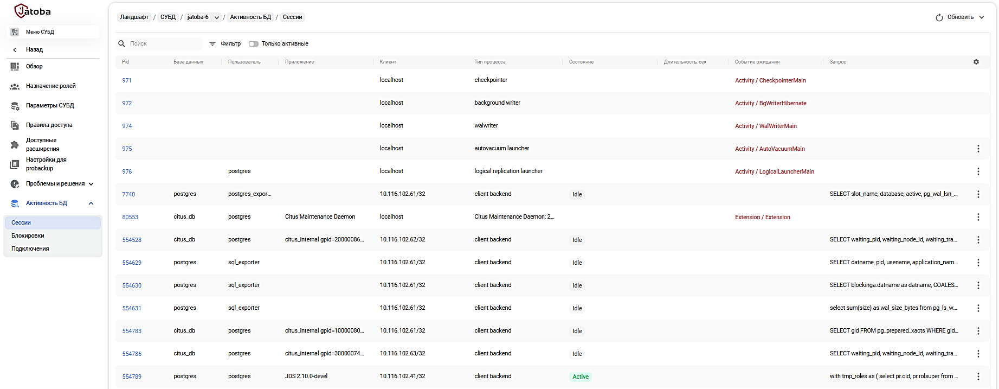{width="6.979166666666667in"
height="2.715069991251094in"}

Рисунок 12.1 -- Отображение текущих сессий

В вкладке «Сессии» отображаются столбцы, представленные в таблице
Таблица 12.1.

Таблица 12.1 -- Столбцы вкладки «Сессии»

| **Название (RU)** | **Название (ENG)** | **Описание**                                                                                 | **Значения поля** |
|-------------------|--------------------|----------------------------------------------------------------------------------------------|-------------------|
| Pid               | Pid                | Идентификатор процесса                                                                       |                   |
| БД                | Database           | Имя БД, к которой подключен процесс                                                          |                   |
| Пользователь      | User               | Имя подключенного пользователя                                                               |                   |
| Приложение        | Application        | Вывод названия приложения (application\_name) и/или версии приложения (application\_version) |                   |
| Клиент            | Host               | IP-адрес или имя компьютера клиента                                                          |                   |
| Тип процесса      | Backend type       | Тип процесса                                                                                 |                   |
| Состояние         | State              | Текущее состояние                                                                            | Таблица 12.2      |
| Длительность, сек | Duration, s        | Длительность работы последней команды, сек                                                   |                   |
| Событие ожидания  | Wait event         | Тип события ожидания / имя события ожидания                                                  | Таблица 12.3      |
| Запрос            | Query              | Текст последнего запроса                                                                     |                   |

Столбцы возможно показать или скрыть через пиктограмму «Выбор столбцов»
(Columns), расположенную в верхнем правом углу вкладки.

По умолчанию будут активны все столбцы.

Поле «Состояние» (State) может принимать значения, приведенные в таблице
Таблица 12.2.

Таблица 12.2 -- Возможные значения поля «Состояние» (State)

| **Значение**                  | **Описание**                                                                                     |
|-------------------------------|--------------------------------------------------------------------------------------------------|
| active                        | Серверный процесс выполняет запрос                                                               |
| idle                          | Серверный процесс ожидает новой команды от клиента                                               |
| idle in transaction           | Серверный процесс находится внутри транзакции, но в настоящее время не выполняет никакой запрос  |
| idle in transaction (aborted) | Серверный процесс находится внутри транзакции, но один из операторов в транзакции вызывал ошибку |
| fastpath function call        | Серверный процесс выполняет fast-path функцию                                                    |
| disabled                      | Серверный процесс отключен                                                                       |

Для сессий в статусе «idle» значения этих полей должны быть пустыми.

Поле «Событие ожидания» (Wait event) может принимать значения,
приведённые в таблице Таблица 12.3.

Таблица 12.3 -- Типы событий ожидания

| **Тип события ожидания** | **Описание**                                                                                                                                                     |
|--------------------------|------------------------------------------------------------------------------------------------------------------------------------------------------------------|
| Activity                 | Серверный процесс простаивает. Состояние «Activity» показывает, что процесс ожидает активности в основном цикле обработки                                        |
| BufferPin                | Серверный процесс ожидает исключительного доступа к буферу данных                                                                                                |
| Client                   | Серверный процесс ожидает в сокете некоторую активность пользовательского приложения. Сервер ждёт наступления события, не зависящего от его внутренних процессов |
| Extension                | Серверный процесс ожидает условия, возникающего в модуле расширения                                                                                              |
| IO                       | Серверный процесс ожидает завершения операции ввода/вывода                                                                                                       |
| IPC                      | Серверный процесс ожидает взаимодействия с другим процессом                                                                                                      |
| Lock                     | Серверный процесс ожидает тяжёлую блокировку                                                                                                                     |
| LWLock                   | Серверный процесс ожидает лёгкую блокировку                                                                                                                      |
| Timeout                  | Серверный процесс ожидает истечения определённого времени. В поле «wait\_event» обозначается конкретное место ожидания                                           |

В правом верхнем углу вкладки располагается пиктограмма «Обновить».

Нажатие на нее обновит отображаемые значения на вкладке. Вызвав
контекстное меню пиктограммы «Обновить» возможно установить
автообновление вкладки через интервалы времени:

-   1 секунда;

-   5 секунд;

-   10 секунд;

-   30 секунд;

-   60 секунд.

На вкладке «Сессии» доступны следующие виды сортировки:

-   «Фильтр»;

Фильтр выполняет фильтрацию по полям «База данных», «Пользователь» и
«Тип процесса» с возможностью поиска значения и множественного выбора.

-   Тумблер «Только активные»;

По умолчанию тумблер выключен, т.е. выводятся все сессии. Установкой
тумблера в активный режим отсортирует список сессий, имеющих статус
«Active».

-   Сортировка вывода;

Каждый из столбцов вкладки, указанный в таблице Таблица 12.1, имеет
функциональную возможность прямой и обратной сортировки пользователем.

### Завершение сессии (End session)

Завершении сессии доступно:

-   из контекстного меню строки таблицы;

-   при клике на строку сессии.

В правой части вкладки откроется дополнительное окно с вспомогательными
полями, представленными в таблице Таблица 12.4.

Таблица 12.4 -- Вспомогательные поля окна завершения сессии на вкладке
«Сессии»

| **Название (RU)**             | **Название (ENG)** | **Описание**                                                                   |
|-------------------------------|--------------------|--------------------------------------------------------------------------------|
| Запрос                        | Query              | Текст запроса                                                                  |
| База данных                   | Database           | Имя БД, к которой подключен процесс                                            |
| Пользователь                  | User               | Имя подключенного пользователя                                                 |
| Приложение                    | Application        | Название приложения                                                            |
| Клиент                        | HOST               | Хост клиента                                                                   |
| Тип процесса                  | Backend type       | Тип процесса                                                                   |
| Состояние                     | State              | Текущее состояние сессии                                                       |
| Длительность                  | Duration, s        | Длительность работы последней команды, сек                                     |
| Тип события ожидания          | Wait event type    | Тип события, которого ждёт обслуживающий процесс                               |
| Событие ожидания              | Wait event         | Тип события ожидания / имя события ожидания                                    |
| ID базы данных                | DB ID              | OID базы данных, к которой подключен процесс                                   |
| IP-адрес клиента              | Client address     | IP-адрес клиента                                                               |
| Порт клиента                  | Client port        | Номер TCP-порта, который используется клиентом для соединения с этим процессом |
| Компьютер клиента             | Client host        | Имя компьютера клиента                                                         |
| Запуск процесса               | Backend start      | Время запуска процесса                                                         |
| Начало транзакции             | Xact start         | Время начала текущей транзакции                                                |
| Начало запроса                | Query start        | Время начала выполнения активного/последнего запроса                           |
| Изменение состояния           | State change       | Время последнего изменения состояния (поля state)                              |
| ID верхнего уровня транзакции | Backend xid        | Идентификатор верхнего уровня транзакции                                       |

Во вложенном окне «Запрос» отражается выполняемый запрос, который
возможно скопировать в буфер обмена.

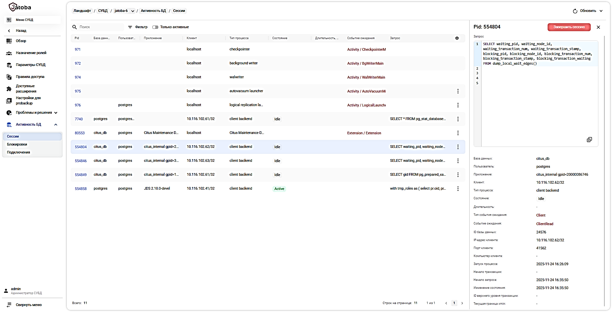{width="7.013888888888889in"
height="3.5794542869641295in"}

Рисунок 12.2 -- Дополнительное окно «Завершение сессии» в вкладке
«Сессии»

Нажатие на кнопку «Завершение сессии» (End session) вызовет окно
подтверждения действия «Завершение сессии» (Session ending).

Подтвердив действие, выбранная сессия завершится.

Компонент различает служебные, серверные и клиентские запросы. В случае,
если завершение процесса может привести к неработоспособности СУБД или
компонента «JDS», будет выведено акцентированное сообщение.

Вкладка «Блокировки» (Locks)
----------------------------

На вкладке «Блокировки» отображаются заблокированные сессии в СУБД.

После выбора цели во вкладке «Блокировки» автоматически отобразятся
существующие блокировки в СУБД.

На вкладке «Блокировки» отображаются столбцы, представленные в таблице
Таблица 12.5.

Таблица 12.5 -- Основные отображаемые поля вкладки «Блокировки»

| **Название (RU)**                 | **Название (ENG)**   | **Описание**                                                                      |
|-----------------------------------|----------------------|-----------------------------------------------------------------------------------|
|  Pid                              | Pid                  | Идентификатор процесса                                                            |
|  Длительность, сек                | Duration, s          | Длительность работы последней команды, сек                                        |
|  Событие ожидания                 | Wait event           | Тип события ожидания / имя события ожидания                                       |
|  Пользователь                     | User                 | Имя подключенного пользователя                                                    |
|  Приложение                       | Application          | Название приложения                                                               |
|  Удерживаемый / запрошенный режим | Inquired / lock mode | Запрошенный режим блокировки для блокируемых сессий, удерживаемый -- для корневых |
|  Состояние                        | State                | Текущее состояние сессии                                                          |
|  БД                               | Database             | Имя БД, к которой подключен процесс                                               |
|  Запрос                           | Query                | Текст последнего запроса                                                          |

Столбцы возможно показать или скрыть через пиктограмму «Выбор столбцов»
(Columns), расположенную в верхнем правом углу вкладки, аналогично как
описано в п. 12.1.

Одни сессии могут блокировать работу других сессий и представлены в виде
уровней зависимостей (иерархии).

### Завершение заблокированной сессии

Завершении сессии доступно при клике на строку сессии. В правой части
вкладки откроется дополнительное окно с вспомогательными полями,
представленными в таблице Таблица 12.6.

Таблица 12.6 -- Вспомогательные поля окна завершения сессии на вкладке
«Блокировки»

| **Название (RU)**             | **Название (ENG)**   | **Описание**                                                                                                                                        |
|-------------------------------|----------------------|-----------------------------------------------------------------------------------------------------------------------------------------------------|
| Длительность                  | Duration, s          | Длительность работы последней команды, сек                                                                                                          |
| Тип события ожидания          | Wait event type      | Тип события, которого ждёт обслуживающий процесс                                                                                                    |
| Событие ожидания              | Wait event           | Тип события ожидания / имя события ожидания                                                                                                         |
| Пользователь                  | User                 | Имя подключенного пользователя                                                                                                                      |
| Приложение                    | Application          | Название приложения                                                                                                                                 |
| Удержание / запрошенный режим | Inquired / lock mode | Запрошенный режим блокировки для блокируемых сессий, удерживаемый -- для корневых                                                                   |
| Состояние                     | State                | Текущее состояние сессии                                                                                                                            |
| База данных                   | Database             | Имя БД, к которой подключен процесс                                                                                                                 |
|  Кем заблокирован (pid)       | Locked by pid        | Pid блокирующей сессии                                                                                                                              |
|  Режим блокировки             | Locked by mode       | Режим блокировки блокирующей сессии                                                                                                                 |
|  Тип блокировки               | Lock type            | Тип блокируемого объекта                                                                                                                            |
|  Объект                       | Object               | Имя объекта, являющегося целью блокировки                                                                                                           |
|  ID отношения                 | Relation             | OID отношения, являющегося целью блокировки                                                                                                         |
|  Страница                     | Page                 | Номер страницы в отношении, являющейся целью блокировки                                                                                             |
|  Кортеж                       | Tuple                | Номер кортежа на странице, являющегося целью блокировки запроса                                                                                     |
|  Виртуальный ID транзакции    | Virtual xid          | Виртуальный идентификатор транзакции, являющийся целью блокировки                                                                                   |
|  ID транзакции                | Transaction ID       | Идентификатор транзакции, являющийся целью блокировки                                                                                               |
|  ID системного каталога       | Class ID             | OID системного каталога, содержащего цель блокировки                                                                                                |
|  ID цели                      | Object ID            | OID цели блокировки в соответствующем системном каталоге                                                                                            |
|  Номер столбца                | Object subid         | Номер столбца, являющегося целью блокировки (на саму таблицу указывают classid и objid), ноль, если это некоторый другой обычный объект базы данных |
| ID базы данных                | DB ID                | OID базы данных, к которой подключен процесс                                                                                                        |
| IP-адрес клиента              | Client address       | IP-адрес клиента                                                                                                                                    |
| Порт клиента                  | Client port          | Номер TCP-порта, который используется клиентом для соединения с этим процессом                                                                      |
| Компьютер клиента             | Client hostname      | Имя компьютера клиента                                                                                                                              |
| Начало транзакции             | Xact start           | Время начала текущей транзакции                                                                                                                     |
| Начало запроса                | Query start          | Время начала выполнения активного/последнего запроса                                                                                                |
| Изменение состояния           | State change         | Время последнего изменения состояния (поля state)                                                                                                   |
| ID верхнего уровня транзакции | Backend xid          | Идентификатор верхнего уровня транзакции                                                                                                            |

Нажатие на кнопку «Завершение сессии» (End session) вызовет окно
подтверждения действия «Завершение сессии» (Session ending).

Тем самым вызовется функция СУБД «pg\_terminate\_backend», которая
завершает процесс с указанным PID.

Подтвердив действие, выбранная сессия завершится.

Вкладка «Подключения»
---------------------

Вкладка «Подключения» отображает количество подключений к выбранной
СУБД, позволяя выполнить меру безопасности, установленную Приказом № 17
ФСТЭК России:

[Мера защиты УПД.9 (3) в части следующих требований:]{.underline}

-   контроль и отображение администратору числа активных параллельных
    (одновременных) сеансов (сессий) для каждой учетной записи
    пользователей.

При переходе во вкладку отображаются столбцы:

-   «Пользователь/роль»;

-   «Количество подключений»;

-   «Квота подключений».

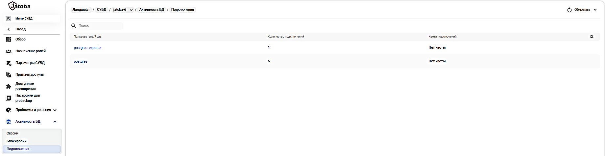{width="7.086805555555555in"
height="1.8409722222222222in"}

Рисунок 12.3 -- Вкладка «Подключения»

Имена пользователей отражены в виде активной ссылки, при нажатии на
которую:

-   произойдет переключение на вкладку «Сессии» (см. п. 12.1);

-   автоматически установится фильтр по выбранному пользователю.

В правом верхнем углу расположена кнопка «Обновить» с выпадающим списком
выбора времени автоматического обновления отображаемой информации.

**Окно поиска**

Окно поиска расположено в левом верхнем углу вкладок «Сессии» и
«Блокировки». Поиск выполняется по буквенным, числовым значениям, по
всем столбцам.

Раздел «Ландшафт». СУБД. Вкладка «LDAP синхронизация» (LDAP Sync)
=================================================================

Вкладка «LDAP синхронизация» (LDAP Sync) является графическим
интерфейсом компонента «ja\_Sync\_LDAP», предназначенного для
синхронизации учетных записей групп пользователей активного каталога с
учетными записями СУБД.

Перед работой с данным подразделом необходимо ознакомиться с
документацией:

-   «Руководство администратора. 643.72410666.00067-08 95 01»;

-   «Руководство по настройке. Часть 2. Контроль субъектов доступа.
    Компонент «Jatoba data vault». 643.72410666.00067-08 98 01-02»;

-   «Руководство по настройке. Часть 8. Синхронизация учетных записей
    служб каталогов и СУБД. Компонент «ja\_Sync\_LDAP».
    643.72410666.00067-08 98 01-08».

Вкладка «LDAP синхронизация» отображается на уровне СУБД. Для работы с
вкладкой необходимо перейти по пути: Раздел Ландшафт → СУБД → Дерево
инфраструктуры → Хост → СУБД → LDAP синхронизация.

|                                                         |                                                                                                                                                                                                         |
|---------------------------------------------------------|---------------------------------------------------------------------------------------------------------------------------------------------------------------------------------------------------------|
| {width="0.25in" height="0.25in"} | Настройка синхронизации учетных записей служб каталогов с СУБД описана в документе «Руководство по настройке. Часть 8. Синхронизация учетных записей служб каталогов и СУБД. Компонент «ja\_Sync\_LDAP» |

Табличная область вкладки «LDAP Sync» разделена на 3 части,
расположенные в логической последовательности:

-   Профили (Profiles);

-   Маппинг (Mapping);

-   Журнал (Log).

Перейдя во вкладку выберите БД с установленным расширением
«ja\_sync\_ldap» после чего:

-   установится соединение с БД;

-   выполнится функция «ldapsync.get\_sync\_profiles», что
    соответствует\
    SQL-команде:

> select ja\_sync\_ldap.get\_sync\_profiles();

Если профили синхронизации сформированы, то они отразятся в табличной
части «Profiles».

Табличная часть «Профили» (Profiles)
------------------------------------

В табличной части «Профили» (Profiles) доступны функциональные
возможности для профилей синхронизации:

-   Добавление (Add);

-   Редактирование (Edit);

-   Удаление (Delete).

### Создание профиля синхронизации с Active Directory

Профиль синхронизации добавляется через кнопку «Добавить».

Нажатие кнопки вызовет окно создания профиля синхронизации «Создание
профиля»\
(Create profile), в котором требуется последовательно заполнить поля:

-   Наименование профиля (Profile name) -- имя профиля;

-   Хост (Host) -- IP-адрес сервера активного каталога;

-   Порт (Port) -- порт подключения к серверу активного каталога, по
    умолчанию используется значение 389;

-   Логин (Login) -- имя учетной записи на сервере активного каталога,
    имеющей административные полномочия управления учетными записями
    пользователей;

-   Пароль (Password) -- пароль вышеописанной учетной записи.

Заполненные поля сгенерируют SQL-команду:

> SELECT ja\_sync\_ldap.set\_sync\_profile(in\_profile\_id int,
> in\_profile\_name text, in\_host\_ip text, in\_port text, in\_login
> text, in\_pswd text);

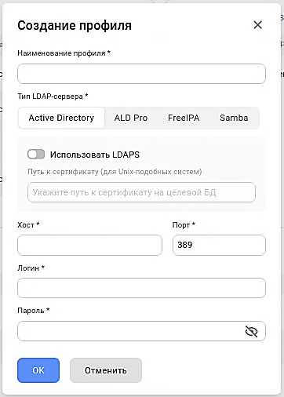{width="2.3252799650043743in"
height="3.266233595800525in"}

Рисунок 13.1 -- Окно создания профиля синхронизации в версии JDS

В описываемом примере SQL-команда будет иметь вид:

> select
> ja\_sync\_ldap.set\_sync\_profile(null,\'ad\_users\',\'10.96.1.200\',\'389\',\'admin\',\'Password\');

При сохранении созданного профиля синхронизации, он появится в списке
профилей и появится сообщение: «Ldapsync профиль создан».

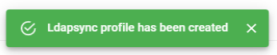{width="3.477437664041995in"
height="0.5995002187226597in"}

Рисунок 13.2 -- Сообщение создания профиля

### Создание профиля синхронизации с ALD Pro

ALD Pro -- это альтернативное программное обеспечение MS Active
Directory для управления активным каталогом, поддерживаемое на ОС
GNU/Linux.

Для создания профиля синхронизации с сервером ALD Pro требуется
выполнить следующие шаги:

-   нажать кнопку «Добавить» (Add) в табличной части «Профили»
    (Profiles);

-   в открывшимся окне «Создание профиля» (Create profile) выбрать
    вкладку «ALD Pro»;

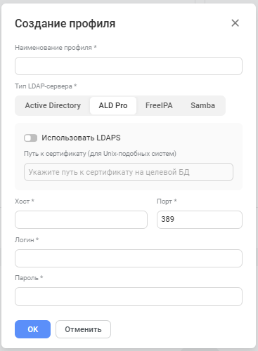{width="2.415860673665792in"
height="3.3116885389326334in"}

Рисунок 13.3 -- Вкладка «ALD Pro»

-   в поле «Имя профиля» (Profile name) указать имя создаваемого профиля
    синхронизации;

-   в поле «Хост» (Host) указать IP-адрес сервера ALD Pro;

-   в поле «Порт» (Port) по умолчанию установлено значение «389», если
    значение входящего порта не менялось, то оставить значением без
    изменений;

-   в поле «Логин» (Login) указать параметр \<admin DN\>;

Строка параметра может иметь следующий вид:

> uid=admin,cn=users,cn=accounts,dc=ald,dc=local

-   в поле «Пароль» (password) указать пароль администратора сервера ALD
    Pro.

На данном шаге создание профиля синхронизации с сервером активного
каталога ALD Pro закончено.

Создание профиля маппинга описано в п. 13.2.2 «Создание профиля маппинга
ALD Pro».

### Создание профиля синхронизации с FreeIPA

FreeIPA (Free Identity, Policy and Audit) --- это дистрибутив Linux с
открытым исходным кодом, который обеспечивает централизованное
управление удостоверениями, аутентификацию и авторизацию, а также
централизованное хранение атрибутов пользователей и групп. Он разработан
для упрощения управления удостоверениями в среде Linux и может быть
использован для создания каталогов, служб единого входа и других
приложений, требующих централизованного управления удостоверениями.

Для создания профиля синхронизации с сервером FreeIPA требуется
выполнить следующие шаги:

-   нажать кнопку «Добавить» (Add) в табличной части «Профили»
    (Profiles);

-   в открывшимся окне «Создание профиля» (Create profile) выбрать
    вкладку «FreeIPA»;

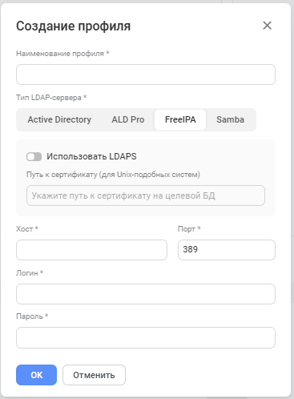{width="2.4013681102362203in"
height="3.3506496062992124in"}

Рисунок 13.4 -- Вкладка «FreeIPA»

-   в поле «Имя профиля» (Profile name) указать имя создаваемого профиля
    синхронизации;

-   в поле «Хост» (Host) указать IP-адрес сервера FreeIPA;

-   в поле «Порт» (Port) по умолчанию установлено значение «389», если
    значение входящего порта не менялось, то оставить значением без
    изменений;

-   в поле «Логин» (Login) указать параметр \<admin DN\>;

Строка параметра может иметь следующий вид:

> uid=admin,cn=users,cn=accounts,dc=freeipa,dc=local)

-   в поле «Пароль» (password) указать пароль администратора сервера
    FreeIPA.

На данном шаге создание профиля синхронизации с сервером активного
каталога FreeIPA закончено.

### Создание профиля синхронизации с Samba

Samba Active Directory Server обеспечивает среду, похожую на Windows,
для управления учетными записями пользователей, правами доступа и
ресурсами в сети на основе Samba. Он позволяет централизованно управлять
аутентификацией пользователей, контролем доступа и совместным
использованием ресурсов, что упрощает обслуживание и обеспечение
безопасности смешанной среды.

С помощью Samba Active Directory Server интегрируются Linux, macOS и
другие системы, отличные от Windows, в домен, что упрощает управление
разрешениями пользователей, совместным доступом к файлам и доступом к
принтерам на всех сетевых устройствах.

Для создания профиля синхронизации с сервером Samba требуется выполнить
следующие шаги:

-   нажать кнопку «Добавить» (Add) в табличной части «Профили»
    (Profiles).

-   в открывшимся окне «Создание профиля» (Create profile) выбрать
    вкладку «Samba»;

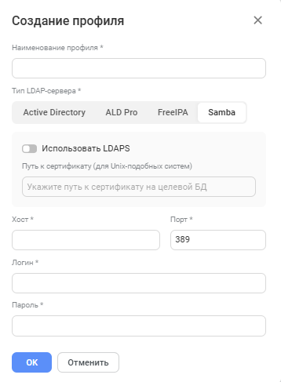{width="2.38673009623797in"
height="3.2467530621172354in"}

Рисунок 13.5 -- Окно создания профиля Samba

-   в поле «Имя профиля» (Profile name) указать имя создаваемого профиля
    синхронизации;

> Например
>
> samba\_usr

-   в поле «Хост» (Host) указать адрес сервера Samba;

Допускается указывать доменное имя или IP-адрес сервера Samba.

Например

IP-адрес сервера Samba

> 10.116.101.114

или доменное имя сервера Samba

> dc.domain.test

-   в поле «Порт» (Port) по умолчанию установлено значение «389», если
    значение входящего порта не менялось, то оставить значением без
    изменений;

> В рассматриваемом примере используется значение «636».

-   в поле «Логин» (Login) указать «UID» администратора сервера Samba;

«UID» администратора сервера Samba получается выполнением команды в
терминале от имени и с правами «root»:

> samba-tool user show administrator

{width="7.06469706911636in"
height="1.8957053805774278in"}

Рисунок 13.6 -- «UID» администратора сервера Samba

Строка параметра может иметь следующий вид:

> cn=administrator,cn=users,dc=domain,dc=test

-   в поле «Пароль» (password) указать пароль администратора сервера
    Samba.

На данном шаге создание профиля синхронизации с сервером активного
каталога Samba закончено.

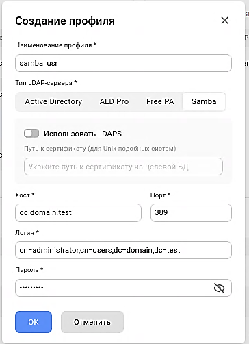{width="2.4047342519685038in"
height="3.4173917322834644in"}

Рисунок 13.7 -- Создание профиля синхронизации с сервером активного
каталога «Samba»

Выполняемые действия будут аналогичны выполнению SQL-команде на сервере
СУБД «Jatoba» с установленным расширением ja\_Sync\_LDAP:

> SELECT
> ja\_sync\_ldap.set\_sync\_profile(null,\'samba\_usr\',\'dc.domain.test\',\'636\',\'CN=Administrator,CN=Users,DC=domain,DC=test\',
> \'P\@ssword\', \'samba\');

Создание профиля маппинга описано в п. 13.2.4 «Создание профиля маппинга
Samba».

### Настройка LDAPS для сервера СУБД в ОС семейства Windows и GNU/Linux

Для использования LDAPS для сервера СУБД в ОС семейства Windows
достаточно выполнить следующие шаги:

-   перевести тумблер в положение «включено»;

-   указать имя сертификата.

Предварительно сертификат должен быть экспортирован с сервера Active
Directory и установлен на сервер СУБД в доверенные корневые центры
сертификации.

Для использования LDAPS для сервера СУБД в ОС GNU/Linux достаточно
выполнить следующие шаги:

-   перевести тумблер в положение «включено»;

-   указать путь и имя сертификата.

Скопировать сертификат pfx в любую директорию в ОС с СУБД, на которую
есть права у пользователя postgres.

Например:

> /var/lib/jatoba/\<версия\>/

Получить из сертификата pfx сертификат crt:

> openssl pkcs12 -in \<cert\_name\>.pfx -nokeys -out \<cert\_name\>.crt

Назначить владельцем сертификата пользователя postgres:

> chown postgres:postgres /путь/до/\<cert\_name\>.crt

|                                                         |                                                                                                                                                                            |
|---------------------------------------------------------|----------------------------------------------------------------------------------------------------------------------------------------------------------------------------|
| {width="0.25in" height="0.25in"} | Полное описание настроек по ОС приведено в документе «Руководство по настройке. Часть 8. Синхронизация учетных записей служб каталогов и СУБД. Компонент «ja\_Sync\_LDAP». |

### Редактирование и удаление профиля синхронизации

Имеющиеся профили синхронизации возможно редактировать или удалить через
контекстное меню строки, как представлено на рисунке Рисунок 13.8.

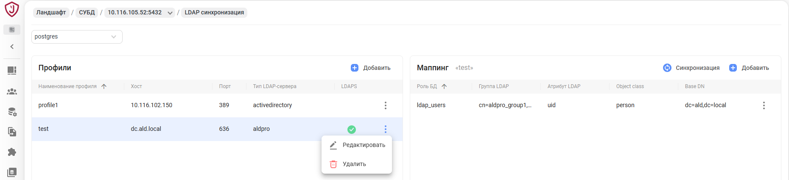{width="7.086805555555555in"
height="1.6194444444444445in"}

Рисунок 13.8 -- Контекстное меню редактирования профиля

Удаление профиля синхронизации идентично выполненной SQL-команде, где
номер профиля подставляется автоматически:

> select ja\_sync\_ldap.drop\_sync\_profile(in\_profile\_id int);

Табличная часть «Маппинг» (Mappings)
------------------------------------

В табличной части Маппинг (Mapping) отражаются профили маппинга
соответствующие профилю синхронизации. Профиль синхронизации может иметь
несколько профилей маппинга и при выборе профиля синхронизации, в
табличной части «Profiles», отразятся принадлежащие ему профили.

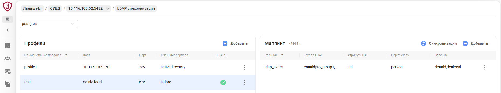{width="7.086805555555555in"
height="1.3215277777777779in"}

Рисунок 13.9 -- Профили маппинга

Выбор профиля синхронизации вызовет функцию
«ldapsync.get\_sync\_profile\_maps», что идентично выполнению
SQL-команды:

> select ja\_sync\_ldap.get\_sync\_profile\_maps(in\_profile\_id int);

номер профиля (profile\_id) подставляется автоматически.

В табличной части «Mapping» доступны функциональные возможности для
профилей маппинга, такие как:

-   создание (Add);

-   редактирование (Edit);

-   удаление (Delete).

### Создание профиля маппинга Active Directory

Нажатие пиктограммы создания профиля маппинга вызовет окно «Создание
маппинга» (Create mapping).

Заполняемые поля показаны в таблице Таблица 13.1.

Таблица 13.1 -- Наименование полей профиля маппинга

| **№** | **Наименование поля** | **Тип поля**   |
|-------|-----------------------|----------------|
| 1     | DB role \*            | Обязательное   |
| 2     | LDAP group \*         | Обязательное   |
| 3     | LDAP attribute \*     | Обязательное   |
| 4     | Object class          | Необязательное |
| 5     | Base DN               | Необязательное |

Окно создания профиля маппинга представлено на рисунке Рисунок 13.10

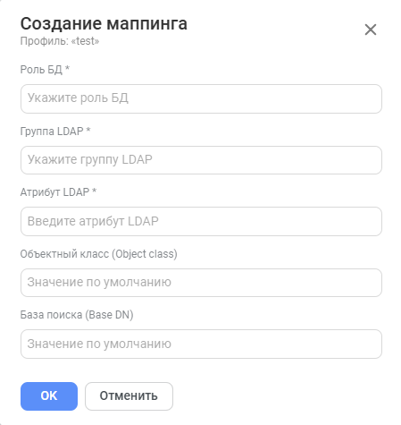{width="2.402626859142607in"
height="2.541754155730534in"}

Рисунок 13.10 -- Окно создания профиля маппинга

В поле «DB role» указывается групповая роль, в которую будут добавлены
создаваемые пользователи в целевой СУБД.

В поле «AD group/LDAP group» указывается атрибут «DistinguishedName»
группы пользователей «db\_users» Microsoft Active Directory.

В поле «AD attribute/LDAP attribute» указывается атрибут записи в
Microsoft Active Directory, по которому будет осуществляться поиск
учетных записей пользователей и выполняться синхронизация с СУБД. В
качестве атрибутов синхронизации могут использоваться атрибуты:

-   sAMAccountName;

-   cn;

-   name.

Заполненные поля окна сгенерируют SQL-команду:

> SELECT ja\_sync\_ldap.set\_sync\_profile\_map(in\_map\_id int,
> in\_profile\_id int, role\_bd text, role\_ad text, in\_attribute
> text);

В описываемом примере SQL-команда будет иметь вид:

> SELECT
> ja\_sync\_ldap.set\_sync\_profile\_map(null,1,\'ad\_users\',\'CN=db\_users,CN=Users,DC=jatoba,DC=corp\',
> \'cn\');

Поля «Object class» и «Base DN» не обязательны при заполнении и
заполнятся автоматически.

При сохранении созданного профиля маппинга, он появится в списке
профилей и в верхней центральной части раздела появится сообщение:
«Ldapsync профиль маппинга создан».

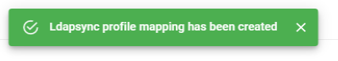{width="4.199938757655293in"
height="0.5831353893263342in"}

Рисунок 13.11 -- Сообщение создание профиля маппинга

После чего станет доступна пиктограмма выполнения синхронизации
«Synchronization».

### Создание профиля маппинга ALD Pro

Для создания такого профиля мапинга с сервером ALD Pro требуется
выполнить следующие шаги:

-   нажать кнопку «Добавить» (Add) в табличной части «Маппинг»
    (Mappings), что вызовет окно «Создание профиля» (Create mapping);

-   в поле «Роль БД» (DB role) указывается групповая роль в СУБД, в
    которую будут добавлены создаваемые пользователи;

-   в поле «Группа LDAP» (LDAP group) указать имя группы пользователей
    на сервере ALD Pro, пользователи которой будут синхронизированы с
    пользователями СУБД;

Строка параметра может иметь следующий вид:

> cn=lpadmin,cn=groups,cn=accounts,dc=ald,dc=local

-   в поле «Атрибут LDAP» (LDAP attribute) указать атрибут, по которому
    будет осуществляться поиск учетных записей пользователей и
    выполняться синхронизация с СУБД;

> В качестве атрибута поиска на сервере ALD Pro используется атрибут:
>
> uid

Атрибут UID (User ID) --- это уникальный идентификатор пользователя в
системе. Он используется для идентификации и отличия пользователей в
операционной системе. Каждый пользователь в системе имеет свой
собственный UID, который присваивается ему при создании учетной записи.

-   в поле «Объектный класс» (Object class) указать параметр:

> person
>
> либо параметр заполнится автоматически.

-   в поле «База поиска» (Base DN) указать параметр \<basedn\>. При
    заполнении обязательных полей поле заполниться автоматически.

Строка параметра может иметь следующий вид:

> dc=ald,dc=local

### Создание профиля маппинга FreeIPA

Для создания такого профиля мапинга с сервером FreeIPA требуется
выполнить следующие шаги:

-   нажать кнопку «Добавить» (Add) в табличной части «Маппинг»
    (Mappings), что вызовет окно «Создание профиля» (Create mapping);

-   в поле «Роль БД» (DB role) указать групповую роль в СУБД, в которую
    будут добавлены создаваемые пользователи;

-   в поле «Группа LDAP» (LDAP group) указать имя группы пользователей
    на сервере FreeIPA, пользователи которой буду синхронизированы с
    пользователями СУБД;

Строка параметра может иметь следующий вид:

> CN=freeipa,CN=groups,CN=accounts,DC=freeipa,DC=local

-   в поле «Атрибут LDAP» (LDAP attribute) указать атрибут по которому
    будет осуществляться поиск учетных записей пользователей и
    выполняться синхронизация с СУБД;

> В качестве атрибута поиска на сервере FreeIPA используется атрибут:
>
> uid

Атрибут UID (User ID) --- это уникальный идентификатор пользователя в
системе. Он используется для идентификации и различения пользователей в
операционной системе. Каждый пользователь в системе имеет свой
собственный UID, который присваивается ему при создании учетной записи.

-   в поле «Объектный класс» (Object class) указать параметр:

> person

-   в поле «База поиска» (Base DN) указать параметр \<basedn\>.

Строка параметра может иметь следующий вид:

> dc=freeipa,dc=local

Параметр «basedn» отражается в файле:

> /etc/ipa/default.conf

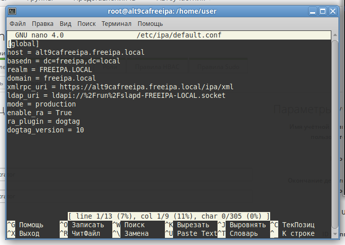{width="6.867820428696413in"
height="2.652083333333333in"}

Рисунок 13.12 -- Содержимое файла «default.conf»

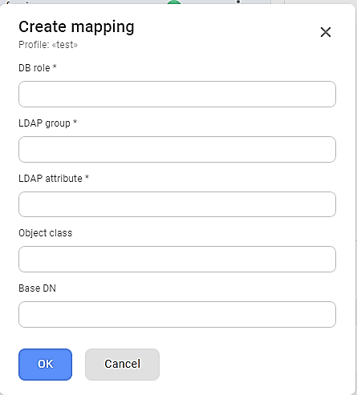{width="2.8836307961504812in"
height="3.1627340332458442in"}

Рисунок 13.13 -- Окно создания профиля маппинга для сервера FreeIPA

### Создание профиля маппинга Samba

Для создания такого профиля маппинга с сервером Samba требуется
выполнить следующие шаги:

-   нажать кнопку «Добавить» (Add) в табличной части «Маппинг»
    (Mappings), что вызовет окно «Создание профиля» (Create mapping). ID
    маппинга сформируется автоматически;

-   в поле «Роль БД» (DB role) указать групповую роль в СУБД, в которую
    будут добавлены создаваемые пользователи;

> Например
>
> db\_users\_smb

Групповую роль возможно предварительно создать в разделе «Роли БД»
описанного в п. 9 настоящего документа.

-   в поле «Группа LDAP» (LDAP group) указать имя группы пользователей
    на сервере Samba, пользователи которой будут синхронизированы с
    пользователями СУБД.

> Например

При синхронизации УЗ по атрибуту \'sAMAccountName\', требуется получить
его из вывода свойств группы пользователей на сервере активного каталога
Samba командой:

> samba-tool group show db\_user

В данном случае, группа пользователей db\_user должна быть создана на
сервере активного каталога и содержать пользователей ОС.

{width="6.609198381452319in"
height="4.774617235345582in"}

Рисунок 13.14 -- Вывод свойств группы

Для атрибута «sAMAccountName» используется значение «DistinguishedName»:

> CN=db\_users,CN=Users,DC=domain,DC=test

-   в поле «Атрибут LDAP» (LDAP attribute) указать атрибут, по которому
    будет осуществляться поиск учетных записей пользователей и
    выполняться синхронизация с СУБД.

> В качестве атрибута поиска на сервере Samba используется атрибут:
>
> sAMAccountName

-   в поле «Объектный класс» (Object class) указать параметр:

> user

Параметр выбирается из строки значение «DistinguishedName»

> CN=Users

-   в поле «База поиска» (Base DN) указать параметр \<dn\>.

Например

> dc=domain,dc=test

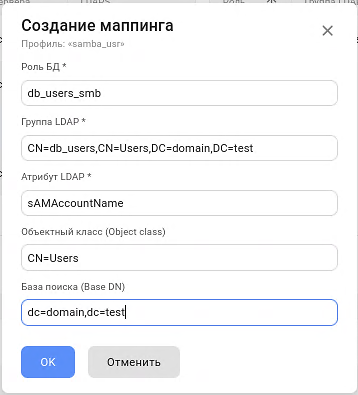{width="2.8888713910761155in"
height="3.2039118547681538in"}

Рисунок 13.15 -- Окно создания профиля маппинга для сервера Samba

### Редактирование и удаление профиля маппинга

Имеющиеся профили маппинга возможно редактировать или удалить через
контекстное меню строки, как представлено на рисунке Рисунок 13.16.

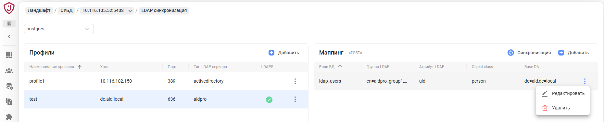{width="7.086805555555555in"
height="1.4402777777777778in"}

Рисунок 13.16 -- Контекстное меню редактирования профиля маппинга

Удаление существующего профиля маппинга идентично выполненной
SQL-команде, где номер профиля подставляется автоматически:

> SELECT ja\_sync\_ldap.drop\_sync\_profile\_map(in\_map\_id int);

При выборе пиктограммы редактирования профиля маппинга «Edit» откроется
окно «Edit mapping».

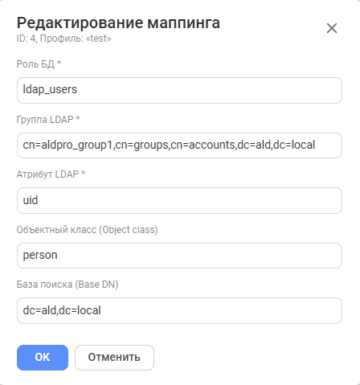{width="2.416329833770779in"
height="2.5835312773403323in"}

Рисунок 13.17 -- Окно редактирования профиля маппинга

Поле «Profile» недоступно для редактирования, т.к. профиль маппинга
соотносится к определенному профилю синхронизации.

Поля «DB role», «AD group» и «AD attribute» доступны для редактирования.

Табличная часть «Журнал» (Log)
------------------------------

В журнале «Log» отображаются события выполнения синхронизации учетных
записей пользователей активного каталога с учетными записями СУБД
«Jatoba».

Имеется функциональная возможность просмотра, удаления выбранных событий
и отдельных событий.

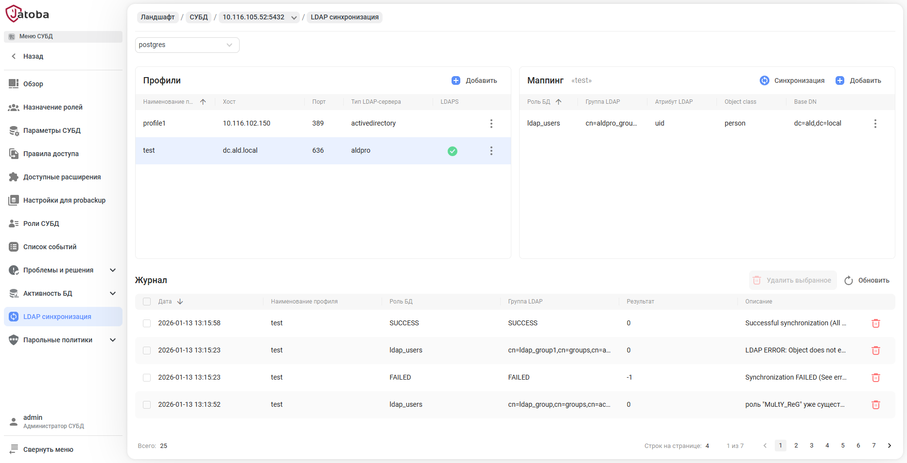{width="7.086805555555555in"
height="3.627083333333333in"}

Рисунок 13.18 -- Журнал

Раздел «Ландшафт». СУБД. Вкладка «Парольные политики» (Password policies)
=========================================================================

Раздел «Парольные политики» предназначен для автоматизации и упрощения
работы с парольными политиками и блокировками пользователей целевой
СУБД.

Раздел включает в себя подразделы:

-   Управление политиками (Policy management) (п. 14.1);

-   Привязка ролей (Role Binding) (п. 14.2);

-   Работа с блокировками (п. 14.3).

Корректная работа раздела обеспечивается установленными и настроенными
на целевой СУБД компонент:

-   SecurityProfile, описанного в документе «Руководство
    администратора»;

-   ja\_CSum, описанного в документе «Руководство по настройке.
    Часть 14. Контроль целостности. Компонент «ja\_CSum».

Функциональные возможности подраздела доступны на уровне целевой СУБД в
разделе «Ландшафт».

Вкладка «Управление политиками» (Policy management)
---------------------------------------------------

Во вкладке отображаются парольные политики:

-   Default -- профиль парольной политики используемой по умолчанию;

-   FSTEC\_1\_class -- профиль для ИС первого класса защищенности;

-   FSTEC\_2\_class -- профиль для ИС второго класса защищенности;

-   CIS -- профиль, основанный на рекомендациях
    Center for Internet Security;

-   Corporate\_1 -- корпоративный профиль первого уровня для учетных
    записей пользователей;

-   Corporate\_2 -- корпоративный профиль второго уровня для учетных
    записей администраторов программных (программно-аппаратных средств);

-   Corporate\_3 -- корпоративный профиль третьего уровня для
    технических (сервисных, служебных) учетных записей, используемых в
    технологических процессах ИС или встроенных производителями
    программных (программно-аппаратных) средств.

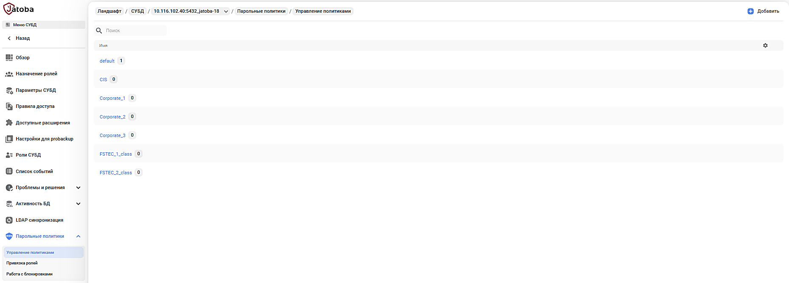{width="7.086805555555555in" height="2.55in"}

Рисунок 14.1 -- Вкладка «Редактирование политик»

Во вкладке доступно редактирование, удаление предустановленных политик и
создание новых основанных на парольной политике по умолчанию (Default).

Вкладка «Привязка ролей» (Role Binding)
---------------------------------------

Во вкладке «Привязка ролей» отображаются роли СУБД, распределенные по
парольным политикам.

В раскрывшимся списке парольной политики отображается список
пользователей с установленными и унаследованными от групповых ролей
атрибутами.

{width="7.0856474190726155in"
height="2.6260870516185477in"}

Рисунок 14.2 -- Список пользователей привязанных к парольной политике

Редактирование парольных политик недоступно. Возможен только просмотр.

Ко всем ролям СУБД применяется парольная политика по умолчанию
«default». Для применения предустановленных парольных политики или
созданных, требуется установить чекбокс на одной или нескольких ролях и
переместить между парольными политиками.

Парольная политика применится при следующей идентификации пользователя в
СУБД.

Вкладка «Работа с блокировками»
-------------------------------

Вкладка «Работа с блокировками» делится на два окна (вкладки)
«securityprofile» и «checksum». Вкладки отображают роли СУБД и их
статусы блокировки.

Статусы ролей, заблокированных из-за нарушения парольных политик,
отображаются во вкладке «securityprofile» и заблокированные в следствии
нарушения контроля целостности СУБД отображаются во вкладке «checksum».

### Вкладка «securityprofile»

Во вкладке отображается список пользователей (ролей) СУБД.

Доступно отфильтровать заблокированные роли установкой тумблера «Только
заблокированные».

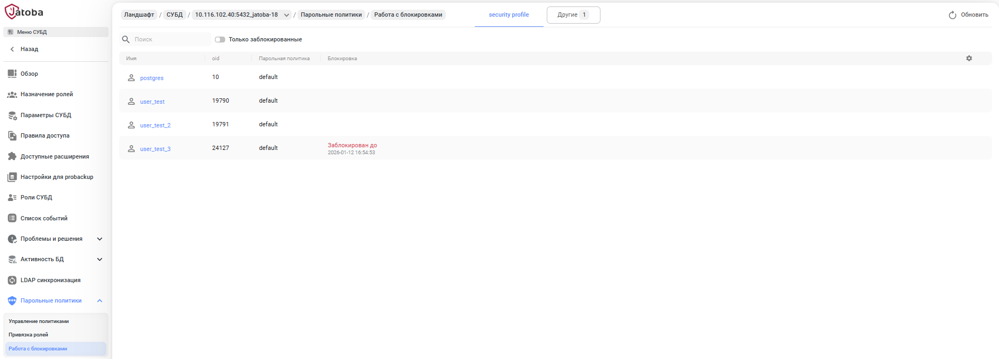{width="7.086805555555555in"
height="2.545138888888889in"}

Рисунок 14.3 -- Вкладка «securityprofile»

Приказ ФСТЭК России от 14.04.2023 N 64 «Требования по безопасности
информации к системам управления базами данных (выписка)» в разделе 9,
не устанавливает требования к типу блокирования, поэтому, как описано в
п. 6.2.1. «Блокирование и разблокирование учетных записей» документа
Руководство администратора:

По умолчанию блокировка пользователей выполняется в режиме «immediate».
В данном режиме пользователь принудительно отключается без ожидания и
непосредственного отката транзакций».

|                                                                                     |                                                                                                                                               |
|-------------------------------------------------------------------------------------|-----------------------------------------------------------------------------------------------------------------------------------------------|
| {width="0.2513888888888889in" height="0.2513888888888889in"} | В силу указанных причин, использовать функциональную возможность, по блокированию роли или группы ролей, следует с максимальной осторожностью |

В строке пользователя СУБД, при наведении курсора в конец строки
вызывается кнопка «Блокировать/Разблокировать».

По умолчанию пользователь СУБД блокируется на 60 минут.

### Вкладка «checksum»

|                                                                                     |                                                                                                                                                                                                 |
|-------------------------------------------------------------------------------------|-------------------------------------------------------------------------------------------------------------------------------------------------------------------------------------------------|
| {width="0.2513888888888889in" height="0.2513888888888889in"} | Перед разблокировкой пользователей, заблокированных при нарушении контроля целостности СУБД, требуется вручную, на целевом хосте устранить причину нарушения или пересчитать контрольные суммы. |

Во вкладке «checksum» отображаются группы пользователей:

-   Пользователи БД;

-   Администраторы БД;

-   Администраторы СУБД;

-   Прочие.

При нарушении контроля целостности СУБД или ограничения программной
среды СУБД блокируется группа «Пользователи БД». Информация о блокировке
выводится в строке группы в виде списка БД.

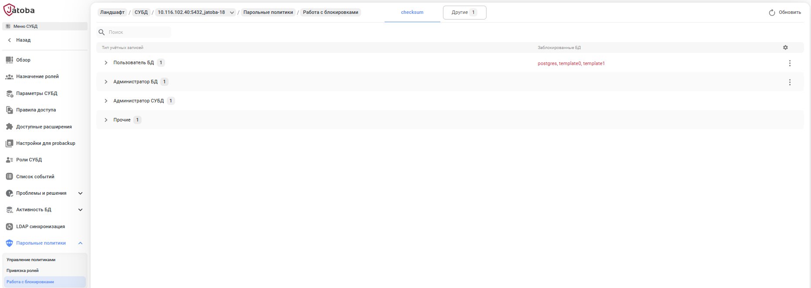{width="7.086805555555555in"
height="2.527083333333333in"}

Рисунок 14.4 -- Вкладка «checksum»

Контекстное меню разблокирования находится в строке группы.

В вызванном окне выбираются только БД, к которым требуется открыть
доступ.

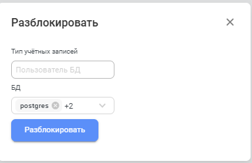{width="3.016755249343832in"
height="1.9165102799650044in"}

Рисунок 14.5 -- Окно разблокирования группы пользователей

Нажатие кнопки «Разблокировать» инициирует выполнение SQL-команды
разблокирования группы пользователей на целевом хосте.

Также доступна операция блокирования группы пользователей.

Блокирование доступно для всех групп, кроме группы «Администраторы
СУБД».

Раздел «Ландшафт». БД. Вкладка «Обзор» 
=======================================

В разделе Ландшафт существует вторая вкладка «Обзор», отображающая
параметры БД.

Для перехода в нее требуется выбрать раздел «Ландшафт» → «Дерево
инфраструктуры» → хост → СУБД → БД.

При переходе не обязательно точно наводить курсор на объект.

Нажатие на гиперссылку БД откроет вкладку «Обзор», в которой отобразятся
основные параметры БД.

Отображаемые параметры представлены в таблице Таблица 15.1.

Таблица 15.1 - Список отображаемых параметров БД

| **Наименование поля**                     | **Вид отображения** | **Описание поля**                                                    |
|-------------------------------------------|---------------------|----------------------------------------------------------------------|
| Владелец                                  | текст               | Администратор БД                                                     |
| Описание                                  | текст               | Комментарий к БД                                                     |
| Размер                                    | текст               | Объем дискового пространства занимаемого БД                          |
| Текущие сессии                            | число (ссылка)      | Количество текущих подключений к БД                                  |
| Табличное пространство                    | текст               | Используемое табличное пространство                                  |
| Схемы                                     | текст (список)      | Схемы БД                                                             |
| Кодировка                                 | текст               | Кодировка символов в БД                                              |
| Категория сортировки                      | текст               | Устанавливает значение LC\_COLLATE в окружении ОС сервера баз данных |
| Категория типов символов                  | текст               | Устанавливает значение LC\_CTYPE в окружении ОС сервера баз данных   |
| Шаблон                                    | да/нет              | Допускается ли использование БД в качестве шаблона                   |
| Разрешено подключение                     | да/нет              | Допускается ли подключение пользователей к БД                        |
| Лимит подключений                         | число               | Ограничение количества одновременных подключений к БД                |

Значение поля «Текущие сессии» отражено в виде активной ссылки, при
нажатии на которую:

-   произойдет переключение на вкладку «Сессии» (см. п. 12.1);

-   автоматически установится фильтр по выбранному пользователю и БД.

Вид вкладки показан на рисунке Рисунок 15.1.

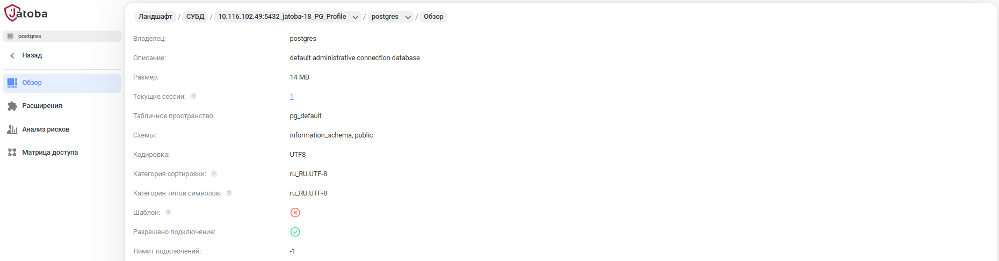{width="7.086805555555555in"
height="1.851388888888889in"}

Рисунок 15.1 - Вкладка «Обзор» БД

Раздел «Ландшафт». БД. Вкладка «Расширения»
===========================================

Вкладка «Расширения» предназначен для управления расширениями СУБД.

Вкладка отображается на уровне БД. Для работы с вкладкой необходимо
перейти по пути: Раздел Ландшафт → СУБД → Дерево инфраструктуры → Хост →
СУБД → БД → Расширения.

Во вкладке отображается список установленных расширений и информация о
них по столбцам:

-   Наименование -- наименование расширения;

-   Версия -- версия расширения;

-   Схема -- схема, содержащая объекты установленного расширения;

-   Перемещаемость -- признак перемещаемости расширения в другую схему;

-   Владелец -- владелец расширения;

-   SU -- необходимость привилегии «SUPERUSER» для управления
    расширением;

-   Доверенное -- возможность управления расширением от имени
    «SUPERUSER»;

-   Зависимые -- наименование расширений, которые зависят от текущего
    расширения.

<table>
<tbody>
<tr class="odd">
<td></td>
<td>
Перед установкой расширений СУБД «Jatoba» убедитесь, что компонент контроля целостности «ja_CSum» отключен или переведен в режим информирования (permissive). Поскольку, «ja_CSum» функционируя совместно компонентом парольных политик «SecurityProfile», пересчитав контрольные суммы СУБД и найдя в них расхождения с эталонными значениями, передаст команду компоненту «SecurityProfile» на блокирование пользователей СУБД.

Функциональная возможность управления контрольными суммами СУБД отсутствует.

Пересчет контрольных сумм СУБД выполняется вручную.
</td>
</tr>
</tbody>
</table>

Установка расширения в БД
-------------------------

Установка расширения в БД доступно при:

-   выборе БД в общем списке баз данных СУБД;

-   переходе во вкладку «Расширения».

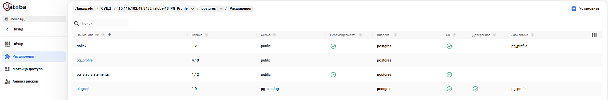{width="7.086805555555555in" height="1.175in"}

Рисунок 16.1 -- Вкладка «Расширения»

Модальное окно «Установка расширений» вызывается нажатием кнопки
«Установить».

В окне последовательно выбирается устанавливаемое расширение, его версия
и схема БД.

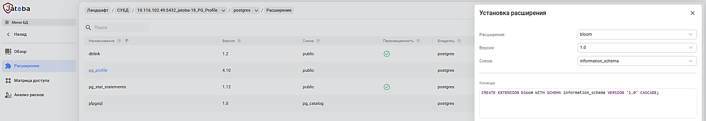{width="7.086805555555555in" height="1.225in"}

Рисунок 16.2 - Окно «Установка расширения»

Отобразится SQL-команда установки расширения, без возможности
редактирования. Расширение установится по нажатию кнопки «Установить».

После операции установки расширения оно отобразится в общем списке во
вкладке «Управление расширениями». В списке доступны операции по:

-   сортировке списка;

-   контекстному поиску расширений;

-   редактированию расширения (изменение версии расширения и схемы
    установки);

-   удалению расширения.

При большом количестве установленных расширений их список разбивается на
страницы в правом нижнем углу вкладки.

### Удаление расширений БД

Расширения устанавливаются в конкретную БД. Для удаления расширения
требуется разделе «Ландшафт» перейти до уровня БД во вкладку
«Расширения».

Во вкладке «Расширения» наведя курсор на строку установленного
расширения появится кнопка «Удалить».

Выбрав операцию удаления расширения в БД компонент выдаст окно
подтверждения операции.

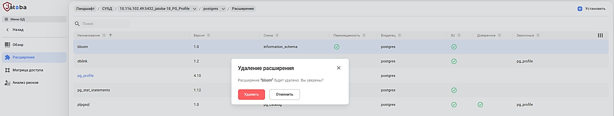{width="7.086805555555555in"
height="1.3430555555555554in"}

Рисунок 16.3 -- Удаление расширения в БД и окно подтверждения

|                                                         |                                                        |
|---------------------------------------------------------|--------------------------------------------------------|
| {width="0.25in" height="0.25in"} | Расширение plpgsql нельзя удалить из служебной БД JDS. |

БД. Установка расширения pg\_profile 
-------------------------------------

Расширение pg\_profile имеет более тонкую настройку в отличие от других
расширений СУБД. В следствии чего для его настройки разработано
отдельное представление в компонента.

Расширение устанавливается в порядке описанном в п.п. 16.1.

|                                                         |                                                                                                                                                             |
|---------------------------------------------------------|-------------------------------------------------------------------------------------------------------------------------------------------------------------|
| {width="0.25in" height="0.25in"} | Расширение pg\_profile, установленное средствами раздела «Ландшафт», автоматически появится в разделе «Снимки и отчеты» (Snapshots & Reports) (см. п.п. 24) |

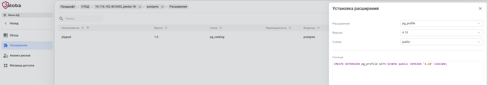{width="7.086805555555555in"
height="1.2402777777777778in"}

Рисунок 16.4 -- Окно уставки расширения pg\_profile

Установка выполняется методом «CASCADE» и вместе с ним установится
расширение dblink.

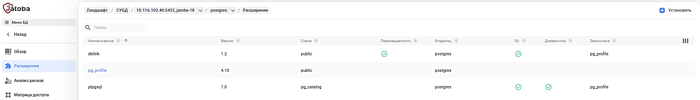{width="7.086805555555555in"
height="1.0138888888888888in"}

Рисунок 16.5 -- Установленные расширения на целевой СУБД

В списке установленных расширений расширение pg\_profile имеет
гиперссылку, ведущую в отдельные вкладки:

-   Обзор;

-   Настройки сервера;

-   Параметры.

    6.  ### Вкладка «Обзор» расширения

> Во вкладке «Обзор» отображаются не редактируемые строки:

-   Версия -- версия расширения;

-   Владелец -- владелец расширения;

-   Расположение -- путь к хосту СУБД, на котором установлено
    расширение.

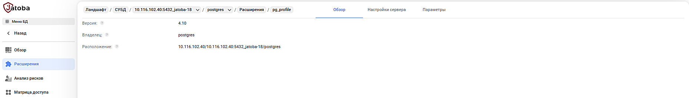{width="7.086805555555555in"
height="1.0173611111111112in"}

Рисунок 16.6 - Вкладка «Обзор» расширения

### Вкладка «Настройки сервера» 

Во вкладке «Настройки сервера» отображаются виртуальные сервера
расширения.

Виртуальный сервер «local» устанавливается автоматически при установке
расширения. Виртуальные сервера доступно создавать и редактировать.

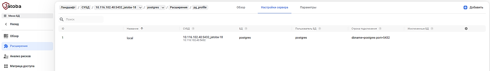{width="7.086805555555555in"
height="1.0347222222222223in"}

Рисунок 16.7 -- Вкладка «Настройки сервера»

Нажатие кнопки «Добавить» вызовет окно «Добавление сервера». В данном
окне устанавливаются параметры нового виртуального сервера, приведенные
в таблице Таблица 16.1

Таблица 16.1 -- Параметры создаваемого виртуального сервера

| **Раздел**                         | **Параметр**                         | **Описание**                                                                            | **Редактирование ** |
|------------------------------------|--------------------------------------|-----------------------------------------------------------------------------------------|---------------------|
| **Настройки подключения**          |                                      |                                                                                         |                     |
|                                    | Название: \*                         | Наименование создаваемого виртуального сервера                                          | Х                   |
|                                    | СУБД: \*                             | Выпадающий список из СУБД подключенных в разделе «Ландшафт»                             | Х                   |
|                                    | БД: \*                               | База данных                                                                             | Х                   |
|                                    | Пользователь БД                      | Пользователь базы данных (Пользователь с назначением «Сбор снимков производительности») | ─                   |
|                                    | Строка подключения                   | Отображение строки подключения к БД                                                     | ─                   |
| **Дополнительные параметры**       |                                      |                                                                                         |                     |
|                                    | Исключенные БД:                      | Выпадающий список с выбором БД с которых не будут сниматься снимки                      | Х                   |
|                                    | Снимать метрики при создании снимка: | включение сервера в набор серверов, на которых снимаются метрики при создании снимка    | Х                   |
|                                    | Время жизни снимка на сервере:       | Целое, положительное значение в днях определяющее время жизни снимка на сервере         | Х                   |
|                                    | Описание:                            | Описание создаваемого сервера                                                           | Х                   |
| **Установка pg\_stat\_statements** |                                      |                                                                                         |                     |
|                                    | Версия                               | Версия компонента                                                                       | Х                   |
|                                    | Схема                                | Схема для установки                                                                     | Х                   |

Примечание:

\* - обязательные параметры.

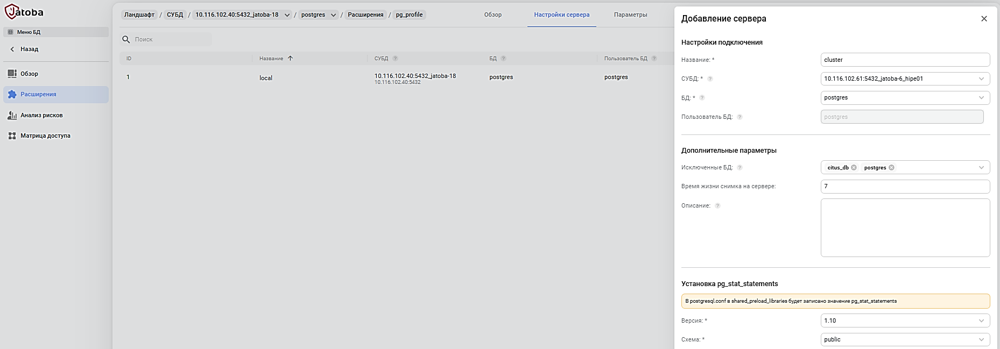{width="7.086805555555555in"
height="2.4756944444444446in"}

Рисунок 16.8 -- Окно добавления нового сервера

Возможно добавлять серверы с других хостов СУБД, таким образом создавая
иерархическую структуру сбора статистики.

Если в поле «Пользователь БД» указан не привилегированный пользователь
(SU), то под полем отобразить сообщение:

> Выбранному пользователю БД будут назначены привилегии:
>
> \- доступ к схемам расположения расширений (если расширения
> установлены) pg\_stat\_statements, pg\_stat\_kcache,
> pg\_wait\_sampling
>
> \- возможность запуска функций (если расширения установлены)
> pg\_stat\_statements\_reset, pg\_stat\_kcache\_reset,
> pg\_wait\_sampling\_reset\_profile
>
> \- роль pg\_read\_all\_stats

В процессе создания виртуального сервера, вышеуказанные действия будут
выполнены.

Блок «Установка pg\_stat\_statements» активируется, если расширение
«pg\_stat\_statements» не установлено, что сопровождается
соответствующим сообщением.

Появляются поля «Версия» и «Схема», установив параметры в которых
установится расширение. Пакет компонента должен быть установлен
предварительно на хосте.

Завершение установки «pg\_stat\_statements» может быть произведено с
перезагрузкой СУБД. Поэтому будет выведено модальное окно «Применение
параметров» с выбором желаемого действия, таким как «Продолжить без
перезагрузки» и «Перезагрузить сейчас».

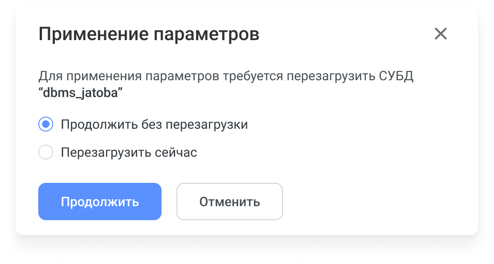{width="3.1041666666666665in"
height="1.5293252405949256in"}

Рисунок 16.9 -- Окно применения параметров

Далее созданная структура виртуальных серверов отразится в подразделе
«Снимки и отчеты» описанного в разделе 24 настоящего документа.

### Вкладка «Параметры» 

Во вкладке «Параметры» отображаются параметры расширения, установленные
по умолчанию.

Параметры расширения приведены в таблице Таблица 16.2.

Таблица 16.2 -- Параметры расширения

| **Параметры**                                                                                                                                                                                          | **Значение** |
|--------------------------------------------------------------------------------------------------------------------------------------------------------------------------------------------------------|--------------|
| Количество выбираемых первых объектов (операторов, отношений и т. д.), которое будет выдаваться в каждой отсортированной по некоторому критерию таблице отчёта. Этот параметр влияет на размер выборки | 20           |
| Время хранения снимков в днях                                                                                                                                                                          | 7            |
| Если этот параметр включен, pg\_profile будет отслеживать подробные временные интервалы                                                                                                                | off          |
| Ограничение длины запроса для отчетов                                                                                                                                                                  | 20000        |

Имеющиеся параметры доступны для редактирования.

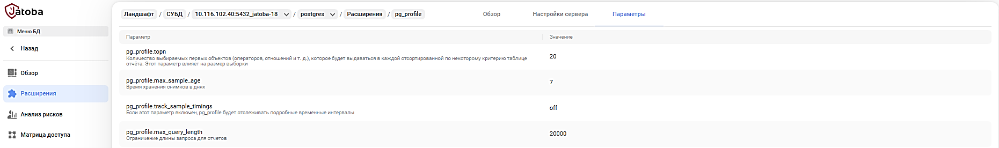{width="7.086805555555555in"
height="1.0506944444444444in"}

Рисунок 16.10 - Вкладка «Параметры»

На узком экране вкладки «Обзор», «Настройки сервера» и «Параметры»
автоматически свернуться в общую вкладку «Другие» в форме выпадающего
списка.

БД. Установка расширения securityprofile (парольные политики)
-------------------------------------------------------------

Для активации компонента в СУБД «Jatoba» на целевом хосте, в разделе
«Ландшафт» достаточно выбрать расширение для установки. Автоматически
внесутся изменения в конфигурационный файл postgresql.auto.conf,
прописав следующие строки:

> shared\_preload\_libraries = \'securityprofile\'

|                                                                                       |                                                                                                                                                                                                                      |
|---------------------------------------------------------------------------------------|----------------------------------------------------------------------------------------------------------------------------------------------------------------------------------------------------------------------|
| {width="0.2513888888888889in" height="0.2513888888888889in"} | Указание в конфигурационном файле postgresql.conf опции shared\_preload\_libraries = \'securityprofile\' активирует компонент управления парольными политиками и создается политика по умолчанию с именем «default». |

> securityprofile.db\_name = \'dbname\'

Параметр «dbname» определяет имя БД, в которой будет создаваться или уже
создано расширение sercurityprofile, значение по умолчанию postgres.

Внесенные изменения применяются после перезагрузки СУБД.

Компонент securityprofile выполняет функции безопасности в СУБД и влияет
на работу всех пользователей и администраторов СУБД, поскольку:

-   применяет парольные политики;

-   блокирует пользователей и администраторов СУБД при нарушении
    парольных политик;

-   блокирует пользователей при нарушении контроля целостности СУБД.

Расширение устанавливается в порядке, описанном в п.п. 16.1. При этом
дополнительно указывается БД для установки и устанавливается флаг для
автоматического внесения изменений в конфигурационный файл
postgresql.auto.conf.

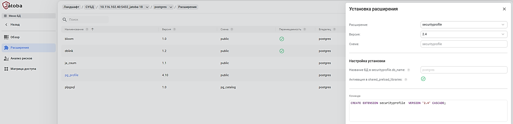{width="7.086805555555555in"
height="1.7180555555555554in"}

Рисунок 16.11 -- Установка расширения securityprofile

<table>
<tbody>
<tr class="odd">
<td></td>
<td>
После установки компонента securityprofile немедленно обновите пароль для пользователя postgres.

Дополнительно измените аутентификационную информацию в разделах для подключения к целевой СУБД.
</td>
</tr>
</tbody>
</table>

В случае если блокировка произошла, выполните действия, описанные в
документе «Руководство администратора» в п.п.:

-   16.1. Временная блокировка пользователей СУБД и суперпользователя;

-   16.2. Блокировка суперпользователя СУБД.

После установки расширения оно отобразится в форме гиперссылки во
вкладке «Управление расширениями».

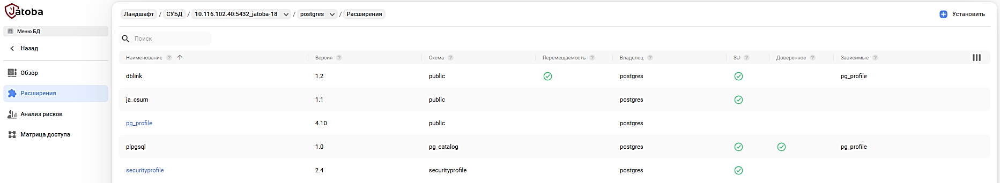{width="7.086805555555555in"
height="1.2993055555555555in"}

Рисунок 16.12 -- Гиперссылка расширения securityprofile

Переход по гиперссылке раскроет вкладки «Обзор» и «Параметры».

Во вкладке «Обзор» отображаются параметры:

-   Версия -- версия расширения;

-   Владелец -- владелец расширения;

-   Расположение -- IP-адрес СУБД / версия СУБД/ БД, в которой
    установлено расширение.

Во вкладке «Параметры» отображаются параметры, приведенные в таблице
Таблица 16.3.

Таблица 16.3 -- Отображаемые параметры расширения securityprofile

| **Параметр**                    | **Значение** | **Описание параметра**                                                     |
|---------------------------------|--------------|----------------------------------------------------------------------------|
| Profiles\_cache\_limit          | 10           | Максимальное количество профилей, хранимых в кэше                          |
| Accounts\_cache\_limit          | 1000         | Максимальное количество пользовательских аккаунтов, хранимых в кэше        |
| Password\_history\_cache\_limit | 10000        | Максимальное количество парольных хэшей (md5), хранимых в кэше             |
| Status\_cache\_limit            | 100          | Максимальное количество статусов блокировки пользователей, хранимых в кэше |

Настройка парольных политик описана в разделе 14 «Раздел «Ландшафт».
СУБД. Вкладка «Парольные политики» (Password policies).

БД. Установка расширения ja\_csum (контроль целостности)
--------------------------------------------------------

|                                                                                     |                                                                                                                                                                                            |
|-------------------------------------------------------------------------------------|--------------------------------------------------------------------------------------------------------------------------------------------------------------------------------------------|
| {width="0.2513888888888889in" height="0.2513888888888889in"} | Рекомендуется устанавливать расширения «ja\_CSum» и «SecurityProfile» вручную в соответствии с документом «Руководство по настройке. Часть 14. Контроль целостности. Компонент «ja\_CSum». |

Установка расширения «ja\_CSum» требует предварительного внесения
параметра загрузки расширения в конфигурационном файле «postgresql.conf»
вручную на целевом хосте или используя раздел JDS «Параметры СУБД» (см.
раздел 6).

В разделе «Shared Library Preloading», для последующей загрузки
расширения, устанавливается параметр:

> shared\_preload\_libraries = \'ja\_csum\'

При совместном использовании компонентов «securityprofile» и «ja\_CSum»,
в разделе «Shared Library Preloading» для последующей загрузки
расширений устанавливаются параметры:

> shared\_preload\_libraries = \'securityprofile, ja\_csum\'

Применив параметры станет доступна установка расширения «ja\_CSum» в
стандартном порядке установки расширений.

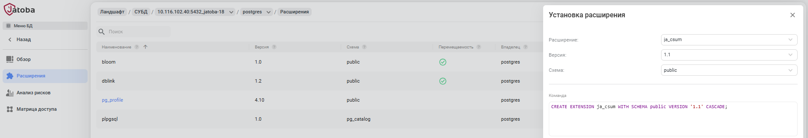{width="7.086805555555555in" height="1.2125in"}

Рисунок 16.13 -- Окно установки расширения ja\_csum

Раздел «Ландшафт». БД. Вкладка «Матрица доступа» (Access matrix)
================================================================

Матрица доступа отражает назначенные атрибуты пользователей, объекты
доступа и имеющиеся привилегии пользователей относительно этих объектов.

Объектами доступа являются:

-   схемы (schemas);

-   таблицы (tables);

-   представления (views);

-   мат. представления (views);

-   функции (functions);

-   последовательности (sequences).

Подраздел «Матрица доступа» располагается на уровне базы данных.

Для перехода к нему потребуется в разделе «Ландшафт» выбрать СУБД во
вкладке «Дерево инфраструктуры» и в раскрывающемся списке перейти на
уровень БД.

Матрица доступа построится автоматически относительно всех субъектов
доступа и объектов доступа.

Субъектами доступа являются пользователи СУБД, т.е. роли, обладающие,
как минимум атрибутом «Login». При этом учитываются привилегии,
установленные групповыми ролями, к которым отнесен пользователь.

Атрибуты пользователей отражаются после имени пользователя в виде
аббревиатур, которые приведены в таблице Таблица 17.1, в виде
пиктограммы.

Таблица 17.1 -- Аббревиатуры атрибутов ролей

| SU   | SUPERUSER    |
|------|--------------|
| INH  | INHERIT      |
| CRR  | CREATEROLE   |
| CRDB | CREATEDB     |
| L    | LOGIN        |
| REP  | REPLICATION  |
| BRls | BypassRls    |

|                                                         |                                                                              |
|---------------------------------------------------------|------------------------------------------------------------------------------|
| {width="0.25in" height="0.25in"} | Аббревиатуры атрибутов ролей идентичны в разделах User Risk и Access matrix. |

Привилегии пользователей отражаются в полях сформированной таблицы в
виде аббревиатур, которые приведены в таблице Таблица 17.2, разделенные
точками.

Таблица 17.2 -- Условные обозначения привилегий пользователей

| S   | Select   |
|-----|----------|
| In  | Insert   |
| Up  | Update   |
| D   | Delete   |
| T   | Truncate |
| Ex  | Execute  |
| Us  | USAGE    |

|                                                         |                                                         |
|---------------------------------------------------------|---------------------------------------------------------|
| {width="0.25in" height="0.25in"} | Системные привилегии в матрице доступа не отображаются. |

Выбор субъектов
---------------

Выбор субъектов доступа доступен через пиктограмму, расположенную в
правой верхней части окна.

Нажатие на пиктограмму вызовет окно субъектов доступа (пользователей), в
котором снятием флагов ограничивается список субъектов для обновления
матрицы.

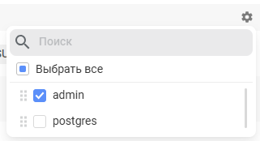{width="3.34375in" height="1.8125in"}

Рисунок 17.1 -- Окно субъектов доступа

При установке или снятии флага матрица перестраивается автоматически.

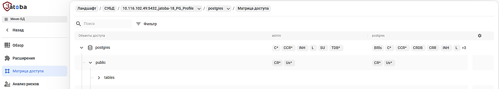{width="7.086805555555555in"
height="1.2652777777777777in"}

Рисунок 17.2 -- Вид «Матрицы доступа»

Фильтр «Матрицы доступа»
------------------------

Сформированную матрицу доступа возможно отфильтровать по требуемым
критериям. К таким критериям относятся:

-   Объекты доступа (Access objects);

-   Роли (Roles);

-   Атрибуты ролей (Role attributes);

-   Привилегии ролей (Role privileges).

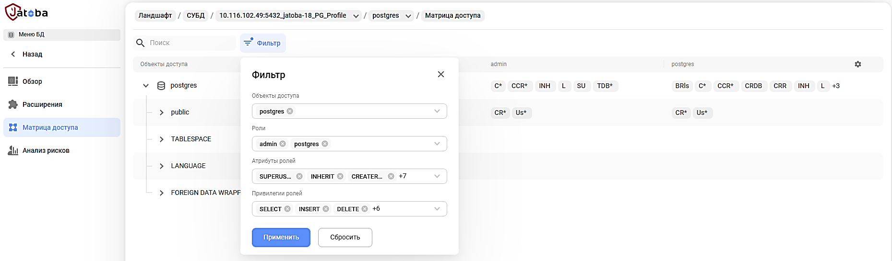{width="7.086805555555555in"
height="2.077777777777778in"}

Рисунок 17.3 -- Вид окна фильтра «Матрицы доступа»

В фильтре отсутствуют прямые зависимости между полями фильтрации.

Отфильтровать «Матрицу доступа» возможно по каждому из параметров полей
или в сочетании параметров.

> **Поле «Объекты доступа» (Access objects)**

В поле допустим выбор объектов только через выпадающий список. Окно
«Фильтрация объектов доступа» (Access objects filtering) отображает в
древовидной форме структуру БД.

В отражаемой структуре реализованы следующие функциональные возможности,
которые можно выбрать простановкой соответствующих флагов:

-   выбор объектов по типу;

-   выбор конкретного объекта;

-   выбор всех объектов (Select All).

Также поиск по названию объекта, который выполняется вводом названия
искомого объекта.

Древовидная форма структуры БД перестроится без сокрытия типов объектов,
отобразит найденные объекты. Требуемые объекты отмечаются флагом.

Список объектов и их количество отразится в поле «Объекты доступа».

**Поле «Роли»**

В поле «Роли» выбираются те роли СУБД, по которым требуется сформировать
матрицу доступа.

Роли (пользователи) СУБД отображаются в выпадающем списке, в алфавитном
порядке.

В списке ролей реализованы следующие функциональные возможности, которые
можно выбрать простановкой соответствующих флагов:

-   контекстный поиск и выбор роли;

-   единичный выбор роли;

-   множественный выбор ролей;

-   выбор всех ролей (Select All).

Для контекстного поиска достаточно ввести в поле «Роли» от 1 символа и
более. Список ролей будет автоматически перестраиваться.

**Поле «Атрибуты ролей» (Role attributes)**

В поле «Атрибуты ролей» возможно выбрать атрибуты для фильтрации матрицы
доступа.

В списке ролей реализованы следующие функциональные возможности, которые
можно выбрать простановкой соответствующих флагов:

-   контекстный поиск атрибута роли;

-   единичный атрибута роли;

-   множественный атрибутов ролей;

-   выбор всех атрибута роли (Select All).

**Поле «Привилегии ролей» (Role privileges)**

В поле «Привилегии ролей» отображаются привилегии ролей относительно
объектов БД.

Поле обладает всеми функциональными возможностями, которые были описаны
выше в других полях фильтра матрицы доступа.

Раздел «Ландшафт». БД. Вкладка «Анализ рисков» (User Risk)
==========================================================

Вкладка «Анализ рисков» (User Risk) логически связана с вкладкой «Матрица доступа» (Access Matrix) (17), т.к. в совокупности полученных данных можно получить объективную картину доступа субъектов доступа к объектам доступа. При этом в разделах отражается информация о групповых ролях и назначенным им атрибутам и привилегиям, которые наследуют роли пользователей.

В частности, «Анализ рисков» (User Risk) предоставляет количественные
показатели системных привилегий и атрибутов ролей относительно схемы
данных в БД, функционирующей на выбранном сервере.

Представленный отчет выполнен в виде матрицы и диаграммы «Privileges
chart».

Подраздел «Анализ рисков» располагается на уровне базы данных.

Для перехода к нему потребуется в разделе «Ландшафт» выбрать СУБД во
вкладке «Дерево инфраструктуры» и в раскрывающемся списке перейти на
уровень БД.

Выбор схемы данных (Schema)
---------------------------

Первоначально раздел не выстраивается автоматически. Для построения
отчета требуется выбрать схему данных в выпадающем списке,
расположенному в левом верхнем углу окна.

Отображение матрицы
-------------------

По умолчанию схема PUBLIC отображается в начале списка, приоритет имеют
цифры, далее в алфавитном порядке с приоритетом верхнего регистра.
Сортировка по столбцам атрибутов и привилегий осуществляется по наличию
атрибута/привилегии.

В настройке отображения столбцов таблицы присутствую и выбраны по
умолчанию атрибуты и привилегии, приведенные в таблице Таблица 18.1.

Таблица 18.1 -- Условные обозначения системных привилегий и атрибутов
ролей

| **Обозначение**                                             | **Привилегии и атрибуты**  | **Описание**                                                                                                                                              | **Отображение по умолчанию** |
|-------------------------------------------------------------|----------------------------|-----------------------------------------------------------------------------------------------------------------------------------------------------------|------------------------------|
| **Привилегии пользователей на вложенные объекты уровня БД** |                            |                                                                                                                                                           |                              |
| **STb**                                                     | SELECT TABLE               | Чтение                                                                                                                                                    | Х                            |
| **UpTb**                                                    | UPDATE TABLE               | Создание                                                                                                                                                  | Х                            |
| **ITb**                                                     | INSERT TABLE               | Изменение                                                                                                                                                 | Х                            |
| **DTb**                                                     | DELETE TABLE               | Удаление                                                                                                                                                  | Х                            |
| **TrTb**                                                    | TRUNCATE TABLE             | Удаление всех строк                                                                                                                                       | Х                            |
| **Системные привилегии**                                    |                            |                                                                                                                                                           |                              |
| **RTb**                                                     | REFERENCES TABLE           | Использование зависимых таблиц                                                                                                                            | Х                            |
| **TgTb**                                                    | TRIGGER TABLE              | Установка триггеров на таблицы                                                                                                                            | Х                            |
| **EFn**                                                     | EXECUTE FUNCTION           | Выполнение функций                                                                                                                                        | Х                            |
| **EPr**                                                     | EXECUTE PROCEDURE          | Выполнение процедур                                                                                                                                       | Х                            |
| **SSq**                                                     | SELECT SEQUENCE            | Получение значения счетчиков                                                                                                                              |                              |
| **UpSq**                                                    | UPDATE SEQUENCE            | Обновление значения счетчиков                                                                                                                             |                              |
| **USq**                                                     | USAGE SEQUENCE             | Использование счетчика                                                                                                                                    |                              |
| **CrDB**                                                    | CREATE DATABASE            | Создание базы данных                                                                                                                                      |                              |
| **CnDB**                                                    | CONNECT DATABASE           | Подключение к базе данных                                                                                                                                 |                              |
| **TDB**                                                     | TEMPORARY DATABASE         | Использование временных таблиц                                                                                                                            |                              |
| **CrTS**                                                    | CREATE TABLESPACE          | Создание табличного пространства                                                                                                                          |                              |
| **CrSc**                                                    | CREATE SCHEMA              | Создание схемы                                                                                                                                            |                              |
| **USc**                                                     | USAGE SCHEMA               | Использование схемы                                                                                                                                       |                              |
| **UpLO**                                                    | UPDATE LARGE OBJECT        | Изменение данных в больших объектах                                                                                                                       |                              |
| **SLO**                                                     | SELECT LARGE OBJECT        | Получение больших объектов                                                                                                                                |                              |
| **UFDW**                                                    | USAGE FOREIGN DATA WRAPPER | Использование внешних источников данных                                                                                                                   |                              |
| **UFS**                                                     | USAGE FOREIGN SERVER       | Использование внешних серверов                                                                                                                            |                              |
| **UD**                                                      | USAGE DOMAIN               | Использование домена                                                                                                                                      |                              |
| **ULn**                                                     | USAGE LANGUAGE             | Использования языка программирования                                                                                                                      |                              |
| **UTy**                                                     | USAGE TYPE                 | Использование тип                                                                                                                                         | Х                            |
| **Атрибуты ролей**                                          |                            |                                                                                                                                                           |                              |
| **SU**                                                      | SUPERUSER                  | Роль «Супер пользователь» обладает полными правами доступа к СУБД                                                                                         | Х                            |
| **INH**                                                     | INHERIT                    | Роли, имеющие атрибут «INHERIT», автоматически используют права всех ролей, членами которых они являются, в том числе и унаследованные этими ролями права | Х                            |
| **CRR**                                                     | CREATEROLE                 | Роль имеет разрешение на создание других ролей                                                                                                            | Х                            |
| **CRD**                                                     | CREATEDB                   | Роль имеет разрешение на создание базы данных                                                                                                             | Х                            |
| **L**                                                       | LOGIN                      | Роль с атрибутом «LOGIN» рассматривается, как роль пользователя базы данных, а также может использоваться для начального подключения к базе данных        | Х                            |
| **REP**                                                     | REPLICATION                | Роль имеет разрешение на запуск потоковой репликации                                                                                                      | Х                            |
| **BRLS**                                                    | BYPASSRLS                  | Атрибут роли, определяющий игнорирование все политики защиты на уровне строк (RLS -- Row Level Security)                                                  | Х                            |

Диаграмма
---------

Диаграмма представляет количественную оценку суммарного количества
предоставленных системных привилегий и количества установленных
атрибутов пользователей.

Цветовая индикация SU (Superuser) и выбранного столбца отображается на
диаграмме (рисунок Рисунок 18.1).

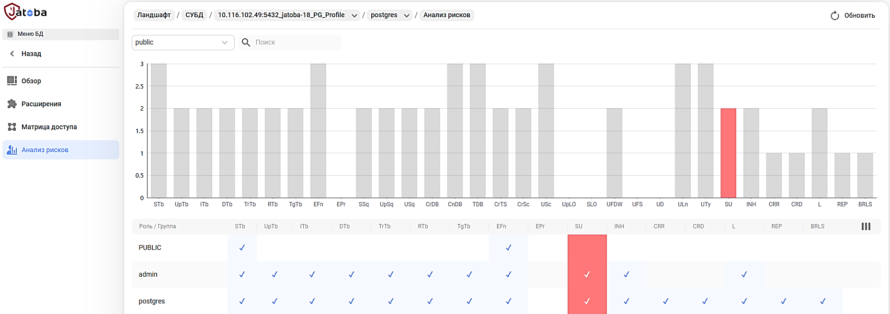{width="7.086805555555555in"
height="2.502083333333333in"}

Рисунок 18.1 -- Цветовая индикация

Раздел «Ландшафт». Вкладка «Кластеры jaDog»
===========================================

Работа компонента по управлению кластером полностью описана в документе
«Руководство по настройке. Часть 1. Управление режимом работы узлов
кластера. Компонент «jaDog». 643.72410666.00067-08 98-02-01».

Подключение к существующему кластеру описано в документе «Руководство по
безопасности».

Вкладка «Кластеры» в разделе «Ландшафт», отображает список подключенных
кластеров.

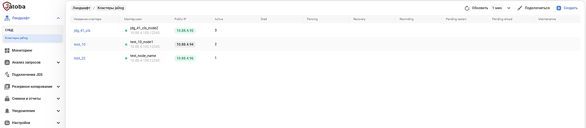{width="7.086805555555555in"
height="1.5472222222222223in"}

Рисунок 19.1 -- Отображение структуры кластера

Навигация в разделе
-------------------

Сущности кластера «jaDog» располагаются в двух подразделах с вкладками
по следующим путям:

-   Раздел Ландшафт → СУБД → Дерево инфраструктуры → Хост → СУБД →
    Служба jadog:

<!-- -->

-   Обзор (см. п.п 19.1.1);

<!-- -->

-   Раздел Ландшафт → Кластеры jaDog:

<!-- -->

-   Обзор;

-   Список узлов (см. п.п. 19.1.3):

<!-- -->

-   Параметры.

Рисунок 19.2 -- Навигация в подразделах Ландшафта

Параметры кластера отображаются на уровне службы «jadog». Для просмотра
параметров кластера необходимо перейти по пути: Раздел Ландшафт → СУБД →
Дерево инфраструктуры → Хост → СУБД → Служба jadog.

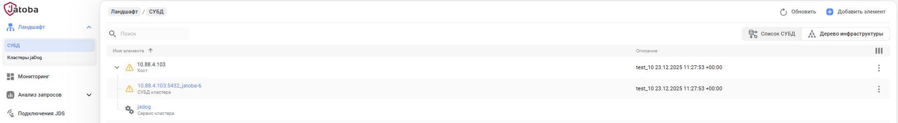{width="7.086805555555555in"
height="0.9743055555555555in"}

Рисунок 19.3 -- Путь к параметрам кластера

Параметры кластера распределены по вкладкам:

-   Обзор (см. п.п 19.1.1);

-   Структура (см. п.п. **Ошибка! Источник ссылки не найден.**);

-   Репликация (см. п.п. **Ошибка! Источник ссылки не найден.**);

### Вкладка «Обзор» параметров узла

Обзор параметров узла кластера сгруппирован по блокам,

-   Название;

-   Статус;

-   Последнее обновление;

-   Public IP;

-   Адрес jaDog;

-   Кластер;

-   Роль в кластере;

-   Дата-центр;

-   Состояние узла;

-   Параметры репликации;

-   Статус;

-   Тип;

-   Источник;

-   Слот.

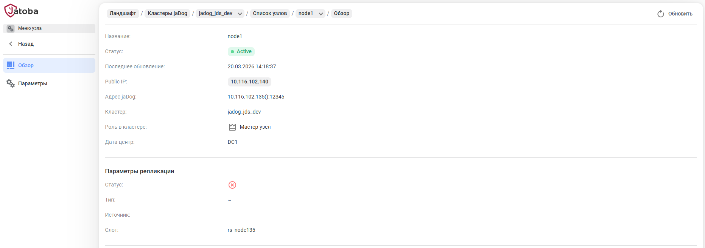{width="7.086805555555555in"
height="2.4993055555555554in"}

Рисунок 19.4 -- Вкладка «Обзор» параметров кластера

### Вкладка «Обзор» кластера

Во вкладке «Обзор» отображаются следующие не редактируемые параметры:

-   Название кластера;

-   Идентификатор;

-   Соединение;

-   Последнее обновление;

-   Адрес подключения;

-   Мастер-узел;

-   Public IP.

А также расположена кнопка Активации/деактивации Public IP кластера.

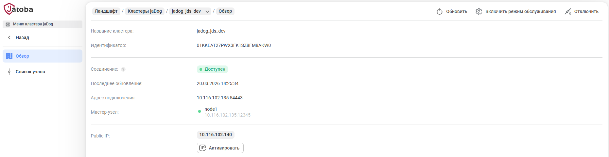{width="7.086805555555555in"
height="1.8347222222222221in"}

Рисунок 19.5 -- Вкладка «Обзор» кластера

### Вкладка «Список узлов» 

Вкладка «Список узлов» является основной вкладкой, в которой
отображается структура кластера и выполняются основные операции над
кластером.

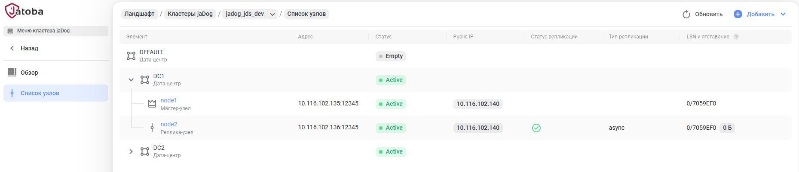{width="7.086805555555555in"
height="1.5361111111111112in"}

Рисунок 19.6 - Вкладка «Список узлов»

Структура кластера отражается в виде иерархического списка. По умолчанию
узлы кластера будут соотнесены к дата-центру с именем «Default».

Узлы кластера отображаются гиперссылкой, переход по которой ведет во
вкладку «Параметры» (см. п.п. 19.1.4).

В столбце «Адрес» отображается IP-адрес и порт.

В столбце «Статус» отображаются состояния узла:

-   ACTIVE -- устойчивое состояние узла;

-   INACTIVE -- не активный;

-   DIED -- неработоспособный;

-   RECOVERY -- узел в режиме восстановления;

-   FENCING -- узел оказался в сегменте кластера, где не достигнут
    кворум по выбору нового главного узла;

-   PROMOTING -- резервный узел в процессе преобразования в главный;

-   REWINDING -- резервный узел в процессе переключения на новый главный
    узел.

-   STARTING -- узел находится в состоянии запуска.

-   RESTARTING -- узел находится в состоянии перезапуска.

-   DEMOTING -- главный узел в процессе преобразования в резервный;

-   DELETING -- узел удаляется;

-   STOPPED -- узел остановлен;

-   [[MAINTENANCE]{.underline}](технического_обслуживания#_Режим_) --
    узел в режиме технического обслуживания;

-   CANDIDATE - узел в режиме выбора кандидата (голосование) на роль
    главного узла кластера (master)

-   INIT -- узел в состоянии инициализации.

В поле «Статус» Дата-центра отображаются возможные состояния:

-   ACTIVE -- активный;

-   EMPTY -- пустой;

-   INACTIVE -- не активный.

В поле «Статус репликации» отображается индикатор успешности репликации
для подчиненных узлов.

В поле «Тип репликации» отображается тип репликации, синхронная или
асинхронная, для подчиненных узлов.

В поле «LSN и отставания» отображается разница между двумя позициями в
журнале предзаписи.

**Отставание** - факт, состоящий в том, что транзакции на реплике
выполняются позже, чем на мастере. По функции pg\_wal\_lsn\_diff (lsn1
pg\_lsn, lsn2 pg\_lsn) → numeric вычисляется разница в байтах (lsn1 -
lsn2) между двумя позициями в журнале предзаписи (Мастера и Реплики).
Полученный результат можно использовать для определения задержки
репликации

**LSN** (Log Sequence Number) в СУБД --- это байтовое смещение до записи
относительно начала журнала предзаписи (WAL). LSN --- это 64-битное
целое число, которое представляет собой указатель на позицию в потоке
WAL.

LSN используется для:

-   Описания позиции вставки в WAL. Записи WAL добавляются в файлы WAL
    по мере записи каждой новой записи, и LSN описывает позицию вставки.

-   Контроля порядка записи изменений в табличных страницах. Порядок
    контролируется с учётом LSN последнего изменения страницы и текущего
    состояния pg\_current\_wal\_lsn.

-   Оценки объёма журнальных записей между двумя позициями LSN. Зная две
    позиции LSN, можно получить размер журнальных записей между ними (в
    байтах) простым вычитанием одной позиции из другой.

Public IP отображается у всех узлов кластера и отличается цветовой
градацией. Только у узла с ролью «Master» Public IP подсвечен зеленым
цветом.

Узлы кластера могут иметь роли и делиться по типам:

-   «Master» - главный-узел;

-   «Slave» - подчиненный резервный узел (Primary Slave) и подчиненный
    каскадный узел (Cascade Slave);

-   «Referee» - узел-арбитр.

Операции над узлами кластера выполняются через контекстное меню строки
узла.

Узел с ролью «Master» возможно только «Присоединить к дата-центру» и
«Отсоединить от дата-центра».

Над узлом с ролью «Slave» доступны операции:

-   «Присоединить к дата-центру»;

-   «Отсоединить от дата-центра»;

-   «Сделать мастером»;

-   «Удалить узел».

Над узлом с ролью «Slave» с типом подчиненный каскадный узел (Cascade
Slave) доступна операция «Удалить узел».

Над узлом с ролью «Referee» доступны операции:

-   «Присоединить к дата-центру»;

-   «Отсоединить от дата-центра»;

-   «Удалить узел».

### Вкладка «Параметры»

Параметры компонента «jaDog» отражены во вкладке «Параметры». Параметры
являются редактируемыми, полный перечень которых приведен в документе
«Управление режимом работы узлов кластера. Компонент «jaDog».

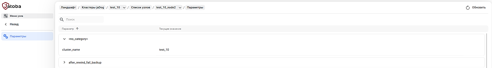{width="7.086805555555555in"
height="0.9868055555555556in"}

Рисунок 19.7 - Параметры компонента «jaDog»

Изменение значений подтверждается информационным сообщением. Новые
значения параметра применяются моментально.

Однако, для отдельных параметров и их применения требуется перечитать
конфигурацию, т.е. применить новые параметры в конфигурационном файле
узла кластера.

В информационной строке выводится сообщение:

> Узел требует перечитывания конфигурации.Перечитать

Нажатие гиперссылки «Перечитать» вызовет окно подтверждения и в итоге
выполнит операцию пересчета и применения конфигурации узла кластера.

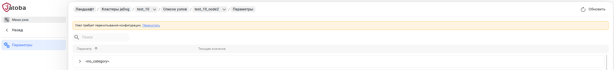{width="6.351745406824147in"
height="1.716418416447944in"}

Рисунок 19.8 -- Кнопки «Обновить» и «Перечитать конфигурацию»

Подключение к существующему кластеру
------------------------------------

Подключение к существующему кластеру описано в документе «Руководство по
безопасности».

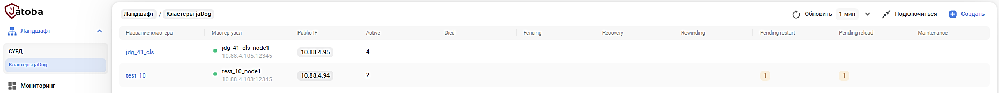{width="7.086805555555555in"
height="0.6652777777777777in"}

Рисунок 19.9 -- Расположение кнопки «Подключить»

Кластер не может быть добавлен дважды. При подключении к существующему
кластеру выполняется проверка уникальности идентификатора кластера.

{width="3.2694728783902014in"
height="4.0472222222222225in"}

Рисунок 19.10 -- Подключение к кластеру

Создание кластера
-----------------

Создание кластера подразумевает следующую последовательность действий:

-   администратор создает кластер на базе первого узла мастера;

-   администратор добавляет Х узлов с нужными ролями;

-   администратор проводит необходимые настройки кластера;

-   администратор переносит данные;

-   администратор убеждается в корректности работы кластера;

-   администратор разрешает клиентские подключения к кластеру
    через «Public IP», используя элемент в интерфейсе «Активировать
    Public IP» (см. п. 19.5).

Создание кластера доступно в разделе «Ландшафт», во вкладке «Кластеры
jaDog» нажатием кнопки «Создать».

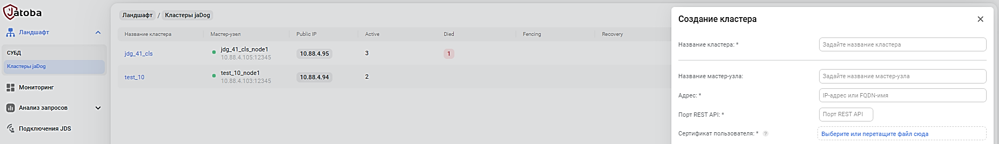{width="7.086805555555555in" height="1.025in"}

Рисунок 19.11 -- Окно «Создание кластера»

Вызвав окно «Создание кластера» вводится:

-   Имя кластера;

-   Адрес REST API сервера, на базе которого создается кластер;

-   Порт REST API сервера, через который будут проводится команды;

-   Сертификат пользователя в формате \*.pfx.

Компонент JDS не запрашивает порт экземпляра jaDog.

Подключение узла кластера
-------------------------

Добавление узла в кластер выполняется во вкладке «Список узлов», через
кнопку «Добавить» и в меню выбрав опцию «Узел».

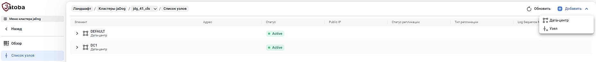{width="7.086805555555555in"
height="0.7479166666666667in"}

Рисунок 19.12 -- Контекстное меню кластера

В окне «Добавление узла в кластер» требуется указать:

-   Название;

-   Адрес - IP-адрес или DNS-имя узла кластера;

-   Порт подключения к узлу: 12345

По умолчанию используется порт 12345, однако порт может отличаться в
зависимости от настроек компонента jaDog.

-   Роль - роль узла Slave/Referee.

-   Тип репликации (Асинхронная/Синхронная);

-   Каскадная репликация -- репликация с указанного узла Slave;

-   Не копировать данные.

Данный параметр подключения используется в случае, если узел кластера
был подготовлен и на него были заранее скопированы данные с основного
узла. При подключении такого узла кластера данные с основного узла
копироваться не будут.

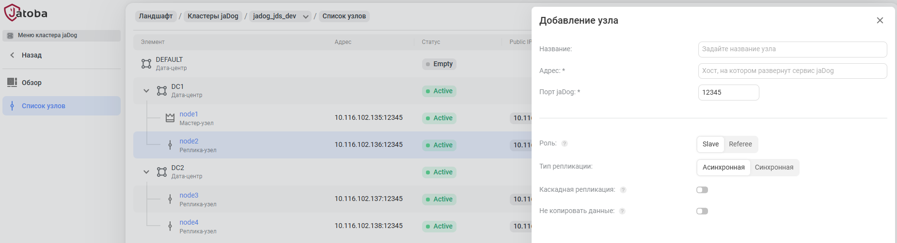{width="7.086805555555555in"
height="1.9256944444444444in"}

Рисунок 19.13 -- Окно добавления узла в кластер

|                                                                                     |                                                                                                                                                                      |
|-------------------------------------------------------------------------------------|----------------------------------------------------------------------------------------------------------------------------------------------------------------------|
| {width="0.2513888888888889in" height="0.2513888888888889in"} | Если хост был ранее добавлен в раздел «Ландшафт», то после использования его в качестве узла кластера потребуется переустановить пароль в разделе «Назначение ролей» |

### Каскадная репликация

Возможно добавить узел кластера с каскадной репликацией только с ролью
«Slave» от существующего узла кластера с ролью «Slave».

В окне «Добавление узла», при установке переключателя «Каскадная
репликация», появится поле «Источник репликации» с выпадающим списком. В
выпадающем списке отразятся узлы с ролью «Slave». От выбранного узла
будет реплицироваться новый узел.

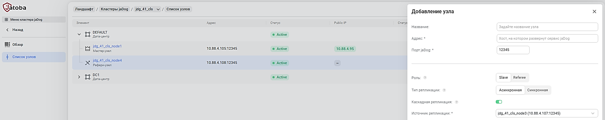{width="7.086805555555555in"
height="1.4166666666666667in"}

Рисунок 19.14 -- Окно добавления узла в кластер с каскадной репликацией

Активация/деактивация PublicIP кластера
---------------------------------------

В настройках каждого jaDog узла есть параметр Public IP. При работе
узлов в составе кластера, один из узлов работает в роли \"Мастер\". Если
Public IP активирован, значение его параметра становится актуальным для
соединения с кластером.

При обслуживании кластера, могут выполняться следующие действия:

-   администратор запрещает клиентские подключения к кластеру
    через Public IP, используя элемент в интерфейсе «Деактивировать
    Public IP»;

-   администратор читает журнал аудита компонентов, проверяет настройки,
    выясняет причину неполадок;

-   администратор проводит необходимые действия по устранению причин
    неполадок;

-   администратор убеждается в корректности работы кластера;

-   администратор разрешает клиентские подключения к кластеру
    через Public IP, используя элемент в интерфейсе \"Активировать
    Public IP\".

Кнопка «Актировать/деактивировать» расположена по пути: Раздел
«Ландшафт» - Вкладка «Кластеры» - уровень кластера в дереве кластеров.

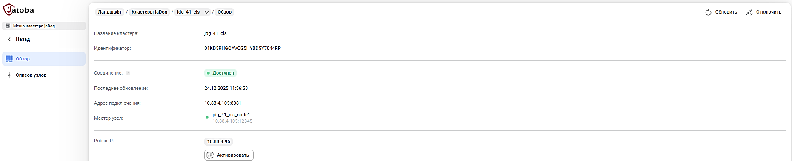{width="7.086805555555555in"
height="1.4395833333333334in"}

Рисунок 19.15 - Кнопка «Актировать/деактивировать»

Назначение узлу роли Мастер
---------------------------

Имеющийся узел с ролью «Slave» возможно назначить на роль «Master».

В строке узла потребуется вызвать контекстное меню и выбрать опцию
«Сделать мастером».

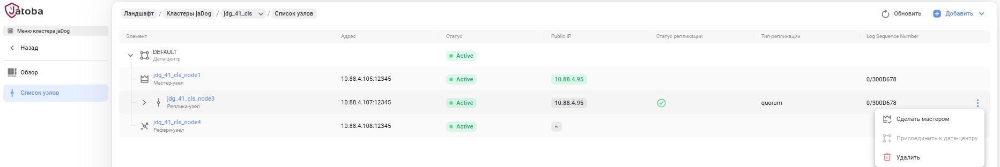{width="7.086805555555555in"
height="1.1854166666666666in"}

Рисунок 19.16 -- Контекстное меню узла с ролью «Slave»

После чего компонент выведет окно предупреждения и получив
подтверждение, начнётся процедура смены ролей кластера (switchover).

Для узла с каскадной репликацией назначение роли «Master» недоступно.

Удаление узла
-------------

Узел с ролью «Master» возможно удалить только после последовательного
удаления всех связанных с ним узлов, таких как «Slave» или «Referee».

В строке узла потребуется вызвать контекстное меню и выбрать опцию
«Удалить», как представлено на рисунке Рисунок 19.16.

После чего компонент выведет окно предупреждения.

Удаленный узел не будет отражаться в списке узлов.

Удаление узлов в кластере с каскадной репликацией имеет свои
особенности. Первоначально удаляется узел кластера с каскадной
репликацией, после чего целесообразно удалять узел с ролью «Slave»
относительно узла с ролью «Master».

Дата-центр
----------

Дата-центр --- это логическая сущность в JDS, позволяющая сопоставить
узлы кластера по подсетям в Дата-центрах.

Узлы могут иметь статусу:

-   ACTIVE -- устойчивое состояние узла;

-   INACTIVE -- не активный;

-   DIED -- неработоспособный;

-   RECOVERY -- узел в режиме восстановления;

-   FENCING -- узел оказался в сегменте кластера, где не достигнут
    кворум по выбору нового главного узла;

-   PROMOTING -- резервный узел в процессе преобразования в главный;

-   REWINDING -- резервный узел в процессе переключения на новый главный
    узел.

-   STARTING -- узел находится в состоянии запуска.

-   RESTARTING -- узел находится в состоянии перезапуска.

-   DEMOTING -- главный узел в процессе преобразования в резервный;

-   DELETING -- узел удаляется;

-   STOPPED -- узел остановлен;

-   MAINTENANCE -- узел в режиме технического обслуживания;

-   CANDIDATE - узел в режиме выбора кандидата (голосование) на роль
    главного узла кластера (master)

-   INIT -- узел в состоянии инициализации.

Работа кластера в разных подсетях и соответственно в разных Дата-центрах
требует подготовительных действий, т.к. конфигурационный файл правил
аутентификации в СУБД «pg\_hba.conf» не настраивается автоматически на
разные подсети при конфигурировании узла кластера.

Схема первоначального состояния узлов кластера представлена на рисунке
Рисунок 19.17

Рисунок 19.17 -- Начальное состояние узлов кластера

В рассматриваемом примере узлы кластера имеют сетевую адресацию,
представленную в таблице Таблица 19.1.

Таблица 19.1 -- Сетевая адресация серверов стенда кластера «jaDog» для
работы в Дата-центре

<table>
<thead>
<tr class="header">
<th><strong>№</strong></th>
<th><strong>Имя сервера</strong></th>
<th><strong>IP-адрес</strong></th>
<th><strong>Маска подсети</strong></th>
<th><strong>Public IP</strong></th>
<th>
<strong>Роль/</strong>

<strong>состояние</strong>
</th>
<th><strong>Дата-центр</strong></th>
</tr>
</thead>
<tbody>
<tr class="odd">
<td><strong>1</strong></td>
<td><strong>JDS</strong></td>
<td>10.116.102.40</td>
<td>255.255.255.0</td>
<td></td>
<td></td>
<td></td>
</tr>
<tr class="even">
<td></td>
<td><strong>Подсеть 102</strong></td>
<td></td>
<td></td>
<td></td>
<td></td>
<td></td>
</tr>
<tr class="odd">
<td><strong>2</strong></td>
<td><strong>Node1</strong></td>
<td>10.116.102.54/24</td>
<td>255.255.255.0</td>
<td>10.116.102.81/24</td>
<td>Slave</td>
<td>dc1</td>
</tr>
<tr class="even">
<td><strong>3</strong></td>
<td><strong>Node2</strong></td>
<td>10.116.102.55/24</td>
<td>255.255.255.0</td>
<td>10.116.102.81/24</td>
<td>Master</td>
<td>dc1</td>
</tr>
<tr class="odd">
<td><strong>4</strong></td>
<td><strong>Node3</strong></td>
<td>10.116.102.57/24</td>
<td>255.255.255.0</td>
<td></td>
<td></td>
<td></td>
</tr>
<tr class="even">
<td><strong>5</strong></td>
<td><strong>Node4</strong></td>
<td>10.116.102.58/24</td>
<td>255.255.255.0</td>
<td></td>
<td></td>
<td></td>
</tr>
<tr class="odd">
<td></td>
<td><strong>Подсеть 103</strong></td>
<td></td>
<td></td>
<td></td>
<td></td>
<td></td>
</tr>
<tr class="even">
<td><strong>6</strong></td>
<td><strong>Node5</strong></td>
<td>10.116.103.57/24</td>
<td>255.255.255.0</td>
<td>10.116.103.82/24</td>
<td>Unknown</td>
<td>dc2</td>
</tr>
<tr class="odd">
<td><strong>7</strong></td>
<td><strong>Node6</strong></td>
<td>10.116.103.58/24</td>
<td>255.255.255.0</td>
<td>10.116.103.82/24</td>
<td>Unknown</td>
<td>dc2</td>
</tr>
</tbody>
</table>

Дата-центры еще не сформированы.

Узел Node2 выполняет роль «Master», Узел Node1 выполняет роль «Slave» и
сконфигурирован на публичный IP-адрес 10.116.102.81/24.

Узлы Node5 и Node6 являются свободными и сконфигурированы на публичный\
IP-адрес 10.116.103.82/24.

### Подготовительные действия для создания кластера

На узле Node2 с роль «Master» потребуется внести дополнительные
параметры для подключения узлов в другой подсети, внеся следующие
строки:

> host all \<имя пользователя\> \<адрес подсети\> md5
>
> host replication \<имя пользователя\> \<адрес подсети\> md5

{width="6.986744313210848in"
height="4.009433508311461in"}

Рисунок 19.18 -- Параметры конфигурационного файлы pg\_hba.conf на узле
«Master»

Сохранить внесенные изменения.

|                                                                                     |                                                                          |
|-------------------------------------------------------------------------------------|--------------------------------------------------------------------------|
| {width="0.2513888888888889in" height="0.2513888888888889in"} | Рекомендуется использовать надежный метод аутентификации «SCRAM-SHA-256» |

Применение параметров целесообразнее выполнить не через перезагрузку
служб, а через SQL-команду. Для чего от имени и с правами пользователя
«postgres», войти в СУБД и выполнить SQL-команду:

> SELECT pg\_reload\_conf();

{width="7.056080489938758in"
height="2.756522309711286in"}

Рисунок 19.19 -- Выполнение перезагрузки параметров СУБД

Далее можно переходить к конфигурированию кластера в Дата-центрах в
разделе JDS «Список кластеров».

### Создание/удаление Дата-центров

Добавление узла в кластер выполняется во вкладке «Список узлов», через
кнопку «Добавить» и в меню выбрав опцию «Дата-центр».

Нажатие на пиктограмму вызовет окно «Создание дата-центра» в правом углу
вкладки.

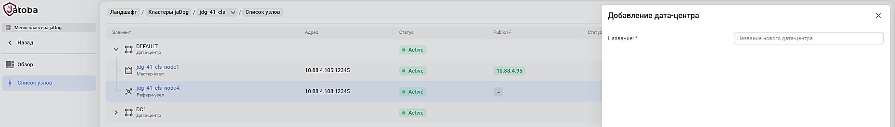{width="7.086805555555555in"
height="1.0131944444444445in"}

Рисунок 19.20 -- Окно «Создание дата-центра»

В поле «Имя дата-центра» вносится требуемое название.

Это соответствует команде в утилите «jadog\_ctl»:

> datacenter create \'name\'

Для рассматриваемого примера создаются дата-центры:

-   «dc1»;

-   «dc2».

В контекстном меню Дата-центра находится пункт меню «Удалить».

Удалить возможно только пустой Дата-центр, т.е. Дата- центр, не
содержащий в себе узлов кластера.

Невозможно удалить Дата-центр по умолчанию «DEFAULT».

### Присоединение узлов кластера к Дата-центру

К созданным дата-центрам присоединим узлы кластера:

-   Node1 IP-10.116.102.54/24 и Node2 IP- 10.116.102.55/24 к «dc1»;

-   Node5 IP-10.116.103.57/24 и Node6 IP-10.116.103.58/24 к «dc2».

Присоединение к Дата-центрам узлов кластера выполняется в подразделе
«Jadog кластеры».

Присоединение к Дата-центрам узлов кластера выполняется во вкладке
«Список узлов», в строке узла, через контекстное меню выбрав опцию
«Присоединить к дата-центру».

Каждый узел присоединяется отдельно.

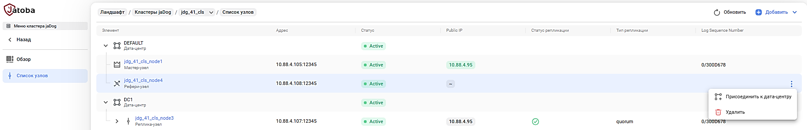{width="7.086805555555555in"
height="1.1548611111111111in"}

Рисунок 19.21 -- Контекстное меню «Присоединить к дата-центру»

Нажатие на меню вызовет одноименное окно.

Поле «Выберите дата-центр» выполнено в виде выпадающего списка, в
котором отражаются созданные Дата-центры (см. п. 19.8.2).

Это соответствует команде в утилите «jadog\_ctl»:

> datacenter \'dc1\' attach node 10.116.102.54 12345
>
> datacenter \'dc1\' attach node 10.116.102.55 12345
>
> datacenter \'dc2\' attach node 10.116.103.57 12345
>
> datacenter \'dc2\' attach node 10.116.103.58 12345

В результате узлы кластера распределены по Дата-центрам. Один узел
выполняет роль «Master», остальные узлы работают с ролью «Slave».

В подсети «102» кластер работает с Public IP -- 10.116.102.81/24. Второй
публичный адрес 10.116.103.82/24 в подсети «103» не используется.
Полученная конфигурация кластера представлена в таблице Таблица 19.2 и
показана на рисунке Рисунок 19.22.

Таблица 19.2 -- Сетевая адресация серверов стенда кластера «jaDog»,
работающих в Дата-центрах

<table>
<thead>
<tr class="header">
<th><strong>№</strong></th>
<th><strong>Имя сервера</strong></th>
<th><strong>IP-адрес</strong></th>
<th><strong>Маска подсети</strong></th>
<th><strong>Public IP</strong></th>
<th>
<strong>Роль/</strong>

<strong>состояние</strong>
</th>
<th><strong>Дата-центр</strong></th>
</tr>
</thead>
<tbody>
<tr class="odd">
<td><strong>1</strong></td>
<td><strong>JDS</strong></td>
<td>10.116.102.40</td>
<td>255.255.255.0</td>
<td></td>
<td></td>
<td></td>
</tr>
<tr class="even">
<td></td>
<td><strong>Подсеть 102</strong></td>
<td></td>
<td></td>
<td></td>
<td></td>
<td></td>
</tr>
<tr class="odd">
<td><strong>2</strong></td>
<td><strong>Node1</strong></td>
<td>10.116.102.54/24</td>
<td>255.255.255.0</td>
<td>10.116.102.81/24</td>
<td>Slave</td>
<td>dc1</td>
</tr>
<tr class="even">
<td><strong>3</strong></td>
<td><strong>Node2</strong></td>
<td>10.116.102.55/24</td>
<td>255.255.255.0</td>
<td>10.116.102.81/24</td>
<td>Master</td>
<td>dc1</td>
</tr>
<tr class="odd">
<td><strong>4</strong></td>
<td><strong>Node3</strong></td>
<td>10.116.102.57/24</td>
<td>255.255.255.0</td>
<td></td>
<td></td>
<td></td>
</tr>
<tr class="even">
<td><strong>5</strong></td>
<td><strong>Node4</strong></td>
<td>10.116.102.58/24</td>
<td>255.255.255.0</td>
<td></td>
<td></td>
<td></td>
</tr>
<tr class="odd">
<td></td>
<td><strong>Подсеть 103</strong></td>
<td></td>
<td></td>
<td></td>
<td></td>
<td></td>
</tr>
<tr class="even">
<td><strong>6</strong></td>
<td><strong>Node5</strong></td>
<td>10.116.103.57/24</td>
<td>255.255.255.0</td>
<td>10.116.103.82/24</td>
<td>Slave</td>
<td>dc2</td>
</tr>
<tr class="odd">
<td><strong>7</strong></td>
<td><strong>Node6</strong></td>
<td>10.116.103.58/24</td>
<td>255.255.255.0</td>
<td>10.116.103.82/24</td>
<td>Slave</td>
<td>dc2</td>
</tr>
</tbody>
</table>

Рисунок 19.22 -- Схема кластера в Дата-центрах

Отключение кластера от JDS
--------------------------

Отключение кластера выполняется через кнопку «Отключить» в правом
верхнем углу во вкладке «Обзор» на уровне «Кластеры jaDog».

Данная операция подразумевает отключение кластера от инфраструктуры JDS.
При этом он продолжить функционировать, но не будет отражаться во
вкладке «Кластеры jaDog».

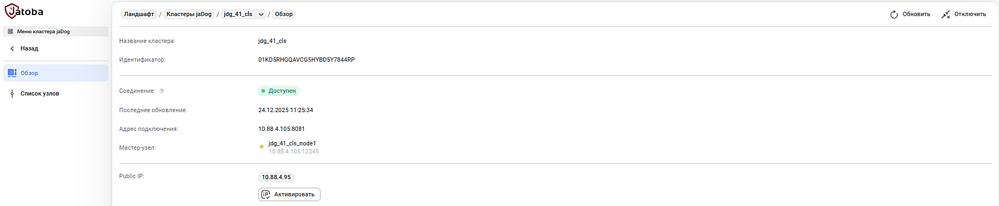{width="7.086805555555555in" height="1.4625in"}

Рисунок 19.23 -- Контекстное меню кластера.

После выбора опции «Отключить» компонент выведет окно подтверждения
действия.

{width="3.854851268591426in"
height="1.434362423447069in"}

Рисунок 19.24 -- Окно «отключение кластера»

Отключенный кластер можно вновь подключить способом, описанным в
документе «Руководство по безопасности».

Режим «технического обслуживания» (maintenance)
-----------------------------------------------

Режим технического обслуживания используется для кластера и для
отдельного узла.

Кластер в режиме ТО продолжает принимать запросы от пользователей и
обрабатывать их, но все рабочие узлы: Master и Slave, кроме Referee,
перестают выполнять процедуру обработки отказа.

Узел кластера в режиме ТО перестает выполнять процедуру обработки
отказа, при этом кластер остается работоспособен.

**Кластер в режиме ТО**

Ввод режима технического обслуживания кластера выполняется переходом по
пути:

-   Раздел Ландшафт → Кластеры jaDog → Обзор (кластера) → Кнопка
    «Включить режим обслуживания».

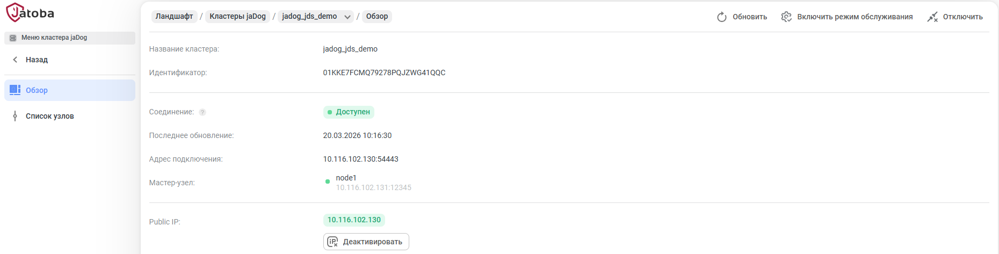{width="7.086805555555555in"
height="1.8020833333333333in"}

Рисунок 19.25 - Кнопка «Включить режим обслуживания»

Перед включением режима ТО компонент выведет информационное сообщение.

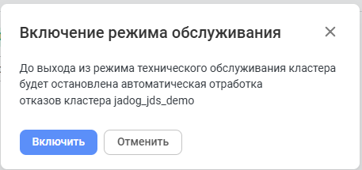{width="3.3541666666666665in"
height="1.5273436132983378in"}

Рисунок 19.26 -- Информационное сообщение о включении режима ТО

Согласие вызовет процесс перехода в режим ТО.

Для перехода всех улов кластера в режим ТО, может потребоваться
некоторое время.

Просмотреть состояние кластера возможно через вкладку «Список узлов».

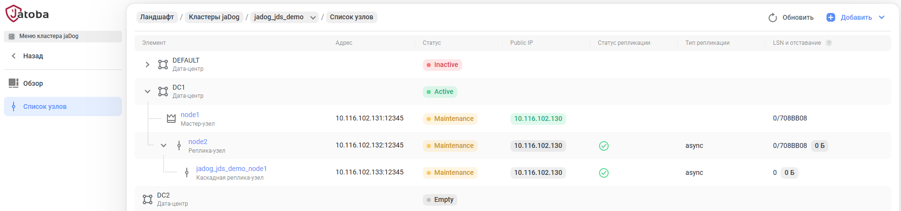{width="7.086805555555555in"
height="1.667361111111111in"}

Рисунок 19.27 -- Список узлов кластера в режиме ТО

На данном шаге перевод кластера в режим технического обслуживания
закончен.

С узлами кластера доступны все операции, не приводящие к процедуре
отказа в обслуживании.

Вывод из режима технического обслуживания кластера выполняется переходом
по пути:

-   Раздел Ландшафт → Кластеры jaDog → Обзор (кластера) → Кнопка
    «Отключить режим обслуживания».

Если кластер был введен в режим ТО, то отдельный вывод узлов кластера из
данного режима недоступен.

**Узел кластера в режиме ТО**

Вывод режима технического обслуживания кластера выполняется переходом по
пути:

-   Раздел Ландшафт → Кластеры jaDog → Список узлов

В строке узла кластера, через контекстное меню, выбирается опция
«Включить режим обслуживания».

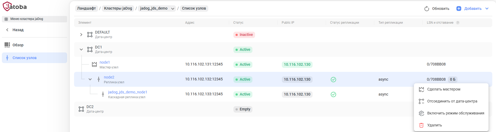{width="7.086805555555555in"
height="1.895138888888889in"}

Рисунок 19.28 - опция «Включить режим обслуживания» к строке узла
кластера

Перед включением режима ТО для узла кластера компонент выведет
информационное сообщение.

Согласие вызовет процесс перехода в режим ТО узла кластера.

В случае, когда узел связан каскадной репликацией с другим узлом, данный
узел также будет переведен в режим ТО.

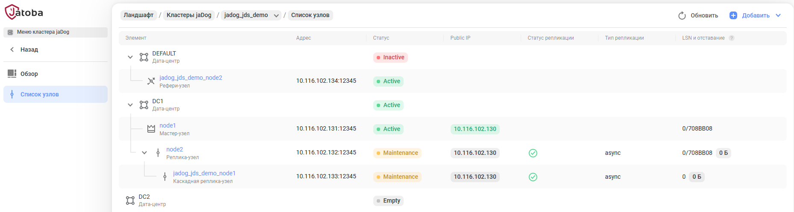{width="7.086805555555555in"
height="1.8944444444444444in"}

Рисунок 19.29 -- Узлы с каскадной репликацией в режиме ТО

Вывод из режима технического обслуживания узла кластера выполняется
переходом по пути:

-   Раздел Ландшафт → Кластеры jaDog → Список узлов.

В строке узла кластера, через контекстное меню, выбирается опция
«Отключить режим обслуживания».

Реинициализация (Reinit) неработоспособного узла (DIED)
-------------------------------------------------------

Узел в состоянии неработоспособности (DIED) возможно отсоединить от
кластера и вновь подключить. Однако это достаточно трудоемкая и долгая
операция.

Целесообразно использовать процедуру реинициализации узла.

В списке узлов кластера, только для узла в статусе (DIED), в контекстном
меню, доступна опция «Реинициализация».

Операция «Реинициализация» доступна в режиме:

-   реинициализации узла кластера с копированием данных с узла с ролью
    «Master»;

{width="7.086805555555555in"
height="3.693659230096238in"}

Рисунок 19.30 -- Запуск реинициализации узла кластера

-   реинициализации узла кластера без копирования данных с узла с ролью
    «Master».

{width="7.086805555555555in"
height="3.693659230096238in"}

Рисунок 19.31 Запуск реинициализации узла кластера без копирования
данных

Подтвердив операцию узел перейдет в режиме восстановления (RECOVERY).
При успешном выполнении операции узел станет активным.

Раздел «Мониторинг» (Monitoring)
================================

Раздел «Мониторинг» предназначен для отображения оперативной информации
в форме графических и цифровых панелей (виджетов) о целевой СУБД и ОС,
на которой она установлена.

Настройка подключения описана в п. 2.3 «Вкладка «Источники данных»
настоящего документа.

Информация собирается с компонент:

-   «node\_exporter» -- предназначен для мониторинга и сбора метрик с
    различных компонентов в системе на основе ОС Linux;

-   «postgres\_exporter» -- предназначен для сбора и экспорта метрик
    СУБД, таких как статистика по базе данных, нагрузка на сервер,
    количество запросов и т. д.;

-   «sql\_exporter» -- предназначен для экспорта данных из SQL-запросов
    в формат, удобный для анализа и визуализации.

Информацию аккумулирует система «PROMETHEUS» и передаёт ее в подраздел
«Панель» JDS. Утилита «Alertmanager» обеспечивает контроль над
пороговыми значениями и рассылку уведомлений.

Схема взаимодействия компонент представлена на рисунке Рисунок 20.1.

Рисунок 20.1 -- Схема взаимодействия компонент для сбора метрик

Настройка вышеуказанных компонент описана в документе «Руководство по
настройке. Часть 28. Поддержка мониторинга СУБД».

Во вкладке «Мониторинг» отображаются предустановленный набор виджетов.

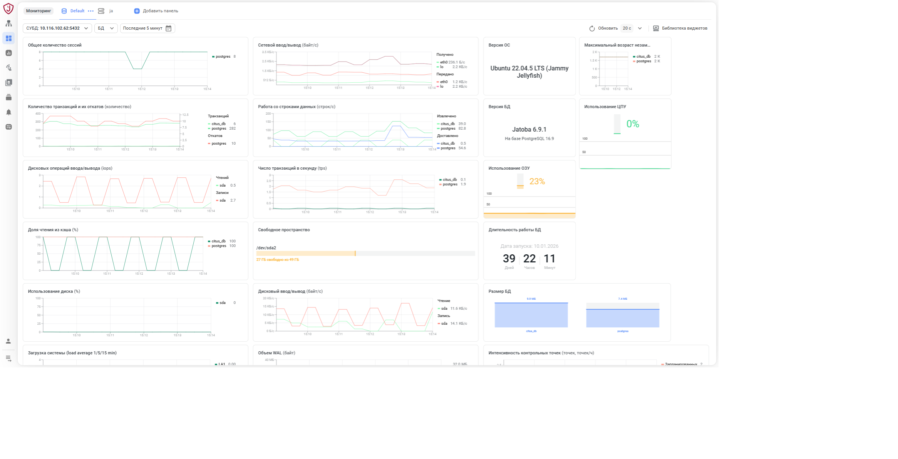{width="7.009589895013123in"
height="3.5902777777777777in"}

Рисунок 20.2 -- Предустановленные виджеты

В верхней строке доступен выбор:

-   контролируемой СУБД;

-   всех баз данных или единственной БД;

-   периода контроля;

-   периодичности обновления вкладки;

-   библиотека виджетов.

Рабочее пространство возможно организовать созданием вкладок с виджетами
или простым выбором виджетов.

Библиотека виджетов
-------------------

Библиотека виджетов структурирована по двум вкладкам. На вкладке
«Сервер» располагаются виджеты, относящиеся к используемой ОС. На
вкладке «БД» располагаются виджеты, относящиеся к работе баз данных.

Перечень используемых виджетов, находящихся в библиотеке виджетов,
приведенных в таблице Таблица 20.1.

Таблица 20.1 -- Перечень виджетов в библиотеке виджетов

| **Вкладка библиотеки виджетов** | **Виджет**                                       | **Метрика**                          |
|---------------------------------|--------------------------------------------------|--------------------------------------|
| **Сервер**                      | Использование ЦПУ                                | ЦПУ, нагрузка                        |
| **Сервер**                      | Дисковый ввод/вывод                              | диск, чтение, запись                 |
| **Сервер**                      | Дисковых операций ввода/вывода                   | диск, чтение, запись, нагрузка       |
| **Сервер**                      | Версия ОС                                        | версия                               |
| **Сервер**                      | Использование ОЗУ                                | ОЗУ, нагрузка                        |
| **Сервер**                      | Дисковый ввод/вывод                              | диск, чтение, запись, нагрузка       |
| **Сервер**                      | Использование диска                              | диск, чтение, запись, нагрузка       |
| **Сервер**                      | Свободное пространство                           | диск, размер                         |
| **Сервер**                      | Сетевой ввод/вывод                               | сеть, чтение, запись, нагрузка       |
| **Сервер**                      | Загрузка системы (load average 1/5/15 min)       | ЦПУ, нагрузка                        |
| **БД**                          | Версия БД                                        | версия (PostgreSQL/Jatoba)           |
| **БД**                          | Количество сессий по состояниям                  | сессии, нагрузка                     |
| **БД**                          | Число транзакций в секунду                       | нагрузка                             |
| **БД**                          | Длительность работы БД                           | длительность                         |
| **БД**                          | Размер БД                                        | размер                               |
| **БД**                          | Количество заблокированных и ожидающих сессий    | сессии, конфликты                    |
| **БД**                          | Изменение размеров БД                            | Размер, запись                       |
| **БД**                          | Общее количество сессий                          | Сессии, нагрузка                     |
| **БД**                          | Блокировки                                       | конфликты                            |
| **БД**                          | Взаимоблокировки, конфликты                      | конфликты                            |
| **БД**                          | Максимальный возраст незамороженных транзакций   | длительность                         |
| **БД**                          | Работа со строками данных                        | Строки, чтение, запись               |
| **БД**                          | Максимальная продолжительность запросов/ожиданий | Сессии, конфликты, длительность      |
| **БД**                          | Автовакуумы и их длительность                    | Сессии, длительность                 |
| **БД**                          | Интенсивность контрольных точек                  | WAL, контрольные точки, нагрузка     |
| **БД**                          | Объем WAL                                        | WAL, запись размер                   |
| **БД**                          | Интенсивность работы с буферами                  | WAL, чтение, запись                  |
| **БД**                          | Длительность обработки контрольных точек         | WAL, контрольные точки, длительность |
| **БД**                          | Доля чтения из кэша                              | чтение                               |
| **БД**                          | Запись во временные файлы                        | размер, чтение                       |
| **БД**                          | Количество транзакций и их откатов               | нагрузка                             |

На панель виджеты добавляются нажатием кнопки «Библиотека виджетов». В
окне «Библиотека виджетов» выбираются требуемые виджеты, которые будут
выстраиваться в окне вертикально.

Выбор требуемых виджетов возможно выполнить через поле «поиск» и/или
используя фильтр по метрикам, приведенным в таблице Таблица 20.1. В
фильтре метрик виджетов доступен множественный выбор.

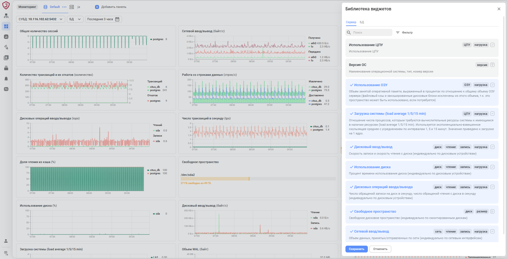{width="7.086805555555555in"
height="3.623611111111111in"}

Рисунок 20.3 -- Окно «Библиотека виджетов»

После сохранения выбора, виджеты можно:

-   изменять размер и адаптировать размер виджета на нестандартный;

-   перемещать по пространству окна.

Компонент запомнит и сохранит их расположение и размер.

Виджет автоматически загрузит данные метрик. В случае их отсутствия на
виджете выводится информация о причине отсутствия данных:

-   Prometheus не вернул данных, так как СУБД не существует в заданном
    периоде или не настроен ни один экспортёр (Prometheus did not return
    data because the DBMS does not exist in the specified period or no
    exporter is configured)

Такое может произойти, если пользователь выбрал СУБД, а затем сменил
период наблюдения на тот, в котором этой СУБД ещё/уже не существовало;
при выборе периода список СУБД инициализируется заново, но выбор
пользователя в отношении СУБД остается):

-   В заданном периоде БД \<datname\> не существует (The database
    \<datname\> does not exist in the specified period)

Такое может произойти, если пользователь выбрал БД, а затем сменил
период наблюдения на тот, в котором этой БД ещё/уже не существовало; при
выборе периода список БД инициализируется заново, но выбор пользователя
в отношении БД остается.

-   Для указанных параметров Prometheus не вернул данных, возможно, не
    настроен \<exporter\_type\>-экспортёр (Prometheus did not return
    data for the specified parameters, perhaps the
    \<exporter\_type\>-exporter is not configured properly)

Нужный для виджета экспортёр может быть не подключен, не
сконфигурирован, не отвечать по каким-то причинам, из-за чего в
Prometheus не сохраняются нужные данные; также может быть, что не
удается выполнить сопоставление адреса экспортера и адреса СУБД,
отсутствуют метрики pg\_static, pg\_server, node\_os\_info.

-   В заданном периоде показатели равны нулю (There are only zero values
    in the specified period)

Все временные ряды были отброшены при подготовке данных, поскольку
содержали только нулевые значения.

Добавление панели виджетов
--------------------------

Помимо имеющейся панели виджетов «Default», существует функциональная
возможность добавления новых панелей через кнопку «Добавить панель».

Панели имеют градацию на:

-   СУБД;

-   Citus;

-   jaDog.

> Визуально отличаются значками.

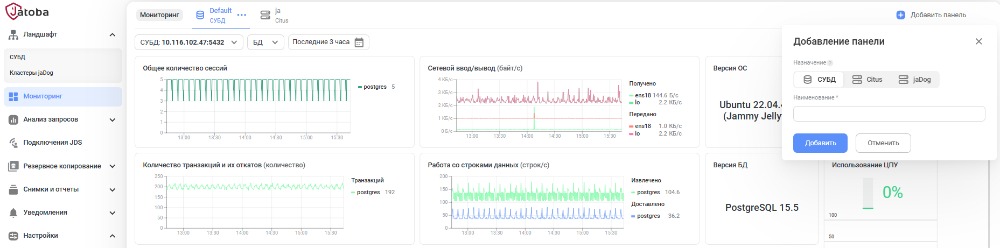{width="7.086805555555555in"
height="1.7590277777777779in"}

Рисунок 20.4 -- Окно добавления панели виджетов

Максимальное количество панелей виджетов, которые доступно добавить, не
более 30.

На узком экране вкладки панелей виджетов автоматически свернуться в
общую вкладку «Другие» в форме выпадающего списка.

Панель виджетов для кластера ja\_Hipe\_Cluster
----------------------------------------------

Воспользоваться панелью виджетов для кластера на основе компонента
«ja\_Hipe\_Cluster» возможно, когда экспортеры и система «Prometheus»
настроена. Описание настройки приведено в документе «Руководство по
настройке. Часть 28. Поддержка мониторинга СУБД».

Набор виджетов для кластера ограничен и приведен в таблице Таблица 20.2

Таблица 20.2 -- Перечень виджетов для ja\_Hipe\_Cluster

| **Тип виджета** | **Виджет**                                       | **Метрика**                     | **Описание**                                                       |
|-----------------|--------------------------------------------------|---------------------------------|--------------------------------------------------------------------|
|                 | Использование сессий узлами                      | Сессии, нагрузка                | общее кол-во сессий на каждом узле кластере с учетом ретроспективы |
| **Сервер**      | Использование диска                              | диск, нагрузка                  |                                                                    |
|                 | Объём шардированных таблиц                       | размер                          |                                                                    |
| **Сервер**      | Использование ЦПУ                                | ЦПУ, нагрузка                   |                                                                    |
| **Сервер**      | Использование ОЗУ                                | ОЗУ, нагрузка                   |                                                                    |
| **БД**          | Число транзакций в секунду                       | нагрузка                        |                                                                    |
| **Сервер**      | Сетевой ввод/вывод                               | сеть, нагрузка                  |                                                                    |
|                 | Количество узлов                                 | Доступность                     |                                                                    |
|                 | Максимальная продолжительность запросов/ожиданий | Сессии, конфликты, длительность |                                                                    |
|                 | Состояние узлов                                  | Доступность                     |                                                                    |
|                 | Общее количество сессий                          | Сессии, нагрузка                | количество сессий к СУБД                                           |

На виджетах отображаются графы для каждого узла кластера.

Легенда виджетов является активной. При нажатии на легенду узла кластера
в виджете контрастно отразится граф только выбранного узла. Остальные
графы изменят контрастность.

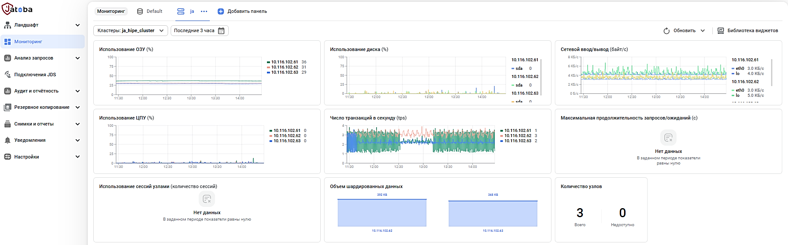{width="7.086805555555555in"
height="2.2118055555555554in"}

Рисунок 20.5 -- Виджеты кластера

Панель виджетов для кластера jaDog
----------------------------------

Воспользоваться панелью виджетов для кластера на основе компонента
«ja\_Hipe\_Cluster» возможно, когда экспортеры и система «Prometheus»
настроена. Описание настройки приведено в документе «Руководство по
настройке. Часть 28. Поддержка мониторинга СУБД».

Доступен единственный виджет «Состояние узлов».

{width="7.0856474190726155in"
height="1.652173009623797in"}

Рисунок 20.6 -- Панель виджетов для кластера jaDog

Уведомления. Информирование о заданном значении показателя
----------------------------------------------------------

Виджеты, отражающие динамические значения, оснащены механизмом
уведомлений. Этот механизм активируется через контекстное меню виджета,
выбором опции «Уведомления».

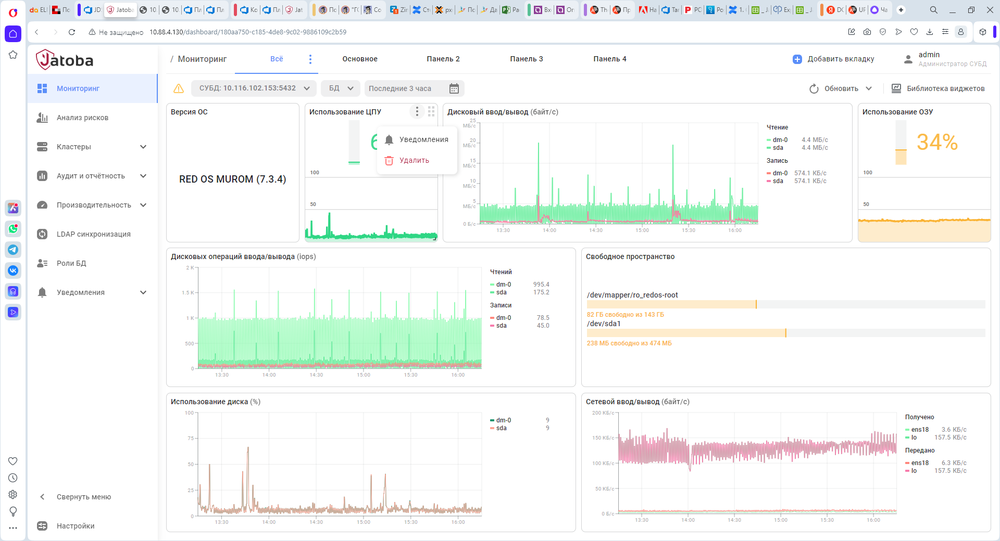{width="2.810521653543307in"
height="1.4260870516185478in"}

Рисунок 20.7 -- Контекстное меню виджета

Выбор данной опции вызовет окно настройки уведомлений.

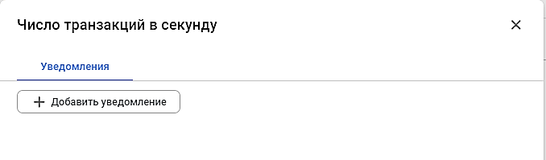{width="3.0259733158355204in"
height="0.8881539807524059in"}

Рисунок 20.8 -- Окно уведомления

Добавление уведомления доступно нажатием на кнопку «+ Добавить
уведомление».

Каждый виджет может быть настроен на несколько уведомлений, для
нескольких объектов контроля и имеет собственные настройки, в которых
устанавливаются пороговые значения по типам условий.

Такая конструкция уведомлений позволяет:

-   устанавливать объекты контроля;

-   создавать условие на любой объект;

-   отслеживать выход метрики за пределы заданного диапазона и наоборот;

-   следить за метриками, которые:

<!-- -->

-   в нормальном состоянии колеблются в определенном \"коридоре\"
    величин;

-   в ненормальном состоянии выходят из «коридора» величин, как в
    большую, так и в меньшую сторону.

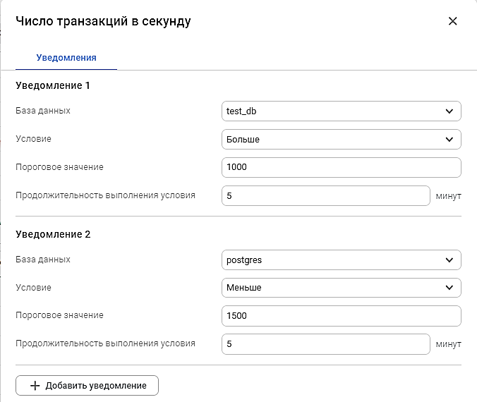{width="3.1578740157480314in"
height="2.662704505686789in"}

Рисунок 20.9 -- Настройка уведомлений для виджета

Уведомления настраиваются пользователями самостоятельно и будут
отправляться на E-mail, указанный в карточке пользователя (см. п 2.1.3).
Также уведомления приходят в Telegram и Zulip. Изменить созданные
уведомления может только создавший их пользователь.

Создать «Уведомления» от имени и с правами пользователя JDS «admin»
невозможно, т.к. у данной учетной записи отсутствует E-mail и не может
быть добавлен.

Раздел «Анализ запросов» (Query analysis)
=========================================

Подраздел «Анализ запросов» предоставляет:

-   отображение визуализации плана запроса средствами Pg-explain;

-   отображение списка планов запросов по нескольким критериям отбора и
    переход по ссылке из выбранного плана запроса на страницу анализа
    плана запроса;

-   возможность ручного ввода плана запроса.

Настройка требуемых компонентов и подключение к JDS описано в документе
«Руководство по настройке. Часть 24. Поддержка мониторинга СУБД в части
анализа запросов».

|                                                         |                                                                                               |
|---------------------------------------------------------|-----------------------------------------------------------------------------------------------|
| {width="0.25in" height="0.25in"} | Подраздел «Анализ запросов» (Query analysis) не поддерживается версией ядра «4» СУБД «Jatoba» |

Вкладка «Запросы»
-----------------

Вкладка «Запросы» отображает планы запросов с некоей большой
длительностью выполнения.

Отображаются поля:

-   Host -- IP-адрес хоста;

-   Наименование хоста -- условное наименование хоста;

-   Всего -- количество отобранных планов запросов из лога pg-monitor;

-   Шаблонов -- значение количества шаблонов и ссылка для перехода к
    списку планов запросов выбранной СУБД;

-   Timeline -- графическое представление распределения запросов по
    времени суток.

По умолчанию отображаются запросы на текущую дату.

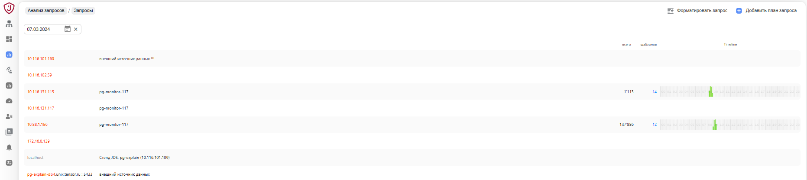{width="7.086805555555555in"
height="1.59375in"}

Рисунок 21.1 -- Вид вкладки «Запросы»

При нажатии на гиперссылку количества шаблонов вкладка «Запросы»
перестроится и отобразит вкладку «по шаблонам».

На вкладке «по шаблонам» отображаются поля:

-   шаблон -- план уникального запроса без учета повторов его
    выполнения;

-   метод;

-   app -- приложение, отправившее запрос;

-   rол-во -- всего повторов выполнения этого запроса;

-   sum, мс -- суммарное время выполнения всех запросов одного шаблона;

-   avg, мс -- среднее время выполнения запроса;

-   buf:mem -- требуемая оперативная память для выполнения запроса;

-   buf:dsk -- требуемое дисковое пространство для выполнения запроса;

-   \% -- доля дисковых ресурсов для выполнения запроса;

-   last -- последнее по времени выполнение запроса -- ссылка для
    перехода к визуализации плана запроса;

-   Timeline -- графическое представление распределения запросов по
    времени суток.

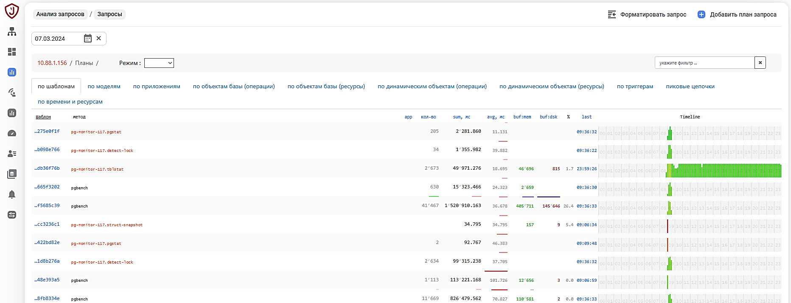{width="7.086805555555555in"
height="2.544553805774278in"}

Рисунок 21.2 -- Вкладка «по шаблонам»

**Визуализация плана запроса**

При клике по конкретному шаблону открывается список запусков запроса по
времени.

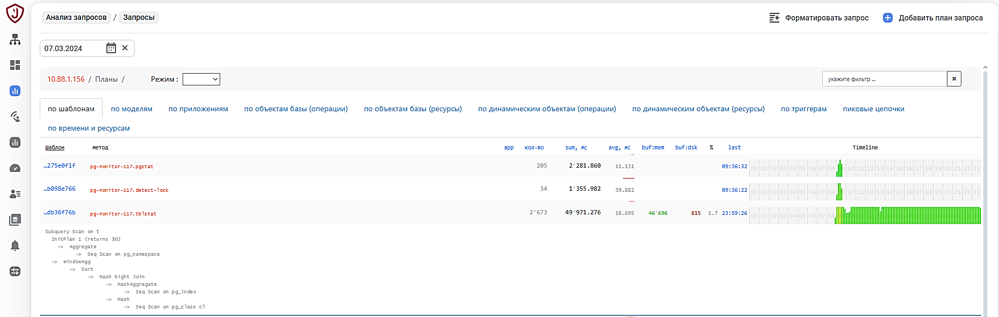{width="7.086805555555555in"
height="2.247916666666667in"}

Рисунок 21.3 - Список запусков запроса по времени

При выборе конкретного запроса из списка планов запросов и нажатию по
значению в поле «last» открываются вкладки визуализации запроса:

-   вкладка «explain»;

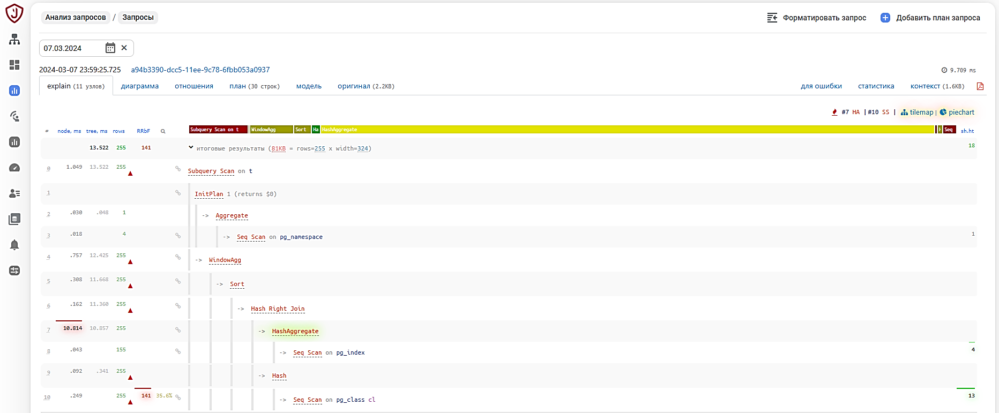{width="7.086805555555555in"
height="2.93125in"}

Рисунок 21.4 -- Визуализация explain по узлам

Визуализированный план запроса возможно экспортировать в PDF-файл через
пиктограмму «Adobe Acrobat».

-   вкладка «диаграмма»;

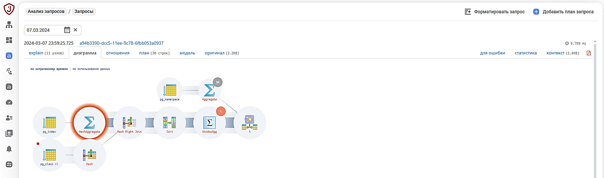{width="7.086805555555555in"
height="2.0930555555555554in"}

Рисунок 21.5 -- Визуализация на вкладке «диаграмма»

-   вкладка «отношения»;

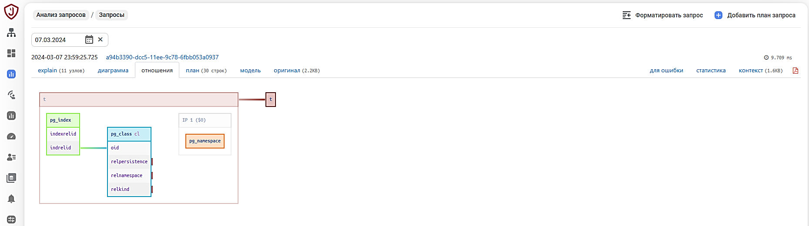{width="7.086805555555555in"
height="1.9902777777777778in"}

Рисунок 21.6 -- Визуализация на вкладке «отношения»

-   вкладка «план»;

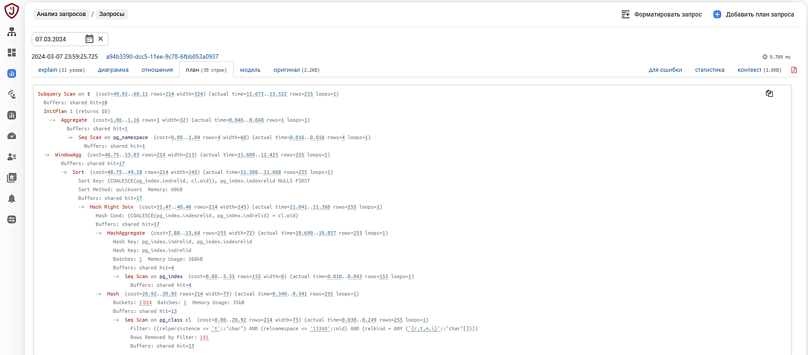{width="7.086805555555555in"
height="3.111111111111111in"}

Рисунок 21.7 -- Визуализация на вкладке «план»

-   вкладка «модель»;

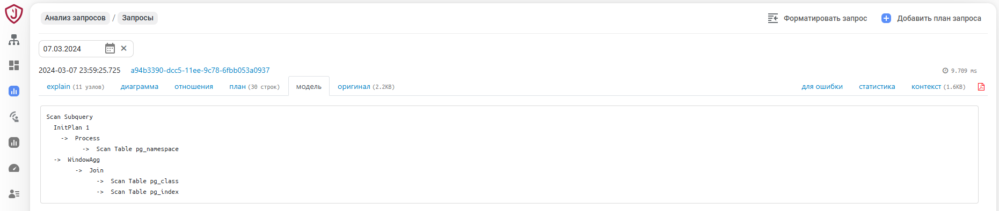{width="7.086805555555555in"
height="1.5006944444444446in"}

Рисунок 21.8 -- Визуализация на вкладке «модель»

-   вкладка «оригинал».

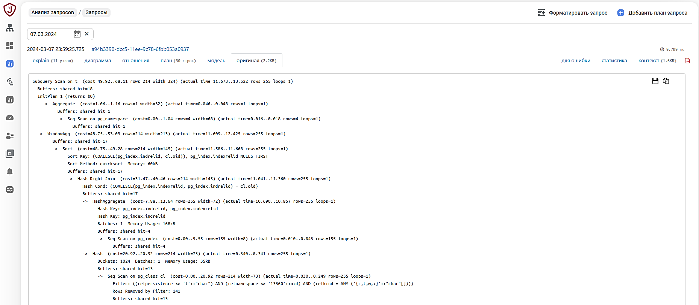{width="7.086805555555555in"
height="3.102777777777778in"}

Рисунок 21.9 -- Визуализация на вкладке «оригинал»

Вкладка «Мегазапросы»
---------------------

Вкладка «Мегазапросы» отображает планы запросов, имеющие хотя бы одну из
особенностей:

-   большой объем возвращаемой выборки;

-   большое количество используемых в запросе параметров;

-   большой размер запроса;

-   большая длительность передачи результатов запроса от сервера.

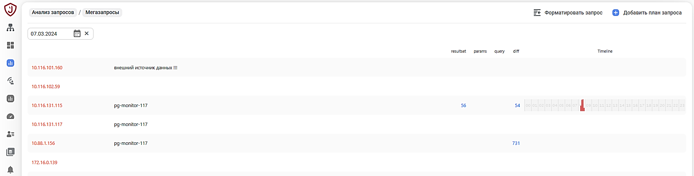{width="7.086805555555555in"
height="1.8069444444444445in"}

Рисунок 21.10 -- Вид вкладки «Мегазапросы»

При выборе вкладки отображается список подключенных СУБД и следующие
поля:

-   «Host» -- IP-адрес хоста;

-   «Наименование хоста» -- условное наименование хоста;

-   «Resultset» -- количество по признаку большого объема возвращаемой
    выборки -- ссылка к списку планов запросов, отфильтрованных по
    выбранному параметру;

-   «Params» -- количество, большое число используемых параметров в
    запросе -- ссылка;

-   «Query» -- количество, большой размер текста запроса -- ссылка;

-   «Diff» -- количество, большая длительность передачи результатов
    запроса от сервера -- ссылка;

-   «Timeline» -- график времени, когда выполнялись запросы.

При нажатии на гиперссылки «Resultset» или «Diff» вкладка «Мегазапросы»
перестроится и отобразит вкладку «по приложениям».

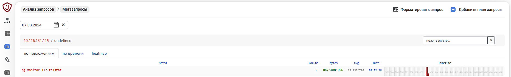{width="7.086805555555555in"
height="1.0770833333333334in"}

Рисунок 21.11 -- Вкладка «по приложениям»

Вкладка «по приложениям» отображает поля:

-   «Приложение» -- приложение отправившее запрос;

-   «Метод» -- метод, используемый в плане для выполнения определенной
    операции;

-   «Кол-во» -- число выполнения запросов;

-   «Duration» -- суммарное время выполнения запросов с учетом передачи
    их результатов от сервера -- фактическое время;

-   «Exectime» -- суммарное время выполнения запросов -- ожидаемое
    время;

-   «Diff» -- разность суммарных фактического и ожидаемого времени -
    суммарное время передачи результата запроса;

-   «+%» -- отношение времени передачи результата запроса к времени
    выполнения запроса, в процентах;

-   «Last» -- время последнего выполнения запроса;

-   «Timeline» -- график времени, когда выполнялись запросы.

Нажатие по значению времени в поле «Last» откроет визуализацию плана
запроса.

В теле вывода визуализации плана запроса присутствует гиперссылка
«перейти к анализу». Нажав на которую, вкладка перестроится и отразит
вкладки визуализации, как было описано выше:

-   вкладка
    «[explain](https://10.116.101.109:8444/archive/explain/e79d9630-dc46-11ee-8b7c-a58085cdfda4:0:2024-03-07#explain)»;

-   вкладка
    «[диаграмма](https://10.116.101.109:8444/archive/explain/e79d9630-dc46-11ee-8b7c-a58085cdfda4:0:2024-03-07#visio)»;

-   вкладка «отношения»;

-   вкладка «план»;

-   вкладка «модель»;

-   вкладка «оригинал».

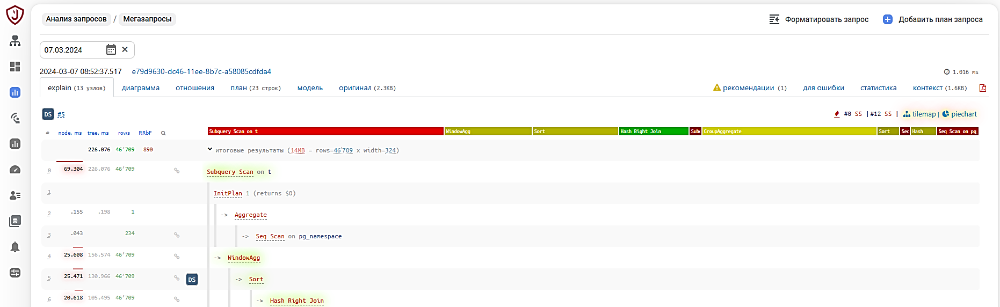{width="7.086805555555555in"
height="2.1770833333333335in"}

Рисунок 21.12 -- Вкладки визуализации запроса.

Вкладка «Блокировки»
--------------------

Вкладка «Блокировки» отображает планы запросов, в результате которых
потребовалось блокировать ресурсы данных. Отображаются поля:

-   «Host» -- IP-адрес хоста;

-   «Наименование хоста» -- условное наименование хоста;

-   «deadlock» -- взаимные блокировки ресурсов, требуемых для двух
    запросов;

-   «lock» -- обычная блокировка ресурсов данных требуемая для
    выполнения конкретного запроса;

-   «Timeline» -- графическое представление распределения запросов по
    времени суток.

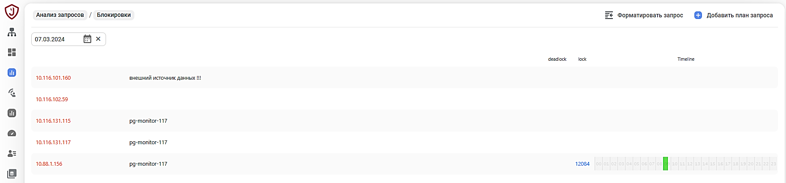{width="7.086805555555555in"
height="1.6527777777777777in"}

Рисунок 21.13 -- Вид вкладки «Блокировки»

Нажатие по значению в поле «lock» открывает агрегированный список
запросов на вкладке «по типам», сгруппированный по типам блокировок, по
приложениям, по времени.

Отображаются поля:

-   «mode» -- тип блокировки ресурса;

-   «type» -- область действия блокировки;

-   «приложение» -- при клике разворачивается список, где дополнительно
    отображается PID и приложение;

-   «объект блокировки» -- объект блокировки;

-   «sum, мс» -- суммарное время выполнения запросов;

-   «кол-во» -- количество запросов в агрегированной строке группы;

-   «last» -- время начала выполнения последнего запроса -- ссылка;

-   «Timeline» -- графическое представление распределения запросов по
    времени суток.

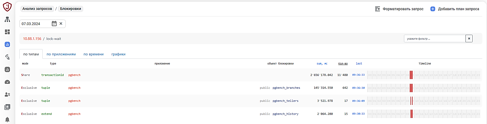{width="7.086805555555555in"
height="1.8097222222222222in"}

Рисунок 21.14 -- Вкладка «по типам»

Кликнув по значению в поле «last» пользователь должен увидеть страницу
анализа плана выполнения запроса, выполнявшегося последним, где можно
найти данные по блокировке.

Далее, выбрав ссылку «Перейти к анализу», можно перейти к блоку
визуализации плана запроса, рядом с которым расположена ссылка.

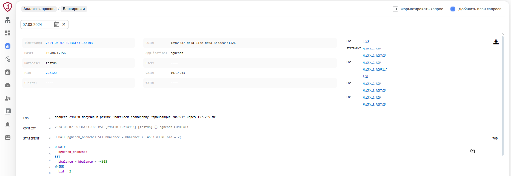{width="7.086805555555555in"
height="2.454861111111111in"}

Рисунок 21.15 -- Вывод анализа плана запроса

На данной странице анализа планов запросов, входящих в шаблон, можно
увидеть информацию о блокировке.

Вкладка «Ошибки»
----------------

Во вкладке «Ошибки» отражаются ошибки на целевых СУБД сортированные по
датам:

-   по хостам (см. п. 21.4.2);

-   по ошибкам (см. п. 21.4.2);

> отображаемых в одноименных ссылках (вкладках).

### Вкладка «по хостам»

Вкладка отображает количество ошибок, с делением по критичности, на всех
хостах.

Во вкладке «по хостам» отображаются столбцы:

-   Host - наименование хоста СУБД;

-   Fatal - высокая критичность ошибки выполнения запроса;

-   Error - обычная критичность ошибки выполнения запроса;

-   Warning - предупреждение о проблеме выполнения запроса;

-   Timeline - графическое представление распределения запросов по
    времени суток

Нажатие на количество ошибок в строке хоста вызовет переход страницу
списка классов ошибок для выбранного хоста.

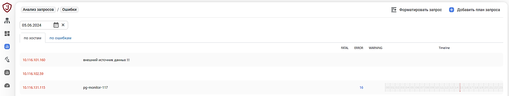{width="7.086805555555555in"
height="1.3520833333333333in"}

Рисунок 21.16 -- Вкладка «по хостам»

**Страница списка классов ошибок для выбранного хоста**

Страница отображает список наименований классов ошибок выполнения
запросов с отображением числа приложений, где встречаются ошибки,
количества случаев каждого класса ошибок и распределением по времени за
выбранные сутки.

На странице отображаются столбцы, описанные в таблице Таблица 21.1.

Таблица 21.1 -- Столбцы страницы списка классов ошибок для выбранного
хоста

| **Поля**                  | **Описание **                                                                                                                                           |
|---------------------------|---------------------------------------------------------------------------------------------------------------------------------------------------------|
| Класс ошибки              | наименование класса ошибок, зарегистрированных на конкретном хосте                                                                                      |
| Методы                    | наименования приложений и методов вызывавших запросы с ошибками (если более 1 приложения,  то список наименований приложений скрыты в свернутую строку) |
| app/arg                   | количество приложений                                                                                                                                   |
| Кол-во                    | количество случаев ошибок конкретного класса                                                                                                            |
| last                      | последнее время выполнения запроса                                                                                                                      |
| Timeline                  | графическое представление распределения запросов по времени суток                                                                                       |

[ ]{.underline}

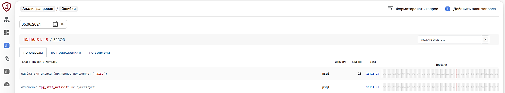{width="7.086805555555555in"
height="1.3138888888888889in"}

Рисунок 21.17 - Страница списка классов ошибок для выбранного хоста

Выбрав класс ошибки и нажав на ее строку развернется список ошибок,
разграниченных по времени.

**Страница описания запроса, выполненного с ошибкой**

Выбрав время выполнение запроса, открывается Страница описания запроса,
выполненного с ошибкой, которая содержит строку краткого описания
ошибки, с указанием критичности ошибки.

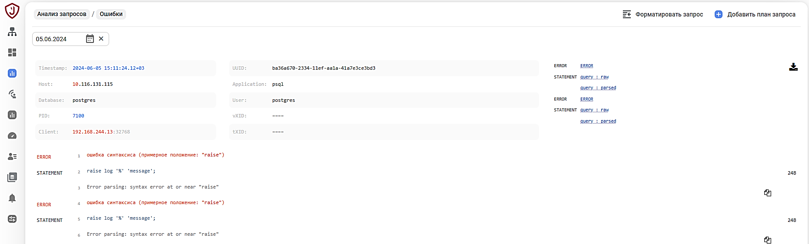{width="7.086805555555555in"
height="2.14375in"}

Рисунок 21.18 - Страница описания запроса, выполненного с ошибкой

Полное описание ошибки показывается при нажатии на ее строку.

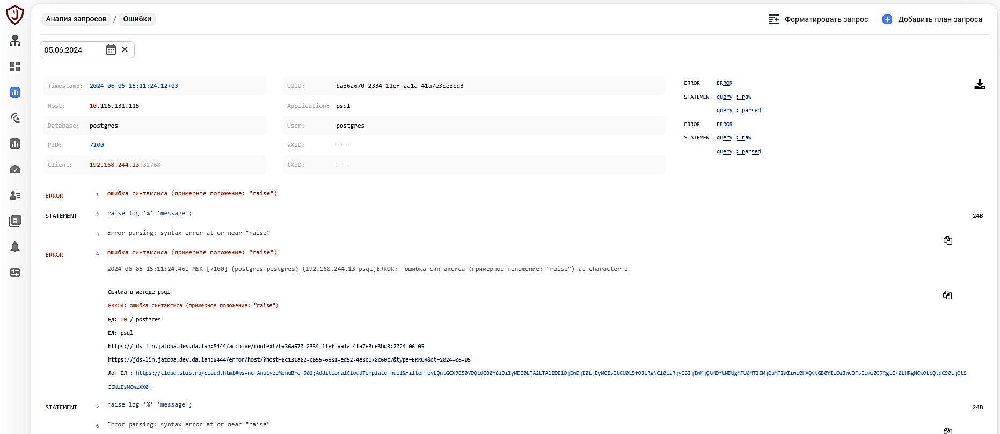{width="7.086805555555555in"
height="3.0770833333333334in"}

Рисунок 21.19 -- Полное описание ошибки

Пиктограмма «Скопировать» копирует в буфер обмена полное описание
ошибки.

### Вкладка «по ошибкам»

Вкладка отображает количество ошибок, без деления по критичности, на
всех хостах.

Во вкладке «по ошибкам» отображаются столбцы:

-   Ошибка - наименование класса ошибки;

-   Количество - количество ошибок конкретного класса;

-   hosts - число хостов, где зарегистрированы ошибки данного класса;

-   last - время последнего выполнения запроса с ошибкой данного класса;

-   Timeline - графическое представление распределения запросов по
    времени суток.

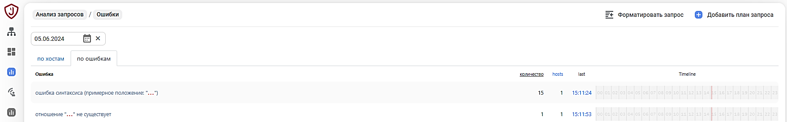{width="7.086805555555555in"
height="1.1041666666666667in"}

Рисунок 21.20 - Вкладка «по ошибкам»

Выбрав и развернув строку выбранного класса ошибки, отобразится список
хостов, где выполнялись запросы с ошибками выбранного класса.

В случае последующего выбора хоста из развернутого списка, компонент
выполнит переход на страницу \"Страница списка классов ошибок для
выбранного хоста\", описанную ранее.

В случае выбора времени последнего выполнения запроса, система выполнит
переход на страницу \"Страница описания запроса, выполненного с
ошибкой\", описанную ранее.

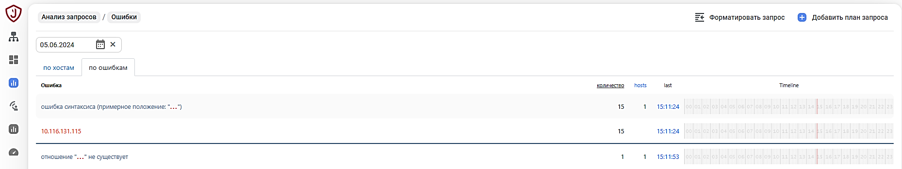{width="7.086805555555555in"
height="1.3381944444444445in"}

Рисунок 21.21 -- Список хостов на которых проявилась ошибка

Вкладка «Статистика»
--------------------

Во вкладке отображается статистическая и аналитическая информация об
объекте мониторинга на основе журнала аудита СУБД. Для чего во вкладке
«Настройки» (см. п. 21.6) устанавливаются дополнительные параметры
журнала аудита СУБД.

Установленная дата календаря отображает статистическую информацию по
полям:

-   Relations - снепшоты состояния таблиц;

-   RU/SA - статистика использования ресурсов;

-   Stats - снепшоты статистики по таблицам;

-   Analyze - события применения команды;

-   Vacuum - события применения команды;

-   Checkpoint - события применения команды;

-   Timelime -- линия времени.

При переходе по кликабельным пиктограммам и значениям открываются
страницы с данными статистики.

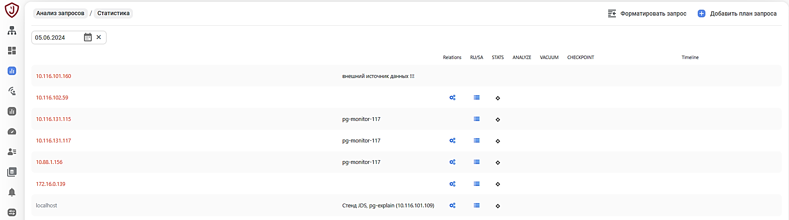{width="7.086805555555555in"
height="1.9902777777777778in"}

Рисунок 21.22 -- Вкладка «Статистика»

Вкладка «Настройки»
-------------------

Настройка подключений описана в документе «Руководство по настройке.
Часть 24. Поддержка мониторинга СУБД в части анализа запросов», в
пунктах:

-   5.1.4. Конфигурирование компонента JDS на отдельном узле;

-   5.2.5. Редактирование параметров компонента JDS.

При настроенном подключении для наблюдаемой СУБД дополнительно
устанавливаются параметры журнала аудита СУБД.

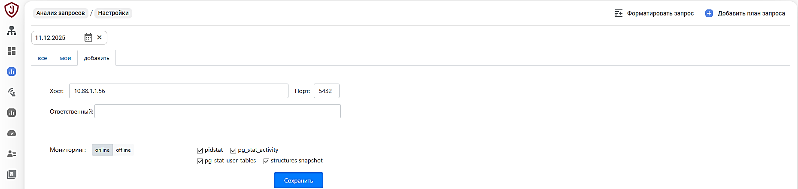{width="7.086805555555555in"
height="1.68125in"}

Рисунок 21.23 -- Дополнительные настройки журнала аудита СУБД

Форматирование запроса
----------------------

Подраздел «Анализ запросов» имеет функциональную возможность
форматирования SQL-запросов.

Нажатие кнопки «Форматировать запрос» вызывает окно с двумя основными
полями «Исходный запрос» и «Форматированный запрос». SQL-запрос
вставляется через буфер обмена. После нажатия кнопки «Форматировать»
система выполняет автоматизированную проверку синтаксиса, форматирование
и раскраску SQL-запроса.

**Например**

Исходный запрос

> INSERT INTO orders (customer\_id, product, price)
>
> SELECT (random() \* 3 + 1)::integer, \'product\', (random() \* 1000 +
> 1)::integer
>
> FROM generate\_series(1, 1000);
>
> Форматированный запрос

**INSERT INTO** orders(

customer\_id

, product

, price

)

**SELECT**

(random() \* 3 + 1)::integer

, \'product\'

, (random() \* 1000 + 1)::integer

**FROM**

generate\_series(1, 1000);

Полученный результат форматирования запроса возможно сохранить через
буфер обмена.

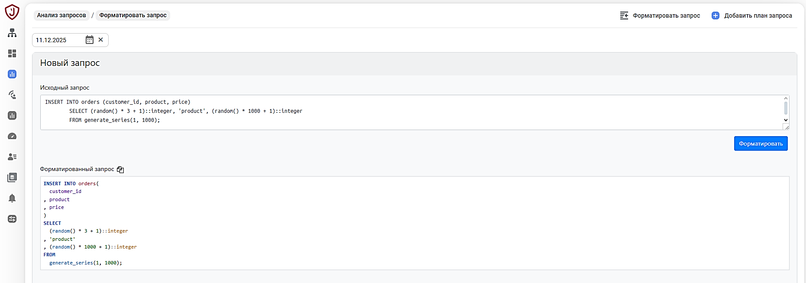{width="7.086805555555555in"
height="2.5006944444444446in"}

Рисунок 21.24 -- Окно «Форматировать запрос»

Добавление плана запроса 
-------------------------

Для визуализации плана выполнения запроса, загружаемого вручную,
необходимо скопировать в буфер обмена текст плана, затем открыть в
боковом меню раздел «Анализ запросов» и нажать кнопку «Добавить план
запроса».

В открытом окне «План запроса для анализа» необходимо вставить текст
плана запроса из буфера в поле ввода, как показано на рисунке Рисунок
21.25. Корректный план запроса автоматически получит подсветку
синтаксиса.

 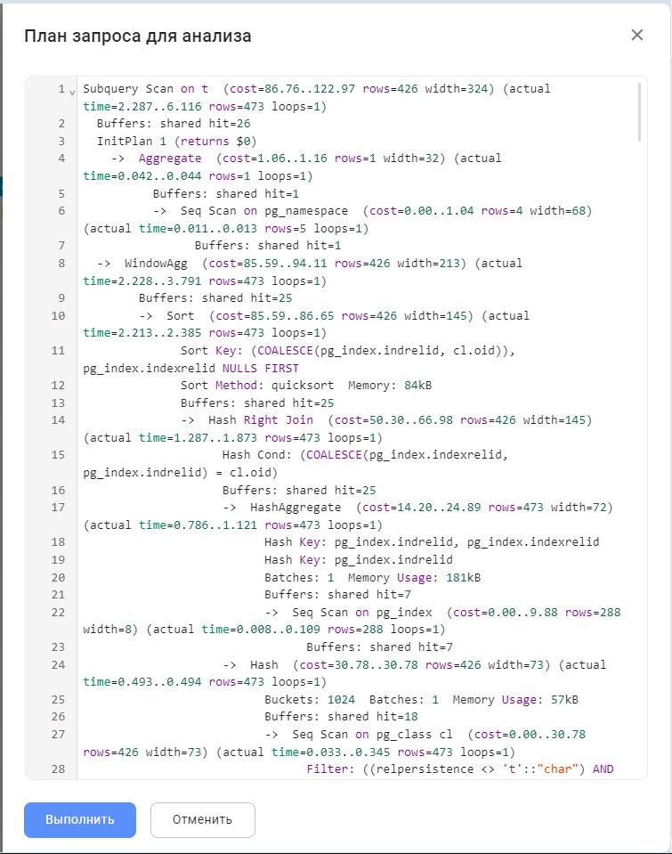{width="2.7057469378827648in"
height="3.463127734033246in"}

Рисунок 21.25 - Окно «План запроса для анализа»

Для выполнения визуализации вставленного текста плана запроса требуется
нажать кнопку «Выполнить».

После начала обработки текста плана запроса, если был вставлен
некорректный (неполный) текст плана запроса или, по ошибке, был вставлен
текст SQL-запроса, то будет отображаться сообщение об ошибке:

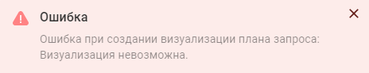{width="4.207547025371828in"
height="0.8342541557305336in"}

Рисунок 21.26 -- Ошибка визуализации плана запроса

Если при обработке текста плана запроса ошибки нет, то одновременно с
открытием страницы визуализации плана выполнения запроса будет
отображаться сообщение:

{width="3.9715277777777778in"
height="0.645259186351706in"}

Рисунок 21.27 -- Сообщение об успешной визуализации плана запроса

Страница визуализации плана запроса состоит из нескольких вкладок,
состав которых зависит от информации, полученной из плана, а также
контекстной информации, относящейся ко времени выполнения запроса, если
такая информация доступна.

 Вкладки страницы визуализации плана запроса:

-   Explain -- отображение форматированного плана выполнения запроса и
    данных по узлам плана;

-   Диаграмма -- диаграмма этапов выполнения плана запроса с выделением
    проблемных узлов;

-   Отношения -- схема отношений таблиц, используемых в запросе, в том
    числе временных;

-   План -- отображение плана запроса с подсветкой синтаксиса;

-   Модель -- упрощенный вид плана запроса, без детализации для узлов
    плана;

-   Оригинал -- исходный вид загруженного плана запроса;

-   Таблицы -- описание используемых таблиц и созданных индексов;

-   Рекомендации -- рекомендация по исправлению проблемы в узле;

-   Для ошибки - готовый текст сообщения для вставки в баг-трекер;

-   Статистика -- список наименований узлов плана выполнения запроса с
    расширенными данными по узлам;

-   Контекст -- сводная информация о запросе и плане его выполнения. 

### Форматированное текстовое представление плана запроса

Страница визуализации плана запроса открывается на вкладке «Explain» -
первой из нескольких доступных вкладок. На странице визуализации всегда
отображаются дата/время загрузки плана и UUID запроса.

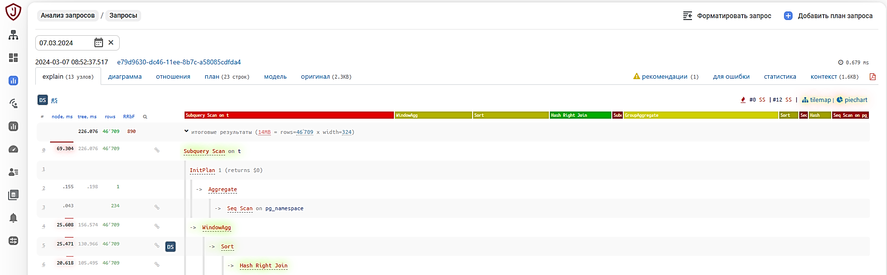{width="7.086805555555555in"
height="2.198611111111111in"}

Рисунок 21.28 -- Текстовое представление плана запроса

|                                                         |                                                                                                                                                                                                                                                                                                |
|---------------------------------------------------------|------------------------------------------------------------------------------------------------------------------------------------------------------------------------------------------------------------------------------------------------------------------------------------------------|
| {width="0.25in" height="0.25in"} | Отображение даты и времени в верхнем левом углу зависят от способа его загрузки. Для плана запроса, загруженного автоматически из журнала контролируемой СУБД -- это время выполнения запроса в БД. Для плана запроса, загруженного вручную -- это время загрузки плана запроса пользователем. |

 Вкладка «Explain» может быть полезна для анализа последовательности
выполнения этапов запроса, представленных в виде дерева пронумерованных
узлов. План запроса отображается в отформатированном виде с отдельными
колонками времени выполнения узлов плана и числом обрабатываемых строк:

-   node, ms -- время исполнения узла, без учета дочерних узлов;

-   tree, ms -- время исполнения узла, включая дочерние узлы;

-   rows -- количество строк, обработанных узлом;

-   RRbF -- количество строк, отброшенных фильтром в запросе.

Просмотр подробных данных каждого узла в развернутом виде возможен при
клике по строке узла, как показано на рисунке Рисунок 21.29.

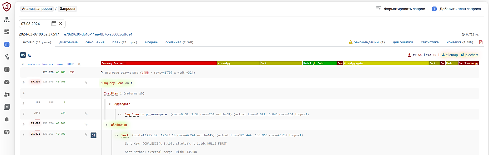{width="7.086805555555555in"
height="2.2645833333333334in"}

Рисунок 21.29 - Просмотр подробных данных узла в развернутом виде

 Для более оперативного ознакомления с данными отдельного узла плана во
всплывающем окне, можно воспользоваться строкой-диаграммой, выбрав один
из узлов.

### Сравнительные диаграммы плана запроса

Если недостаточно текстового представления данных по узлам, то на этой
же вкладке «Explain», можно взвесить узлы плана отдельно по стоимости,
времени выполнения и возвращаемым строкам в графическом виде, нажав
кнопки, «Tilemap» или «Piechart».

Кнопка «Tilemap» -- диаграмма в виде последовательности шестигранников -
тайлов, с выбором всех трех параметров, выделенных на следующем рисунке
стрелкой. Цветом и толщиной линий на диаграмме указан весовой вклад узла
в общую оценку по каждому параметру. Всплывающее окно показывает тот же
набор данных для узла, что и в текстовом представлении плана запроса.
Нажав на тайл можно подсветить узел в текстовом представлении, видимом в
соседнем окне.

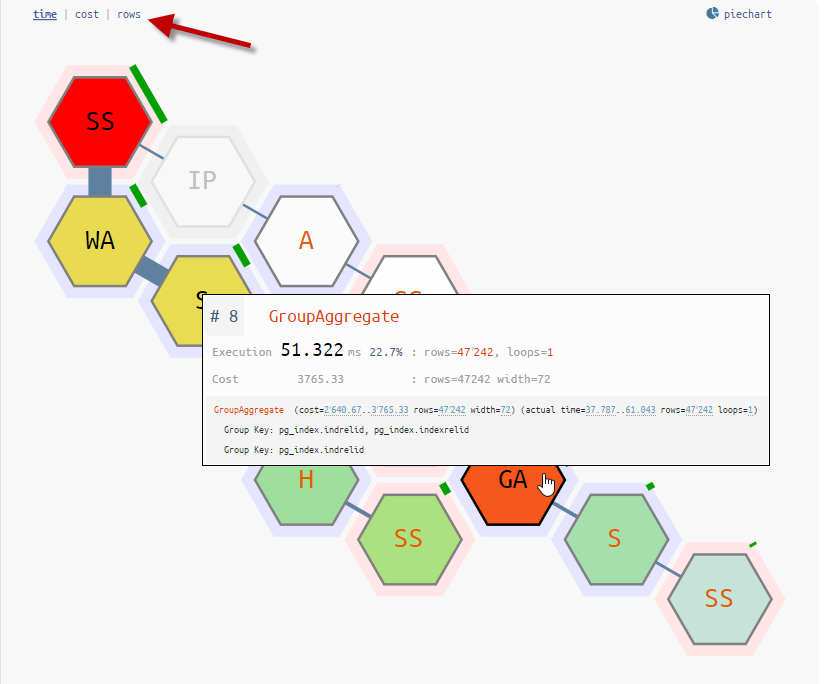{width="3.5279997812773405in"
height="2.9286515748031494in"}

Рисунок 21.30 -- Диаграмма тайтлов

 Кнопка «Piechart» -- круговая диаграмма, только для отображения долями
веса времени каждого из узлов плана в общем времени выполнения запроса.
Здесь последовательность выполнения узлов обозначена слоем (от внешнего
к центральному), а цвета долей совпадают с цветами на строке-диаграмме в
текстовом представлении плана запроса. Всплывающее окно показывает тот
же набор данных для узла, что и в текстовом представлении. Нажав на долю
в диаграмме можно подсветить узел в текстовом представлении, видимом в
соседнем окне.

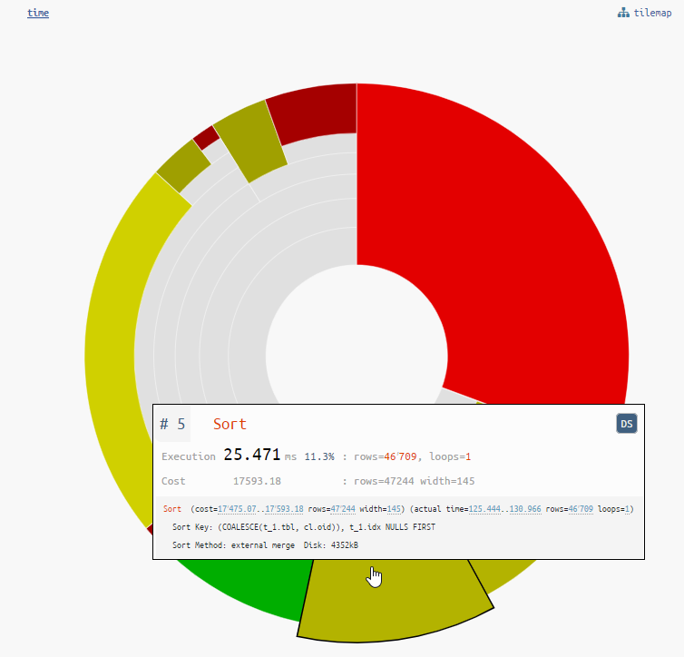{width="3.496000656167979in"
height="3.3570417760279967in"}

Рисунок 21.31 -- Круговая диаграмма 

Независимо от вида представления узла в составе плана запроса,
всплывающая подсказка к узлу содержит в удобном для чтения виде
детальную информацию:

-   \# - номер и наименование узла;

-   Execution -- фактическое время выполнения узла (в ms, без
    учета вложенных узлов), для одного повтора (loops);

-   Loops -- фактическое количество повторных выполнений узла;

-   Процент -- процентное значение фактического времени выполнения узла
    от общего фактического времени выполнения, без учетов всех повторов;

-   Rows (красное значение) -- количество строк, фактически возвращенное
    узлом;

-   Cost -- оценочная стоимость узла в установленных единицах;

-   Rows (серое значение) -- оценочное количество строк, возвращаемых
    узлом;

-   Width -- средний оценочный объем прочитанной строки (в байтах).

### Функциональная диаграмма плана запроса

Если необходимо изучить план запроса целиком, но он сложен и нет желания
вчитываться во всплывающие подсказки на диаграммах, то можно на вкладке
«Диаграмма» посмотреть представление плана запроса в виде
последовательности функциональных пиктограмм -- миниатюрных обозначений
узлов каждого типа.

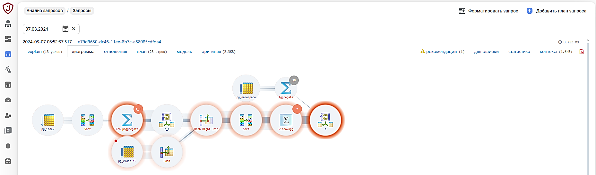{width="7.086805555555555in"
height="2.095138888888889in"}

Рисунок 21.32 -- Функциональная диаграмма

Расположение узлов на этой диаграмме, если смотреть по порядку их
номеров, идет справа налево. «Читать» план запроса нужно по отдельным
ветвям -сверху-вверх и слева-направо. «Прочитав» дочернюю ветвь, нужно
опуститься на следующий уровень и «читать» начиная слева, с начала
ветви.

Нажатие на пиктограмму выбранного узла выполняет переход к этому же
узлу, обозначенному на вкладке «Explain», в форматированном текстовом
представлении. 

### Модель плана запроса

Для агрегирования информации о планах запросов, выполняемых многократно,
но с разными временем и объемами выбираемых данных, используют очищенную
форму плана запроса - шаблон плана запроса. О шаблонах планов запросов
будет рассказано в разделе «Анализ длительности выполнения запроса к
БД».

На вкладке «Модель» можно увидеть еще более очищенную форму плана
запроса, называемую моделью плана запроса.

Модель плана запроса -- это агрегированная форма для объединения
нескольких планов запросов, выполнявшихся над одними и теми же объектами
БД, но разными способами. В модели плана запроса обобщенная структура
агрегированных планов: объединены разные операции над таблицами,
операция объединения данных из таблиц представлена один раз с указанием
всех используемых таблиц, все узлы сортировки, группировки и
уникализации данных собраны в один узел.

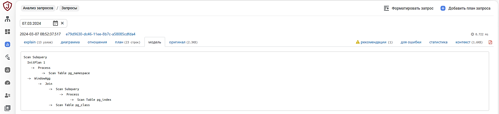{width="7.086805555555555in"
height="1.632638888888889in"}

Рисунок 21.33 -- Модель плана запроса

Таким образом получаем компактный алгоритм использования объектов БД в
запросе.

### Диаграмма отношений таблиц

Для лучшего понимания состава используемых запросом объектов БД, можно
посмотреть диаграмму отношений таблиц, расположенную на вкладке
«Отношения». Цвета блоков совпадают с цветами на строке-диаграмме в
текстовом представлении плана запроса. Всплывающее окно показывает тот
же набор данных для узла, что и в текстовом представлении.  Нажатие
на блок узла обеспечивает контекстный переход к этому узлу в текстовом
форматированном представлении, на вкладке «Explain».

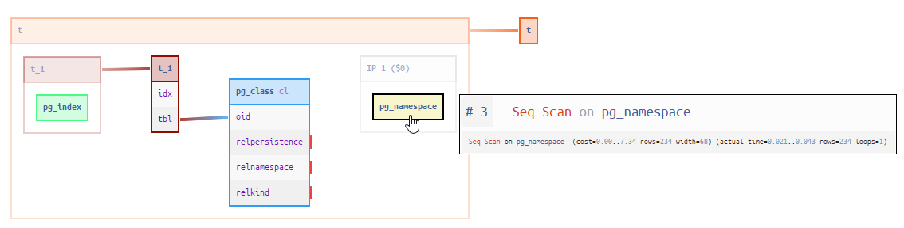{width="7.086805555555555in"
height="1.7998020559930008in"}

Рисунок 21.34 -- Диаграмма отношения таблиц

|                                                         |                                                                                                     |
|---------------------------------------------------------|-----------------------------------------------------------------------------------------------------|
| {width="0.25in" height="0.25in"} | Использование таблиц в узлах плана запроса, в виде списка, можно посмотреть на вкладке «Статистика» |

### Автоматические рекомендации по повышению качества запросов

В некоторых типовых случаях, при достаточном наборе данных, компонент
JDS может предложить рекомендацию, для повышения производительности
запроса в конкретном узле плана выполнения запроса. Такие рекомендации
не являются обязательными. Они обозначаются особыми пиктограммами на
диаграммах и в списках узлов, как например рекомендация на рисунке
Рисунок 21.35 - увеличить выделение оперативной памяти для обработки
большого количества записей, с целью снижения нагрузки на дисковое
хранилище.

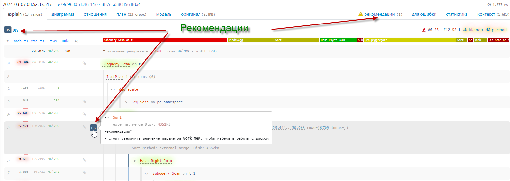{width="7.086805555555555in"
height="2.5277132545931758in"}

Рисунок 21.35 -- Рекомендации по плану запроса

Рекомендации JDS могут содержать предложения:

-   Выполнить ANALYZE, в случае если запросы, попавшие в журнал, не
    содержат планы выполнения;

-   Выполнить VACUUM, если таблицы, используемые в запросах слишком
    разрежены;

-   Создать индекс, если сортировка в запросе занимает много времени;

-   Расширить используемый индекс, например, полями сортировки, если при
    выборке единственной записи перебирается много строк;

-   Добавить составной индекс, если выполняется последовательное
    сканирование по нескольким индексам;

-   Уточнить условие отбора по WHERE, если фильтр отбрасывает слишком
    много строк, из прочитанного. 

|                                                         |                                                                                                                                                                                                                                                                                                                                                                                                    |
|---------------------------------------------------------|----------------------------------------------------------------------------------------------------------------------------------------------------------------------------------------------------------------------------------------------------------------------------------------------------------------------------------------------------------------------------------------------------|
| {width="0.25in" height="0.25in"} | В случае если план запроса содержит несколько рекомендаций, то все рекомендации удобнее просмотреть на вкладке «Рекомендации», как было показано на рисунке выше. Число рядом с наименованием вкладки -- число рекомендаций. На странице списка рекомендаций, нажатие на номер узла обеспечивает контекстный переход к этому узлу в форматированном текстовом представлении, на вкладке «Explain». |

Подраздел «Подключения JDS» (JDS connections)
=============================================

Вкладка «Подключения JDS» отображает количество подключений к компоненту
пользовательского веб-интерфейса для администраторов «Jatoba data safe»,
позволяя выполнить меру безопасности, установленную Приказом № 17 ФСТЭК
России:

[Мера защиты УПД.9 (3) в части следующих требований:]{.underline}

-   контроль и отображение администратору числа активных параллельных
    (одновременных) сеансов (сессий) для каждой учетной записи
    пользователей.

После выбора цели отображаются столбцы:

-   «Пользователь»;

-   «Тип»:

<!-- -->

-   JDS (подключение к компоненту);

-   БД (подключение к служебной БД компонента);

<!-- -->

-   «Количество подключений»;

-   «Лимит подключений».

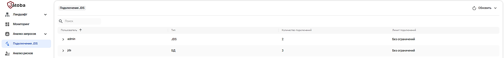{width="7.086805555555555in"
height="0.8166666666666667in"}

Рисунок 22.1 -- Подраздел «Подключения JDS»

Лимит подключений для пользователей JDS устанавливается в карточке
пользователя (см. п. 2.1.3).

Подключения от имени пользователя выполнено в виде раскрывающего списка,
в котором отображаются:

-   «Адрес подключения»;

-   «Приложение» -- версия приложения JDS, версия интернет браузера и
    версия ОС;

-   «Время до отключения, чч:мм».

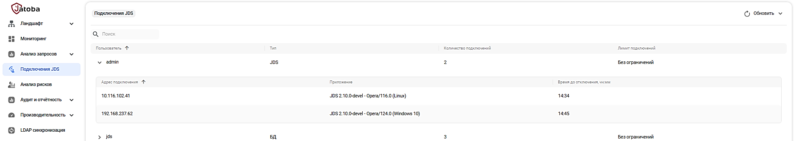{width="7.086805555555555in"
height="1.2652777777777777in"}

Рисунок 22.2 -- Отображение дополнительной информации о подключении
пользователя JDS

Раздел «Резервное копирование» (Backup)
=======================================

|                                                         |                                                                                                                                                         |
|---------------------------------------------------------|---------------------------------------------------------------------------------------------------------------------------------------------------------|
| {width="0.25in" height="0.25in"} | Раздел «Резервное копирование» не доступен целевой СУБД «Jatoba» с версией ядра «18», т.к. компонент «pg\_ProBackup» в данной версии не поддерживается. |

Функционирование раздела обеспечивается следующими условиями:

-   Настройка целевого хоста и непосредственно SSH-соединения (см.
    документ «Руководство по безопасности»);

-   Установлены пакеты компонента pg\_ProBackup (см. документ
    «Руководство по установке»):

<!-- -->

-   jatoba\<ver\>-pg-probackup;

-   jatoba\<ver\>-ptrack.

Для активации компонента ptrack в СУБД «Jatoba» на целевом хосте, в
разделе «Ландшафт» через «Параметры СУБД» изменить конфигурационный файл
«postgresql.conf», прописав следующие строки:

> shared\_preload\_libraries=\'ptrack\'

Расширение ptrack устанавливается в порядке, описанном в разделе 16.

Должен быть создан каталог хранения резервных копий, а также для
внешнего каталога (по необходимости) и на него установлены права
командой:

> chown -R postgres /backup\_dir(директория резервного копирования)

Настройки для ProBackUp 
------------------------

Первоначальная настройка целевой СУБД выполняется в разделе «Резервные
копии».

В разделе устанавливаются параметры, приведенные в таблице Таблица 23.1.

Таблица 23.1 -- Требуемые параметры для настройки для probackup

<table>
<thead>
<tr class="header">
<th><strong>Параметр</strong></th>
<th><strong>Значение</strong></th>
<th><strong>Примечание </strong></th>
</tr>
</thead>
<tbody>
<tr class="odd">
<td><strong>Хост</strong></td>
<td>IP</td>
<td>Значение присвоится автоматически</td>
</tr>
<tr class="even">
<td><strong>Порт</strong></td>
<td>5433</td>
<td>Значение по умолчанию</td>
</tr>
<tr class="odd">
<td><strong>СУБД</strong></td>
<td>jatoba-&lt;ver&gt;</td>
<td>Значение присвоится автоматически</td>
</tr>
<tr class="even">
<td><strong>Роль для резервного копирования</strong></td>
<td>postgres</td>
<td>Значение по умолчанию</td>
</tr>
<tr class="odd">
<td><strong>БД для подключения</strong></td>
<td>Имя БД</td>
<td>Значение устанавливается из выпадающего списка</td>
</tr>
<tr class="even">
<td><strong>Архивный режим</strong></td>
<td>on/always</td>
<td></td>
</tr>
<tr class="odd">
<td><strong>Уровень WAL</strong></td>
<td>logical/replication</td>
<td></td>
</tr>
<tr class="even">
<td><strong>Количество подключений</strong></td>
<td>1</td>
<td>
Значение по умолчанию «1».

При работе СУБД в кластере параметр «max_wal_senders» рекомендуется увеличить в диапазоне от 2 до 10.
</td>
</tr>
<tr class="odd">
<td><strong>Проверка контрольных сумм</strong></td>
<td>чек бокс</td>
<td></td>
</tr>
<tr class="even">
<td><strong>PTRACK</strong></td>
<td>тумблер</td>
<td></td>
</tr>
</tbody>
</table>

Вкладка «Хранилища»
-------------------

Во вкладке «Хранилища» раздела «Ландшафт» настраивается хранилища, в
котором и будут храниться резервные копии СУБД.

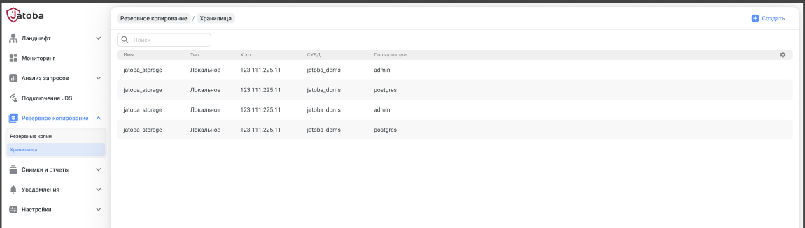{width="7.062436570428696in"
height="1.9902777777777778in"}

Рисунок 23.1 -- Хранилища

Во вкладке устанавливаются параметры, приведенные в таблице Таблица
23.2.

Таблица 23.2 -- Требуемые параметры для хранилища резервных копий

<table>
<thead>
<tr class="header">
<th><strong>Параметр</strong></th>
<th><strong>Значение</strong></th>
<th><strong>Примечание </strong></th>
<th></th>
</tr>
</thead>
<tbody>
<tr class="odd">
<td><strong>Тип</strong></td>
<td>Локальное</td>
<td></td>
<td></td>
</tr>
<tr class="even">
<td><strong>Имя</strong></td>
<td>-</td>
<td>Имя хранилища</td>
<td></td>
</tr>
<tr class="odd">
<td><strong>Путь к папке для резервных копий</strong></td>
<td>-</td>
<td>Каталог, в котором инициализируется хранилище</td>
<td></td>
</tr>
<tr class="even">
<td></td>
<td></td>
<td></td>
<td>Каталог будет создан автоматически, но требуется проверка установленных прав</td>
</tr>
<tr class="odd">
<td><strong>Хост</strong></td>
<td>IP</td>
<td>
Имя или IP хоста.

Значение выбирается из выпадающего списка из раздела «Ландшафт»
</td>
<td></td>
</tr>
<tr class="even">
<td><strong>СУБД</strong></td>
<td>-</td>
<td>
Имя резервируемой СУБД.

Значение выбирается из выпадающего списка из раздела «Ландшафт»
</td>
<td></td>
</tr>
<tr class="odd">
<td><strong>Путь к папке data</strong></td>
<td>/var/lib/jatoba/&lt;ver&gt;/data</td>
<td>Целевой каталог СУБД</td>
<td></td>
</tr>
<tr class="even">
<td><strong>Пользователь</strong></td>
<td>postgres</td>
<td>Имя администратора СУБД</td>
<td></td>
</tr>
<tr class="odd">
<td><strong>Пользователь backup</strong></td>
<td>postgres</td>
<td>Имя учетной записи для подключения к утилите</td>
<td></td>
</tr>
<tr class="even">
<td><strong>Внешний каталог</strong></td>
<td>-</td>
<td>Путь к каталогу хранения резервных копий</td>
<td></td>
</tr>
<tr class="odd">
<td><strong>Полных резервных копий</strong></td>
<td>
0-10

По умолчанию – 0
</td>
<td>Параметр определяет политику хранения полных резервных копий.</td>
<td></td>
</tr>
<tr class="even">
<td><strong>Срок хранения</strong></td>
<td>0-30</td>
<td>
Срок актуальности резервных копий в хранилище.

Максимальное значение - 30 дней
</td>
<td></td>
</tr>
<tr class="odd">
<td><strong>Копий для восстановления</strong></td>
<td>Максимальное</td>
<td>Параметр определяет политику хранения (актуальности) копий для восстановления СУБД на момент времени в хранилище.</td>
<td></td>
</tr>
<tr class="even">
<td><strong>Тайм-аут архивации 
(сек)</strong></td>
<td>300</td>
<td>
Параметр определяет переключение сервера на новы сегмент WAL по истечении указанного периода времени

Максимальное значение – 3600 сек.
</td>
<td></td>
</tr>
<tr class="odd">
<td><strong>Сжатие</strong></td>
<td>Тумблер</td>
<td>zlib, pglz</td>
<td></td>
</tr>
<tr class="even">
<td><strong>Уровень сжатия</strong></td>
<td>1</td>
<td>Максимальное значение -9</td>
<td></td>
</tr>
<tr class="odd">
<td><strong>Каталог журналов</strong></td>
<td>-</td>
<td>Директория хранения журналов. По умолчанию &lt;директория хранилища&gt;/log</td>
<td></td>
</tr>
<tr class="even">
<td><strong>Имя журнала</strong></td>
<td>pg_probackup.log</td>
<td></td>
<td></td>
</tr>
<tr class="odd">
<td><strong>Размер журнал</strong></td>
<td>Числовое значение в КБ/ МБ/ ГБ</td>
<td>Максимальный размер журнала - 1 ГБ</td>
<td></td>
</tr>
<tr class="even">
<td><strong>Время хранения</strong></td>
<td>Числовое значение в Миллисекунды/ Секунды/ Минуты / Часы/ Дни</td>
<td>Параметр определяет срок актуальности файла журнала</td>
<td></td>
</tr>
</tbody>
</table>

Параметр «Внешний каталог» должен отличаться от «Путь к папке для
резервных копий», т.к. при восстановлении произойдет конфликт обработки
и СУБД не сможет быть восстановлена.

Учетная запись postgres должна иметь права доступа к директории, которая
является параметром «Внешний каталог».

Поддерживается несколько хранилищ резервных копий, параметры которых
возможно редактировать.

Вкладка «Резервные копии»
-------------------------

После вышеописанных действий возможно перейти к созданию резервных
копий.

Первая резервная копия СУБД должна быть выполнена по типу резервирования
«FULL» в режиме резервирования «ARCHIVE».

|                                                                                     |                                                                                                     |
|-------------------------------------------------------------------------------------|-----------------------------------------------------------------------------------------------------|
| {width="0.2513888888888889in" height="0.2513888888888889in"} | Перед первой полной архивацией СУБД в обязательном порядке требуется перезагрузка СУБД перезагрузка |

Нажатие кнопки «Создать» вызывает вкладку «Создание резервной копии».

Во вкладке устанавливаются параметры, приведенные в таблице Таблица
23.3.

Таблица 23.3 -- Требуемые параметры для создания резервной копии

<table>
<thead>
<tr class="header">
<th><strong>Параметр</strong></th>
<th><strong>Значение</strong></th>
<th><strong>Примечание </strong></th>
</tr>
</thead>
<tbody>
<tr class="odd">
<td><strong>СУБД</strong></td>
<td>jatoba-&lt;ver&gt;</td>
<td>Значение присвоится выбором из выпадающего списка.</td>
</tr>
<tr class="even">
<td><strong>Хранилище резервных копий</strong></td>
<td>-</td>
<td>Хранилище выбирается из выпадающего списка</td>
</tr>
<tr class="odd">
<td><strong>Тип резервирования</strong></td>
<td>FULL/ DELTA /PAGE /PTRACK</td>
<td></td>
</tr>
<tr class="even">
<td><strong>Режим резервирования</strong></td>
<td>ARCHIVE /STREAM</td>
<td></td>
</tr>
<tr class="odd">
<td><strong>Пароль пользователя postgres</strong></td>
<td>-</td>
<td>Пароль вводится в ручную и не храниться.</td>
</tr>
<tr class="even">
<td><strong>Внешний каталог</strong></td>
<td></td>
<td>Не обязательный параметр</td>
</tr>
<tr class="odd">
<td><strong>Сжатие</strong></td>
<td>тумблер</td>
<td>Включение отключение сжатия резервных копий. 
Не обязательное значение</td>
</tr>
</tbody>
</table>

При создании резервной копии с указанием внешнего каталога, отличного от
предустановленного при конфигурировании хранилища, рекомендуется указать
также параметры сжатия. В ином случае, в резервную копию попадет
каталог, который был предустановлен ранее.

Созданные резервные копии отразятся в общем списке.

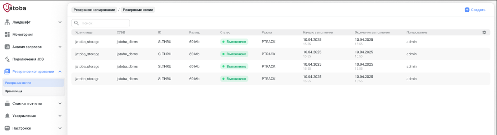{width="7.086805555555555in"
height="1.9340277777777777in"}

Рисунок 23.2 -- Список резервных копий

В случае возникновения ошибки c созданием резервных копий, выполните
действия описанные в п.п. 27.14 настоящего документа.

Для каждой созданной резервной копии в ее строке будет отражаться
пиктограмма отчета о выполненном резервном копировании, вне зависимости
от результатов.

Восстановление резервной копии
------------------------------

Имея список резервных копий, доступно выполнить восстановление СУБД.
Пользователь компонента с правами администратора во вкладке «Резервные
копии» выполняет следующие действия:

-   Выбирает резервную копию;

-   Вызывает контекстное меню и выбирает пункт \"Восстановить\".

Будет вызвано информационное окно восстановления.

В зависимости от типа резервной копии возможны два основных варианта
восстановления:

1)  Если выбрана копия типа «FULL»: 

-   СУБД останавливается; 

-   Целевая директория СУБД «data» - удаляется;

-   После запускается процесс восстановления;

-   По завершении восстановления СУБД запускается.

2)  Если выбрана копия типа «DELTA», «PTRACK» или «PAGE»:

-   СУБД останавливается;

-   Запускается режим инкрементального восстановления;

-   По завершении восстановления СУБД запускается.

В случае восстановления СУБД относительно копии, снятой с другой СУБД -
восстановление по копиям в режиме «DELTA», «PTRACK» или «PAGE»
завершится с ошибкой, т.к. не будут совпадать контрольные суммы файлов в
копии и в целевой папке СУБД «data».

В таком случае, восстановление должно производиться из резервной копии
типа «FULL», с зачисткой целевой папки СУБД «data».

Раздел «Снимки и отчеты» (Snapshots & Reports)
==============================================

Раздел «Снимки и отчеты» предназначен для создания снимков состояния БД
(Snapshots) и получения отчетов. Создавать снимки и получать отчеты
возможно через иерархическую структуру виртуальных серверов. Полученные
данные будут храниться в служебной БД компонента.

Перечень отчетов полностью описан в документе «Руководство по настройке.
Часть 6. Руководство по настройке анализа производительности СУБД»
Компонент «pg\_Profile». 643.72410666.00067-08 98-01-06».

|                                                         |                                                                                                                                                                                                        |
|---------------------------------------------------------|--------------------------------------------------------------------------------------------------------------------------------------------------------------------------------------------------------|
| {width="0.25in" height="0.25in"} | Расширение pg\_profile, установленное средствами раздела «Ландшафт», автоматически появится в разделе «Снимки и отчеты» (Snapshots & Reports) (см. п.п. 16 Раздел «Ландшафт». БД. Вкладка «Расширения» |

В случае когда виртуальный сервер local был создан автоматически при
установке расширения pg\_stat\_statements обязательно требуется в
разделе «Ландшафт» через «Параметры СУБД» изменить конфигурационный файл
postgresql.conf и добавить строку:

> shared\_preload\_libraries = \'pg\_stat\_statements\'

И применить внесенные изменения перезагрузкой СУБД.

Для нового сервера запись в конфигурационном файле делается
автоматически.

Вкладка «Снимки» (Snapshots)
----------------------------

Во вкладке «Снимки» отображаются хранимые снимки состояния БД.
Выбирается один, несколько или все сервера. Компонент автоматически
предложит выбрать хосты, на которых установлено расширение
«pg\_profile».

Новый снимок создаётся через кнопку «Создать». После чего откроется окно
«Создание снимка», в котором выбирается виртуальный сервер и доступно
установить чекбокс «Добавить данные о размерах». При нажатии кнопки
«Сохранить» снимок будет создан.

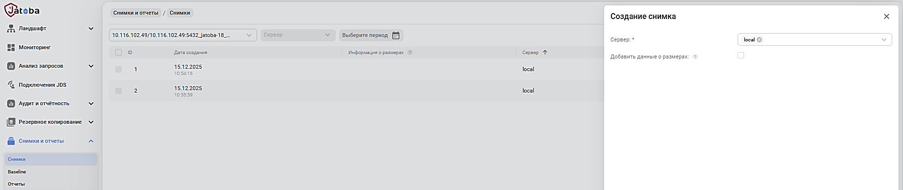{width="7.086805555555555in"
height="1.5020833333333334in"}

Рисунок 24.1 - Создание «Снимка»

Далее созданный снапшот (снимок) будет храниться в служебной БД.

Последний снимок с данными удалить невозможно.

Если снимок был создан не средствами подраздела, а вручную, то при
открытии вкладка «Снимки» она синхронизируется под внесенные изменения.

Во вкладке по кнопке в форме троеточия, расположенной в правом верхнем
углу доступны операции экспорта/импорта снимков. При нажатии кнопки
«Экспортировать» открывается окно «Экспорт», в котором следует выбрать:

-   Сервер;

-   Начальный снимок;

-   Конечный снимок.

После нажатия кнопки «Экспортировать» сформируется файл export.csv.

{width="3.0205172790901136in"
height="1.5649945319335083in"}

Рисунок 24.2 -- Экспорт снимков

При нажатии кнопки «Импортировать» открывается окно «Импорт».
Импортируются снимки в формате файлов \*.csv максимального размера 28
МБ.

Импорт снимков выполняется, выбором файла либо перетаскиванием в поле
«Файл».

Вкладка «Baseline» 
-------------------

Baseline -- именованная последовательность снапшотов, которая имеет
отдельную от настроенной политику хранения. Можно задать определенное
время хранения в днях. Также можно создать последовательность снапшотов
только для определенного периода времени.

Во вкладке доступно создание:

-   Baseline по снимкам;

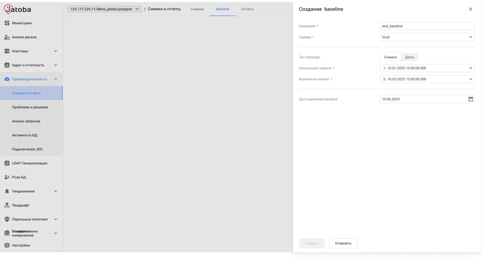{width="2.832088801399825in"
height="1.5277777777777777in"}

Рисунок 24.3 -- Создание baseline по снимкам

-   Baseline по датам.

Созданные Baseline отобразятся в списке и далее могут использоваться в
формировании отчетов.

Вкладка «Отчеты» (Reports)
--------------------------

Во вкладке «Отчеты» доступно создавать или просматривать ранее созданные
отчеты.

Нажатие кнопки «Создать» вызывает окно «Создание отчета», в котором
устанавливаются параметры отчета.

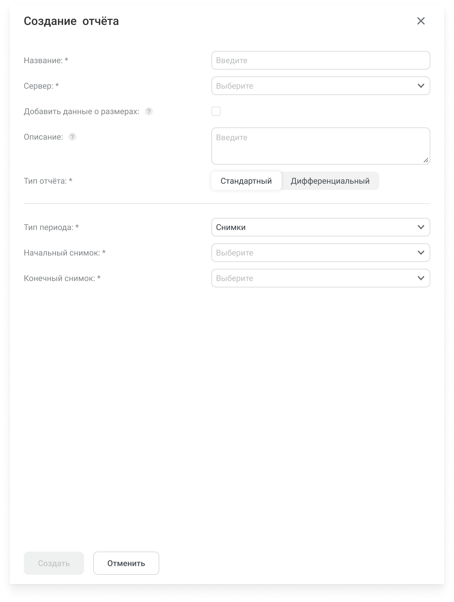{width="2.6902777777777778in"
height="1.7777777777777777in"}

Рисунок 24.4 -- Окно «Создание отчета»

Отчеты в компоненте бывают 2-х видов:

-   стандартные отчеты;

-   дифференциальные отчеты.

Стандартные отчеты содержат статистическую информацию для определенного
периода времени.

Дифференциальные отчеты содержат статистическую информацию за два
выбранных периода, позволяя легко сравнить показатели.

Параметры формируемых отчетов приведены в таблице Таблица 24.1

Таблица 24.1 -- Параметры отчетов

| **Тип отчёта**       | **Тип периода**         | **Первый параметр**  | **Второй параметр**  |
|----------------------|-------------------------|----------------------|----------------------|
| **Стандартный**      |                         |                      |                      |
|                      | **Снимки **             | Начальный снимок: \* | Конечный снимок: \*  |
|                      | **Даты**                | Начальная дата \*    | Конечная дата \*     |
|                      | **Baseline**            | Baseline: \*         |                      |
| **Дифференциальный** |                         |                      |                      |
|                      | **Снимки - Снимки**     | **Интервал 1**       | **Интервал 2**       |
|                      |                         | Начальный снимок: \* | Начальный снимок: \* |
|                      |                         | Конечный снимок: \*  | Конечный снимок: \*  |
|                      | **Даты - Даты**         | **Интервал 1**       | **Интервал 2**       |
|                      |                         | Начальная дата \*    | Начальная дата \*    |
|                      |                         | Конечная дата \*     | Конечная дата \*     |
|                      | **Baseline - Baseline** | **Интервал 1**       | **Интервал 2**       |
|                      |                         | Baseline: \*         | Baseline: \*         |
|                      | **Даты -Baseline**      | **Интервал 1**       | **Интервал 2**       |
|                      |                         | Начальная дата \*    | Baseline: \*         |
|                      |                         | Конечная дата \*     |                      |
|                      | **Baseline - Даты**     | **Интервал 1**       | **Интервал 2**       |
|                      |                         | Baseline: \*         | Начальная дата \*    |
|                      |                         |                      | Конечная дата \*     |
|                      | **Baseline - Снимки**   | **Интервал 1**       | **Интервал 2**       |
|                      |                         | Baseline: \*         | Начальный снимок: \* |
|                      |                         |                      | Конечный снимок: \*  |
|                      | **Снимки - Baseline**   | **Интервал 1**       | **Интервал 2**       |
|                      |                         | Начальный снимок: \* | Baseline: \*         |
|                      |                         | Конечный снимок: \*  |                      |

Сформированные отчеты отразятся списком во вкладке «Отчеты», которые
возможно просмотреть, скачать или удалить.

Отчет скачивается в формате \*.html

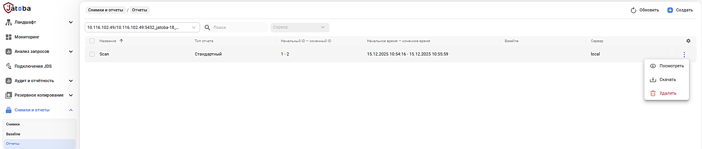{width="7.086805555555555in"
height="1.5104166666666667in"}

Рисунок 24.5 -- Список отчетов

Просматриваемый отчет откроется в отдельной вкладке браузера.

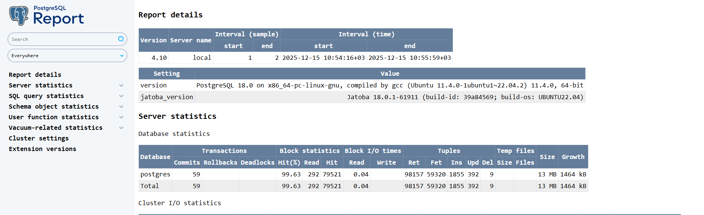{width="7.086805555555555in"
height="2.172222222222222in"}

Рисунок 24.6 -- Форма отчета «Snapshots & Reports»

Раздел «Уведомления» (Notifications)
====================================

Раздел «Уведомления» предназначен для оповещения администраторов о
событиях целевой СУБД и компонента JDS.

Механизм уведомлений содержит в себе три типа поиска сообщений:

-   «Ошибки БД» (см. п. 25.2.1);

> Поиск выполняется по классу события или по коду события.

-   «События учетных записей» (см. п. 25.2.2);

Поиск выполняется по ключевым фразам для выполнения мер безопасности
УПД.1 (5) и УПД.9 (4) в соответствии с Приказом № 17 ФСТЭК России.

-   «Произвольный текст» (см. п.25.2.3).

Поиск выполняется, по ключевым словам, задаваемым пользователем JDS.

Раздел «Уведомления» имеет функциональные возможности:

-   настройки сервисов отправки сообщений (Zulip. см. п. 25.1.2 ) и
    писем (Email. см. п. 25.1.1);

-   настройки периодичности отправки сообщений и писем (см. п. 25.1.3);

-   формированию подписок на события безопасности пользователей JDS (см.
    п. 25.2);

-   отправки сообщений и писем (см. п. 25.3.1);

-   отправки писем с вложениями пользователей JDS подписанным на события
    безопасности (см. п. 25.3.1.1).

Подраздел «Настройки» (Settings)
--------------------------------

### Сервисы Email (Email services)

Компонент JDS обладает функциональной возможностью отправки уведомлений
используя почтовые сервисы.

Предварительно должен быть создан почтовый ящик и полученные учетные
данные для доступа к нему.

Для перехода к настройке Сервиса Email потребуется перейти по пути:\
«Настройки»«Сервисы». Нажать пиктограмму «Добавить» в правом верхнем
углу.

В открывшимся окне «Создание Email подключения» выполнить следующие
действия:

-   тумблер «Статус»;

> Переключить тумблер если планируется, что подключение будет активным.

-   «Наименование»\*;

> В поле можно указать произвольное название подключения.

-   «Хост»\*;

> В поле вносится адрес хоста почтового сервера.

-   «Порт»\*;

В поле вносится порт хоста почтового сервера. При использовании
SSL-соединения указывается порт -- 465. Для SMTP протокола указывается
порт ТСР -- 25.

-   тумблер «Использование SSL»;

Переключить тумблер если планируется, что подключение будет
использоваться SSL подключение. Параметры порта описаны выше.

-   «Имя пользователя»\*;

В поле вносится имя пользователя почтового ящика. Допускается внести
полное наименование почтового ящика.

-   «Пароль»\*;

В поле указывается пароль для почтового ящика.

-   «Имя отправителя»\*;

В поле указывается имя отправителя.

-   «Адрес отправителя»\*;

В поле вносится адрес почтового ящика с почтовым доменом.

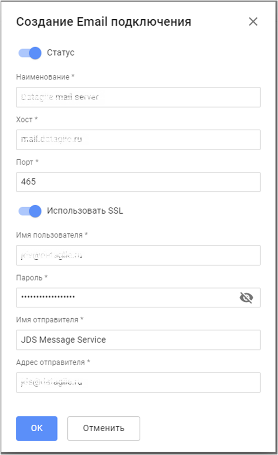{width="3.1885345581802276in"
height="5.273346456692914in"}

Рисунок 25.1 -- Окно «Создание Email подключения»

|                                                                                     |                                                                         |
|-------------------------------------------------------------------------------------|-------------------------------------------------------------------------|
| {width="0.2513888888888889in" height="0.2513888888888889in"} | Все поля в окне «Создание Email подключения» обязательны для заполнения |

После сохранения настроек, созданное подключение появится в списке
подключений.

### Сервисы Zulip (Zulip services)

Использование сервиса мессенджера Zulip возможно только в случае, когда
он используется в инфраструктуре. Предварительно настраивается бот Zulip
и его параметры используются для последующей настройки сервиса Zulip.

#### Настройка бота Zulip

Настройка бота Zulip выполняется вне пространства компонента JDS.
Настройка проводится на веб-странице чата Zulip.

Перейдя в чат потребуется:

-   открыть личные настройки;

-   выбрать вкладку «Боты».

В открывшейся вкладке «НАСТРОЙКИ/БОТЫ» заполнить поля:

-   «Полное имя»;

> В представленном примере указывается имя «JDS-agent».

-   «Адрес электронной почты бота».

В поле вносится аналогичное имя «JDS-agent», а сервер Zulip
автоматически подставит адрес E-mail. После имени до почтового домена
будет подставлен префикс «-bot».

Проверив внесенный значения, создается бот нажатием на пиктограмму
«Создать бот».

Рисунок 25.2 -- Окно настройки Zulip бота

Автоматически откроется вкладка «Активные боты»

Рисунок 25.3 -- Вкладка «Активные боты»

#### Создание Zulip подключения

Полученные параметры Zulip-бота используются в создании Zulip
подключения.

Для перехода к настройке сервиса Zulip потребуется перейти по пути:
«Настройки»«Сервисы». Нажать пиктограмму «Добавить» в правом нижнем
углу.

В открывшимся окне «Создание Zulip подключения» выполнить следующие
действия:

-   тумблер «Статус»;

Переключить тумблер если планируется, что подключение будет активным.

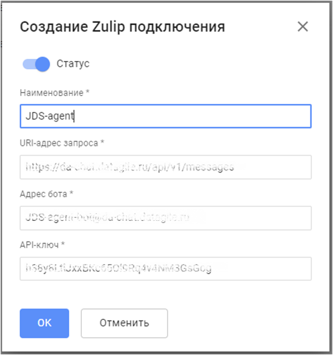{width="3.2074365704286962in"
height="3.419938757655293in"}

Рисунок 25.4 -- Окно «Создание Zulip подключения»

-   поле «Наименование»;

> В поле можно внести произвольное название подключения.

-   «URI-адрес запроса»;

> Внести URI-адрес запроса. (URI-адрес возможно получить у
> администратора сервиса Zulip)

-   «Адрес бота»;

> В поле вносится E-mail бота (см. Рисунок 25.3).

-   «API-ключ».

> В поле вносится API-ключ бота (см. Рисунок 25.3).

|                                                                                     |                                                                         |
|-------------------------------------------------------------------------------------|-------------------------------------------------------------------------|
| {width="0.2513888888888889in" height="0.2513888888888889in"} | Все поля в окне «Создание Zulip подключения» обязательны для заполнения |

После сохранения подключение появится в общем списке.

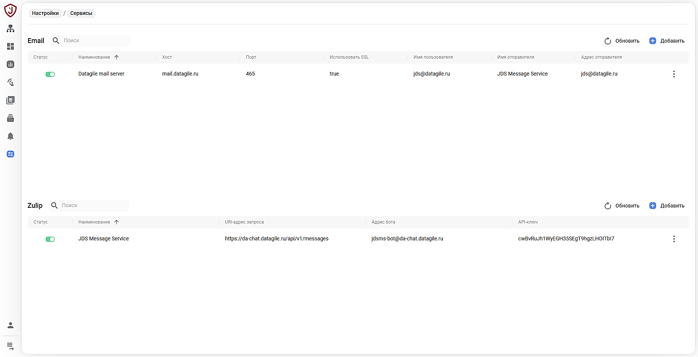{width="7.086805555555555in"
height="3.627083333333333in"}

Рисунок 25.5 -- Список подключений Zulip

### Настройки обработки (Processing settings)

Подраздел «Обработчики» находится по пути: раздел «Уведомления»
подраздел «Сообщения». На вкладке «Обработчики» отражаются
предустановленные параметры периодичности отправки сообщений.

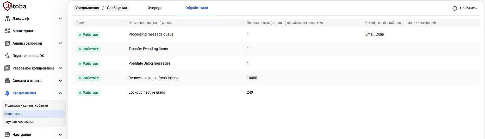{width="7.086805555555555in"
height="2.040277777777778in"}

Рисунок 25.6 -- Вкладка «Настройки обработки»

Изменить преднастроенные параметры можно от имени и с правами
администратора компонента JDS, в каталоге веб-сайта в конфигурационном
файле appsettings.json. В файле изменяется параметр «Interval» на целое
число.

Подраздел «Подписки и каналы событий» (Subscriptions and event channels)
------------------------------------------------------------------------

Подраздел служит для формирования каналов событий и подписок
пользователей JDS на события безопасности СУБД и JDS. Формирование
подписок следует осуществлять после основных настроек раздела описанных
в разделе 25.1 настоящего документа.

Процесс формирования «Подписки и каналов событий» показан на рисунке
Рисунок 25.7.

Рисунок 25.7 -- Схема создания подписки

Условно процесс делится на этап создания канала событий и подписки на
него пользователей.

**Создание канала событий**

Для перехода к формированию подписок потребуется перейти по пути:
«Уведомления» «Подписки и каналы событий». В окне «Подписки и каналы
событий» нажать пиктограмму «Добавить» в правом верхнем углу.

В открывшимся окне «Создание канала событий» выполнить следующие
действия:

-   «Наименование»;

Поле является редактируемым и в него можно внести наименование подписки
отражающую специфику (отличительную черту).

-   «Программный компонент»;

Выпадающий список, в котором устанавливается единственный выбор
компонента:

-   JDS;

-   СУБД.

<!-- -->

-   «Источник»;

-   «Тип события».

Поле выполнено в формате выпадающего списка, в котором возможно сделать
единственный выбор и является зависимым от выбранного «Программного
компонента».

Подробное описание механизма работы типа подписок приведено в пунктах
настоящего документа:

-   Ошибки БД (см. п. 25.2.1);

-   События учетных записей (см. п. 25.2.2);

-   Произвольный текст (см. п.25.2.3);

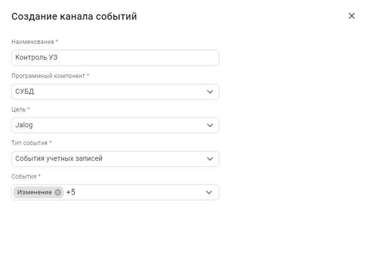{width="3.230352143482065in"
height="2.8847648731408575in"}

Рисунок 25.8 -- Окно «Создание канала событий»

Созданный канал событий отразится в общем списке.

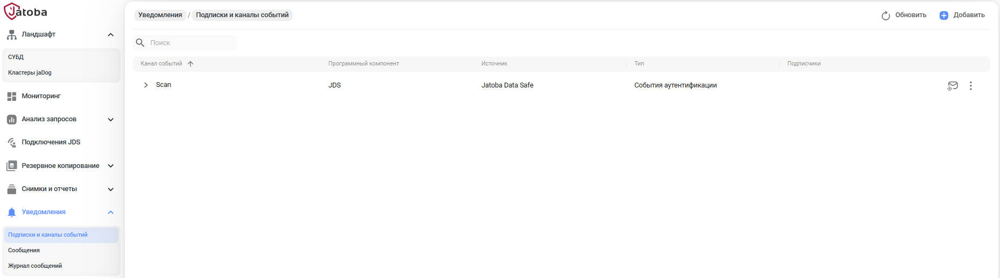{width="7.086805555555555in" height="1.975in"}

Рисунок 25.9 -- Список каналов событий

Механизм создания канала событий проконтролирует созданный канал событий
и не позволит сохранить новый канал если будут идентичны названия
каналов событий, цель и тип поиска.

На данном этапе формирование канала событий закончено.

Канал событий возможно отредактировать или удалить через контекстное
меню, вызываемое через пиктограмму в правой стороне строки канала.

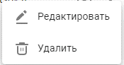{width="1.8181813210848643in"
height="0.9583333333333334in"}

Рисунок 25.10 -- Контекстное меню операций с каналом событий

**Подписка пользователя**

После того как создан канал событий, становится доступной функциональная
возможность подписки пользователей.

Подписать пользователя на канал событий возможно через кнопку,
расположенную в правой стороне строки канала.

{width="0.5in" height="0.4375in"}

Рисунок 25.11 -- Кнопка добавления подписчика

Нажатие на кнопку вызовет окно «Создание подписки».

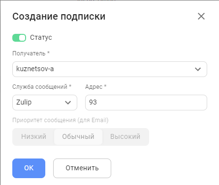{width="3.1910706474190724in"
height="2.73084864391951in"}

Рисунок 25.12 -- Окно «Создание подписки»

В окне устанавливаются следующие параметры:

-   «Статус»;

Тумблер, означающий активность подписки пользователя.

-   «Получатель»;

Поле выполнено в формате выпадающего списка, в котором возможно сделать
единственный выбор. В списке получателей могут быть только пользователи
компонента JDS. Описание создания пользователей JDS приведено в п. 2.1.3
настоящего документа.

-   «Служба сообщений»;

Для установки «Службы сообщений» требуется в выпадающем списке выбрать:

-   Email (25.1.1);

-   Zulip (25.1.2).

<!-- -->

-   «Адрес»;

Поле «Адрес» редактируемое, можно заполнить вручную либо подставить
адрес электронной почты из карточки пользователя JDS.

-   «Приоритет сообщения\*»:

<!-- -->

-   Низкий;

-   Обычный;

-   Высокий.

> После сохранения, подписчик отразится в списке подписчиков канала
> событий.

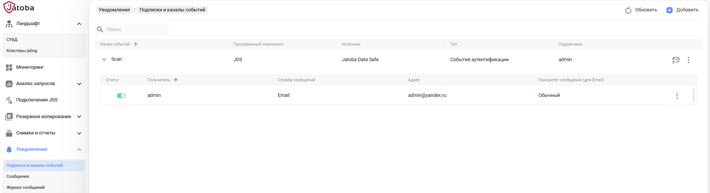{width="7.086805555555555in"
height="1.9326388888888888in"}

Рисунок 25.13 -- Список подписчиков канала событий

Функциональные возможности механизма подписок позволяют добавлять:

-   множество пользователей;

-   одного и того же пользователя с разными службами сообщений.

Канал событий возможно отредактировать или удалить через контекстное
меню, вызываемое через пиктограмму в правой стороне строки подписчика.

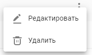{width="1.9375in"
height="1.1666666666666667in"}

Рисунок 25.14 -- Контекстное меню редактирования подписчика

### Ошибки БД

Создать подписку на ошибки СУБД возможно с помощью:

-   меню «Программный компонент» «СУБД»;

-   меню «Источник» выбрать одну из подключенных к JDS СУБД;

-   меню «Тип события» «Ошибки БД».

После чего станет доступным меню «Классы и коды ошибок».

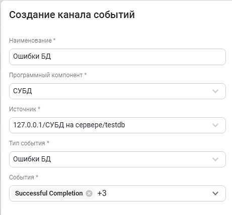{width="3.1200732720909885in"
height="2.903495188101487in"}

Рисунок 25.15 -- Поле «Тип события»

Выбрав выпадающий список меню «Событий», отроется иерархический список.
В списке доступен множественные выбор классов и/или кодов ошибок
событий.

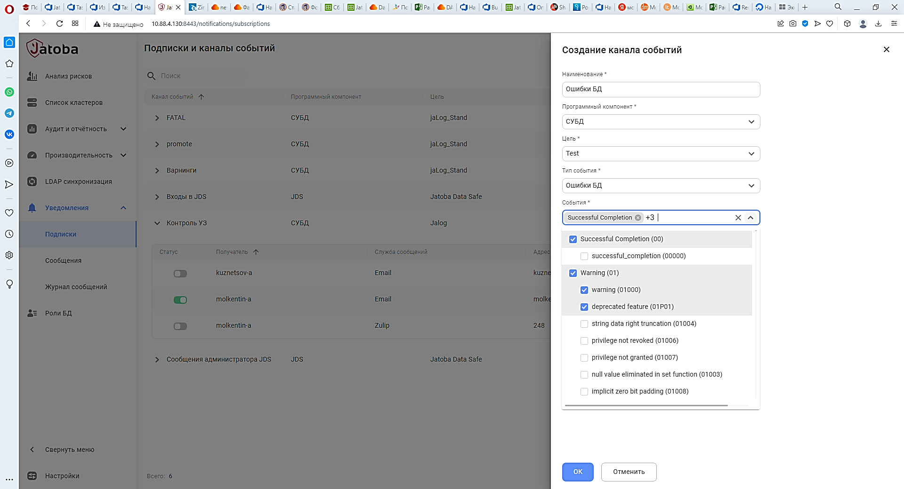{width="3.123639545056868in"
height="4.208695319335083in"}

Рисунок 25.16 -- Окно «Классы и коды ошибок»

В иерархическом списке доступно выбрать класс события или код подкласса
события. Перечень классов событий приведен в Приложении Приложение 1.

### События учетных записей

Использование типа подписки «События учетных записей» позволяет
выполнить меры безопасности, установленные Приказом № 17 ФСТЭК России:

1)  (УПД.1) «Управление (заведение, активация, блокирование и
    уничтожение) учетными записями пользователей, в том числе внешних
    пользователей».

[Мера защиты УПД.1 в части следующего требования:]{.underline}

-   оповещение администратора, об изменении сведений о пользователях, их
    ролях, обязанностях, полномочиях, ограничениях.

[Усиление меры защиты УПД.1(5) в части следующего
требования:]{.underline}

-   автоматический контроль заведения, активации, блокирования и
    уничтожения учетных записей пользователей и оповещение
    администраторов о результатах автоматического контроля.

2)  (УПД.9) «Ограничение числа параллельных сеансов доступа для каждой
    учетной записи пользователя информационной системы».

[Усиление меры защиты УПД.9 (4) в части следующего
требования:]{.underline}

-   оповещение администратора о попытках превышения числа установленных
    допустимых активных параллельных (одновременных) сеансов (сессий)
    для каждой учетной записи.

Создать подписку на «События учетных записей» СУБД возможно с помощью:

-   меню «Программный компонент» «СУБД»;

-   меню «Цель» выбрать одну из подключенных к JDS СУБД;

-   меню «Тип подписки» «События учетных записей».

После чего станет доступной меню «События». Выбрав пункты:

-   «Создание»;

-   «Изменение»;

-   «Удаление»;

-   «Блокировка»;

-   «Активация»;

> будет выполняться поиск в служебной БД «ja\_log» по набору ключевых
> фраз приведенных в таблице Таблица 25.1, для обеспечения меры
> безопасности УПД.1(5).

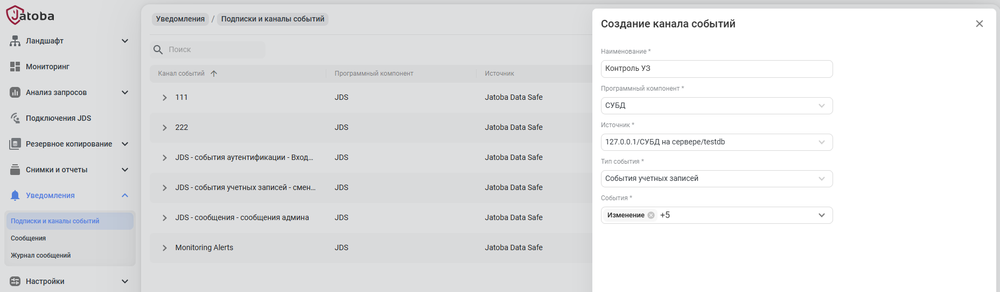{width="7.086805555555555in"
height="2.076388888888889in"}

Рисунок 25.17 -- Создание канала по типу события «События учетных
записей»

Выбрав пункт «Превышение количества одновременных сеансов» будет
выполняться поиск в служебной БД «ja\_log» по ключевой фразе «too many
connections», таким образом обеспечивается мера безопасности УПД.1(5).

Таблица 25.1 -- Соответствие пунктов поля «События» с ключевыми фразами
и мерами безопасности

<table>
<thead>
<tr class="header">
<th><strong>Параметр в поле «События»</strong></th>
<th><strong>Команда</strong></th>
<th><strong>Примечание</strong></th>
<th><strong>Мера безопасности</strong></th>
</tr>
</thead>
<tbody>
<tr class="odd">
<td><strong>Создание</strong></td>
<td>
CREATE ROLE

CREATE USER

CREATE GROUP
</td>
<td>Заведение УЗ</td>
<td>УПД.1(5)</td>
</tr>
<tr class="even">
<td><strong>Изменение</strong></td>
<td>
ALTER GROUP

ALTER ROLE

ALTER USER

ALTER.* OWNER TO

ALTER DEFAULT PRIVILEGES

GRANT

REVOKE

ALTER GROUP

CREATE POLICY

ALTER POLICY

DROP POLICY

SET ROLE

RESET ROLE

SET SESSION AUTHORIZATION

RESET SESSION AUTHORIZATION
</td>
<td>Изменение сведений, полномочий, ограничений УЗ</td>
<td>УПД.1(5)</td>
</tr>
<tr class="odd">
<td><strong>Удаление</strong></td>
<td>
DROP ROLE

DROP USER

DROP GROUP
</td>
<td>Уничтожение УЗ</td>
<td>УПД.1(5)</td>
</tr>
<tr class="even">
<td><strong>Блокировка</strong></td>
<td>
securityprofile.lock_account

Account locked
</td>
<td>Блокирование УЗ</td>
<td>УПД.1(5)</td>
</tr>
<tr class="odd">
<td><strong>Активация (разблокировка)</strong></td>
<td>securityprofile.unlock_account</td>
<td>Активация УЗ</td>
<td>УПД.1(5)</td>
</tr>
<tr class="even">
<td><strong>Превышение количества одновременных сеансов</strong></td>
<td>too many connections</td>
<td>Количества сеансов УЗ</td>
<td>УПД.9 (4)</td>
</tr>
</tbody>
</table>

Далее, как описано выше, устанавливаются параметры адресата.

### Произвольный текст

Подписка, по ключевым словам, предоставляет возможность пользователю
компонента JDS самостоятельно устанавливать критерии поиска событий в
целевой СУБД.

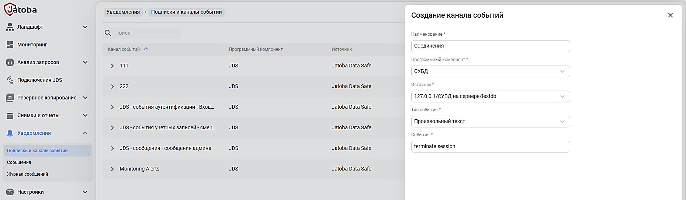{width="7.086805555555555in"
height="2.06875in"}

Рисунок 25.18 -- «Тип события» «Произвольный текст»

### Канал событий программного компонента JDS

Канал событий программного компонента JDS позволяет получать уведомления
по событиям, приведенным в таблице Таблица 25.2.

Таблица 25.2 -- Перечень типа событий и событий канала JDS

| **Тип события**         | **События**                       | **Раздел документации** |
|-------------------------|-----------------------------------|-------------------------|
| События аутентификации  | Пользователь вошел в систему      |                         |
|                         | Пользователь вышел из системы     |                         |
| Сообщения               | Сообщения администратора          |                         |
| События учетных записей | Пароль изменен                    | 2.2                     |
| Проблемы и решения      | Задача запущена                   | 11.3                    |
|                         | Задача завершена                  |                         |
|                         | Задача создана                    |                         |
|                         | Задача отредактирована            |                         |
|                         | Задача удалена                    |                         |
| Ландшафт                | Hba файл отредактирован           | 6                       |
|                         | Hba файл восстановлен             |                         |
|                         | Конфигурация перезагружена        |                         |
|                         | Создана резервная копия Hba файла |                         |
|                         | Список резервных копий Hba файла  |                         |
|                         | Сервис СУБД запущен               |                         |
|                         | Сервис СУБД остановлен            |                         |
|                         | Сервис СУБД перезапущен           |                         |
|                         | Автозапуск сервиса СУБД включён   |                         |
|                         | Автозапуск сервиса СУБД выключен  |                         |

Подраздел «Сообщения» (Messages)
--------------------------------

Подраздел «Сообщения» предназначен для:

-   контроля отправленных сообщений (25.4);

-   мониторинга сообщений, стоящих в очереди (25.3.1);

-   отправки сообщений с вложениями подписчикам на определенные события
    (25.3.1.1).

Подраздел имеет две вкладки:

-   «Очередь»;

-   «Обработчики».

### Очередь (queue)

В случае наступления события, на которое сформирована подписка,
генерируется сообщение и попадает в «Очередь».

Через время, установленное на вкладе «Настройки обработки» (25.1.3),
сообщение будет оправлено и отразится на вкладке «Журнал сообщений»
(25.4).

#### Отправка сообщений

Вкладка «Очередь» имеет дополнительную функциональную возможность
отправки сообщений с вложениями адресатам, подписанным на определенную
категорию событий.

В качестве примера:

-   сформировать в подразделе Матрица доступа (Access matrix) файл (17);

-   создать сообщение;

-   отправить.

На вкладе «Очередь» в правом верхнем углу нажать пиктограмму «Добавить».
После чего откроется окно «Создания сообщения» (Create a message).

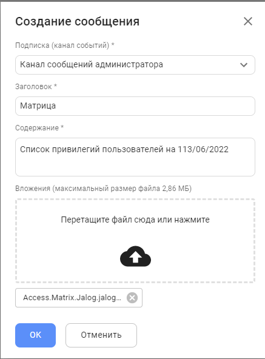{width="3.158928258967629in"
height="4.278102580927384in"}

Рисунок 25.19 -- Окно «Создания сообщения»

Установка параметров сообщений схожа с оформлением подписки пользователя
JDS, для чего потребуется заполнить поля:

-   «Подписка (канал события)\*»;

> Выбрать в выпадающем списке ранее сформированные подписки.

-   «Заголовок \*»;

> Заполнить текстовую часть заголовка письма (темы).

-   «Содержание \*»;

> Заполнить текстовую часть содержания письма.

-   «Вложения».

При необходимости сформировать вложение кликнув на поле.

В приводимом примере ранее сформированную и экспортированную матрицу
доступа вложить в сообщение.

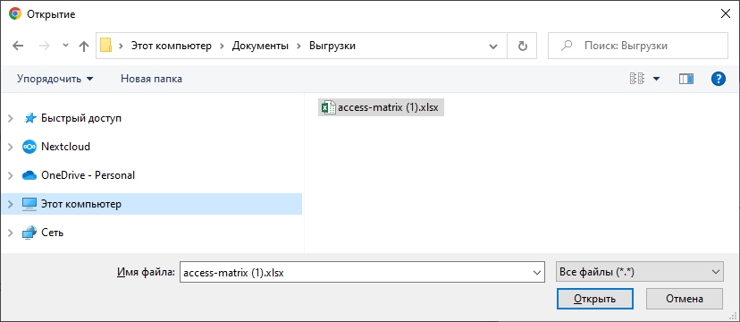{width="4.734104330708662in"
height="2.058325678040245in"}

Рисунок 25.20 -- Окно выбора вложения

Сохранить сформированное сообщение.

После чего сообщение отразится в списке сообщений в очереди.

Через время, установленное в «Настройке обработки» (25.1.3), сообщение
отправится и попадет в «Журнал сообщений» (25.4).

Полученное адресатом сообщение будет иметь аналогичный вид, как
представлено на рисунке Рисунок 25.21.

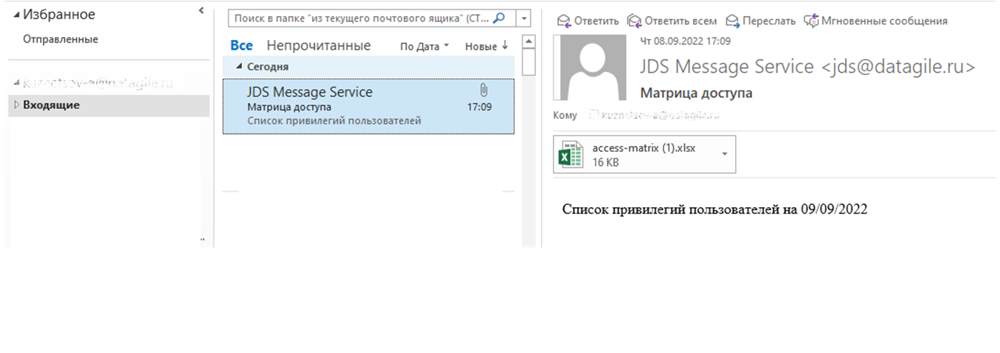{width="6.760660542432196in"
height="1.5972222222222223in"}

Рисунок 25.21 -- Письмо сформированное на вкладе «Очередь сообщений»
компонента JDS

Где:

-   в адресе отправителя будут отражены «Имя отправителя» и «Адрес
    отправителя», которые были установлены в параметрах «Сервисы Email»
    (25.1.1);

-   в теме письма будет указан «Заголовок», который указали в процессе
    формирования сообщения (см. Рисунок 25.19);

-   в теле письма отражается «Содержание» (см. Рисунок 25.19);

-   вложение, соответствующее отправленному.

|                                                                                     |                                                                                                                                       |
|-------------------------------------------------------------------------------------|---------------------------------------------------------------------------------------------------------------------------------------|
| {width="0.2513888888888889in" height="0.2513888888888889in"} | Отправка сообщений с вложениями возможно только для пользователей JDS, для которых установлена отправка писем через Email подключения |

### Обработчики (Handlers)

Вкладка «Обработчики» имеет информационный характер, в которой
отображается информация:

-   «Статус»;

-   «Наименование (ключ) задания»;

-   «Периодичность (интервал) обработки очереди, мин»;

-   «Службы сообщений для отправки уведомлений».

Отображаемые параметры недоступны для редактирования.

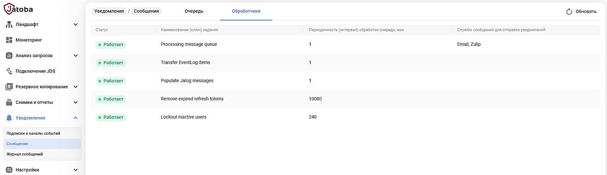{width="7.086805555555555in"
height="2.051388888888889in"}

Рисунок 25.22 -- Вкладка «Обработчики»

Журнал сообщений (Message log)
------------------------------

Вкладка «Журнал сообщений» выполняет контрольную функцию регистрации
отправленных сообщений.

Список сообщений невозможно редактировать. Доступна сортировка по
столбцам, а также полнотекстовый поиск.

При нажатии на вложение загрузится отправленный файл.

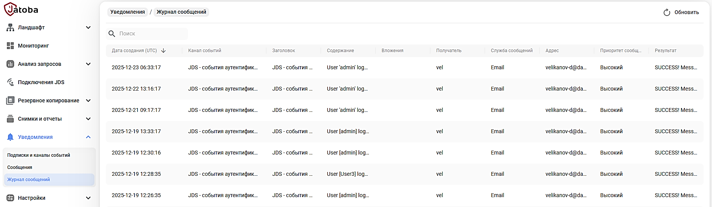{width="7.086805555555555in"
height="2.0694444444444446in"}

Рисунок 25.23 -- Вкладка «Журнал сообщений»

Журналы событий JDS 
====================

Технический журнал - этот журнал предназначен для регистрации событий
технического характера от момента запуска приложения и до его
завершения. Также, в этот журнал записываются сообщения о технических
ошибках любого уровня, которые возникают при выполнении функций
приложения.

Технические журналы компонента JDS и службы jds-doctor, в текстовом
формате находятся в каталоге:

-   /var/log/jds для GNU Linux;

-   \%ProgramData%\\jds для ОС семейства Windows.

Содержимое журналов доступно просматривать во внутреннем хранилище
журналов «systemd» утилитой «journalctl».

**Например**

> \#journalctl -u jds-doctor
>
> \#journalctl -u jds

Файлы журналов формируются при запуске служб. Имя файла журнала имеет
формат:

> Service\_name\_ГГГГММДД.log

В конфигурационных файлах:

-   /opt/jds/appsettings.json;

-   /opt/jds-doctor/appsetting.json.

существует отдельный раздел «AppLogging» для управления техническим
журналом.

> \"AppLogging\": {
>
> \"Level\": \"Information\",
>
> \"SensitiveDataLogging\": false,
>
> \"FileCount\": 90,
>
> \"RotateInterval\": \"Day\"

Этот раздел включает вложенные элементы не глубже одного уровня, которые
отвечают за следующие параметры, приведенные в таблице Таблица 26.1:

Таблица 26.1 -- Параметры журналирования

<table>
<thead>
<tr class="header">
<th><strong>Параметр</strong></th>
<th><strong>Описание параметра</strong></th>
</tr>
</thead>
<tbody>
<tr class="odd">
<td>&quot;Level&quot;: &quot;Information&quot;,</td>
<td>
<strong>«Level»</strong> - уровень журналирования.

Значение из набора (Debug, Information, Error)

<strong>DEBUG</strong> - в журнал выводятся сообщения о начале, этапах и результатах выполнения действий, включая подробные сообщения об ошибках

<strong>INFORMATION</strong> - в журнал выводятся сообщения о факте завершения выполнения крупных действий, а также краткие сообщения об ошибках

<strong>ERROR</strong> - в журнал выводятся только сообщения об ошибках в процессе работы, с кратким текстом ошибки.
</td>
</tr>
<tr class="even">
<td>&quot;SensitiveDataLogging&quot;:</td>
<td><strong>«SensitiveDataLogging»</strong> - признак «Включать данные БД для отладки». Значение по умолчанию - «False».</td>
</tr>
<tr class="odd">
<td>&quot;FileCount&quot;: 90,</td>
<td>
<strong>«FileCount»</strong> - количество копий журнала.

Значение по умолчанию - «90» (целое число).
</td>
</tr>
<tr class="even">
<td>&quot;RotateInterval&quot;: &quot;Day&quot;</td>
<td>
«RotateInterval» - периодичность создания нового журнала (периодичность ротации).

Значение по умолчанию - «Day».

Используются значения из набора hour, day, month.
</td>
</tr>
</tbody>
</table>

Параметры журналирования в конфигурационных файлах
/opt/jds/appsettings.json компонента JDS и
/opt/jds-doctor/appsetting.json службы jds-doctor идентичны и
применяются после перезапуска одноименных служб.

Сообщения об ошибках
====================

Ошибка при проверке подключения к цели: 28P01
---------------------------------------------

Ошибка при проверке подключения к цели:28P01 возникает в случае если
указаны неверные аутентификационные параметры ассоциированного
пользователя СУБД.

> Error while checking target connection:28P01: password authentication
> failed user \[user\_name\]

Для устранения ошибки необходимо проверить аутентификационную
информацию.

Ошибка при проверке подключения к цели
--------------------------------------

Ошибка при проверке подключения к цели, возникает в случае указания
неверного IP-адреса, порта и т.д.

Сообщение переводится как: «Ошибка при проверке подключения к цели:
Подключение пока исключено».

> Error while checking target connection:Exception while connection

Для устранения ошибки необходимо проверить данные для подключения.

Ошибка настройке конфигурационного файла: 28000
-----------------------------------------------

Ошибка возникает при некорректном формировании конфигурационного файла
«pg\_hba.conf».

> Error while checking target connection:28000: no pg\_hba.conf entry
> for host \[IP\], user \[user\_name\], database \[db\_name\],SSL off

Для устранения ошибки в конфигурационном файле «pg\_hba.conf» необходимо
внести строку, разрешающую подключение к служебной СУБД, которую
использует компонент JDS.

Ошибка при получении списка записей журнала ldapsync
----------------------------------------------------

Ошибка возникает если пользователь JDS, имеющий доступ к разделу
«LDAP-синхронизация», выбрал целевую СУБД, на которой не установлено
расширение «ja\_sync\_ldap».

> Ошибка при получении списка записей журнала ldapsync: 3F000: schema
> \"ja\_sync\_ldap\" does not exist POSITION: 15

Ошибка при получении списка профилей ldapsync
---------------------------------------------

Ошибка возникает если у ассоциированного пользователя СУБД отсутствуют
права на схему «ja\_sync\_ldap» и принадлежащие ей таблицы.

> Ошибка при получении списка профилей ldapsync: 42501: permission
> denied for table profile

Исправить ошибку возможно предоставлением прав ассоциированному
пользователю СУБД на схему «ja\_sync\_ldap» и принадлежащие ей таблицы.

Ошибка при создании профиля ldapsync
------------------------------------

Ошибка при создании профиля ldapsync возникает при отсутствии у
пользователя СУБД прав на схему «ja\_sync\_ldap».

> Ошибка при создании профиля ldapsync: Невозможно создать профиль
> ldapsync для цели с Id = b14ac7ac-ff12-476f-afe6-a4beef4ba802!

Ошибка при создании/обновления маппинга ldapsync
------------------------------------------------

Ошибка возникает при попытке создания маппинга с указанием не уникальной
групповой роли БД или имени группы в Microsoft Active Directory.

Компонент выведет следующие сообщения:

> Ошибка при обновлении маппинга профиля ldapsync. Маппинг с параметрами
> \"Роль БД\" = \"значение\_параметра\" и/или \"Группа AD\" =
> \"значение\_параметра\" уже существует!
>
> Ошибка при создании маппинга профиля ldapsync. Маппинг с параметрами
> \"Роль БД\" = \"значение\_параметра\" и/или \"Группа AD\" =
> \"значение\_параметра\" уже существует!

Для устранения ошибки требуется указать уникальные параметры, не
используемые в других маппингах.

Ошибка при создании одноименного профиля ldapsync
-------------------------------------------------

Ошибка возникает при попытке указания неуникального имени профиля
синхронизации.

Компонент выведет следующие сообщения:

> Ошибка при создании профиля ldapsync: Профиль с именем \"Profile\" уже
> существует!
>
> Ошибка при обновлении профиля ldapsync: Профиль с именем \"Profile\"
> уже существует!

Для устранения ошибки требуется указать уникальное имя профиля
синхронизации.

Ошибка выполнения синхронизации
-------------------------------

Ошибка о невозможности синхронизации профиля возникает в случае
некорректно указанных параметров.

> Невозможно выполнить синхронизацию профиля \"profile\_name\" с id =
> \"profile\_id\"

Для устранения ошибки потребуется:

-   провести анализ событий безопасности;

-   перепроверить параметры профиля синхронизации;

-   перепроверить параметры маппинга;

-   сохранить внесенные изменения;

-   выполнить повторную синхронизацию.

Сообщение «Синхронизация частично выполнена»
--------------------------------------------

Сообщение «Синхронизация частично выполнена» возникает в случае, когда
одна или несколько синхронизируемых учетных записей не соответствуют
требованиям и были исключены из синхронизации.

Для полной синхронизации потребуется:

-   провести анализ событий безопасности;

-   исправить ошибку на источнике проблемы;

-   выполнить повторную синхронизацию.

Ошибка при добавлении в кластер Master узла
-------------------------------------------

В случае установки компонента JDS на один из узлов кластера может
возникать ошибка добавления в кластер Master узла.

Компонент выведет одно из сообщений:

> Ошибка при подключении списка узлов кластера: 57P01: terminating
> connection due to administrator
>
> Ошибка при подключении списка узлов кластера: An exception has been
> raised that is likely due to transient

Для устранения ошибки необходимо внести изменения в строку:

> \"DefaultConnection\": \"User Id=jds; Password=P\@assword;
> Server=localhost; Database=jdsdb; Port=5432\"

конфигурационного файла Appsettings.json компонента JDS значение:

> Pooling=false;

После чего строка будет иметь следующий вид:

> \"DefaultConnection\": \"User Id=jds; Password=P\@assword;
> Server=localhost; Database=jdsdb; Port=5432; Pooling=false;\"

Сохранить изменения в файле и выполнить перезагрузку службы веб-сервера.

Также ошибка может возникать и при выполнении функции «switchover».

Ошибка при создании канала событий
----------------------------------

Ошибка создания канала событий возникает при идентичных параметрах с
ранее созданным каналом событий.

Компонент выведет следующее сообщение:

> Ошибка при создании канала событий: An error occurred while saving the
> entity changes. See the inner exception for details.

Для устранения ошибки требуется изменить параметры канала событий.

Дублирование сообщений при рассылке уведомлений
-----------------------------------------------

Ошибка возникает при некорректной настройке клиента синхронизации
времени.

Ошибка устраняется на уровне ОС командами:

> sudo apt purge ntp\
> sudo apt purge chrony\
> sudo timedatectl set-ntp true\
> sudo systemctl start systemd-timesyncd

Резервное копирование
---------------------

При ошибке создания резервной копии требуется выполнить следующие
действия:

-   удалить СУБД из раздела «Ландшафт»;

-   повторно подключить СУБД в раздел «Ландшафт»;

-   удалить в postgresql.conf последние команды архивации;

-   проверить права на директорию бэкапа от ROOT для учетной записи
    postgres;

-   удалить архивные копии из директории;

-   удалить прежнее хранилище;

-   настроить бэкап;

-   создать хранилище;

-   перед полной архивацией провести перезагрузку;

-   выполнить FULL ARH.

1.  

    []{#_Toc225259250 .anchor}Перечень «Классов событий» используемых в
    подразделе «Подписки»

Таблица П.1.1 -- Перечень «Классов событий»

| **sql\_state\_code**                                                         | **Наименование**                                          |
|------------------------------------------------------------------------------|-----------------------------------------------------------|
| **Class 00 --- Successful Completion**                                       |                                                           |
| 00000                                                                        | successful\_completion                                    |
| **Class 01 --- Warning**                                                     |                                                           |
| 01000                                                                        | warning                                                   |
| 0100C                                                                        | dynamic\_result\_sets\_returned                           |
| 01008                                                                        | implicit\_zero\_bit\_padding                              |
| 01003                                                                        | null\_value\_eliminated\_in\_set\_function                |
| 01007                                                                        | privilege\_not\_granted                                   |
| 01006                                                                        | privilege\_not\_revoked                                   |
| 01004                                                                        | string\_data\_right\_truncation                           |
| 01P01                                                                        | deprecated\_feature                                       |
| **Class 02 --- No Data (this is also a warning class per the SQL standard)** |                                                           |
| 02000                                                                        | no\_data                                                  |
| 02001                                                                        | no\_additional\_dynamic\_result\_sets\_returned           |
| **Class 03 --- SQL Statement Not Yet Complete**                              |                                                           |
| 03000                                                                        | sql\_statement\_not\_yet\_complete                        |
| **Class 08 --- Connection Exception**                                        |                                                           |
| 08000                                                                        | connection\_exception                                     |
| 08003                                                                        | connection\_does\_not\_exist                              |
| 08006                                                                        | connection\_failure                                       |
| 08001                                                                        | sqlclient\_unable\_to\_establish\_sqlconnection           |
| 08004                                                                        | sqlserver\_rejected\_establishment\_of\_sqlconnection     |
| 08007                                                                        | transaction\_resolution\_unknown                          |
| 08P01                                                                        | protocol\_violation                                       |
| **Class 09 --- Triggered Action Exception**                                  |                                                           |
| 09000                                                                        | triggered\_action\_exception                              |
| **Class 0A --- Feature Not Supported**                                       |                                                           |
| 0A000                                                                        | feature\_not\_supported                                   |
| **Class 0B --- Invalid Transaction Initiation**                              |                                                           |
| 0B000                                                                        | invalid\_transaction\_initiation                          |
| **Class 0F --- Locator Exception**                                           |                                                           |
| 0F000                                                                        | locator\_exception                                        |
| 0F001                                                                        | invalid\_locator\_specification                           |
| **Class 0L --- Invalid Grantor**                                             |                                                           |
| 0L000                                                                        | invalid\_grantor                                          |
| 0LP01                                                                        | invalid\_grant\_operation                                 |
| **Class 0P --- Invalid Role Specification**                                  |                                                           |
| 0P000                                                                        | invalid\_role\_specification                              |
| **Class 0Z --- Diagnostics Exception**                                       |                                                           |
| 0Z000                                                                        | diagnostics\_exception                                    |
| 0Z002                                                                        | stacked\_diagnostics\_accessed\_without\_active\_handler  |
| **Class 20 --- Case Not Found**                                              |                                                           |
| 20000                                                                        | case\_not\_found                                          |
| **Class 21 --- Cardinality Violation**                                       |                                                           |
| 21000                                                                        | cardinality\_violation                                    |
| **Class 22 --- Data Exception**                                              |                                                           |
| 22000                                                                        | data\_exception                                           |
| 2202E                                                                        | array\_subscript\_error                                   |
| 22021                                                                        | character\_not\_in\_repertoire                            |
| 22008                                                                        | datetime\_field\_overflow                                 |
| 22012                                                                        | division\_by\_zero                                        |
| 22005                                                                        | error\_in\_assignment                                     |
| 2200B                                                                        | escape\_character\_conflict                               |
| 22022                                                                        | indicator\_overflow                                       |
| 22015                                                                        | interval\_field\_overflow                                 |
| 2201E                                                                        | invalid\_argument\_for\_logarithm                         |
| 22014                                                                        | invalid\_argument\_for\_ntile\_function                   |
| 22016                                                                        | invalid\_argument\_for\_nth\_value\_function              |
| 2201F                                                                        | invalid\_argument\_for\_power\_function                   |
| 2201G                                                                        | invalid\_argument\_for\_width\_bucket\_function           |
| 22018                                                                        | invalid\_character\_value\_for\_cast                      |
| 22007                                                                        | invalid\_datetime\_format                                 |
| 22019                                                                        | invalid\_escape\_character                                |
| 2200D                                                                        | invalid\_escape\_octet                                    |
| 22025                                                                        | invalid\_escape\_sequence                                 |
| 22P06                                                                        | nonstandard\_use\_of\_escape\_character                   |
| 22010                                                                        | invalid\_indicator\_parameter\_value                      |
| 22023                                                                        | invalid\_parameter\_value                                 |
| 22013                                                                        | invalid\_preceding\_or\_following\_size                   |
| 2201B                                                                        | invalid\_regular\_expression                              |
| 2201W                                                                        | invalid\_row\_count\_in\_limit\_clause                    |
| 2201X                                                                        | invalid\_row\_count\_in\_result\_offset\_clause           |
| 2202H                                                                        | invalid\_tablesample\_argument                            |
| 2202G                                                                        | invalid\_tablesample\_repeat                              |
| 22009                                                                        | invalid\_time\_zone\_displacement\_value                  |
| 2200C                                                                        | invalid\_use\_of\_escape\_character                       |
| 2200G                                                                        | most\_specific\_type\_mismatch                            |
| 22004                                                                        | null\_value\_not\_allowed                                 |
| 22002                                                                        | null\_value\_no\_indicator\_parameter                     |
| 22003                                                                        | numeric\_value\_out\_of\_range                            |
| 2200H                                                                        | sequence\_generator\_limit\_exceeded                      |
| 22026                                                                        | string\_data\_length\_mismatch                            |
| 22001                                                                        | string\_data\_right\_truncation                           |
| 22011                                                                        | substring\_error                                          |
| 22027                                                                        | trim\_error                                               |
| 22024                                                                        | unterminated\_c\_string                                   |
| 2200F                                                                        | zero\_length\_character\_string                           |
| 22P01                                                                        | floating\_point\_exception                                |
| 22P02                                                                        | invalid\_text\_representation                             |
| 22P03                                                                        | invalid\_binary\_representation                           |
| 22P04                                                                        | bad\_copy\_file\_format                                   |
| 22P05                                                                        | untranslatable\_character                                 |
| 2200L                                                                        | not\_an\_xml\_document                                    |
| 2200M                                                                        | invalid\_xml\_document                                    |
| 2200N                                                                        | invalid\_xml\_content                                     |
| 2200S                                                                        | invalid\_xml\_comment                                     |
| 2200T                                                                        | invalid\_xml\_processing\_instruction                     |
| 22030                                                                        | duplicate\_json\_object\_key\_value                       |
| 22031                                                                        | invalid\_argument\_for\_sql\_json\_datetime\_function     |
| 22032                                                                        | invalid\_json\_text                                       |
| 22033                                                                        | invalid\_sql\_json\_subscript                             |
| 22034                                                                        | more\_than\_one\_sql\_json\_item                          |
| 22035                                                                        | no\_sql\_json\_item                                       |
| 22036                                                                        | non\_numeric\_sql\_json\_item                             |
| 22037                                                                        | non\_unique\_keys\_in\_a\_json\_object                    |
| 22038                                                                        | singleton\_sql\_json\_item\_required                      |
| 22039                                                                        | sql\_json\_array\_not\_found                              |
| 2203A                                                                        | sql\_json\_member\_not\_found                             |
| 2203B                                                                        | sql\_json\_number\_not\_found                             |
| 2203C                                                                        | sql\_json\_object\_not\_found                             |
| 2203D                                                                        | too\_many\_json\_array\_elements                          |
| 2203E                                                                        | too\_many\_json\_object\_members                          |
| 2203F                                                                        | sql\_json\_scalar\_required                               |
| 2203G                                                                        | sql\_json\_item\_cannot\_be\_cast\_to\_target\_type       |
| **Class 23 --- Integrity Constraint Violation**                              |                                                           |
| 23000                                                                        | integrity\_constraint\_violation                          |
| 23001                                                                        | restrict\_violation                                       |
| 23502                                                                        | not\_null\_violation                                      |
| 23503                                                                        | foreign\_key\_violation                                   |
| 23505                                                                        | unique\_violation                                         |
| 23514                                                                        | check\_violation                                          |
| 23P01                                                                        | exclusion\_violation                                      |
| **Class 24 --- Invalid Cursor State**                                        |                                                           |
| 24000                                                                        | invalid\_cursor\_state                                    |
| **Class 25 --- Invalid Transaction State**                                   |                                                           |
| 25000                                                                        | invalid\_transaction\_state                               |
| 25001                                                                        | active\_sql\_transaction                                  |
| 25002                                                                        | branch\_transaction\_already\_active                      |
| 25008                                                                        | held\_cursor\_requires\_same\_isolation\_level            |
| 25003                                                                        | inappropriate\_access\_mode\_for\_branch\_transaction     |
| 25004                                                                        | inappropriate\_isolation\_level\_for\_branch\_transaction |
| 25005                                                                        | no\_active\_sql\_transaction\_for\_branch\_transaction    |
| 25006                                                                        | read\_only\_sql\_transaction                              |
| 25007                                                                        | schema\_and\_data\_statement\_mixing\_not\_supported      |
| 25P01                                                                        | no\_active\_sql\_transaction                              |
| 25P02                                                                        | in\_failed\_sql\_transaction                              |
| 25P03                                                                        | idle\_in\_transaction\_session\_timeout                   |
| **Class 26 --- Invalid SQL Statement Name**                                  |                                                           |
| 26000                                                                        | invalid\_sql\_statement\_name                             |
| **Class 27 --- Triggered Data Change Violation**                             |                                                           |
| 27000                                                                        | triggered\_data\_change\_violation                        |
| **Class 28 --- Invalid Authorization Specification**                         |                                                           |
| 28000                                                                        | invalid\_authorization\_specification                     |
| 28P01                                                                        | invalid\_password                                         |
| **Class 2B --- Dependent Privilege Descriptors Still Exist**                 |                                                           |
| 2B000                                                                        | dependent\_privilege\_descriptors\_still\_exist           |
| 2BP01                                                                        | dependent\_objects\_still\_exist                          |
| **Class 2D --- Invalid Transaction Termination**                             |                                                           |
| 2D000                                                                        | invalid\_transaction\_termination                         |
| **Class 2F --- SQL Routine Exception**                                       |                                                           |
| 2F000                                                                        | sql\_routine\_exception                                   |
| 2F005                                                                        | function\_executed\_no\_return\_statement                 |
| 2F002                                                                        | modifying\_sql\_data\_not\_permitted                      |
| 2F003                                                                        | prohibited\_sql\_statement\_attempted                     |
| 2F004                                                                        | reading\_sql\_data\_not\_permitted                        |
| **Class 34 --- Invalid Cursor Name**                                         |                                                           |
| 34000                                                                        | invalid\_cursor\_name                                     |
| **Class 38 --- External Routine Exception**                                  |                                                           |
| 38000                                                                        | external\_routine\_exception                              |
| 38001                                                                        | containing\_sql\_not\_permitted                           |
| 38002                                                                        | modifying\_sql\_data\_not\_permitted                      |
| 38003                                                                        | prohibited\_sql\_statement\_attempted                     |
| 38004                                                                        | reading\_sql\_data\_not\_permitted                        |
| **Class 39 --- External Routine Invocation Exception**                       |                                                           |
| 39000                                                                        | external\_routine\_invocation\_exception                  |
| 39001                                                                        | invalid\_sqlstate\_returned                               |
| 39004                                                                        | null\_value\_not\_allowed                                 |
| 39P01                                                                        | trigger\_protocol\_violated                               |
| 39P02                                                                        | srf\_protocol\_violated                                   |
| 39P03                                                                        | event\_trigger\_protocol\_violated                        |
| **Class 3B --- Savepoint Exception**                                         |                                                           |
| 3B000                                                                        | savepoint\_exception                                      |
| 3B001                                                                        | invalid\_savepoint\_specification                         |
| **Class 3D --- Invalid Catalog Name**                                        |                                                           |
| 3D000                                                                        | invalid\_catalog\_name                                    |
| **Class 3F --- Invalid Schema Name**                                         |                                                           |
| 3F000                                                                        | invalid\_schema\_name                                     |
| **Class 40 --- Transaction Rollback**                                        |                                                           |
| 40000                                                                        | transaction\_rollback                                     |
| 40002                                                                        | transaction\_integrity\_constraint\_violation             |
| 40001                                                                        | serialization\_failure                                    |
| 40003                                                                        | statement\_completion\_unknown                            |
| 40P01                                                                        | deadlock\_detected                                        |
| **Class 42 --- Syntax Error or Access Rule Violation**                       |                                                           |
| 42000                                                                        | syntax\_error\_or\_access\_rule\_violation                |
| 42601                                                                        | syntax\_error                                             |
| 42501                                                                        | insufficient\_privilege                                   |
| 42846                                                                        | cannot\_coerce                                            |
| 42803                                                                        | grouping\_error                                           |
| 42P20                                                                        | windowing\_error                                          |
| 42P19                                                                        | invalid\_recursion                                        |
| 42830                                                                        | invalid\_foreign\_key                                     |
| 42602                                                                        | invalid\_name                                             |
| 42622                                                                        | name\_too\_long                                           |
| 42939                                                                        | reserved\_name                                            |
| 42804                                                                        | datatype\_mismatch                                        |
| 42P18                                                                        | indeterminate\_datatype                                   |
| 42P21                                                                        | collation\_mismatch                                       |
| 42P22                                                                        | indeterminate\_collation                                  |
| 42809                                                                        | wrong\_object\_type                                       |
| 428C9                                                                        | generated\_always                                         |
| 42703                                                                        | undefined\_column                                         |
| 42883                                                                        | undefined\_function                                       |
| 42P01                                                                        | undefined\_table                                          |
| 42P02                                                                        | undefined\_parameter                                      |
| 42704                                                                        | undefined\_object                                         |
| 42701                                                                        | duplicate\_column                                         |
| 42P03                                                                        | duplicate\_cursor                                         |
| 42P04                                                                        | duplicate\_database                                       |
| 42723                                                                        | duplicate\_function                                       |
| 42P05                                                                        | duplicate\_prepared\_statement                            |
| 42P06                                                                        | duplicate\_schema                                         |
| 42P07                                                                        | duplicate\_table                                          |
| 42712                                                                        | duplicate\_alias                                          |
| 42710                                                                        | duplicate\_object                                         |
| 42702                                                                        | ambiguous\_column                                         |
| 42725                                                                        | ambiguous\_function                                       |
| 42P08                                                                        | ambiguous\_parameter                                      |
| 42P09                                                                        | ambiguous\_alias                                          |
| 42P10                                                                        | invalid\_column\_reference                                |
| 42611                                                                        | invalid\_column\_definition                               |
| 42P11                                                                        | invalid\_cursor\_definition                               |
| 42P12                                                                        | invalid\_database\_definition                             |
| 42P13                                                                        | invalid\_function\_definition                             |
| 42P14                                                                        | invalid\_prepared\_statement\_definition                  |
| 42P15                                                                        | invalid\_schema\_definition                               |
| 42P16                                                                        | invalid\_table\_definition                                |
| 42P17                                                                        | invalid\_object\_definition                               |
| **Class 44 --- WITH CHECK OPTION Violation**                                 |                                                           |
| 44000                                                                        | with\_check\_option\_violation                            |
| **Class 53 --- Insufficient Resources**                                      |                                                           |
| 53000                                                                        | insufficient\_resources                                   |
| 53100                                                                        | disk\_full                                                |
| 53200                                                                        | out\_of\_memory                                           |
| 53300                                                                        | too\_many\_connections                                    |
| 53400                                                                        | configuration\_limit\_exceeded                            |
| **Class 54 --- Program Limit Exceeded**                                      |                                                           |
| 54000                                                                        | program\_limit\_exceeded                                  |
| 54001                                                                        | statement\_too\_complex                                   |
| 54011                                                                        | too\_many\_columns                                        |
| 54023                                                                        | too\_many\_arguments                                      |
| **Class 55 --- Object Not In Prerequisite State**                            |                                                           |
| 55000                                                                        | object\_not\_in\_prerequisite\_state                      |
| 55006                                                                        | object\_in\_use                                           |
| 55P02                                                                        | cant\_change\_runtime\_param                              |
| 55P03                                                                        | lock\_not\_available                                      |
| 55P04                                                                        | unsafe\_new\_enum\_value\_usage                           |
| **Class 57 --- Operator Intervention**                                       |                                                           |
| 57000                                                                        | operator\_intervention                                    |
| 57014                                                                        | query\_canceled                                           |
| 57P01                                                                        | admin\_shutdown                                           |
| 57P02                                                                        | crash\_shutdown                                           |
| 57P03                                                                        | cannot\_connect\_now                                      |
| 57P04                                                                        | database\_dropped                                         |
| 57P05                                                                        | idle\_session\_timeout                                    |
| **Class 58 --- System Error (errors external to PostgreSQL itself)**         |                                                           |
| 58000                                                                        | system\_error                                             |
| 58030                                                                        | io\_error                                                 |
| 58P01                                                                        | undefined\_file                                           |
| 58P02                                                                        | duplicate\_file                                           |
| **Class 72 --- Snapshot Failure**                                            |                                                           |
| 72000                                                                        | snapshot\_too\_old                                        |
| **Class F0 --- Configuration File Error**                                    |                                                           |
| F0000                                                                        | config\_file\_error                                       |
| F0001                                                                        | lock\_file\_exists                                        |
| **Class HV --- Foreign Data Wrapper Error (SQL/MED)**                        |                                                           |
| HV000                                                                        | fdw\_error                                                |
| HV005                                                                        | fdw\_column\_name\_not\_found                             |
| HV002                                                                        | fdw\_dynamic\_parameter\_value\_needed                    |
| HV010                                                                        | fdw\_function\_sequence\_error                            |
| HV021                                                                        | fdw\_inconsistent\_descriptor\_information                |
| HV024                                                                        | fdw\_invalid\_attribute\_value                            |
| HV007                                                                        | fdw\_invalid\_column\_name                                |
| HV008                                                                        | fdw\_invalid\_column\_number                              |
| HV004                                                                        | fdw\_invalid\_data\_type                                  |
| HV006                                                                        | fdw\_invalid\_data\_type\_descriptors                     |
| HV091                                                                        | fdw\_invalid\_descriptor\_field\_identifier               |
| HV00B                                                                        | fdw\_invalid\_handle                                      |
| HV00C                                                                        | fdw\_invalid\_option\_index                               |
| HV00D                                                                        | fdw\_invalid\_option\_name                                |
| HV090                                                                        | fdw\_invalid\_string\_length\_or\_buffer\_length          |
| HV00A                                                                        | fdw\_invalid\_string\_format                              |
| HV009                                                                        | fdw\_invalid\_use\_of\_null\_pointer                      |
| HV014                                                                        | fdw\_too\_many\_handles                                   |
| HV001                                                                        | fdw\_out\_of\_memory                                      |
| HV00P                                                                        | fdw\_no\_schemas                                          |
| HV00J                                                                        | fdw\_option\_name\_not\_found                             |
| HV00K                                                                        | fdw\_reply\_handle                                        |
| HV00Q                                                                        | fdw\_schema\_not\_found                                   |
| HV00R                                                                        | fdw\_table\_not\_found                                    |
| HV00L                                                                        | fdw\_unable\_to\_create\_execution                        |
| HV00M                                                                        | fdw\_unable\_to\_create\_reply                            |
| HV00N                                                                        | fdw\_unable\_to\_establish\_connection                    |
| **Class P0 --- PL/pgSQL Error**                                              |                                                           |
| P0000                                                                        | plpgsql\_error                                            |
| P0001                                                                        | raise\_exception                                          |
| P0002                                                                        | no\_data\_found                                           |
| P0003                                                                        | too\_many\_rows                                           |
| P0004                                                                        | assert\_failure                                           |
| **Class XX --- Internal Error**                                              |                                                           |
| XX000                                                                        | internal\_error                                           |
| XX001                                                                        | data\_corrupted                                           |
| XX002                                                                        | index\_corrupted                                          |

Термины и определения {#термины-и-определения .ListParagraph}
=====================

**Целевая СУБД** -- СУБД являющаяся целью мониторинга.

При использовании компонента пользовательского веб-интерфейса для
администраторов «Jatoba data safe», компонент ведет мониторинг,
обслуживание и прочие действия отдельно установленных СУБД «Jatoba».
Такие СУБД для компонента «Jatoba data safe» являются целевыми.

**Служебная СУБД** -- СУБД, обслуживающая компонент «Jatoba data safe»,
и выполняющая служебные функции

**Флажок** (от англ. check box) -- элемент графического
пользовательского интерфейса, позволяющий пользователю управлять
параметром с двумя состояниями.

**Бекапирование** -- резервное копирование (англ. backup copy) --
процесс создания копии данных на носителе (жестком диске, дискете и т.
д.), предназначенном для восстановления данных в оригинальном или новом
месте их расположения в случае их повреждения или разрушения.

**Маппинг** -- маппинг, маппирование (англ. mapping) -- в
программировании определение соответствия данных между
последовательностями элементов.

**Instance** -- производная от слова инсталляция (англ. install). В
контексте документа под данным термином подразумевается установленный на
отдельном физическом или виртуальном сервере экземпляр СУБД «Jatoba».

**Пиктограмма** -- значок, элемент графического интерфейса пользователя;
небольшое изображение на мониторе, служащее для идентификации некоторого
объекта: файла, программы и т. п. Выбор и активизация пиктограммы
вызывает действие, связанное с выбранным объектом.

**Extension** -- расширение в СУБД - это совокупность нескольких SQL
объектов (типы данных, функции, операторы), объединенных в виде скрипта,
динамически загружаемая библиотека (если она необходима) и управляющий
файл, в котором указывается имя скрипта, путь к библиотеке, версия по
умолчанию и прочие опции.

**Снапшот** (англ. Snapshots) -- снимок состояния объекта.

**Соответствие групп (mapping)** -- совокупность параметров, описывающих
какие учетные записи AD будут синхронизированы с учетными записями СУБД.

**SMTP** (Simple Mail Transfer Protocol) -- протокол, используемый для
передачи электронной почты.

**ZULIP** -- веб-сервис для обмена сообщениями и организации обсуждений
с использованием технологии real-time.

**Первичная идентификация -** действия по формированию и регистрации
информации о субъекте доступа или объекте доступа, а также действия по
присвоению идентификатора доступа субъекту доступа или объекту доступа и
его регистрации в перечне присвоенных идентификаторов доступа. (ГОСТ Р
58833-2020, пункт 3.41)

**BOM (Byte Order Mark)** --- метка порядка байтов, специальный символ
стандарта Unicode (U+FEFF), который может располагаться в начале файла.
Он помогает определить:

-   кодировку текста (UTF‑8, UTF‑16, UTF‑32);

-   порядок байтов (Little Endian / Big Endian).

Для UTF‑8 BOM --- это последовательность трёх байтов: EF BB BF (в
шестнадцатеричном представлении).

Перечень сокращений {#перечень-сокращений .ListParagraph}
===================

| API          | --  | Application programming interface                                |
|--------------|-----|------------------------------------------------------------------|
| HTTP         | --  | HyperText Transfer Protocol                                      |
| HTTPS        | --  | HyperText Transfer Protocol Secure                               |
| IIS          | --  | Internet Information Services                                    |
| IP           | --  | Internet Protocol                                                |
| ISO          | --  | International Organization for Standardization                   |
| LDAP         | --  | Lightweight Directory Access Protocol                            |
| SQL          | --  | Structured Query Language                                        |
| TCP          | --  | Transmission Control Protocol                                    |
| UDP          | --  | User Datagram Protocol                                           |
| UID          | --  | User Identifier                                                  |
| PID          | --  | Process ID. Идентификатор процесса                               |
| АРМ          | --  | Автоматизированное рабочее место                                 |
| БД           | --  | База данных                                                      |
| ИБ           | --  | Информационная безопасность                                      |
| ОЗУ          | --  | Оперативное запоминающее устройство                              |
| ОС           | --  | Операционная система                                             |
| РСБ          | --  | Регистрация событий безопасности                                 |
| СМИБ         | --  | Система менеджмента информационной безопасности                  |
| СУБД         | --  | Система управления базами данных                                 |
| УПД          | --  | Управление доступом                                              |
| ФСТЭК России | --  | Федеральная служба по техническому и экспортному контролю России |
| ЭВМ          | --  | Электронно-вычислительная машина                                 |

<table>
<thead>
<tr class="header">
<th>Лист регистрации изменений</th>
<th></th>
<th></th>
<th></th>
<th></th>
<th></th>
<th></th>
<th></th>
<th></th>
<th></th>
</tr>
</thead>
<tbody>
<tr class="odd">
<td>Изм.</td>
<td>Номера листов (страниц)</td>
<td>Всего 
листов (страниц) 
в документе</td>
<td>Номер документа</td>
<td>Входящий номер сопроводительного документа и дата</td>
<td>Подпись</td>
<td>Дата</td>
<td></td>
<td></td>
<td></td>
</tr>
<tr class="even">
<td></td>
<td>измененных</td>
<td>замененных</td>
<td>новых</td>
<td>аннулированных</td>
<td></td>
<td></td>
<td></td>
<td></td>
<td></td>
</tr>
<tr class="odd">
<td></td>
<td></td>
<td></td>
<td></td>
<td></td>
<td></td>
<td></td>
<td></td>
<td></td>
<td></td>
</tr>
<tr class="even">
<td></td>
<td></td>
<td></td>
<td></td>
<td></td>
<td></td>
<td></td>
<td></td>
<td></td>
<td></td>
</tr>
<tr class="odd">
<td></td>
<td></td>
<td></td>
<td></td>
<td></td>
<td></td>
<td></td>
<td></td>
<td></td>
<td></td>
</tr>
<tr class="even">
<td></td>
<td></td>
<td></td>
<td></td>
<td></td>
<td></td>
<td></td>
<td></td>
<td></td>
<td></td>
</tr>
<tr class="odd">
<td></td>
<td></td>
<td></td>
<td></td>
<td></td>
<td></td>
<td></td>
<td></td>
<td></td>
<td></td>
</tr>
<tr class="even">
<td></td>
<td></td>
<td></td>
<td></td>
<td></td>
<td></td>
<td></td>
<td></td>
<td></td>
<td></td>
</tr>
<tr class="odd">
<td></td>
<td></td>
<td></td>
<td></td>
<td></td>
<td></td>
<td></td>
<td></td>
<td></td>
<td></td>
</tr>
<tr class="even">
<td></td>
<td></td>
<td></td>
<td></td>
<td></td>
<td></td>
<td></td>
<td></td>
<td></td>
<td></td>
</tr>
<tr class="odd">
<td></td>
<td></td>
<td></td>
<td></td>
<td></td>
<td></td>
<td></td>
<td></td>
<td></td>
<td></td>
</tr>
<tr class="even">
<td></td>
<td></td>
<td></td>
<td></td>
<td></td>
<td></td>
<td></td>
<td></td>
<td></td>
<td></td>
</tr>
<tr class="odd">
<td></td>
<td></td>
<td></td>
<td></td>
<td></td>
<td></td>
<td></td>
<td></td>
<td></td>
<td></td>
</tr>
<tr class="even">
<td></td>
<td></td>
<td></td>
<td></td>
<td></td>
<td></td>
<td></td>
<td></td>
<td></td>
<td></td>
</tr>
<tr class="odd">
<td></td>
<td></td>
<td></td>
<td></td>
<td></td>
<td></td>
<td></td>
<td></td>
<td></td>
<td></td>
</tr>
<tr class="even">
<td></td>
<td></td>
<td></td>
<td></td>
<td></td>
<td></td>
<td></td>
<td></td>
<td></td>
<td></td>
</tr>
<tr class="odd">
<td></td>
<td></td>
<td></td>
<td></td>
<td></td>
<td></td>
<td></td>
<td></td>
<td></td>
<td></td>
</tr>
<tr class="even">
<td></td>
<td></td>
<td></td>
<td></td>
<td></td>
<td></td>
<td></td>
<td></td>
<td></td>
<td></td>
</tr>
<tr class="odd">
<td></td>
<td></td>
<td></td>
<td></td>
<td></td>
<td></td>
<td></td>
<td></td>
<td></td>
<td></td>
</tr>
<tr class="even">
<td></td>
<td></td>
<td></td>
<td></td>
<td></td>
<td></td>
<td></td>
<td></td>
<td></td>
<td></td>
</tr>
<tr class="odd">
<td></td>
<td></td>
<td></td>
<td></td>
<td></td>
<td></td>
<td></td>
<td></td>
<td></td>
<td></td>
</tr>
<tr class="even">
<td></td>
<td></td>
<td></td>
<td></td>
<td></td>
<td></td>
<td></td>
<td></td>
<td></td>
<td></td>
</tr>
<tr class="odd">
<td></td>
<td></td>
<td></td>
<td></td>
<td></td>
<td></td>
<td></td>
<td></td>
<td></td>
<td></td>
</tr>
<tr class="even">
<td></td>
<td></td>
<td></td>
<td></td>
<td></td>
<td></td>
<td></td>
<td></td>
<td></td>
<td></td>
</tr>
<tr class="odd">
<td></td>
<td></td>
<td></td>
<td></td>
<td></td>
<td></td>
<td></td>
<td></td>
<td></td>
<td></td>
</tr>
<tr class="even">
<td></td>
<td></td>
<td></td>
<td></td>
<td></td>
<td></td>
<td></td>
<td></td>
<td></td>
<td></td>
</tr>
<tr class="odd">
<td></td>
<td></td>
<td></td>
<td></td>
<td></td>
<td></td>
<td></td>
<td></td>
<td></td>
<td></td>
</tr>
</tbody>
</table>
