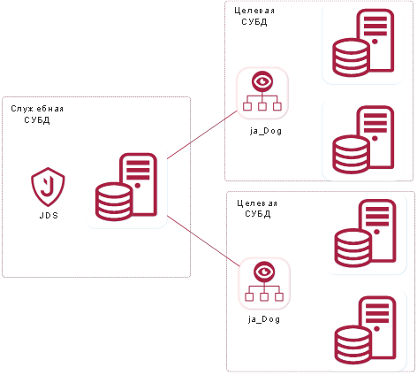
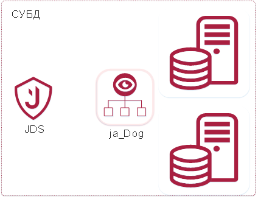

!!rule numbering lazy
!!rule numbering sections

# 2. Test

Схема работы компонента при клиент-серверном варианте представлена на рисунке [#].



Схема работы компонента при локальной установке представлена на рисунке [#].



При локальной установке должна учитываться дополнительная нагрузка на СУБД при сборе событий безопасности и размер свободного дискового пространства.

:::warning Важная информация
Использование компонента JDS в локальной установке допустимо, но не является желательной.

Рекомендуется использовать распределенную структуру, когда у компонента JDS есть своя служебная СУБД «Jatoba», т.е. клиент-серверный вариант, как описано выше.
:::

:::note
test
:::

# 3 Примеры
## [#] Пример с рисунком
На рисунке [#] показан кот.

![[#] Кот](../../assets/images/jds-gfm/image4.png)
![[#] Кот](../../assets/images/jds-gfm/image4.png)

## [#] Пример с листингом
В листинге [#] показан код.

```html [#] Одинокий div
<div></div>

SELECT * FROM users;
```

## [#] Пример с таблицей
В таблице [#] показаны результаты анализа.

[#] Результат анализа

Заголовок 1 | Заголовок 2
------------|-------------
текст       | текст
2           | 22
3           | 33

![[#] Мяч](../../assets/images/jds-gfm/image1.png)
На рисунке [#-1] был изображён кот

Ниже, на рисунках [#]-[#+2] изображены коты
![[#] Кот](../../assets/images/jds-gfm/image1.png)
![[#] Котик](../../assets/images/jds-gfm/image1.png)
![[#] Котяра](../../assets/images/jds-gfm/image1.png)
Выше, на рисунках [#-3]-[#-1] были изображены коты
