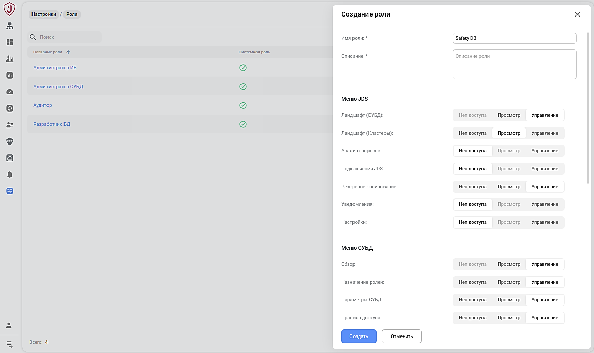
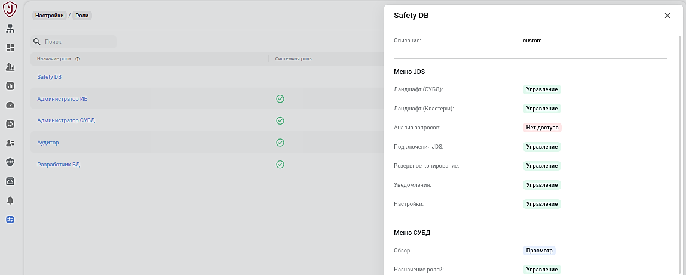
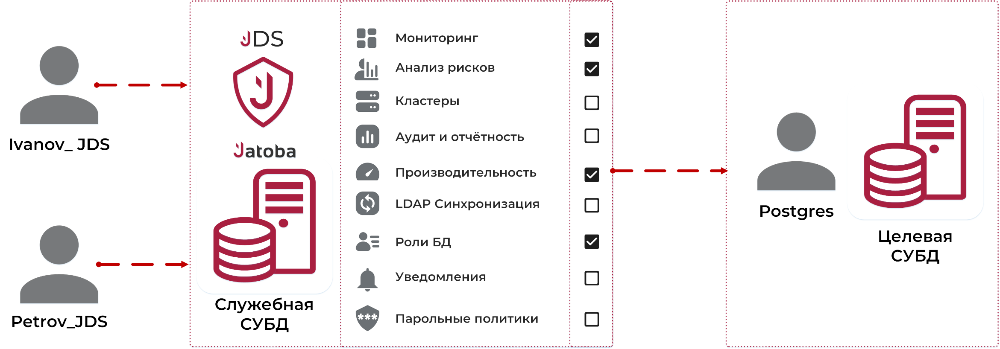
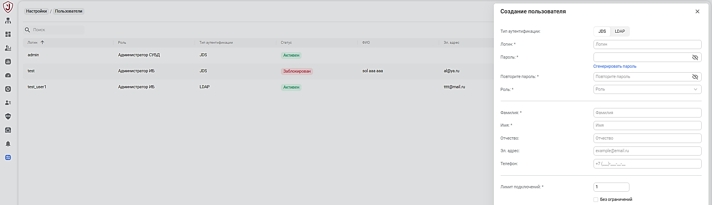
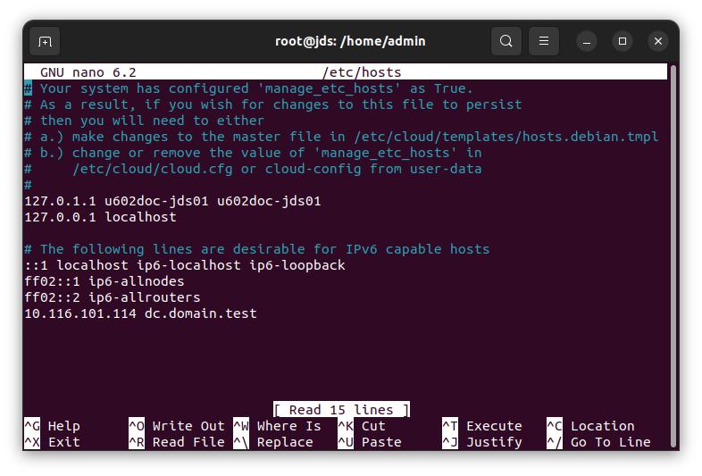
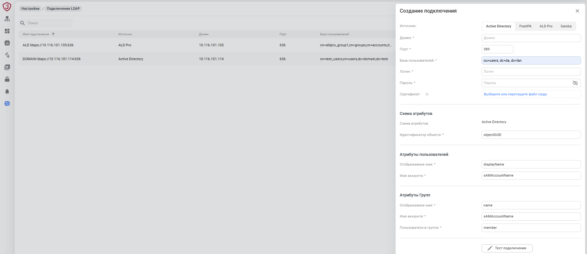

# Аутентификация пользователей JDS

Реализована двухкомпонентная ролевая модель.

Первым компонентом выступает ролевая модель JDS, в которую включена
доступность разделов.

Вторым компонентом ролевой модели является набор ролей в целевых СУБД,
которым предоставлены необходимые права и привилегии при инициализации
компонент и расширений СУБД.

При использовании ролевой модели пользователь JDS не будет знать учетных
данных для доступа к инсталляции СУБД, что обеспечивает безопасный
доступ к конфиденциальным данным.

### Ролевая модель JDS 

Компонент JDS для доступа разделам использует встроенную ролевую модель.
В ролевой модели предустановлены:

  - Администратор СУБД - обеспечивающий эффективное функционирование,
    безопасность, резервное копирование и оптимизации работы СУБД;

  - Аудитор - выполняющий внутренний или внешний комплексный аудит
    систем ИБ, в том числе СУБД;

  - Администратор ИБ - обеспечивающий защиту информации в
    автоматизированных ИС, контроль доступа, мониторинг и
    расследование инцидентов.

  - Разработчик БД – выполняющий разработку программного кода для
    манипулирования данными в БД, оптимизации работы БД в
    автоматизированных ИС.

Рисунок 2.1 – Роли JDS

Для каждой роли назначены не изменяемые права доступа к разделам
компонента описанные в таблице Таблица 2.1.

Таблица 2.1 – Назначенные
права

| **Раздел**    | **Подраздел**             | **Роль**               |             |                      |                    |
| ------------- | ------------------------- | ---------------------- | ----------- | -------------------- | ------------------ |
|               |                           | **Администратор СУБД** | **Аудитор** | **Администратор ИБ** | **Разработчик БД** |
| **Меню JDS ** | Ландшафт (СУБД)           | Управление             | Просмотр    | Просмотр             | Просмотр           |
|               | Ландшафт (Кластеры jaDog) | Управление             | Нет доступа | Нет доступа          | Нет доступа        |
|               | Мониторинг                | Управление             | Управление  | Управление           | Управление         |
|               | Анализ запросов           | Управление             | Нет доступа | Нет доступа          | Управление         |
|               | Подключения JDS           | Управление             | Нет доступа | Управление           | Нет доступа        |
|               | Резервное копирование     | Управление             | Просмотр    | Просмотр             | Нет доступа        |
|               | Снимки и отчеты           | Управление             | Нет доступа | Управление           | Управление         |
|               | Уведомления               | Управление             | Нет доступа | Управление           | Нет доступа        |
|               | Настройки                 | Управление             | Нет доступа | Нет доступа          | Нет доступа        |
| **Меню СУБД** | Обзор                     | Управление             | Просмотр    | Просмотр             | Просмотр           |
|               | Список БД                 | Управление             | Управление  | Управление           | Управление         |
|               | Параметры СУБД            | Управление             | Просмотр    | Просмотр             | Нет доступа        |
|               | Правила доступа           | Управление             | Просмотр    | Просмотр             | Нет доступа        |
|               | Доступные расширения      | Управление             | Нет доступа | Нет доступа          | Нет доступа        |
|               | Настройки для probackup   | Управление             | Нет доступа | Нет доступа          | Нет доступа        |
|               | Роли СУБД                 | Управление             | Нет доступа | Управление           | Нет доступа        |
|               | Список событий            | Управление             | Управление  | Управление           | Нет доступа        |
|               | Проблемы и решения        | Управление             | Нет доступа | Нет доступа          | Нет доступа        |
|               | Активность БД             | Управление             | Нет доступа | Управление           | Нет доступа        |
|               | LDAP синхронизация        | Управление             | Нет доступа | Нет доступа          | Нет доступа        |
|               | Парольные политики        | Управление             | Просмотр    | Управление           | Нет доступа        |
| **Меню БД**   | Обзор                     | Управление             | Просмотр    | Просмотр             | Просмотр           |
|               | Расширения                | Управление             | Нет доступа | Нет доступа          | Нет доступа        |
|               | Матрица доступа           | Управление             | Управление  | Управление           | Нет доступа        |
|               | Анализ рисков             | Управление             | Управление  | Управление           | Нет доступа        |

Предустановленные роли имеют атрибут «системные».

Дополнительно возможно создать специализированные роли, для которых
назначить особый набор прав доступа к каждому из подразделов. Набор
прав варьируется в зависимости от функциональной возможности их
назначения. Если такая возможность отсутствует, то название во
вкладке помечено серым цветом.

Рисунок 2.2 – Создание специализированной роли

Назначенные права доступа для роли возможно:

  - просмотреть при нажатии на гиперссылку роли в модальном окне

  - изменить через контекстное меню в строке роли.

Рисунок 2.3 – Окно просмотра назначенных прав доступа

### Модель ролевой консолидации JDS и целевой СУБД

В модели ролевой консолидации пользователь JDS получив доступ к разделам
дальнейшие действия в целевой СУБД выполняет от имени и с правами
привилегированного пользователя.

Рисунок 2.4 - Модель ролевой консолидации

При этом действия каждого пользователя регистрируются в журнале событий
компонента.

### Создание пользователей JDS

Создание пользователей возможно от имени и с правами администратора
компонента JDS и доступно на вкладке «Пользователи» раздела
«Настройки». Если подключения к целевым СУБД были созданы ранее,
то по умолчанию они будут доступны пользователю с ролью «Администратор»
и находиться в списке.

Вызов окна создания пользователей компонента JDS доступен через
пиктограмму «Add», как представлено на рисунке Рисунок 2.5.

Рисунок 2.5 – Вкладка «Пользователи» («Users»)

В открывшимся окне потребуется установить параметры, приведенные в
таблице Таблица 2.2

Таблица 2.2 – Параметры создания
пользователя

| **№** | **Параметр**      | **Параметр (ENG)** | **Обязательность параметра** | **Тип поля**      |
| ----- | ----------------- | ------------------ | ---------------------------- | ----------------- |
| 1     | Логин             | Username           | Обязательный                 | Текстовое         |
| 2     | Пароль            | Password           | Обязательный                 | Текстовое         |
| 3     | Повторить пароль  | Repeat password    | Обязательный                 | Текстовое         |
| 4     | Роль              | Role               | Обязательный                 | Выпадающий список |
| 5     | Фамилия           | Last name          | Обязательный                 | Текстовое         |
| 6     | Имя               | First name         | Обязательный                 | Текстовое         |
| 7     | Отчество          | Middle name        | Необязательный               | Текстовое         |
| 8     | Эл. адрес         | E-mail             | Необязательный               | Текстовое         |
| 9     | Телефон           | Phone              | Необязательный               | Текстовое         |
| 10    | Лимит подключений | Connection limit   | Обязательный                 | Текстовое         |

При успешном создании пользователя, его учетная запись появится в списке
пользователей JDS.

Далее станут доступны операции по корректировке учетной записи
пользователя через контекстное меню:

  - Сменить пароль (Change password);

  - Редактировать;

  - Удалить (Delete).

### Подключения LDAP 

JDS поддерживает подключение пользователя компонента из активных
каталогов, таких как: Active Directory, FreeIPA, ALD Pro и Samba
используя отдельную группу пользователей LDAP.

:::warning[Предупреждение]
Во избежание проблем с подключением, рекомендуется в дереве каталогов LDAP проводить преднастройку - создание отдельной группы пользователей LDAP, для упрощения подключения и добавления пользователей, например ограничивать базы поиска до &quot;ou=users, dc=da, dc=lan&quot; (ActiveDirectory/SAMBA) или до определенной группы (cn=my_group, dc=da, dc=lan) для FreeIPA и ALDPro.
Примеры создания групп пользователей приведены в документе «Руководство по настройке. Часть 8. Синхронизация учетных записей служб каталогов и СУБД. Компонент «ja_Sync_LDAP».
:::

В рассматриваемом примере будет использоваться база поиска до "ou=users,
dc=da, dc=lan".

Перед настройкой подключения, если требуется подключение по доменному
имени, на хосте с JDS прописывается подключение к активному каталогу
командой:

> nano /etc/hosts

Внести IP-адрес и имя активного каталога.

Например

> 10.116.101.114 dc.domain.test

Рисунок 2.6 – Редактирование конфигурационного файла подключений

Вкладка «Подключения LDAP» находится в разделе «Настройки».

Создание подключения к активному каталогу выполняется нажатием кнопки
«Добавить подключение», которое вызовет окно «Создание подключения».

Рисунок 2.7 - Окно «Новое подключение»

Устанавливаются следующие параметры:

  - Источник: тип ОС активного каталога Active Directory, FreeIPA, ALD
    Pro или Samba

  - Домен: \* - IP-адрес или DNS имя хоста активного каталога;

  - Порт: \* - порт подключения;

  - База пользователей: \* - база поиска активного каталога, в которой
    может использоваться организационная группа (ou) и/или группа
    (cn);

  - Логин: \* - имя пользователя, имеющего административные привилегии;

  - Пароль: \* - пароль пользователя;

  - Сертификат: - сертификат в формате \*.pfx.

**Схема атрибутов**

  - Схема атрибутов: - схема устройства каталога LDAP того или иного
    типа. Устанавливается автоматически в зависимости от выбранного
    типа активного каталога

  - Идентификатор объекта: \* - атрибут, значение которого является
    уникальным идентификатором объекта в дереве структуры каталогов
    LDAP.

**Атрибуты пользователей**

  - Отображаемое имя: \* - атрибут, значение которого используется для
    отображения записи пользователя в дереве структуры каталогов LDAP.

  - Имя аккаунта: \* - атрибут, значение которого содержит имя
    пользователя, под которым он входит в систему и проходит
    аутентификацию.

**Атрибуты Групп**

  - Отображаемое имя: \* - атрибут группы, значение которого
    используется для отображения записи группы в дереве
    структуры каталогов LDAP;

  - Имя аккаунта: \*- атрибут группы, значение которого содержит имя,
    под которым она зарегистрирована в дереве каталогов LDAP.;

  - Пользователи в группе: \* - атрибут группы, значение которого
    содержит информацию о пользователях, состоящих в этой группе.

Созданное подключение отразится в общем списке подключений.

#### Создание пользователя JDS c LDAP аутентификацией

Пользователь JDS с LDAP аутентификацией создаётся во вкладке
«Пользователи» раздела «Настройки». В окне «Создание
пользователя» выбирается Вкладка «LDAP» и из выпадающих списков
устанавливаются параметры:

  - Домен-сервер: \* - сервер активного каталога;

  - Пользователь \* - пользователь активного каталога;

  - Роль: \* - назначаемая роль пользователю в JDS;

> Дополнительно устанавливается «Лимит подключений».

Рисунок 2.8 – Окно «Создание пользователя» JDS с LDAP аутентификацией

Остальные данные пользователя будут загружены автоматически.

#### Создание пользователей JDS из группы c LDAP аутентификацией

Для создания пользователей JDS из группы активного каталога c LDAP
аутентификацией создаётся группа пользователей во вкладке
«Пользователи» раздела «Настройки».

В окне «Создание пользователя» выбирается вкладка «LDAP» и «Группа». Из
выпадающих списков устанавливаются параметры:

  - Домен-сервер: \* - сервер активного каталога;

  - Группа \* - группа активного каталога;

  - Роль: \* - назначаемая роль группе пользователей в JDS;

Автоматически загрузятся данные о группе, количестве пользователей и
выведется список пользователей.

Выбор пользователей из группы недоступен.

> Дополнительно устанавливается «Лимит подключений».

Рисунок 2.9 – Создание группы пользователей с LDAP аутентификацией

После нажатия кнопки «Создать» выполнится синхронизация с группой
активного каталога.

В последствии если один или несколько пользователей будут удалены из
пользователей JDS, то при повторном создании пользователей JDS из
той же группы будут выбраны для синхронизации отсутствующие в списке
пользователей JDS пользователи активного каталога.

#### LDAP аутентификация пользователей JDS

На стартовой странице JDS для LDAP аутентификации пользователи должны
выбрать вкладку «LDAP», сервер LDAP, ввести логин (имя пользователя)
и пароль активного каталога.

Рисунок 2.10 – LDAP аутентификация

#### Обновление настроек LDAP аутентификации пользователей JDS с версии 2.9 на 2.10 JDS

В связи с расширением функциональности подключения и чтения LDAP
каталогов в части работ с группами пользователей, при переходе с
JDS версии 2.9 на 2.10 и выше, необходимо обеспечить обновление
параметров подключения к LDAP серверам по набору параметров по
умолчанию, а именно по схеме атрибутов "Active Directory".

Если подключение к LDAP серверу в версии JDS 2.9 было сделано к типу
каталогов Active Directory (Microsoft), при миграции данных на
версию JDS 2.10 и выше, никаких дополнительных действий по
настройке подключения не требуется. В ином случае,
администратору необходимо авторизоваться под локальной
учетной записью JDS и в форме редактирования подключения указать
нужный тип LDAP каталога - FreeIPA, ALDPro или Samba.

