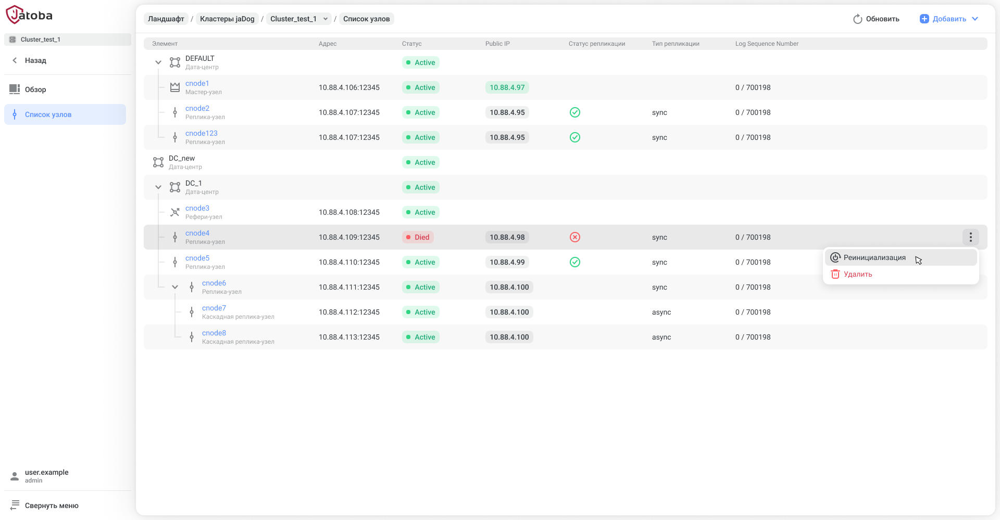
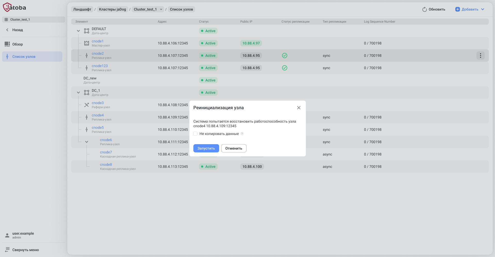

# АННОТАЦИЯ

В данном руководстве приведены сведения, необходимые для установки и
эксплуатации компонента пользовательского веб-интерфейса для
администраторов  
«Jatoba data safe» (далее по тексту – компонент или JDS).

Степени важности примечаний, применяемые в
документе:

:::warning[Важная информация]
указания, требующие особого внимания
:::

:::info[Дополнительная информация]
указания, позволяющие упростить работу с изделием
:::

--------------------

:::info[Дополнительная информация]
Для СУБД «Jatoba» версии ядра 4, 5, 6 и 18 используется версия компонента — 2.11.
:::

:::warning[Важная информация]
Для сертифицированной версии СУБД «Jatoba» поддерживается работа только на ОС, указанных в формуляре на поставку!
:::


# Ниже - временные главы


## Отключение кластера от JDS

Отключение кластера выполняется через кнопку «Отключить» в правом
верхнем углу во вкладке «Обзор» на уровне «Кластеры jaDog».

Данная операция подразумевает отключение кластера от инфраструктуры JDS.
При этом он продолжить функционировать, но не будет отражаться во
вкладке «Кластеры jaDog».


Рисунок 19.23 – Контекстное меню кластера.

После выбора опции «Отключить» компонент выведет окно подтверждения
действия.


Рисунок 19.24 – Окно «отключение кластера»

Отключенный кластер можно вновь подключить способом, описанным в
документе «Руководство по безопасности».

## Режим «технического обслуживания» (maintenance)

Режим технического обслуживания используется для кластера и для
отдельного узла.

Кластер в режиме ТО продолжает принимать запросы от пользователей и
обрабатывать их, но все рабочие узлы: Master и Slave, кроме
Referee, перестают выполнять процедуру обработки отказа.

Узел кластера в режиме ТО перестает выполнять процедуру обработки
отказа, при этом кластер остается работоспособен.

**Кластер в режиме ТО**

Ввод режима технического обслуживания кластера выполняется переходом по
пути:

  - Раздел Ландшафт → Кластеры jaDog → Обзор (кластера) → Кнопка
    «Включить режим обслуживания».


Рисунок 19.25 - Кнопка «Включить режим обслуживания»

Перед включением режима ТО компонент выведет информационное сообщение.


Рисунок 19.26 – Информационное сообщение о включении режима ТО

Согласие вызовет процесс перехода в режим ТО.

Для перехода всех улов кластера в режим ТО, может потребоваться
некоторое время.

Просмотреть состояние кластера возможно через вкладку «Список узлов».


Рисунок 19.27 – Список узлов кластера в режиме ТО

На данном шаге перевод кластера в режим технического обслуживания
закончен.

С узлами кластера доступны все операции, не приводящие к процедуре
отказа в обслуживании.

Вывод из режима технического обслуживания кластера выполняется переходом
по пути:

  - Раздел Ландшафт → Кластеры jaDog → Обзор (кластера) → Кнопка
    «Отключить режим обслуживания».

Если кластер был введен в режим ТО, то отдельный вывод узлов кластера из
данного режима недоступен.

**Узел кластера в режиме ТО**

Вывод режима технического обслуживания кластера выполняется переходом по
пути:

  - Раздел Ландшафт → Кластеры jaDog → Список узлов

В строке узла кластера, через контекстное меню, выбирается опция
«Включить режим обслуживания».


Рисунок 19.28 - опция «Включить режим обслуживания» к строке узла
кластера

Перед включением режима ТО для узла кластера компонент выведет
информационное сообщение.

Согласие вызовет процесс перехода в режим ТО узла кластера.

В случае, когда узел связан каскадной репликацией с другим узлом, данный
узел также будет переведен в режим ТО.


Рисунок 19.29 – Узлы с каскадной репликацией в режиме ТО

Вывод из режима технического обслуживания узла кластера выполняется
переходом по пути:

  - Раздел Ландшафт → Кластеры jaDog → Список узлов.

В строке узла кластера, через контекстное меню, выбирается опция
«Отключить режим обслуживания».

## Реинициализация (Reinit) неработоспособного узла (DIED)

Узел в состоянии неработоспособности (DIED) возможно отсоединить от
кластера и вновь подключить. Однако это достаточно трудоемкая и
долгая операция.

Целесообразно использовать процедуру реинициализации узла.

В списке узлов кластера, только для узла в статусе (DIED), в контекстном
меню, доступна опция «Реинициализация».

Операция «Реинициализация» доступна в режиме:

  - реинициализации узла кластера с копированием данных с узла с ролью
    «Master»;



Рисунок 19.30 – Запуск реинициализации узла кластера

  - реинициализации узла кластера без копирования данных с узла с ролью
    «Master».



Рисунок 19.31 Запуск реинициализации узла кластера без копирования
данных

Подтвердив операцию узел перейдет в режиме восстановления (RECOVERY).
При успешном выполнении операции узел станет активным.

# Раздел «Мониторинг» (Monitoring)

Раздел «Мониторинг» предназначен для отображения оперативной информации
в форме графических и цифровых панелей (виджетов) о целевой СУБД и ОС,
на которой она установлена.

Настройка подключения описана в п. 2.3 «Вкладка «Источники данных»
настоящего документа.

Информация собирается с компонент:

  - «node\_exporter» – предназначен для мониторинга и сбора метрик с
    различных компонентов в системе на основе ОС Linux;

  - «postgres\_exporter» – предназначен для сбора и экспорта метрик
    СУБД, таких как статистика по базе данных, нагрузка на сервер,
    количество запросов и т. д.;

  - «sql\_exporter» – предназначен для экспорта данных из SQL-запросов в
    формат, удобный для анализа и визуализации.

Информацию аккумулирует система «PROMETHEUS» и передаёт ее в подраздел
«Панель» JDS. Утилита «Alertmanager» обеспечивает контроль над
пороговыми значениями и рассылку уведомлений.

Схема взаимодействия компонент представлена на рисунке Рисунок 20.1.

Рисунок 20.1 – Схема взаимодействия компонент для сбора метрик

Настройка вышеуказанных компонент описана в документе «Руководство по
настройке. Часть 28. Поддержка мониторинга СУБД».

Во вкладке «Мониторинг» отображаются предустановленный набор виджетов.


Рисунок 20.2 – Предустановленные виджеты

В верхней строке доступен выбор:

  - контролируемой СУБД;

  - всех баз данных или единственной БД;

  - периода контроля;

  - периодичности обновления вкладки;

  - библиотека виджетов.

Рабочее пространство возможно организовать созданием вкладок с виджетами
или простым выбором виджетов.

## Библиотека виджетов

Библиотека виджетов структурирована по двум вкладкам. На вкладке
«Сервер» располагаются виджеты, относящиеся к используемой ОС.
На вкладке «БД» располагаются виджеты, относящиеся к работе баз
данных.

Перечень используемых виджетов, находящихся в библиотеке виджетов,
приведенных в таблице Таблица 20.1.

Таблица 20.1 – Перечень виджетов в библиотеке
виджетов

| **Вкладка библиотеки виджетов** | **Виджет**                                       | **Метрика**                          |
| ------------------------------- | ------------------------------------------------ | ------------------------------------ |
| **Сервер**                      | Использование ЦПУ                                | ЦПУ, нагрузка                        |
| **Сервер**                      | Дисковый ввод/вывод                              | диск, чтение, запись                 |
| **Сервер**                      | Дисковых операций ввода/вывода                   | диск, чтение, запись, нагрузка       |
| **Сервер**                      | Версия ОС                                        | версия                               |
| **Сервер**                      | Использование ОЗУ                                | ОЗУ, нагрузка                        |
| **Сервер**                      | Дисковый ввод/вывод                              | диск, чтение, запись, нагрузка       |
| **Сервер**                      | Использование диска                              | диск, чтение, запись, нагрузка       |
| **Сервер**                      | Свободное пространство                           | диск, размер                         |
| **Сервер**                      | Сетевой ввод/вывод                               | сеть, чтение, запись, нагрузка       |
| **Сервер**                      | Загрузка системы (load average 1/5/15 min)       | ЦПУ, нагрузка                        |
| **БД**                          | Версия БД                                        | версия (PostgreSQL/Jatoba)           |
| **БД**                          | Количество сессий по состояниям                  | сессии, нагрузка                     |
| **БД**                          | Число транзакций в секунду                       | нагрузка                             |
| **БД**                          | Длительность работы БД                           | длительность                         |
| **БД**                          | Размер БД                                        | размер                               |
| **БД**                          | Количество заблокированных и ожидающих сессий    | сессии, конфликты                    |
| **БД**                          | Изменение размеров БД                            | Размер, запись                       |
| **БД**                          | Общее количество сессий                          | Сессии, нагрузка                     |
| **БД**                          | Блокировки                                       | конфликты                            |
| **БД**                          | Взаимоблокировки, конфликты                      | конфликты                            |
| **БД**                          | Максимальный возраст незамороженных транзакций   | длительность                         |
| **БД**                          | Работа со строками данных                        | Строки, чтение, запись               |
| **БД**                          | Максимальная продолжительность запросов/ожиданий | Сессии, конфликты, длительность      |
| **БД**                          | Автовакуумы и их длительность                    | Сессии, длительность                 |
| **БД**                          | Интенсивность контрольных точек                  | WAL, контрольные точки, нагрузка     |
| **БД**                          | Объем WAL                                        | WAL, запись размер                   |
| **БД**                          | Интенсивность работы с буферами                  | WAL, чтение, запись                  |
| **БД**                          | Длительность обработки контрольных точек         | WAL, контрольные точки, длительность |
| **БД**                          | Доля чтения из кэша                              | чтение                               |
| **БД**                          | Запись во временные файлы                        | размер, чтение                       |
| **БД**                          | Количество транзакций и их откатов               | нагрузка                             |

На панель виджеты добавляются нажатием кнопки «Библиотека виджетов». В
окне «Библиотека виджетов» выбираются требуемые виджеты, которые будут
выстраиваться в окне вертикально.

Выбор требуемых виджетов возможно выполнить через поле «поиск» и/или
используя фильтр по метрикам, приведенным в таблице Таблица 20.1. В
фильтре метрик виджетов доступен множественный выбор.


Рисунок 20.3 – Окно «Библиотека виджетов»

После сохранения выбора, виджеты можно:

  - изменять размер и адаптировать размер виджета на нестандартный;

  - перемещать по пространству окна.

Компонент запомнит и сохранит их расположение и размер.

Виджет автоматически загрузит данные метрик. В случае их отсутствия на
виджете выводится информация о причине отсутствия данных:

  - Prometheus не вернул данных, так как СУБД не существует в заданном
    периоде или не настроен ни один экспортёр (Prometheus did not
    return data because the DBMS does not exist in the specified period
    or no exporter is configured)

Такое может произойти, если пользователь выбрал СУБД, а затем сменил
период наблюдения на тот, в котором этой СУБД ещё/уже не
существовало; при выборе периода список СУБД
инициализируется заново, но выбор пользователя в
отношении СУБД остается):

  - В заданном периоде БД \<datname\> не существует (The database
    \<datname\> does not exist in the specified period)

Такое может произойти, если пользователь выбрал БД, а затем сменил
период наблюдения на тот, в котором этой БД ещё/уже не
существовало; при выборе периода список БД инициализируется
заново, но выбор пользователя в отношении БД остается.

  - Для указанных параметров Prometheus не вернул данных, возможно, не
    настроен \<exporter\_type\>-экспортёр (Prometheus did not return
    data for the specified parameters, perhaps the
    \<exporter\_type\>-exporter is not configured properly)

Нужный для виджета экспортёр может быть не подключен, не
сконфигурирован, не отвечать по каким-то причинам, из-за
чего в Prometheus не сохраняются нужные данные; также может быть, что
не удается выполнить сопоставление адреса экспортера и адреса СУБД,
отсутствуют метрики pg\_static, pg\_server, node\_os\_info.

  - В заданном периоде показатели равны нулю (There are only zero values
    in the specified period)

Все временные ряды были отброшены при подготовке данных, поскольку
содержали только нулевые значения.

## Добавление панели виджетов

Помимо имеющейся панели виджетов «Default», существует функциональная
возможность добавления новых панелей через кнопку «Добавить панель».

Панели имеют градацию на:

  - СУБД;

  - Citus;

  - jaDog.

> Визуально отличаются значками.


Рисунок 20.4 – Окно добавления панели виджетов

Максимальное количество панелей виджетов, которые доступно добавить, не
более 30.

На узком экране вкладки панелей виджетов автоматически свернуться в
общую вкладку «Другие» в форме выпадающего списка.

## Панель виджетов для кластера ja_Hipe_Cluster

Воспользоваться панелью виджетов для кластера на основе компонента
«ja\_Hipe\_Cluster» возможно, когда экспортеры и система «Prometheus»
настроена. Описание настройки приведено в документе «Руководство по
настройке. Часть 28. Поддержка мониторинга СУБД».

Набор виджетов для кластера ограничен и приведен в таблице Таблица 20.2

Таблица 20.2 – Перечень виджетов для
ja\_Hipe\_Cluster

| **Тип виджета** | **Виджет**                                       | **Метрика**                     | **Описание**                                                       |
| --------------- | ------------------------------------------------ | ------------------------------- | ------------------------------------------------------------------ |
|                 | Использование сессий узлами                      | Сессии, нагрузка                | общее кол-во сессий на каждом узле кластере с учетом ретроспективы |
| **Сервер**      | Использование диска                              | диск, нагрузка                  |                                                                    |
|                 | Объём шардированных таблиц                       | размер                          |                                                                    |
| **Сервер**      | Использование ЦПУ                                | ЦПУ, нагрузка                   |                                                                    |
| **Сервер**      | Использование ОЗУ                                | ОЗУ, нагрузка                   |                                                                    |
| **БД**          | Число транзакций в секунду                       | нагрузка                        |                                                                    |
| **Сервер**      | Сетевой ввод/вывод                               | сеть, нагрузка                  |                                                                    |
|                 | Количество узлов                                 | Доступность                     |                                                                    |
|                 | Максимальная продолжительность запросов/ожиданий | Сессии, конфликты, длительность |                                                                    |
|                 | Состояние узлов                                  | Доступность                     |                                                                    |
|                 | Общее количество сессий                          | Сессии, нагрузка                | количество сессий к СУБД                                           |

На виджетах отображаются графы для каждого узла кластера.

Легенда виджетов является активной. При нажатии на легенду узла кластера
в виджете контрастно отразится граф только выбранного узла. Остальные
графы изменят контрастность.


Рисунок 20.5 – Виджеты кластера

## Панель виджетов для кластера jaDog

Воспользоваться панелью виджетов для кластера на основе компонента
«ja\_Hipe\_Cluster» возможно, когда экспортеры и система «Prometheus»
настроена. Описание настройки приведено в документе «Руководство по
настройке. Часть 28. Поддержка мониторинга СУБД».

Доступен единственный виджет «Состояние узлов».


Рисунок 20.6 – Панель виджетов для кластера jaDog

## Уведомления. Информирование о заданном значении показателя

Виджеты, отражающие динамические значения, оснащены механизмом
уведомлений. Этот механизм активируется через контекстное меню
виджета, выбором опции «Уведомления».


Рисунок 20.7 – Контекстное меню виджета

Выбор данной опции вызовет окно настройки уведомлений.


Рисунок 20.8 – Окно уведомления

Добавление уведомления доступно нажатием на кнопку «+ Добавить
уведомление».

Каждый виджет может быть настроен на несколько уведомлений, для
нескольких объектов контроля и имеет собственные настройки, в
которых устанавливаются пороговые значения по типам условий.

Такая конструкция уведомлений позволяет:

  - устанавливать объекты контроля;

  - создавать условие на любой объект;

  - отслеживать выход метрики за пределы заданного диапазона и наоборот;

  - следить за метриками, которые:

  - в нормальном состоянии колеблются в определенном "коридоре" величин;

  - в ненормальном состоянии выходят из «коридора» величин, как в
    большую, так и в меньшую сторону.


Рисунок 20.9 – Настройка уведомлений для виджета

Уведомления настраиваются пользователями самостоятельно и будут
отправляться на E-mail, указанный в карточке пользователя (см.
п 2.1.3). Также уведомления приходят в Telegram и Zulip. Изменить
созданные уведомления может только создавший их пользователь.

Создать «Уведомления» от имени и с правами пользователя JDS «admin»
невозможно, т.к. у данной учетной записи отсутствует E-mail и не
может быть добавлен.

# Раздел «Анализ запросов» (Query analysis)

Подраздел «Анализ запросов» предоставляет:

  - отображение визуализации плана запроса средствами Pg-explain;

  - отображение списка планов запросов по нескольким критериям отбора и
    переход по ссылке из выбранного плана запроса на страницу анализа
    плана запроса;

  - возможность ручного ввода плана запроса.

Настройка требуемых компонентов и подключение к JDS описано в документе
«Руководство по настройке. Часть 24. Поддержка мониторинга СУБД в части
анализа
запросов».

|                         |                                                                                               |
| ----------------------- | --------------------------------------------------------------------------------------------- |
|  | Подраздел «Анализ запросов» (Query analysis) не поддерживается версией ядра «4» СУБД «Jatoba» |

## Вкладка «Запросы»

Вкладка «Запросы» отображает планы запросов с некоей большой
длительностью выполнения.

Отображаются поля:

  - Host – IP-адрес хоста;

  - Наименование хоста – условное наименование хоста;

  - Всего – количество отобранных планов запросов из лога pg-monitor;

  - Шаблонов – значение количества шаблонов и ссылка для перехода к
    списку планов запросов выбранной СУБД;

  - Timeline – графическое представление распределения запросов по
    времени суток.

По умолчанию отображаются запросы на текущую дату.


Рисунок 21.1 – Вид вкладки «Запросы»

При нажатии на гиперссылку количества шаблонов вкладка «Запросы»
перестроится и отобразит вкладку «по шаблонам».

На вкладке «по шаблонам» отображаются поля:

  - шаблон – план уникального запроса без учета повторов его выполнения;

  - метод;

  - app – приложение, отправившее запрос;

  - rол-во – всего повторов выполнения этого запроса;

  - sum, мс – суммарное время выполнения всех запросов одного шаблона;

  - avg, мс – среднее время выполнения запроса;

  - buf:mem – требуемая оперативная память для выполнения запроса;

  - buf:dsk – требуемое дисковое пространство для выполнения запроса;

  - % – доля дисковых ресурсов для выполнения запроса;

  - last – последнее по времени выполнение запроса – ссылка для перехода
    к визуализации плана запроса;

  - Timeline – графическое представление распределения запросов по
    времени суток.


Рисунок 21.2 – Вкладка «по шаблонам»

**Визуализация плана запроса**

При клике по конкретному шаблону открывается список запусков запроса по
времени.


Рисунок 21.3 - Список запусков запроса по времени

При выборе конкретного запроса из списка планов запросов и нажатию по
значению в поле «last» открываются вкладки визуализации запроса:

  - вкладка «explain»;


Рисунок 21.4 – Визуализация explain по узлам

Визуализированный план запроса возможно экспортировать в PDF-файл через
пиктограмму «Adobe Acrobat».

  - вкладка «диаграмма»;


Рисунок 21.5 – Визуализация на вкладке «диаграмма»

  - вкладка «отношения»;


Рисунок 21.6 – Визуализация на вкладке «отношения»

  - вкладка «план»;


Рисунок 21.7 – Визуализация на вкладке «план»

  - вкладка «модель»;


Рисунок 21.8 – Визуализация на вкладке «модель»

  - вкладка «оригинал».


Рисунок 21.9 – Визуализация на вкладке «оригинал»

## Вкладка «Мегазапросы»

Вкладка «Мегазапросы» отображает планы запросов, имеющие хотя бы одну из
особенностей:

  - большой объем возвращаемой выборки;

  - большое количество используемых в запросе параметров;

  - большой размер запроса;

  - большая длительность передачи результатов запроса от сервера.


Рисунок 21.10 – Вид вкладки «Мегазапросы»

При выборе вкладки отображается список подключенных СУБД и следующие
поля:

  - «Host» – IP-адрес хоста;

  - «Наименование хоста» – условное наименование хоста;

  - «Resultset» – количество по признаку большого объема возвращаемой
    выборки – ссылка к списку планов запросов, отфильтрованных по
    выбранному параметру;

  - «Params» – количество, большое число используемых параметров в
    запросе – ссылка;

  - «Query» – количество, большой размер текста запроса – ссылка;

  - «Diff» – количество, большая длительность передачи результатов
    запроса от сервера – ссылка;

  - «Timeline» – график времени, когда выполнялись запросы.

При нажатии на гиперссылки «Resultset» или «Diff» вкладка «Мегазапросы»
перестроится и отобразит вкладку «по приложениям».


Рисунок 21.11 – Вкладка «по приложениям»

Вкладка «по приложениям» отображает поля:

  - «Приложение» – приложение отправившее запрос;

  - «Метод» – метод, используемый в плане для выполнения определенной
    операции;

  - «Кол-во» – число выполнения запросов;

  - «Duration» – суммарное время выполнения запросов с учетом передачи
    их результатов от сервера – фактическое время;

  - «Exectime» – суммарное время выполнения запросов – ожидаемое время;

  - «Diff» – разность суммарных фактического и ожидаемого времени -
    суммарное время передачи результата запроса;

  - «+%» – отношение времени передачи результата запроса к времени
    выполнения запроса, в процентах;

  - «Last» – время последнего выполнения запроса;

  - «Timeline» – график времени, когда выполнялись запросы.

Нажатие по значению времени в поле «Last» откроет визуализацию плана
запроса.

В теле вывода визуализации плана запроса присутствует гиперссылка
«перейти к анализу». Нажав на которую, вкладка перестроится и
отразит вкладки визуализации, как было описано выше:

  - вкладка
    «[explain](https://10.116.101.109:8444/archive/explain/e79d9630-dc46-11ee-8b7c-a58085cdfda4:0:2024-03-07#explain)»;

  - вкладка
    «[диаграмма](https://10.116.101.109:8444/archive/explain/e79d9630-dc46-11ee-8b7c-a58085cdfda4:0:2024-03-07#visio)»;

  - вкладка «отношения»;

  - вкладка «план»;

  - вкладка «модель»;

  - вкладка «оригинал».


Рисунок 21.12 – Вкладки визуализации запроса.

## Вкладка «Блокировки»

Вкладка «Блокировки» отображает планы запросов, в результате которых
потребовалось блокировать ресурсы данных. Отображаются поля:

  - «Host» – IP-адрес хоста;

  - «Наименование хоста» – условное наименование хоста;

  - «deadlock» – взаимные блокировки ресурсов, требуемых для двух
    запросов;

  - «lock» – обычная блокировка ресурсов данных требуемая для выполнения
    конкретного запроса;

  - «Timeline» – графическое представление распределения запросов по
    времени суток.


Рисунок 21.13 – Вид вкладки «Блокировки»

Нажатие по значению в поле «lock» открывает агрегированный список
запросов на вкладке «по типам», сгруппированный по типам
блокировок, по приложениям, по времени.

Отображаются поля:

  - «mode» – тип блокировки ресурса;

  - «type» – область действия блокировки;

  - «приложение» – при клике разворачивается список, где дополнительно
    отображается PID и приложение;

  - «объект блокировки» – объект блокировки;

  - «sum, мс» – суммарное время выполнения запросов;

  - «кол-во» – количество запросов в агрегированной строке группы;

  - «last» – время начала выполнения последнего запроса – ссылка;

  - «Timeline» – графическое представление распределения запросов по
    времени суток.


Рисунок 21.14 – Вкладка «по типам»

Кликнув по значению в поле «last» пользователь должен увидеть страницу
анализа плана выполнения запроса, выполнявшегося последним, где можно
найти данные по блокировке.

Далее, выбрав ссылку «Перейти к анализу», можно перейти к блоку
визуализации плана запроса, рядом с которым расположена ссылка.


Рисунок 21.15 – Вывод анализа плана запроса

На данной странице анализа планов запросов, входящих в шаблон, можно
увидеть информацию о блокировке.

## Вкладка «Ошибки»

Во вкладке «Ошибки» отражаются ошибки на целевых СУБД сортированные по
датам:

  - по хостам (см. п. 21.4.2);

  - по ошибкам (см. п. 21.4.2);

> отображаемых в одноименных ссылках (вкладках).

### Вкладка «по хостам»

Вкладка отображает количество ошибок, с делением по критичности, на всех
хостах.

Во вкладке «по хостам» отображаются столбцы:

  - Host - наименование хоста СУБД;

  - Fatal - высокая критичность ошибки выполнения запроса;

  - Error - обычная критичность ошибки выполнения запроса;

  - Warning - предупреждение о проблеме выполнения запроса;

  - Timeline - графическое представление распределения запросов по
    времени суток

Нажатие на количество ошибок в строке хоста вызовет переход страницу
списка классов ошибок для выбранного хоста.


Рисунок 21.16 – Вкладка «по хостам»

**Страница списка классов ошибок для выбранного хоста**

Страница отображает список наименований классов ошибок выполнения
запросов с отображением числа приложений, где встречаются ошибки,
количества случаев каждого класса ошибок и распределением по времени за
выбранные сутки.

На странице отображаются столбцы, описанные в таблице Таблица 21.1.

Таблица 21.1 – Столбцы страницы списка классов ошибок для выбранного
хоста

| **Поля**     | **Описание **                                                                                                                                           |
| ------------ | ------------------------------------------------------------------------------------------------------------------------------------------------------- |
| Класс ошибки | наименование класса ошибок, зарегистрированных на конкретном хосте                                                                                      |
| Методы       | наименования приложений и методов вызывавших запросы с ошибками (если более 1 приложения,  то список наименований приложений скрыты в свернутую строку) |
| app/arg      | количество приложений                                                                                                                                   |
| Кол-во       | количество случаев ошибок конкретного класса                                                                                                            |
| last         | последнее время выполнения запроса                                                                                                                      |
| Timeline     | графическое представление распределения запросов по времени суток                                                                                       |

<span class="underline"> </span>


Рисунок 21.17 - Страница списка классов ошибок для выбранного хоста

Выбрав класс ошибки и нажав на ее строку развернется список ошибок,
разграниченных по времени.

**Страница описания запроса, выполненного с ошибкой**

Выбрав время выполнение запроса, открывается Страница описания запроса,
выполненного с ошибкой, которая содержит строку краткого описания
ошибки, с указанием критичности ошибки.


Рисунок 21.18 - Страница описания запроса, выполненного с ошибкой

Полное описание ошибки показывается при нажатии на ее строку.


Рисунок 21.19 – Полное описание ошибки

Пиктограмма «Скопировать» копирует в буфер обмена полное описание
ошибки.

### Вкладка «по ошибкам»

Вкладка отображает количество ошибок, без деления по критичности, на
всех хостах.

Во вкладке «по ошибкам» отображаются столбцы:

  - Ошибка - наименование класса ошибки;

  - Количество - количество ошибок конкретного класса;

  - hosts - число хостов, где зарегистрированы ошибки данного класса;

  - last - время последнего выполнения запроса с ошибкой данного класса;

  - Timeline - графическое представление распределения запросов по
    времени суток.


Рисунок 21.20 - Вкладка «по ошибкам»

Выбрав и развернув строку выбранного класса ошибки, отобразится список
хостов, где выполнялись запросы с ошибками выбранного класса.

В случае последующего выбора хоста из развернутого списка, компонент
выполнит переход на страницу "Страница списка классов ошибок для
выбранного хоста", описанную ранее.

В случае выбора времени последнего выполнения запроса, система выполнит
переход на страницу "Страница описания запроса, выполненного с
ошибкой", описанную ранее.


Рисунок 21.21 – Список хостов на которых проявилась ошибка

## Вкладка «Статистика»

Во вкладке отображается статистическая и аналитическая информация об
объекте мониторинга на основе журнала аудита СУБД. Для чего во
вкладке «Настройки» (см. п. 21.6) устанавливаются дополнительные
параметры журнала аудита СУБД.

Установленная дата календаря отображает статистическую информацию по
полям:

  - Relations - снепшоты состояния таблиц;

  - RU/SA - статистика использования ресурсов;

  - Stats - снепшоты статистики по таблицам;

  - Analyze - события применения команды;

  - Vacuum - события применения команды;

  - Checkpoint - события применения команды;

  - Timelime – линия времени.

При переходе по кликабельным пиктограммам и значениям открываются
страницы с данными статистики.


Рисунок 21.22 – Вкладка «Статистика»

## Вкладка «Настройки»

Настройка подключений описана в документе «Руководство по настройке.
Часть 24. Поддержка мониторинга СУБД в части анализа запросов», в
пунктах:

  - 5.1.4. Конфигурирование компонента JDS на отдельном узле;

  - 5.2.5. Редактирование параметров компонента JDS.

При настроенном подключении для наблюдаемой СУБД дополнительно
устанавливаются параметры журнала аудита СУБД.


Рисунок 21.23 – Дополнительные настройки журнала аудита СУБД

## Форматирование запроса

Подраздел «Анализ запросов» имеет функциональную возможность
форматирования SQL-запросов.

Нажатие кнопки «Форматировать запрос» вызывает окно с двумя основными
полями «Исходный запрос» и «Форматированный запрос». SQL-запрос
вставляется через буфер обмена. После нажатия кнопки
«Форматировать» система выполняет автоматизированную
проверку синтаксиса, форматирование и раскраску SQL-запроса.

**Например**

Исходный запрос

> INSERT INTO orders (customer\_id, product, price)
> 
> SELECT (random() \* 3 + 1)::integer, 'product', (random() \* 1000 +
> 1)::integer
> 
> FROM generate\_series(1, 1000);
> 
> Форматированный запрос

**INSERT INTO** orders(

customer\_id

, product

, price

)

**SELECT**

(random() \* 3 + 1)::integer

, 'product'

, (random() \* 1000 + 1)::integer

**FROM**

generate\_series(1, 1000);

Полученный результат форматирования запроса возможно сохранить через
буфер обмена.


Рисунок 21.24 – Окно «Форматировать запрос»

## Добавление плана запроса 

Для визуализации плана выполнения запроса, загружаемого вручную,
необходимо скопировать в буфер обмена текст плана, затем открыть
в боковом меню раздел «Анализ запросов» и нажать кнопку «Добавить план
запроса».

В открытом окне «План запроса для анализа» необходимо вставить текст
плана запроса из буфера в поле ввода, как показано на рисунке
Рисунок 21.25. Корректный план запроса автоматически получит
подсветку синтаксиса.

 

Рисунок 21.25 - Окно «План запроса для анализа»

Для выполнения визуализации вставленного текста плана запроса требуется
нажать кнопку «Выполнить».

После начала обработки текста плана запроса, если был вставлен
некорректный (неполный) текст плана запроса или, по ошибке,
был вставлен текст SQL-запроса, то будет отображаться сообщение об
ошибке:


Рисунок 21.26 – Ошибка визуализации плана запроса

Если при обработке текста плана запроса ошибки нет, то одновременно с
открытием страницы визуализации плана выполнения запроса будет
отображаться сообщение:


Рисунок 21.27 – Сообщение об успешной визуализации плана запроса

Страница визуализации плана запроса состоит из нескольких вкладок,
состав которых зависит от информации, полученной из плана, а также
контекстной информации, относящейся ко времени выполнения запроса, если
такая информация доступна.

 Вкладки страницы визуализации плана запроса:

  - Explain – отображение форматированного плана выполнения запроса и
    данных по узлам плана;

  - Диаграмма – диаграмма этапов выполнения плана запроса с выделением
    проблемных узлов;

  - Отношения – схема отношений таблиц, используемых в запросе, в том
    числе временных;

  - План – отображение плана запроса с подсветкой синтаксиса;

  - Модель – упрощенный вид плана запроса, без детализации для узлов
    плана;

  - Оригинал – исходный вид загруженного плана запроса;

  - Таблицы – описание используемых таблиц и созданных индексов;

  - Рекомендации – рекомендация по исправлению проблемы в узле;

  - Для ошибки - готовый текст сообщения для вставки в баг-трекер;

  - Статистика – список наименований узлов плана выполнения запроса с
    расширенными данными по узлам;

  - Контекст – сводная информация о запросе и плане его выполнения. 

### Форматированное текстовое представление плана запроса

Страница визуализации плана запроса открывается на вкладке «Explain» -
первой из нескольких доступных вкладок. На странице визуализации
всегда отображаются дата/время загрузки плана и UUID запроса.


Рисунок 21.28 – Текстовое представление плана
запроса

|                         |                                                                                                                                                                                                                                                                                              |
| ----------------------- | -------------------------------------------------------------------------------------------------------------------------------------------------------------------------------------------------------------------------------------------------------------------------------------------- |
|  | Отображение даты и времени в верхнем левом углу зависят от способа его загрузки. Для плана запроса, загруженного автоматически из журнала контролируемой СУБД – это время выполнения запроса в БД. Для плана запроса, загруженного вручную – это время загрузки плана запроса пользователем. |

 Вкладка «Explain» может быть полезна для анализа последовательности
выполнения этапов запроса, представленных в виде дерева
пронумерованных узлов. План запроса отображается в
отформатированном виде с отдельными колонками времени
выполнения узлов плана и числом обрабатываемых строк:

  - node, ms – время исполнения узла, без учета дочерних узлов;

  - tree, ms – время исполнения узла, включая дочерние узлы;

  - rows – количество строк, обработанных узлом;

  - RRbF – количество строк, отброшенных фильтром в запросе.

Просмотр подробных данных каждого узла в развернутом виде возможен при
клике по строке узла, как показано на рисунке Рисунок 21.29.


Рисунок 21.29 - Просмотр подробных данных узла в развернутом виде

 Для более оперативного ознакомления с данными отдельного узла плана во
всплывающем окне, можно воспользоваться строкой-диаграммой, выбрав один
из узлов.

### Сравнительные диаграммы плана запроса

Если недостаточно текстового представления данных по узлам, то на этой
же вкладке «Explain», можно взвесить узлы плана отдельно по стоимости,
времени выполнения и возвращаемым строкам в графическом виде, нажав
кнопки, «Tilemap» или «Piechart».

Кнопка «Tilemap» – диаграмма в виде последовательности шестигранников -
тайлов, с выбором всех трех параметров, выделенных на следующем рисунке
стрелкой. Цветом и толщиной линий на диаграмме указан весовой вклад узла
в общую оценку по каждому параметру. Всплывающее окно показывает тот же
набор данных для узла, что и в текстовом представлении плана запроса.
Нажав на тайл можно подсветить узел в текстовом представлении, видимом
в соседнем окне.


Рисунок 21.30 – Диаграмма тайтлов

 Кнопка «Piechart» – круговая диаграмма, только для отображения долями
веса времени каждого из узлов плана в общем времени выполнения
запроса. Здесь последовательность выполнения узлов обозначена
слоем (от внешнего к центральному), а цвета долей совпадают с
цветами на строке-диаграмме в текстовом представлении плана
запроса. Всплывающее окно показывает тот же набор данных для узла,
что и в текстовом представлении. Нажав на долю в диаграмме можно
подсветить узел в текстовом представлении, видимом в соседнем
окне.


Рисунок 21.31 – Круговая диаграмма 

Независимо от вида представления узла в составе плана запроса,
всплывающая подсказка к узлу содержит в удобном для чтения
виде детальную информацию:

  - \# - номер и наименование узла;

  - Execution – фактическое время выполнения узла (в ms, без
    учета вложенных узлов), для одного повтора (loops);

  - Loops – фактическое количество повторных выполнений узла;

  - Процент – процентное значение фактического времени выполнения узла
    от общего фактического времени выполнения, без учетов всех
    повторов;

  - Rows (красное значение) – количество строк, фактически возвращенное
    узлом;

  - Cost – оценочная стоимость узла в установленных единицах;

  - Rows (серое значение) – оценочное количество строк, возвращаемых
    узлом;

  - Width – средний оценочный объем прочитанной строки (в байтах).

### Функциональная диаграмма плана запроса

Если необходимо изучить план запроса целиком, но он сложен и нет желания
вчитываться во всплывающие подсказки на диаграммах, то можно на вкладке
«Диаграмма» посмотреть представление плана запроса в виде
последовательности функциональных пиктограмм – миниатюрных
обозначений узлов каждого типа.


Рисунок 21.32 – Функциональная диаграмма

Расположение узлов на этой диаграмме, если смотреть по порядку их
номеров, идет справа налево. «Читать» план запроса нужно по
отдельным ветвям -сверху-вверх и слева-направо. «Прочитав»
дочернюю ветвь, нужно опуститься на следующий уровень и «читать»
начиная слева, с начала ветви.

Нажатие на пиктограмму выбранного узла выполняет переход к этому же
узлу, обозначенному на вкладке «Explain», в форматированном
текстовом представлении. 

### Модель плана запроса

Для агрегирования информации о планах запросов, выполняемых многократно,
но с разными временем и объемами выбираемых данных, используют очищенную
форму плана запроса - шаблон плана запроса. О шаблонах планов запросов
будет рассказано в разделе «Анализ длительности выполнения запроса к
БД».

На вкладке «Модель» можно увидеть еще более очищенную форму плана
запроса, называемую моделью плана запроса.

Модель плана запроса – это агрегированная форма для объединения
нескольких планов запросов, выполнявшихся над одними и теми же
объектами БД, но разными способами. В модели плана запроса обобщенная
структура агрегированных планов: объединены разные операции над
таблицами, операция объединения данных из таблиц представлена
один раз с указанием всех используемых таблиц, все узлы сортировки,
группировки и уникализации данных собраны в один узел.


Рисунок 21.33 – Модель плана запроса

Таким образом получаем компактный алгоритм использования объектов БД в
запросе.

### Диаграмма отношений таблиц

Для лучшего понимания состава используемых запросом объектов БД, можно
посмотреть диаграмму отношений таблиц, расположенную на вкладке
«Отношения». Цвета блоков совпадают с цветами на строке-диаграмме
в текстовом представлении плана запроса. Всплывающее окно показывает тот
же набор данных для узла, что и в текстовом представлении.  Нажатие
на блок узла обеспечивает контекстный переход к этому узлу в
текстовом форматированном представлении, на вкладке «Explain».


Рисунок 21.34 – Диаграмма отношения
таблиц

|                         |                                                                                                     |
| ----------------------- | --------------------------------------------------------------------------------------------------- |
|  | Использование таблиц в узлах плана запроса, в виде списка, можно посмотреть на вкладке «Статистика» |

### Автоматические рекомендации по повышению качества запросов

В некоторых типовых случаях, при достаточном наборе данных, компонент
JDS может предложить рекомендацию, для повышения производительности
запроса в конкретном узле плана выполнения запроса. Такие
рекомендации не являются обязательными. Они обозначаются
особыми пиктограммами на диаграммах и в списках узлов, как
например рекомендация на рисунке Рисунок 21.35 - увеличить
выделение оперативной памяти для обработки большого количества
записей, с целью снижения нагрузки на дисковое хранилище.


Рисунок 21.35 – Рекомендации по плану запроса

Рекомендации JDS могут содержать предложения:

  - Выполнить ANALYZE, в случае если запросы, попавшие в журнал, не
    содержат планы выполнения;

  - Выполнить VACUUM, если таблицы, используемые в запросах слишком
    разрежены;

  - Создать индекс, если сортировка в запросе занимает много времени;

  - Расширить используемый индекс, например, полями сортировки, если при
    выборке единственной записи перебирается много строк;

  - Добавить составной индекс, если выполняется последовательное
    сканирование по нескольким индексам;

  - Уточнить условие отбора по WHERE, если фильтр отбрасывает слишком
    много строк, из
прочитанного. 

|                         |                                                                                                                                                                                                                                                                                                                                                                                                   |
| ----------------------- | ------------------------------------------------------------------------------------------------------------------------------------------------------------------------------------------------------------------------------------------------------------------------------------------------------------------------------------------------------------------------------------------------- |
|  | В случае если план запроса содержит несколько рекомендаций, то все рекомендации удобнее просмотреть на вкладке «Рекомендации», как было показано на рисунке выше. Число рядом с наименованием вкладки – число рекомендаций. На странице списка рекомендаций, нажатие на номер узла обеспечивает контекстный переход к этому узлу в форматированном текстовом представлении, на вкладке «Explain». |

# Подраздел «Подключения JDS» (JDS connections)

Вкладка «Подключения JDS» отображает количество подключений к компоненту
пользовательского веб-интерфейса для администраторов «Jatoba data safe»,
позволяя выполнить меру безопасности, установленную Приказом № 17 ФСТЭК
России:

<span class="underline">Мера защиты УПД.9 (3) в части следующих
требований:</span>

  - контроль и отображение администратору числа активных параллельных
    (одновременных) сеансов (сессий) для каждой учетной записи
    пользователей.

После выбора цели отображаются столбцы:

  - «Пользователь»;

  - «Тип»:

  - JDS (подключение к компоненту);

  - БД (подключение к служебной БД компонента);

  - «Количество подключений»;

  - «Лимит подключений».


Рисунок 22.1 – Подраздел «Подключения JDS»

Лимит подключений для пользователей JDS устанавливается в карточке
пользователя (см. п. 2.1.3).

Подключения от имени пользователя выполнено в виде раскрывающего списка,
в котором отображаются:

  - «Адрес подключения»;

  - «Приложение» – версия приложения JDS, версия интернет браузера и
    версия ОС;

  - «Время до отключения, чч:мм».


Рисунок 22.2 – Отображение дополнительной информации о подключении
пользователя
JDS


# Раздел «Снимки и отчеты» (Snapshots & Reports)

Раздел «Снимки и отчеты» предназначен для создания снимков состояния БД
(Snapshots) и получения отчетов. Создавать снимки и получать отчеты
возможно через иерархическую структуру виртуальных серверов.
Полученные данные будут храниться в служебной БД компонента.

Перечень отчетов полностью описан в документе «Руководство по настройке.
Часть 6. Руководство по настройке анализа производительности СУБД»
Компонент «pg\_Profile». 643.72410666.00067-08
98-01-06».

:::info Дополнительная информация
Расширение pg\_profile, установленное средствами раздела «Ландшафт», автоматически появится в разделе «Снимки и отчеты» (Snapshots & Reports) (см. п.п. 16 Раздел «Ландшафт». БД. Вкладка «Расширения»)
:::

В случае когда виртуальный сервер local был создан автоматически при
установке расширения pg\_stat\_statements обязательно требуется в
разделе «Ландшафт» через «Параметры СУБД» изменить конфигурационный
файл postgresql.conf и добавить строку:

> shared\_preload\_libraries = 'pg\_stat\_statements'

И применить внесенные изменения перезагрузкой СУБД.

Для нового сервера запись в конфигурационном файле делается
автоматически.

## Вкладка «Снимки» (Snapshots)

Во вкладке «Снимки» отображаются хранимые снимки состояния БД.
Выбирается один, несколько или все сервера. Компонент
автоматически предложит выбрать хосты, на которых установлено
расширение «pg\_profile».

Новый снимок создаётся через кнопку «Создать». После чего откроется окно
«Создание снимка», в котором выбирается виртуальный сервер и доступно
установить чекбокс «Добавить данные о размерах». При нажатии кнопки
«Сохранить» снимок будет создан.


Рисунок 24.1 - Создание «Снимка»

Далее созданный снапшот (снимок) будет храниться в служебной БД.

Последний снимок с данными удалить невозможно.

Если снимок был создан не средствами подраздела, а вручную, то при
открытии вкладка «Снимки» она синхронизируется под внесенные
изменения.

Во вкладке по кнопке в форме троеточия, расположенной в правом верхнем
углу доступны операции экспорта/импорта снимков. При нажатии кнопки
«Экспортировать» открывается окно «Экспорт», в котором следует
выбрать:

  - Сервер;

  - Начальный снимок;

  - Конечный снимок.

После нажатия кнопки «Экспортировать» сформируется файл export.csv.


Рисунок 24.2 – Экспорт снимков

При нажатии кнопки «Импортировать» открывается окно «Импорт».
Импортируются снимки в формате файлов \*.csv максимального
размера 28 МБ.

Импорт снимков выполняется, выбором файла либо перетаскиванием в поле
«Файл».

## Вкладка «Baseline» 

Baseline – именованная последовательность снапшотов, которая имеет
отдельную от настроенной политику хранения. Можно задать
определенное время хранения в днях. Также можно создать
последовательность снапшотов только для определенного периода
времени.

Во вкладке доступно создание:

  - Baseline по снимкам;


Рисунок 24.3 – Создание baseline по снимкам

  - Baseline по датам.

Созданные Baseline отобразятся в списке и далее могут использоваться в
формировании отчетов.

## Вкладка «Отчеты» (Reports)

Во вкладке «Отчеты» доступно создавать или просматривать ранее созданные
отчеты.

Нажатие кнопки «Создать» вызывает окно «Создание отчета», в котором
устанавливаются параметры отчета.


Рисунок 24.4 – Окно «Создание отчета»

Отчеты в компоненте бывают 2-х видов:

  - стандартные отчеты;

  - дифференциальные отчеты.

Стандартные отчеты содержат статистическую информацию для определенного
периода времени.

Дифференциальные отчеты содержат статистическую информацию за два
выбранных периода, позволяя легко сравнить показатели.

Параметры формируемых отчетов приведены в таблице Таблица 24.1

Таблица 24.1 – Параметры
отчетов

| **Тип отчёта**       | **Тип периода**         | **Первый параметр**  | **Второй параметр**  |
| -------------------- | ----------------------- | -------------------- | -------------------- |
| **Стандартный**      |                         |                      |                      |
|                      | **Снимки **             | Начальный снимок: \* | Конечный снимок: \*  |
|                      | **Даты**                | Начальная дата \*    | Конечная дата \*     |
|                      | **Baseline**            | Baseline: \*         |                      |
| **Дифференциальный** |                         |                      |                      |
|                      | **Снимки - Снимки**     | **Интервал 1**       | **Интервал 2**       |
|                      |                         | Начальный снимок: \* | Начальный снимок: \* |
|                      |                         | Конечный снимок: \*  | Конечный снимок: \*  |
|                      | **Даты - Даты**         | **Интервал 1**       | **Интервал 2**       |
|                      |                         | Начальная дата \*    | Начальная дата \*    |
|                      |                         | Конечная дата \*     | Конечная дата \*     |
|                      | **Baseline - Baseline** | **Интервал 1**       | **Интервал 2**       |
|                      |                         | Baseline: \*         | Baseline: \*         |
|                      | **Даты -Baseline**      | **Интервал 1**       | **Интервал 2**       |
|                      |                         | Начальная дата \*    | Baseline: \*         |
|                      |                         | Конечная дата \*     |                      |
|                      | **Baseline - Даты**     | **Интервал 1**       | **Интервал 2**       |
|                      |                         | Baseline: \*         | Начальная дата \*    |
|                      |                         |                      | Конечная дата \*     |
|                      | **Baseline - Снимки**   | **Интервал 1**       | **Интервал 2**       |
|                      |                         | Baseline: \*         | Начальный снимок: \* |
|                      |                         |                      | Конечный снимок: \*  |
|                      | **Снимки - Baseline**   | **Интервал 1**       | **Интервал 2**       |
|                      |                         | Начальный снимок: \* | Baseline: \*         |
|                      |                         | Конечный снимок: \*  |                      |

Сформированные отчеты отразятся списком во вкладке «Отчеты», которые
возможно просмотреть, скачать или удалить.

Отчет скачивается в формате \*.html


Рисунок 24.5 – Список отчетов

Просматриваемый отчет откроется в отдельной вкладке браузера.


Рисунок 24.6 – Форма отчета «Snapshots & Reports»

# Раздел «Уведомления» (Notifications)

Раздел «Уведомления» предназначен для оповещения администраторов о
событиях целевой СУБД и компонента JDS.

Механизм уведомлений содержит в себе три типа поиска сообщений:

  - «Ошибки БД» (см. п. 25.2.1);

> Поиск выполняется по классу события или по коду события.

  - «События учетных записей» (см. п. 25.2.2);

Поиск выполняется по ключевым фразам для выполнения мер безопасности
УПД.1 (5) и УПД.9 (4) в соответствии с Приказом № 17 ФСТЭК России.

  - «Произвольный текст» (см. п.25.2.3).

Поиск выполняется, по ключевым словам, задаваемым пользователем JDS.

Раздел «Уведомления» имеет функциональные возможности:

  - настройки сервисов отправки сообщений (Zulip. см. п. 25.1.2 ) и
    писем (Email. см. п. 25.1.1);

  - настройки периодичности отправки сообщений и писем (см. п. 25.1.3);

  - формированию подписок на события безопасности пользователей JDS (см.
    п. 25.2);

  - отправки сообщений и писем (см. п. 25.3.1);

  - отправки писем с вложениями пользователей JDS подписанным на события
    безопасности (см. п. 25.3.1.1).

## Подраздел «Настройки» (Settings)

### Сервисы Email (Email services)

Компонент JDS обладает функциональной возможностью отправки уведомлений
используя почтовые сервисы.

Предварительно должен быть создан почтовый ящик и полученные учетные
данные для доступа к нему.

Для перехода к настройке Сервиса Email потребуется перейти по пути:  
«Настройки»«Сервисы». Нажать пиктограмму «Добавить» в правом верхнем
углу.

В открывшимся окне «Создание Email подключения» выполнить следующие
действия:

  - тумблер «Статус»;

> Переключить тумблер если планируется, что подключение будет активным.

  - «Наименование»\*;

> В поле можно указать произвольное название подключения.

  - «Хост»\*;

> В поле вносится адрес хоста почтового сервера.

  - «Порт»\*;

В поле вносится порт хоста почтового сервера. При использовании
SSL-соединения указывается порт – 465. Для SMTP протокола
указывается порт ТСР – 25.

  - тумблер «Использование SSL»;

Переключить тумблер если планируется, что подключение будет
использоваться SSL подключение. Параметры порта описаны
выше.

  - «Имя пользователя»\*;

В поле вносится имя пользователя почтового ящика. Допускается внести
полное наименование почтового ящика.

  - «Пароль»\*;

В поле указывается пароль для почтового ящика.

  - «Имя отправителя»\*;

В поле указывается имя отправителя.

  - «Адрес отправителя»\*;

В поле вносится адрес почтового ящика с почтовым доменом.


Рисунок 25.1 – Окно «Создание Email
подключения»

|                         |                                                                         |
| ----------------------- | ----------------------------------------------------------------------- |
|  | Все поля в окне «Создание Email подключения» обязательны для заполнения |

После сохранения настроек, созданное подключение появится в списке
подключений.

### Сервисы Zulip (Zulip services)

Использование сервиса мессенджера Zulip возможно только в случае, когда
он используется в инфраструктуре. Предварительно настраивается бот
Zulip и его параметры используются для последующей настройки сервиса
Zulip.

#### Настройка бота Zulip

Настройка бота Zulip выполняется вне пространства компонента JDS.
Настройка проводится на веб-странице чата Zulip.

Перейдя в чат потребуется:

  - открыть личные настройки;

  - выбрать вкладку «Боты».

В открывшейся вкладке «НАСТРОЙКИ/БОТЫ» заполнить поля:

  - «Полное имя»;

> В представленном примере указывается имя «JDS-agent».

  - «Адрес электронной почты бота».

В поле вносится аналогичное имя «JDS-agent», а сервер Zulip
автоматически подставит адрес E-mail. После имени до
почтового домена будет подставлен префикс «-bot».

Проверив внесенный значения, создается бот нажатием на пиктограмму
«Создать бот».

Рисунок 25.2 – Окно настройки Zulip бота

Автоматически откроется вкладка «Активные боты»

Рисунок 25.3 – Вкладка «Активные боты»

#### Создание Zulip подключения

Полученные параметры Zulip-бота используются в создании Zulip
подключения.

Для перехода к настройке сервиса Zulip потребуется перейти по пути:
«Настройки»«Сервисы». Нажать пиктограмму «Добавить» в правом нижнем
углу.

В открывшимся окне «Создание Zulip подключения» выполнить следующие
действия:

  - тумблер «Статус»;

Переключить тумблер если планируется, что подключение будет активным.


Рисунок 25.4 – Окно «Создание Zulip подключения»

  - поле «Наименование»;

> В поле можно внести произвольное название подключения.

  - «URI-адрес запроса»;

> Внести URI-адрес запроса. (URI-адрес возможно получить у
> администратора сервиса Zulip)

  - «Адрес бота»;

> В поле вносится E-mail бота (см. Рисунок 25.3).

  - «API-ключ».

> В поле вносится API-ключ бота (см. Рисунок
25.3).

|                         |                                                                         |
| ----------------------- | ----------------------------------------------------------------------- |
|  | Все поля в окне «Создание Zulip подключения» обязательны для заполнения |

После сохранения подключение появится в общем списке.


Рисунок 25.5 – Список подключений Zulip

### Настройки обработки (Processing settings)

Подраздел «Обработчики» находится по пути: раздел «Уведомления»
подраздел «Сообщения». На вкладке «Обработчики» отражаются
предустановленные параметры периодичности отправки сообщений.


Рисунок 25.6 – Вкладка «Настройки обработки»

Изменить преднастроенные параметры можно от имени и с правами
администратора компонента JDS, в каталоге веб-сайта в
конфигурационном файле appsettings.json. В файле изменяется
параметр «Interval» на целое
число.

## Подраздел «Подписки и каналы событий» (Subscriptions and event channels)

Подраздел служит для формирования каналов событий и подписок
пользователей JDS на события безопасности СУБД и JDS.
Формирование подписок следует осуществлять после основных
настроек раздела описанных в разделе 25.1 настоящего документа.

Процесс формирования «Подписки и каналов событий» показан на рисунке
Рисунок 25.7.

Рисунок 25.7 – Схема создания подписки

Условно процесс делится на этап создания канала событий и подписки на
него пользователей.

**Создание канала событий**

Для перехода к формированию подписок потребуется перейти по пути:
«Уведомления» «Подписки и каналы событий». В окне «Подписки и
каналы событий» нажать пиктограмму «Добавить» в правом верхнем углу.

В открывшимся окне «Создание канала событий» выполнить следующие
действия:

  - «Наименование»;

Поле является редактируемым и в него можно внести наименование подписки
отражающую специфику (отличительную черту).

  - «Программный компонент»;

Выпадающий список, в котором устанавливается единственный выбор
компонента:

  - JDS;

  - СУБД.


  - «Источник»;

  - «Тип события».

Поле выполнено в формате выпадающего списка, в котором возможно сделать
единственный выбор и является зависимым от выбранного «Программного
компонента».

Подробное описание механизма работы типа подписок приведено в пунктах
настоящего документа:

  - Ошибки БД (см. п. 25.2.1);

  - События учетных записей (см. п. 25.2.2);

  - Произвольный текст (см. п.25.2.3);


Рисунок 25.8 – Окно «Создание канала событий»

Созданный канал событий отразится в общем списке.


Рисунок 25.9 – Список каналов событий

Механизм создания канала событий проконтролирует созданный канал событий
и не позволит сохранить новый канал если будут идентичны названия
каналов событий, цель и тип поиска.

На данном этапе формирование канала событий закончено.

Канал событий возможно отредактировать или удалить через контекстное
меню, вызываемое через пиктограмму в правой стороне строки канала.


Рисунок 25.10 – Контекстное меню операций с каналом событий

**Подписка пользователя**

После того как создан канал событий, становится доступной функциональная
возможность подписки пользователей.

Подписать пользователя на канал событий возможно через кнопку,
расположенную в правой стороне строки канала.


Рисунок 25.11 – Кнопка добавления подписчика

Нажатие на кнопку вызовет окно «Создание подписки».


Рисунок 25.12 – Окно «Создание подписки»

В окне устанавливаются следующие параметры:

  - «Статус»;

Тумблер, означающий активность подписки пользователя.

  - «Получатель»;

Поле выполнено в формате выпадающего списка, в котором возможно сделать
единственный выбор. В списке получателей могут быть только пользователи
компонента JDS. Описание создания пользователей JDS приведено в п. 2.1.3
настоящего документа.

  - «Служба сообщений»;

Для установки «Службы сообщений» требуется в выпадающем списке выбрать:

  - Email (25.1.1);

  - Zulip (25.1.2).


  - «Адрес»;

Поле «Адрес» редактируемое, можно заполнить вручную либо подставить
адрес электронной почты из карточки пользователя JDS.

  - «Приоритет сообщения\*»:


  - Низкий;

  - Обычный;

  - Высокий.

> После сохранения, подписчик отразится в списке подписчиков канала
> событий.


Рисунок 25.13 – Список подписчиков канала событий

Функциональные возможности механизма подписок позволяют добавлять:

  - множество пользователей;

  - одного и того же пользователя с разными службами сообщений.

Канал событий возможно отредактировать или удалить через контекстное
меню, вызываемое через пиктограмму в правой стороне строки
подписчика.


Рисунок 25.14 – Контекстное меню редактирования подписчика

### Ошибки БД

Создать подписку на ошибки СУБД возможно с помощью:

  - меню «Программный компонент» «СУБД»;

  - меню «Источник» выбрать одну из подключенных к JDS СУБД;

  - меню «Тип события» «Ошибки БД».

После чего станет доступным меню «Классы и коды ошибок».


Рисунок 25.15 – Поле «Тип события»

Выбрав выпадающий список меню «Событий», отроется иерархический список.
В списке доступен множественные выбор классов и/или кодов ошибок
событий.


Рисунок 25.16 – Окно «Классы и коды ошибок»

В иерархическом списке доступно выбрать класс события или код подкласса
события. Перечень классов событий приведен в Приложении Приложение 1.

### События учетных записей

Использование типа подписки «События учетных записей» позволяет
выполнить меры безопасности, установленные Приказом № 17 ФСТЭК
России:

1)  (УПД.1) «Управление (заведение, активация, блокирование и
    уничтожение) учетными записями пользователей, в том числе
    внешних пользователей».

<span class="underline">Мера защиты УПД.1 в части следующего
требования:</span>

  - оповещение администратора, об изменении сведений о пользователях, их
    ролях, обязанностях, полномочиях, ограничениях.

<span class="underline">Усиление меры защиты УПД.1(5) в части следующего
требования:</span>

  - автоматический контроль заведения, активации, блокирования и
    уничтожения учетных записей пользователей и оповещение
    администраторов о результатах автоматического контроля.


2)  (УПД.9) «Ограничение числа параллельных сеансов доступа для каждой
    учетной записи пользователя информационной системы».

<span class="underline">Усиление меры защиты УПД.9 (4) в части
следующего требования:</span>

  - оповещение администратора о попытках превышения числа установленных
    допустимых активных параллельных (одновременных) сеансов (сессий)
    для каждой учетной записи.

Создать подписку на «События учетных записей» СУБД возможно с помощью:

  - меню «Программный компонент» «СУБД»;

  - меню «Цель» выбрать одну из подключенных к JDS СУБД;

  - меню «Тип подписки» «События учетных записей».

После чего станет доступной меню «События». Выбрав пункты:

  - «Создание»;

  - «Изменение»;

  - «Удаление»;

  - «Блокировка»;

  - «Активация»;

> будет выполняться поиск в служебной БД «ja\_log» по набору ключевых
> фраз приведенных в таблице Таблица 25.1, для обеспечения меры
> безопасности УПД.1(5).


Рисунок 25.17 – Создание канала по типу события «События учетных
записей»

Выбрав пункт «Превышение количества одновременных сеансов» будет
выполняться поиск в служебной БД «ja\_log» по ключевой фразе
«too many connections», таким образом обеспечивается мера безопасности
УПД.1(5).

Таблица 25.1 – Соответствие пунктов поля «События» с ключевыми фразами и
мерами безопасности

<table>
<thead>
<tr class="header">
<th><strong>Параметр в поле «События»</strong></th>
<th><strong>Команда</strong></th>
<th><strong>Примечание</strong></th>
<th><strong>Мера безопасности</strong></th>
</tr>
</thead>
<tbody>
<tr class="odd">
<td><strong>Создание</strong></td>
<td><p>CREATE ROLE</p>
<p>CREATE USER</p>
<p>CREATE GROUP</p></td>
<td>Заведение УЗ</td>
<td><span class="underline">УПД.1(5)</span></td>
</tr>
<tr class="even">
<td><strong>Изменение</strong></td>
<td><p>ALTER GROUP</p>
<p>ALTER ROLE</p>
<p>ALTER USER</p>
<p>ALTER.* OWNER TO</p>
<p>ALTER DEFAULT PRIVILEGES</p>
<p>GRANT</p>
<p>REVOKE</p>
<p>ALTER GROUP</p>
<p>CREATE POLICY</p>
<p>ALTER POLICY</p>
<p>DROP POLICY</p>
<p>SET ROLE</p>
<p>RESET ROLE</p>
<p>SET SESSION AUTHORIZATION</p>
<p>RESET SESSION AUTHORIZATION</p></td>
<td>Изменение сведений, полномочий, ограничений УЗ</td>
<td><span class="underline">УПД.1(5)</span></td>
</tr>
<tr class="odd">
<td><strong>Удаление</strong></td>
<td><p>DROP ROLE</p>
<p>DROP USER</p>
<p>DROP GROUP</p></td>
<td>Уничтожение УЗ</td>
<td><span class="underline">УПД.1(5)</span></td>
</tr>
<tr class="even">
<td><strong>Блокировка</strong></td>
<td><p>securityprofile.lock_account</p>
<p>Account locked</p></td>
<td>Блокирование УЗ</td>
<td><span class="underline">УПД.1(5)</span></td>
</tr>
<tr class="odd">
<td><strong>Активация (разблокировка)</strong></td>
<td>securityprofile.unlock_account</td>
<td>Активация УЗ</td>
<td><span class="underline">УПД.1(5)</span></td>
</tr>
<tr class="even">
<td><strong>Превышение количества одновременных сеансов</strong></td>
<td>too many connections</td>
<td>Количества сеансов УЗ</td>
<td><span class="underline">УПД.9 (4)</span></td>
</tr>
</tbody>
</table>

Далее, как описано выше, устанавливаются параметры адресата.

### Произвольный текст

Подписка, по ключевым словам, предоставляет возможность пользователю
компонента JDS самостоятельно устанавливать критерии поиска событий
в целевой СУБД.


Рисунок 25.18 – «Тип события» «Произвольный текст»

### Канал событий программного компонента JDS

Канал событий программного компонента JDS позволяет получать уведомления
по событиям, приведенным в таблице Таблица 25.2.

Таблица 25.2 – Перечень типа событий и событий канала
JDS

| **Тип события**         | **События**                       | **Раздел документации** |
| ----------------------- | --------------------------------- | ----------------------- |
| События аутентификации  | Пользователь вошел в систему      |                         |
|                         | Пользователь вышел из системы     |                         |
| Сообщения               | Сообщения администратора          |                         |
| События учетных записей | Пароль изменен                    | 2.2                     |
| Проблемы и решения      | Задача запущена                   | 11.3                    |
|                         | Задача завершена                  |                         |
|                         | Задача создана                    |                         |
|                         | Задача отредактирована            |                         |
|                         | Задача удалена                    |                         |
| Ландшафт                | Hba файл отредактирован           | 6                       |
|                         | Hba файл восстановлен             |                         |
|                         | Конфигурация перезагружена        |                         |
|                         | Создана резервная копия Hba файла |                         |
|                         | Список резервных копий Hba файла  |                         |
|                         | Сервис СУБД запущен               |                         |
|                         | Сервис СУБД остановлен            |                         |
|                         | Сервис СУБД перезапущен           |                         |
|                         | Автозапуск сервиса СУБД включён   |                         |
|                         | Автозапуск сервиса СУБД выключен  |                         |

## Подраздел «Сообщения» (Messages)

Подраздел «Сообщения» предназначен для:

  - контроля отправленных сообщений (25.4);

  - мониторинга сообщений, стоящих в очереди (25.3.1);

  - отправки сообщений с вложениями подписчикам на определенные события
    (25.3.1.1).

Подраздел имеет две вкладки:

  - «Очередь»;

  - «Обработчики».

### Очередь (queue)

В случае наступления события, на которое сформирована подписка,
генерируется сообщение и попадает в «Очередь».

Через время, установленное на вкладе «Настройки обработки» (25.1.3),
сообщение будет оправлено и отразится на вкладке «Журнал сообщений»
(25.4).

#### Отправка сообщений

Вкладка «Очередь» имеет дополнительную функциональную возможность
отправки сообщений с вложениями адресатам, подписанным на
определенную категорию событий.

В качестве примера:

  - сформировать в подразделе Матрица доступа (Access matrix) файл (17);

  - создать сообщение;

  - отправить.

На вкладе «Очередь» в правом верхнем углу нажать пиктограмму «Добавить».
После чего откроется окно «Создания сообщения» (Create a message).


Рисунок 25.19 – Окно «Создания сообщения»

Установка параметров сообщений схожа с оформлением подписки пользователя
JDS, для чего потребуется заполнить поля:

  - «Подписка (канал события)\*»;

> Выбрать в выпадающем списке ранее сформированные подписки.

  - «Заголовок \*»;

> Заполнить текстовую часть заголовка письма (темы).

  - «Содержание \*»;

> Заполнить текстовую часть содержания письма.

  - «Вложения».

При необходимости сформировать вложение кликнув на поле.

В приводимом примере ранее сформированную и экспортированную матрицу
доступа вложить в сообщение.


Рисунок 25.20 – Окно выбора вложения

Сохранить сформированное сообщение.

После чего сообщение отразится в списке сообщений в очереди.

Через время, установленное в «Настройке обработки» (25.1.3), сообщение
отправится и попадет в «Журнал сообщений» (25.4).

Полученное адресатом сообщение будет иметь аналогичный вид, как
представлено на рисунке Рисунок 25.21.


Рисунок 25.21 – Письмо сформированное на вкладе «Очередь сообщений»
компонента JDS

Где:

  - в адресе отправителя будут отражены «Имя отправителя» и «Адрес
    отправителя», которые были установлены в параметрах «Сервисы
    Email» (25.1.1);

  - в теме письма будет указан «Заголовок», который указали в процессе
    формирования сообщения (см. Рисунок 25.19);

  - в теле письма отражается «Содержание» (см. Рисунок 25.19);

  - вложение, соответствующее
отправленному.

|                         |                                                                                                                                       |
| ----------------------- | ------------------------------------------------------------------------------------------------------------------------------------- |
|  | Отправка сообщений с вложениями возможно только для пользователей JDS, для которых установлена отправка писем через Email подключения |

### Обработчики (Handlers)

Вкладка «Обработчики» имеет информационный характер, в которой
отображается информация:

  - «Статус»;

  - «Наименование (ключ) задания»;

  - «Периодичность (интервал) обработки очереди, мин»;

  - «Службы сообщений для отправки уведомлений».

Отображаемые параметры недоступны для редактирования.


Рисунок 25.22 – Вкладка «Обработчики»

## Журнал сообщений (Message log)

Вкладка «Журнал сообщений» выполняет контрольную функцию регистрации
отправленных сообщений.

Список сообщений невозможно редактировать. Доступна сортировка по
столбцам, а также полнотекстовый поиск.

При нажатии на вложение загрузится отправленный файл.


Рисунок 25.23 – Вкладка «Журнал сообщений»

# Журналы событий JDS 

Технический журнал - этот журнал предназначен для регистрации событий
технического характера от момента запуска приложения и до его
завершения. Также, в этот журнал записываются сообщения о
технических ошибках любого уровня, которые возникают при
выполнении функций приложения.

Технические журналы компонента JDS и службы jds-doctor, в текстовом
формате находятся в каталоге:

  - /var/log/jds для GNU Linux;

  - %ProgramData%\\jds для ОС семейства Windows.

Содержимое журналов доступно просматривать во внутреннем хранилище
журналов «systemd» утилитой «journalctl».

**Например**

> \#journalctl -u jds-doctor
> 
> \#journalctl -u jds

Файлы журналов формируются при запуске служб. Имя файла журнала имеет
формат:

> Service\_name\_ГГГГММДД.log

В конфигурационных файлах:

  - /opt/jds/appsettings.json;

  - /opt/jds-doctor/appsetting.json.

существует отдельный раздел «AppLogging» для управления техническим
журналом.

```
"AppLogging": {

"Level": "Information",

"SensitiveDataLogging": false,

"FileCount": 90,

"RotateInterval": "Day"
```


Этот раздел включает вложенные элементы не глубже одного уровня, которые
отвечают за следующие параметры, приведенные в таблице Таблица 26.1:

Таблица 26.1 – Параметры журналирования

<table>
<thead>
<tr class="header">
<th><strong>Параметр</strong></th>
<th><strong>Описание параметра</strong></th>
</tr>
</thead>
<tbody>
<tr class="odd">
<td>&quot;Level&quot;: &quot;Information&quot;,</td>
<td><p><strong>«Level»</strong> - уровень журналирования.</p>
<p>Значение из набора (Debug, Information, Error)</p>
<p><strong>DEBUG</strong> - в журнал выводятся сообщения о начале, этапах и результатах выполнения действий, включая подробные сообщения об ошибках</p>
<p><strong>INFORMATION</strong> - в журнал выводятся сообщения о факте завершения выполнения крупных действий, а также краткие сообщения об ошибках</p>
<p><strong>ERROR</strong> - в журнал выводятся только сообщения об ошибках в процессе работы, с кратким текстом ошибки.</p></td>
</tr>
<tr class="even">
<td>&quot;SensitiveDataLogging&quot;:</td>
<td><strong>«SensitiveDataLogging»</strong> - признак «Включать данные БД для отладки». Значение по умолчанию - «False».</td>
</tr>
<tr class="odd">
<td>&quot;FileCount&quot;: 90,</td>
<td><p><strong>«FileCount»</strong> - количество копий журнала.</p>
<p>Значение по умолчанию - «90» (целое число).</p></td>
</tr>
<tr class="even">
<td>&quot;RotateInterval&quot;: &quot;Day&quot;</td>
<td><p>«RotateInterval» - периодичность создания нового журнала (периодичность ротации).</p>
<p>Значение по умолчанию - «Day».</p>
<p>Используются значения из набора hour, day, month.</p></td>
</tr>
</tbody>
</table>

Параметры журналирования в конфигурационных файлах
/opt/jds/appsettings.json компонента JDS и
/opt/jds-doctor/appsetting.json службы jds-doctor идентичны и
применяются после перезапуска одноименных служб.

# Сообщения об ошибках

## Ошибка при проверке подключения к цели: 28P01

Ошибка при проверке подключения к цели:28P01 возникает в случае если
указаны неверные аутентификационные параметры ассоциированного
пользователя СУБД.

> Error while checking target connection:28P01: password authentication
> failed user \[user\_name\]

Для устранения ошибки необходимо проверить аутентификационную
информацию.

## Ошибка при проверке подключения к цели

Ошибка при проверке подключения к цели, возникает в случае указания
неверного IP-адреса, порта и т.д.

Сообщение переводится как: «Ошибка при проверке подключения к цели:
Подключение пока исключено».

> Error while checking target connection:Exception while connection

Для устранения ошибки необходимо проверить данные для подключения.

## Ошибка настройке конфигурационного файла: 28000

Ошибка возникает при некорректном формировании конфигурационного файла
«pg\_hba.conf».

> Error while checking target connection:28000: no pg\_hba.conf entry
> for host \[IP\], user \[user\_name\], database \[db\_name\],SSL off

Для устранения ошибки в конфигурационном файле «pg\_hba.conf» необходимо
внести строку, разрешающую подключение к служебной СУБД, которую
использует компонент JDS.

## Ошибка при получении списка записей журнала ldapsync

Ошибка возникает если пользователь JDS, имеющий доступ к разделу
«LDAP-синхронизация», выбрал целевую СУБД, на которой не установлено
расширение «ja\_sync\_ldap».

> Ошибка при получении списка записей журнала ldapsync: 3F000: schema
> "ja\_sync\_ldap" does not exist POSITION: 15

## Ошибка при получении списка профилей ldapsync

Ошибка возникает если у ассоциированного пользователя СУБД отсутствуют
права на схему «ja\_sync\_ldap» и принадлежащие ей таблицы.

> Ошибка при получении списка профилей ldapsync: 42501: permission
> denied for table profile

Исправить ошибку возможно предоставлением прав ассоциированному
пользователю СУБД на схему «ja\_sync\_ldap» и принадлежащие ей
таблицы.

## Ошибка при создании профиля ldapsync

Ошибка при создании профиля ldapsync возникает при отсутствии у
пользователя СУБД прав на схему «ja\_sync\_ldap».

> Ошибка при создании профиля ldapsync: Невозможно создать профиль
> ldapsync для цели с Id = b14ac7ac-ff12-476f-afe6-a4beef4ba802\!

## Ошибка при создании/обновления маппинга ldapsync

Ошибка возникает при попытке создания маппинга с указанием не уникальной
групповой роли БД или имени группы в Microsoft Active Directory.

Компонент выведет следующие сообщения:

> Ошибка при обновлении маппинга профиля ldapsync. Маппинг с параметрами
> "Роль БД" = "значение\_параметра" и/или "Группа AD" =
> "значение\_параметра" уже существует\!
> 
> Ошибка при создании маппинга профиля ldapsync. Маппинг с параметрами
> "Роль БД" = "значение\_параметра" и/или "Группа AD" =
> "значение\_параметра" уже существует\!

Для устранения ошибки требуется указать уникальные параметры, не
используемые в других маппингах.

## Ошибка при создании одноименного профиля ldapsync

Ошибка возникает при попытке указания неуникального имени профиля
синхронизации.

Компонент выведет следующие сообщения:

> Ошибка при создании профиля ldapsync: Профиль с именем "Profile" уже
> существует\!
> 
> Ошибка при обновлении профиля ldapsync: Профиль с именем "Profile" уже
> существует\!

Для устранения ошибки требуется указать уникальное имя профиля
синхронизации.

## Ошибка выполнения синхронизации

Ошибка о невозможности синхронизации профиля возникает в случае
некорректно указанных параметров.

> Невозможно выполнить синхронизацию профиля "profile\_name" с id =
> "profile\_id"

Для устранения ошибки потребуется:

  - провести анализ событий безопасности;

  - перепроверить параметры профиля синхронизации;

  - перепроверить параметры маппинга;

  - сохранить внесенные изменения;

  - выполнить повторную синхронизацию.

## Сообщение «Синхронизация частично выполнена»

Сообщение «Синхронизация частично выполнена» возникает в случае, когда
одна или несколько синхронизируемых учетных записей не соответствуют
требованиям и были исключены из синхронизации.

Для полной синхронизации потребуется:

  - провести анализ событий безопасности;

  - исправить ошибку на источнике проблемы;

  - выполнить повторную синхронизацию.

## Ошибка при добавлении в кластер Master узла

В случае установки компонента JDS на один из узлов кластера может
возникать ошибка добавления в кластер Master узла.

Компонент выведет одно из сообщений:

> Ошибка при подключении списка узлов кластера: 57P01: terminating
> connection due to administrator
> 
> Ошибка при подключении списка узлов кластера: An exception has been
> raised that is likely due to transient

Для устранения ошибки необходимо внести изменения в строку:

> "DefaultConnection": "User Id=jds; Password=P@assword;
> Server=localhost; Database=jdsdb; Port=5432"

конфигурационного файла Appsettings.json компонента JDS значение:

> Pooling=false;

После чего строка будет иметь следующий вид:

> "DefaultConnection": "User Id=jds; Password=P@assword;
> Server=localhost; Database=jdsdb; Port=5432; Pooling=false;"

Сохранить изменения в файле и выполнить перезагрузку службы веб-сервера.

Также ошибка может возникать и при выполнении функции «switchover».

## Ошибка при создании канала событий

Ошибка создания канала событий возникает при идентичных параметрах с
ранее созданным каналом событий.

Компонент выведет следующее сообщение:

> Ошибка при создании канала событий: An error occurred while saving the
> entity changes. See the inner exception for details.

Для устранения ошибки требуется изменить параметры канала событий.

## Дублирование сообщений при рассылке уведомлений

Ошибка возникает при некорректной настройке клиента синхронизации
времени.

Ошибка устраняется на уровне ОС командами:


sudo apt purge ntp  
sudo apt purge chrony  
sudo timedatectl set-ntp true  
sudo systemctl start systemd-timesyncd

## Резервное копирование

При ошибке создания резервной копии требуется выполнить следующие
действия:

  - удалить СУБД из раздела «Ландшафт»;

  - повторно подключить СУБД в раздел «Ландшафт»;

  - удалить в postgresql.conf последние команды архивации;

  - проверить права на директорию бэкапа от ROOT для учетной записи
    postgres;

  - удалить архивные копии из директории;

  - удалить прежнее хранилище;

  - настроить бэкап;

  - создать хранилище;

  - перед полной архивацией провести перезагрузку;

  - выполнить FULL ARH.


1.  # 
    
    <span id="_Toc225259250" class="anchor"></span>Перечень «Классов
    событий» используемых в подразделе «Подписки»

Таблица П.1.1 – Перечень «Классов
событий»

| **sql\_state\_code**                                                       | **Наименование**                                          |
| -------------------------------------------------------------------------- | --------------------------------------------------------- |
| **Class 00 — Successful Completion**                                       |                                                           |
| 00000                                                                      | successful\_completion                                    |
| **Class 01 — Warning**                                                     |                                                           |
| 01000                                                                      | warning                                                   |
| 0100C                                                                      | dynamic\_result\_sets\_returned                           |
| 01008                                                                      | implicit\_zero\_bit\_padding                              |
| 01003                                                                      | null\_value\_eliminated\_in\_set\_function                |
| 01007                                                                      | privilege\_not\_granted                                   |
| 01006                                                                      | privilege\_not\_revoked                                   |
| 01004                                                                      | string\_data\_right\_truncation                           |
| 01P01                                                                      | deprecated\_feature                                       |
| **Class 02 — No Data (this is also a warning class per the SQL standard)** |                                                           |
| 02000                                                                      | no\_data                                                  |
| 02001                                                                      | no\_additional\_dynamic\_result\_sets\_returned           |
| **Class 03 — SQL Statement Not Yet Complete**                              |                                                           |
| 03000                                                                      | sql\_statement\_not\_yet\_complete                        |
| **Class 08 — Connection Exception**                                        |                                                           |
| 08000                                                                      | connection\_exception                                     |
| 08003                                                                      | connection\_does\_not\_exist                              |
| 08006                                                                      | connection\_failure                                       |
| 08001                                                                      | sqlclient\_unable\_to\_establish\_sqlconnection           |
| 08004                                                                      | sqlserver\_rejected\_establishment\_of\_sqlconnection     |
| 08007                                                                      | transaction\_resolution\_unknown                          |
| 08P01                                                                      | protocol\_violation                                       |
| **Class 09 — Triggered Action Exception**                                  |                                                           |
| 09000                                                                      | triggered\_action\_exception                              |
| **Class 0A — Feature Not Supported**                                       |                                                           |
| 0A000                                                                      | feature\_not\_supported                                   |
| **Class 0B — Invalid Transaction Initiation**                              |                                                           |
| 0B000                                                                      | invalid\_transaction\_initiation                          |
| **Class 0F — Locator Exception**                                           |                                                           |
| 0F000                                                                      | locator\_exception                                        |
| 0F001                                                                      | invalid\_locator\_specification                           |
| **Class 0L — Invalid Grantor**                                             |                                                           |
| 0L000                                                                      | invalid\_grantor                                          |
| 0LP01                                                                      | invalid\_grant\_operation                                 |
| **Class 0P — Invalid Role Specification**                                  |                                                           |
| 0P000                                                                      | invalid\_role\_specification                              |
| **Class 0Z — Diagnostics Exception**                                       |                                                           |
| 0Z000                                                                      | diagnostics\_exception                                    |
| 0Z002                                                                      | stacked\_diagnostics\_accessed\_without\_active\_handler  |
| **Class 20 — Case Not Found**                                              |                                                           |
| 20000                                                                      | case\_not\_found                                          |
| **Class 21 — Cardinality Violation**                                       |                                                           |
| 21000                                                                      | cardinality\_violation                                    |
| **Class 22 — Data Exception**                                              |                                                           |
| 22000                                                                      | data\_exception                                           |
| 2202E                                                                      | array\_subscript\_error                                   |
| 22021                                                                      | character\_not\_in\_repertoire                            |
| 22008                                                                      | datetime\_field\_overflow                                 |
| 22012                                                                      | division\_by\_zero                                        |
| 22005                                                                      | error\_in\_assignment                                     |
| 2200B                                                                      | escape\_character\_conflict                               |
| 22022                                                                      | indicator\_overflow                                       |
| 22015                                                                      | interval\_field\_overflow                                 |
| 2201E                                                                      | invalid\_argument\_for\_logarithm                         |
| 22014                                                                      | invalid\_argument\_for\_ntile\_function                   |
| 22016                                                                      | invalid\_argument\_for\_nth\_value\_function              |
| 2201F                                                                      | invalid\_argument\_for\_power\_function                   |
| 2201G                                                                      | invalid\_argument\_for\_width\_bucket\_function           |
| 22018                                                                      | invalid\_character\_value\_for\_cast                      |
| 22007                                                                      | invalid\_datetime\_format                                 |
| 22019                                                                      | invalid\_escape\_character                                |
| 2200D                                                                      | invalid\_escape\_octet                                    |
| 22025                                                                      | invalid\_escape\_sequence                                 |
| 22P06                                                                      | nonstandard\_use\_of\_escape\_character                   |
| 22010                                                                      | invalid\_indicator\_parameter\_value                      |
| 22023                                                                      | invalid\_parameter\_value                                 |
| 22013                                                                      | invalid\_preceding\_or\_following\_size                   |
| 2201B                                                                      | invalid\_regular\_expression                              |
| 2201W                                                                      | invalid\_row\_count\_in\_limit\_clause                    |
| 2201X                                                                      | invalid\_row\_count\_in\_result\_offset\_clause           |
| 2202H                                                                      | invalid\_tablesample\_argument                            |
| 2202G                                                                      | invalid\_tablesample\_repeat                              |
| 22009                                                                      | invalid\_time\_zone\_displacement\_value                  |
| 2200C                                                                      | invalid\_use\_of\_escape\_character                       |
| 2200G                                                                      | most\_specific\_type\_mismatch                            |
| 22004                                                                      | null\_value\_not\_allowed                                 |
| 22002                                                                      | null\_value\_no\_indicator\_parameter                     |
| 22003                                                                      | numeric\_value\_out\_of\_range                            |
| 2200H                                                                      | sequence\_generator\_limit\_exceeded                      |
| 22026                                                                      | string\_data\_length\_mismatch                            |
| 22001                                                                      | string\_data\_right\_truncation                           |
| 22011                                                                      | substring\_error                                          |
| 22027                                                                      | trim\_error                                               |
| 22024                                                                      | unterminated\_c\_string                                   |
| 2200F                                                                      | zero\_length\_character\_string                           |
| 22P01                                                                      | floating\_point\_exception                                |
| 22P02                                                                      | invalid\_text\_representation                             |
| 22P03                                                                      | invalid\_binary\_representation                           |
| 22P04                                                                      | bad\_copy\_file\_format                                   |
| 22P05                                                                      | untranslatable\_character                                 |
| 2200L                                                                      | not\_an\_xml\_document                                    |
| 2200M                                                                      | invalid\_xml\_document                                    |
| 2200N                                                                      | invalid\_xml\_content                                     |
| 2200S                                                                      | invalid\_xml\_comment                                     |
| 2200T                                                                      | invalid\_xml\_processing\_instruction                     |
| 22030                                                                      | duplicate\_json\_object\_key\_value                       |
| 22031                                                                      | invalid\_argument\_for\_sql\_json\_datetime\_function     |
| 22032                                                                      | invalid\_json\_text                                       |
| 22033                                                                      | invalid\_sql\_json\_subscript                             |
| 22034                                                                      | more\_than\_one\_sql\_json\_item                          |
| 22035                                                                      | no\_sql\_json\_item                                       |
| 22036                                                                      | non\_numeric\_sql\_json\_item                             |
| 22037                                                                      | non\_unique\_keys\_in\_a\_json\_object                    |
| 22038                                                                      | singleton\_sql\_json\_item\_required                      |
| 22039                                                                      | sql\_json\_array\_not\_found                              |
| 2203A                                                                      | sql\_json\_member\_not\_found                             |
| 2203B                                                                      | sql\_json\_number\_not\_found                             |
| 2203C                                                                      | sql\_json\_object\_not\_found                             |
| 2203D                                                                      | too\_many\_json\_array\_elements                          |
| 2203E                                                                      | too\_many\_json\_object\_members                          |
| 2203F                                                                      | sql\_json\_scalar\_required                               |
| 2203G                                                                      | sql\_json\_item\_cannot\_be\_cast\_to\_target\_type       |
| **Class 23 — Integrity Constraint Violation**                              |                                                           |
| 23000                                                                      | integrity\_constraint\_violation                          |
| 23001                                                                      | restrict\_violation                                       |
| 23502                                                                      | not\_null\_violation                                      |
| 23503                                                                      | foreign\_key\_violation                                   |
| 23505                                                                      | unique\_violation                                         |
| 23514                                                                      | check\_violation                                          |
| 23P01                                                                      | exclusion\_violation                                      |
| **Class 24 — Invalid Cursor State**                                        |                                                           |
| 24000                                                                      | invalid\_cursor\_state                                    |
| **Class 25 — Invalid Transaction State**                                   |                                                           |
| 25000                                                                      | invalid\_transaction\_state                               |
| 25001                                                                      | active\_sql\_transaction                                  |
| 25002                                                                      | branch\_transaction\_already\_active                      |
| 25008                                                                      | held\_cursor\_requires\_same\_isolation\_level            |
| 25003                                                                      | inappropriate\_access\_mode\_for\_branch\_transaction     |
| 25004                                                                      | inappropriate\_isolation\_level\_for\_branch\_transaction |
| 25005                                                                      | no\_active\_sql\_transaction\_for\_branch\_transaction    |
| 25006                                                                      | read\_only\_sql\_transaction                              |
| 25007                                                                      | schema\_and\_data\_statement\_mixing\_not\_supported      |
| 25P01                                                                      | no\_active\_sql\_transaction                              |
| 25P02                                                                      | in\_failed\_sql\_transaction                              |
| 25P03                                                                      | idle\_in\_transaction\_session\_timeout                   |
| **Class 26 — Invalid SQL Statement Name**                                  |                                                           |
| 26000                                                                      | invalid\_sql\_statement\_name                             |
| **Class 27 — Triggered Data Change Violation**                             |                                                           |
| 27000                                                                      | triggered\_data\_change\_violation                        |
| **Class 28 — Invalid Authorization Specification**                         |                                                           |
| 28000                                                                      | invalid\_authorization\_specification                     |
| 28P01                                                                      | invalid\_password                                         |
| **Class 2B — Dependent Privilege Descriptors Still Exist**                 |                                                           |
| 2B000                                                                      | dependent\_privilege\_descriptors\_still\_exist           |
| 2BP01                                                                      | dependent\_objects\_still\_exist                          |
| **Class 2D — Invalid Transaction Termination**                             |                                                           |
| 2D000                                                                      | invalid\_transaction\_termination                         |
| **Class 2F — SQL Routine Exception**                                       |                                                           |
| 2F000                                                                      | sql\_routine\_exception                                   |
| 2F005                                                                      | function\_executed\_no\_return\_statement                 |
| 2F002                                                                      | modifying\_sql\_data\_not\_permitted                      |
| 2F003                                                                      | prohibited\_sql\_statement\_attempted                     |
| 2F004                                                                      | reading\_sql\_data\_not\_permitted                        |
| **Class 34 — Invalid Cursor Name**                                         |                                                           |
| 34000                                                                      | invalid\_cursor\_name                                     |
| **Class 38 — External Routine Exception**                                  |                                                           |
| 38000                                                                      | external\_routine\_exception                              |
| 38001                                                                      | containing\_sql\_not\_permitted                           |
| 38002                                                                      | modifying\_sql\_data\_not\_permitted                      |
| 38003                                                                      | prohibited\_sql\_statement\_attempted                     |
| 38004                                                                      | reading\_sql\_data\_not\_permitted                        |
| **Class 39 — External Routine Invocation Exception**                       |                                                           |
| 39000                                                                      | external\_routine\_invocation\_exception                  |
| 39001                                                                      | invalid\_sqlstate\_returned                               |
| 39004                                                                      | null\_value\_not\_allowed                                 |
| 39P01                                                                      | trigger\_protocol\_violated                               |
| 39P02                                                                      | srf\_protocol\_violated                                   |
| 39P03                                                                      | event\_trigger\_protocol\_violated                        |
| **Class 3B — Savepoint Exception**                                         |                                                           |
| 3B000                                                                      | savepoint\_exception                                      |
| 3B001                                                                      | invalid\_savepoint\_specification                         |
| **Class 3D — Invalid Catalog Name**                                        |                                                           |
| 3D000                                                                      | invalid\_catalog\_name                                    |
| **Class 3F — Invalid Schema Name**                                         |                                                           |
| 3F000                                                                      | invalid\_schema\_name                                     |
| **Class 40 — Transaction Rollback**                                        |                                                           |
| 40000                                                                      | transaction\_rollback                                     |
| 40002                                                                      | transaction\_integrity\_constraint\_violation             |
| 40001                                                                      | serialization\_failure                                    |
| 40003                                                                      | statement\_completion\_unknown                            |
| 40P01                                                                      | deadlock\_detected                                        |
| **Class 42 — Syntax Error or Access Rule Violation**                       |                                                           |
| 42000                                                                      | syntax\_error\_or\_access\_rule\_violation                |
| 42601                                                                      | syntax\_error                                             |
| 42501                                                                      | insufficient\_privilege                                   |
| 42846                                                                      | cannot\_coerce                                            |
| 42803                                                                      | grouping\_error                                           |
| 42P20                                                                      | windowing\_error                                          |
| 42P19                                                                      | invalid\_recursion                                        |
| 42830                                                                      | invalid\_foreign\_key                                     |
| 42602                                                                      | invalid\_name                                             |
| 42622                                                                      | name\_too\_long                                           |
| 42939                                                                      | reserved\_name                                            |
| 42804                                                                      | datatype\_mismatch                                        |
| 42P18                                                                      | indeterminate\_datatype                                   |
| 42P21                                                                      | collation\_mismatch                                       |
| 42P22                                                                      | indeterminate\_collation                                  |
| 42809                                                                      | wrong\_object\_type                                       |
| 428C9                                                                      | generated\_always                                         |
| 42703                                                                      | undefined\_column                                         |
| 42883                                                                      | undefined\_function                                       |
| 42P01                                                                      | undefined\_table                                          |
| 42P02                                                                      | undefined\_parameter                                      |
| 42704                                                                      | undefined\_object                                         |
| 42701                                                                      | duplicate\_column                                         |
| 42P03                                                                      | duplicate\_cursor                                         |
| 42P04                                                                      | duplicate\_database                                       |
| 42723                                                                      | duplicate\_function                                       |
| 42P05                                                                      | duplicate\_prepared\_statement                            |
| 42P06                                                                      | duplicate\_schema                                         |
| 42P07                                                                      | duplicate\_table                                          |
| 42712                                                                      | duplicate\_alias                                          |
| 42710                                                                      | duplicate\_object                                         |
| 42702                                                                      | ambiguous\_column                                         |
| 42725                                                                      | ambiguous\_function                                       |
| 42P08                                                                      | ambiguous\_parameter                                      |
| 42P09                                                                      | ambiguous\_alias                                          |
| 42P10                                                                      | invalid\_column\_reference                                |
| 42611                                                                      | invalid\_column\_definition                               |
| 42P11                                                                      | invalid\_cursor\_definition                               |
| 42P12                                                                      | invalid\_database\_definition                             |
| 42P13                                                                      | invalid\_function\_definition                             |
| 42P14                                                                      | invalid\_prepared\_statement\_definition                  |
| 42P15                                                                      | invalid\_schema\_definition                               |
| 42P16                                                                      | invalid\_table\_definition                                |
| 42P17                                                                      | invalid\_object\_definition                               |
| **Class 44 — WITH CHECK OPTION Violation**                                 |                                                           |
| 44000                                                                      | with\_check\_option\_violation                            |
| **Class 53 — Insufficient Resources**                                      |                                                           |
| 53000                                                                      | insufficient\_resources                                   |
| 53100                                                                      | disk\_full                                                |
| 53200                                                                      | out\_of\_memory                                           |
| 53300                                                                      | too\_many\_connections                                    |
| 53400                                                                      | configuration\_limit\_exceeded                            |
| **Class 54 — Program Limit Exceeded**                                      |                                                           |
| 54000                                                                      | program\_limit\_exceeded                                  |
| 54001                                                                      | statement\_too\_complex                                   |
| 54011                                                                      | too\_many\_columns                                        |
| 54023                                                                      | too\_many\_arguments                                      |
| **Class 55 — Object Not In Prerequisite State**                            |                                                           |
| 55000                                                                      | object\_not\_in\_prerequisite\_state                      |
| 55006                                                                      | object\_in\_use                                           |
| 55P02                                                                      | cant\_change\_runtime\_param                              |
| 55P03                                                                      | lock\_not\_available                                      |
| 55P04                                                                      | unsafe\_new\_enum\_value\_usage                           |
| **Class 57 — Operator Intervention**                                       |                                                           |
| 57000                                                                      | operator\_intervention                                    |
| 57014                                                                      | query\_canceled                                           |
| 57P01                                                                      | admin\_shutdown                                           |
| 57P02                                                                      | crash\_shutdown                                           |
| 57P03                                                                      | cannot\_connect\_now                                      |
| 57P04                                                                      | database\_dropped                                         |
| 57P05                                                                      | idle\_session\_timeout                                    |
| **Class 58 — System Error (errors external to PostgreSQL itself)**         |                                                           |
| 58000                                                                      | system\_error                                             |
| 58030                                                                      | io\_error                                                 |
| 58P01                                                                      | undefined\_file                                           |
| 58P02                                                                      | duplicate\_file                                           |
| **Class 72 — Snapshot Failure**                                            |                                                           |
| 72000                                                                      | snapshot\_too\_old                                        |
| **Class F0 — Configuration File Error**                                    |                                                           |
| F0000                                                                      | config\_file\_error                                       |
| F0001                                                                      | lock\_file\_exists                                        |
| **Class HV — Foreign Data Wrapper Error (SQL/MED)**                        |                                                           |
| HV000                                                                      | fdw\_error                                                |
| HV005                                                                      | fdw\_column\_name\_not\_found                             |
| HV002                                                                      | fdw\_dynamic\_parameter\_value\_needed                    |
| HV010                                                                      | fdw\_function\_sequence\_error                            |
| HV021                                                                      | fdw\_inconsistent\_descriptor\_information                |
| HV024                                                                      | fdw\_invalid\_attribute\_value                            |
| HV007                                                                      | fdw\_invalid\_column\_name                                |
| HV008                                                                      | fdw\_invalid\_column\_number                              |
| HV004                                                                      | fdw\_invalid\_data\_type                                  |
| HV006                                                                      | fdw\_invalid\_data\_type\_descriptors                     |
| HV091                                                                      | fdw\_invalid\_descriptor\_field\_identifier               |
| HV00B                                                                      | fdw\_invalid\_handle                                      |
| HV00C                                                                      | fdw\_invalid\_option\_index                               |
| HV00D                                                                      | fdw\_invalid\_option\_name                                |
| HV090                                                                      | fdw\_invalid\_string\_length\_or\_buffer\_length          |
| HV00A                                                                      | fdw\_invalid\_string\_format                              |
| HV009                                                                      | fdw\_invalid\_use\_of\_null\_pointer                      |
| HV014                                                                      | fdw\_too\_many\_handles                                   |
| HV001                                                                      | fdw\_out\_of\_memory                                      |
| HV00P                                                                      | fdw\_no\_schemas                                          |
| HV00J                                                                      | fdw\_option\_name\_not\_found                             |
| HV00K                                                                      | fdw\_reply\_handle                                        |
| HV00Q                                                                      | fdw\_schema\_not\_found                                   |
| HV00R                                                                      | fdw\_table\_not\_found                                    |
| HV00L                                                                      | fdw\_unable\_to\_create\_execution                        |
| HV00M                                                                      | fdw\_unable\_to\_create\_reply                            |
| HV00N                                                                      | fdw\_unable\_to\_establish\_connection                    |
| **Class P0 — PL/pgSQL Error**                                              |                                                           |
| P0000                                                                      | plpgsql\_error                                            |
| P0001                                                                      | raise\_exception                                          |
| P0002                                                                      | no\_data\_found                                           |
| P0003                                                                      | too\_many\_rows                                           |
| P0004                                                                      | assert\_failure                                           |
| **Class XX — Internal Error**                                              |                                                           |
| XX000                                                                      | internal\_error                                           |
| XX001                                                                      | data\_corrupted                                           |
| XX002                                                                      | index\_corrupted                                          |

# Термины и определения

**Целевая СУБД** – СУБД являющаяся целью мониторинга.

При использовании компонента пользовательского веб-интерфейса для
администраторов «Jatoba data safe», компонент ведет мониторинг,
обслуживание и прочие действия отдельно установленных СУБД «Jatoba».
Такие СУБД для компонента «Jatoba data safe» являются целевыми.

**Служебная СУБД** – СУБД, обслуживающая компонент «Jatoba data safe», и
выполняющая служебные функции

**Флажок** (от англ. check box) – элемент графического пользовательского
интерфейса, позволяющий пользователю управлять параметром с двумя
состояниями.

**Бекапирование** – резервное копирование (англ. backup copy) – процесс
создания копии данных на носителе (жестком диске, дискете и т. д.),
предназначенном для восстановления данных в оригинальном или новом
месте их расположения в случае их повреждения или разрушения.

**Маппинг** – маппинг, маппирование (англ. mapping) – в программировании
определение соответствия данных между последовательностями элементов.

**Instance** – производная от слова инсталляция (англ. install). В
контексте документа под данным термином подразумевается
установленный на отдельном физическом или виртуальном сервере
экземпляр СУБД «Jatoba».

**Пиктограмма** – значок, элемент графического интерфейса пользователя;
небольшое изображение на мониторе, служащее для идентификации
некоторого объекта: файла, программы и т. п. Выбор и
активизация пиктограммы вызывает действие, связанное с
выбранным объектом.

**Extension** – расширение в СУБД - это совокупность нескольких SQL
объектов (типы данных, функции, операторы), объединенных в виде
скрипта, динамически загружаемая библиотека (если она необходима) и
управляющий файл, в котором указывается имя скрипта, путь к библиотеке,
версия по умолчанию и прочие опции.

**Снапшот** (англ. Snapshots) – снимок состояния объекта.

**Соответствие групп (mapping)** – совокупность параметров, описывающих
какие учетные записи AD будут синхронизированы с учетными записями
СУБД.

**SMTP** (Simple Mail Transfer Protocol) – протокол, используемый для
передачи электронной почты.

**ZULIP** – веб-сервис для обмена сообщениями и организации обсуждений с
использованием технологии real-time.

**Первичная идентификация -** действия по формированию и регистрации
информации о субъекте доступа или объекте доступа, а также действия
по присвоению идентификатора доступа субъекту доступа или объекту
доступа и его регистрации в перечне присвоенных идентификаторов
доступа. (ГОСТ Р 58833-2020, пункт 3.41)

**BOM (Byte Order Mark)** — метка порядка байтов, специальный символ
стандарта Unicode (U+FEFF), который может располагаться в начале
файла. Он помогает определить:

  - кодировку текста (UTF-8, UTF‑16, UTF‑32);

  - порядок байтов (Little Endian / Big Endian).

Для UTF‑8 BOM — это последовательность трёх байтов: EF BB BF (в
шестнадцатеричном
представлении).

# Перечень сокращений

| API          | – | Application programming interface                                |
| ------------ | - | ---------------------------------------------------------------- |
| HTTP         | – | HyperText Transfer Protocol                                      |
| HTTPS        | – | HyperText Transfer Protocol Secure                               |
| IIS          | – | Internet Information Services                                    |
| IP           | – | Internet Protocol                                                |
| ISO          | – | International Organization for Standardization                   |
| LDAP         | – | Lightweight Directory Access Protocol                            |
| SQL          | – | Structured Query Language                                        |
| TCP          | – | Transmission Control Protocol                                    |
| UDP          | – | User Datagram Protocol                                           |
| UID          | – | User Identifier                                                  |
| PID          | – | Process ID. Идентификатор процесса                               |
| АРМ          | – | Автоматизированное рабочее место                                 |
| БД           | – | База данных                                                      |
| ИБ           | – | Информационная безопасность                                      |
| ОЗУ          | – | Оперативное запоминающее устройство                              |
| ОС           | – | Операционная система                                             |
| РСБ          | – | Регистрация событий безопасности                                 |
| СМИБ         | – | Система менеджмента информационной безопасности                  |
| СУБД         | – | Система управления базами данных                                 |
| УПД          | – | Управление доступом                                              |
| ФСТЭК России | – | Федеральная служба по техническому и экспортному контролю России |
| ЭВМ          | – | Электронно-вычислительная машина                                 |

