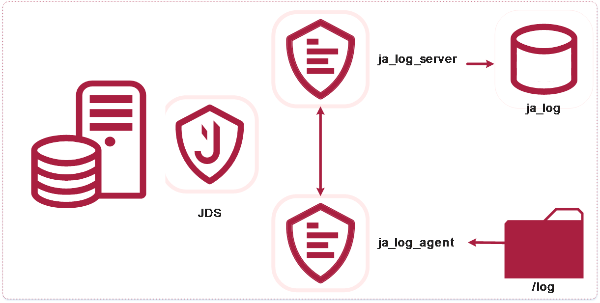

import image16 from '@site/static/img/jds/image16.png';
import image162 from '@site/docs/assets/images/jds-gfm/image16.png';

# Аутентификация пользователей JDS

1

2

3

4

5

6

7

8

Рисунок 2.10 – LDAP аутентификация

