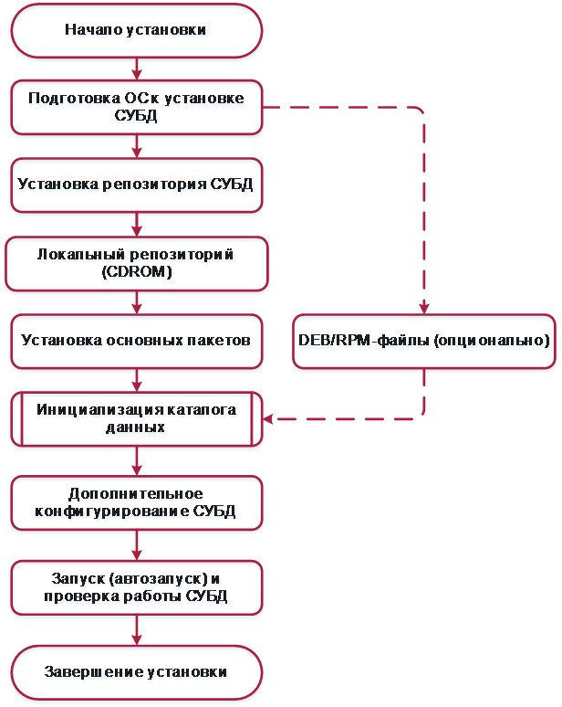

**АННОТАЦИЯ**

Данный документ представляет собой руководство по установке защищенной системы управления базами данных «Jatoba» (далее по тексту – СУБД, СУБД «Jatoba»).

:::warning Важная информация
Все примеры в данном документе приведены для СУБД «Jatoba» версии ядра 4.x, для других версий все шаги выполняются аналогично, разница состоит в именах директорий.

Например, СУБД «Jatoba» версии 5.x по умолчанию устанавливается в директорию:
:::

ОС Windows – «C:\Program Files\GIS\Jatoba\5\bin»;ОС Linux – «/usr/jatoba-5/bin».Степени важности примечаний, применяемые в документе:

| 


|:--:|----|
| 


| 


## Общие сведения о СУБД «Jatoba»

### Назначение СУБД «Jatoba»

СУБД «Jatoba» является программным средством, предназначенным для создания и управления реляционными базами данных на базе ЭВМ под управлением операционных систем (ОС), представленных в таблице Таблица 1.1.

| **№** | **Наименование ОС**                               | **Серверная часть** | **Клиентская часть** | **Docker (ver.)** | **Сертификат ФСТЭК** |                 |
|:-----:|---------------------------------------------------|:-------------------:|:--------------------:|:-----------------:|:--------------------:|:---------------:|
|       |                                                   |                     |                      |                   | **№ серт.**          | **Дата выдачи** |
| 1     | Windows 10                                        | Х                   | Х                    | -                 | -                    | -               |
| 2     | Windows 11                                        | Х                   | Х                    | -                 | -                    | -               |
| 3     | Windows Server 2016                               | Х                   | Х                    | -                 | -                    | -               |
| 4     | Windows Server 2019                               | Х                   | Х                    | -                 | -                    | -               |
| 5     | Windows Server 2022                               | Х                   | Х                    | -                 | -                    | -               |
| 6     | Astra Linux 1.7 Special Edition Смоленск (x86-64) | Х                   | Х                    | 25.0.5            | 2557                 | 30.01.2012      |
| 7     | Astra Linux 1.8 (x86-64)                          | Х                   | Х                    | 25.0.5            | -                    | -               |
| 8     | Debian 11                                         | Х                   | Х                    | 24.0.2            | -                    | -               |
| 9     | Debian 12                                         | Х                   | Х                    | 24.0.2            |                     |                |
| 10    | Альт 8 СП                                         | Х                   | Х                    | 27.1.1            | 3866                 | 10.08.2018      |
| 11    | Альт 10 СП                                        | Х                   | Х                    | 27.1.1            | 3866                 | 10.08.2018      |
| 12    | Альт 9.1 Server                                   | Х                   | Х                    |                  |                     |                |
| 13    | Альт 10 Server                                    | Х                   | Х                    | 23.0.1            |                     |                |
| 14    | Ubuntu 20.04                                      | Х                   | Х                    | 24.0.2            |                     |                |
| 15    | Ubuntu 22.04                                      | Х                   | Х                    | 24.0.2            |                     |                |
| 16    | Ubuntu 24.04                                      | Х                   | Х                    | 24.0.2            |                     |                |
| 17    | ОСНОВА2                                           | Х                   | Х                    | 20.10.5           | 4381                 | 31.03.2021      |
| 18    | РЕД ОС 7.3 Муром                                  | Х                   | Х                    | 25.0.7            | 4060                 | 12.01.2019      |
| 19    | РЕД ОС 8                                          | Х                   | Х                    |                  |                     |                |
| 20    | РОСА «Хром» 12.4                                  | Х                   | Х                    |                  |                     |                |
| 21    | Oracle Linux 8.4                                  | Х                   | Х                    |                  |                     |                |
| 22    | Platform V SberLinux OS Server                    | Х                   | Х                    |                  | 4884                 | 04.12.2024      |

Таблица 1.1 – Перечень поддерживаемых ОС

### Функции СУБД «Jatoba»

СУБД «Jatoba» реализует следующие функциональные возможности:

- управление данными во внешней памяти;
- управление данными в оперативной памяти;
- выполнение запросов (DDL/DML);
- управление транзакциями;
- журнализация изменений, резервное копирование и восстановление базы данных после сбоев, репликация.

СУБД «Jatoba» в дополнение к стандартным возможностям управления базами данных, реализует следующие функции:

- хранение пространственных, географических и геометрических данных, поддержка запросов к ним и управление ими;
- синтаксическая совместимость с распространенными PL/SQL Oracle;
- расширенные возможности секционирования больших таблиц;
- протоколирование, анализ и контроль выполнения команд манипулирования данными (DDL/DML);
- сбор журналов аудита всех операций и загрузка конфигураций в СУБД;
- работа в составе отказоустойчивого кластера с механизмом переключения нагрузки на основной узел кластера;
- защита от несанкционированного изменения конфигурационных файлов;
- единый пользовательский интерфейс для управления конфигурациями компонентов и просмотра их состояния СУБД.

### Требования к среде функционирования СУБД «Jatoba»

СУБД «Jatoba» устанавливается на ЭВМ с процессорами, имеющими архитектуру x86, x86-64 и AMD64, удовлетворяющие следующим аппаратным требованиям, указанным в таблице Таблица 1.2.

<table>
<caption><p>Таблица 1.2 – Программные и аппаратные требования к ЭВМ, на которых функционируют клиентская и серверная часть СУБД</p></caption>
<colgroup>
<col style="width: 36%" />
<col style="width: 40%" />
<col style="width: 23%" />
<col style="width: 0%" />
</colgroup>
<thead>
<tr>
<th style="text-align: center;"><strong>Параметр</strong></th>
<th style="text-align: center;"><strong>Характеристика</strong></th>
<th style="text-align: center;"><strong>Сертифицированная ОС</strong></th>
<th style="text-align: center;"></th>
</tr>
</thead>
<tbody>
<tr>
<td colspan="4" style="text-align: center;"><strong>Требования к аппаратному обеспечению сервера СУБД</strong></td>
</tr>
<tr>
<td style="text-align: center;">ОЗУ</td>
<td style="text-align: center;">Не менее 2 Гб</td>
<td style="text-align: center;"></td>
<td style="text-align: center;"></td>
</tr>
<tr>
<td style="text-align: center;">Свободный объем жесткого диска</td>
<td style="text-align: center;"><p>Минимальный объем от 40 Гб</p>
<p>Рекомендуемый объем от 100 Гб</p></td>
<td style="text-align: center;"></td>
<td style="text-align: center;"></td>
</tr>
<tr>
<td style="text-align: center;">Устройства видео вывода</td>
<td style="text-align: center;">Монитор и видеоадаптер с поддержкой VGA и разрешением 800x600 или выше</td>
<td style="text-align: center;"></td>
<td style="text-align: center;"></td>
</tr>
<tr>
<td style="text-align: center;">Тип процессора и минимальная тактовая частота процессора</td>
<td style="text-align: center;">64-разрядный процессор Intel или AMD 3 ГГц или больше</td>
<td style="text-align: center;"></td>
<td style="text-align: center;"></td>
</tr>
<tr>
<td style="text-align: center;">Минимальное количество ядер</td>
<td style="text-align: center;">4</td>
<td style="text-align: center;"></td>
<td style="text-align: center;"></td>
</tr>
<tr>
<td style="text-align: center;">Максимальное количество ядер</td>
<td style="text-align: center;">256</td>
<td style="text-align: center;"></td>
<td style="text-align: center;"></td>
</tr>
<tr>
<td style="text-align: center;">Устройства ввода-вывода</td>
<td style="text-align: center;">Стандартные 105-клавишная клавиатура и манипулятор «мышь» с USB, либо PS/2-интерфейсами</td>
<td style="text-align: center;"></td>
<td style="text-align: center;"></td>
</tr>
<tr>
<td style="text-align: center;">Адаптер Ethernet</td>
<td style="text-align: center;">100 Мбит/с</td>
<td style="text-align: center;"></td>
<td style="text-align: center;"></td>
</tr>
<tr>
<td colspan="4" style="text-align: center;"><strong>Требования к аппаратному обеспечению АРМ управления</strong></td>
</tr>
<tr>
<td style="text-align: center;">ОЗУ</td>
<td style="text-align: center;">Не менее 4 Гб</td>
<td style="text-align: center;"></td>
<td style="text-align: center;"></td>
</tr>
<tr>
<td style="text-align: center;">Свободный объем жесткого диска</td>
<td style="text-align: center;">От 3 Гб</td>
<td style="text-align: center;"></td>
<td style="text-align: center;"></td>
</tr>
<tr>
<td style="text-align: center;">Устройства видео вывода</td>
<td style="text-align: center;">Монитор и видеоадаптер с поддержкой VGA и разрешением 800x600 или выше</td>
<td style="text-align: center;"></td>
<td style="text-align: center;"></td>
</tr>
<tr>
<td style="text-align: center;">Тип процессора и минимальная тактовая частота процессора</td>
<td style="text-align: center;"><p>64-разрядный процессор Intel или AMD</p>
<p>Рекомендуемая частота: 2.4 ГГц или больше</p></td>
<td style="text-align: center;"></td>
<td style="text-align: center;"></td>
</tr>
<tr>
<td style="text-align: center;">Устройства ввода-вывода</td>
<td style="text-align: center;">Стандартные 105-клавишная клавиатура и манипулятор «мышь» с USB-интерфейсами, либо PS/2 интерфейсами</td>
<td style="text-align: center;"></td>
<td style="text-align: center;"></td>
</tr>
<tr>
<td style="text-align: center;">Адаптер Ethernet</td>
<td style="text-align: center;">100 Мбит/с</td>
<td style="text-align: center;"></td>
<td style="text-align: center;"></td>
</tr>
<tr>
<td colspan="4" style="text-align: center;"><strong>Требования к программному обеспечению сервера</strong></td>
</tr>
<tr>
<td style="text-align: center;">Операционная система</td>
<td style="text-align: center;">Требования приведены в таблице Таблица 1.1</td>
<td style="text-align: center;"></td>
<td style="text-align: center;"></td>
</tr>
<tr>
<td colspan="4" style="text-align: center;"><strong>Требования к программному обеспечению АРМ управления</strong></td>
</tr>
<tr>
<td style="text-align: center;">Операционная система</td>
<td style="text-align: center;">Требования приведены в таблице Таблица 1.1</td>
<td style="text-align: center;"></td>
<td style="text-align: center;"></td>
</tr>
<tr>
<td colspan="4" style="text-align: center;"><strong>Требования к аппаратному обеспечению сервера Jatoba data safe</strong></td>
</tr>
<tr>
<td style="text-align: center;">ОЗУ</td>
<td style="text-align: center;">Не менее 2 Гб</td>
<td style="text-align: center;"></td>
<td style="text-align: center;"></td>
</tr>
<tr>
<td style="text-align: center;">Свободный объем жесткого диска</td>
<td style="text-align: center;"><p>Минимальный объем от 40 Гб</p>
<p>Рекомендуемый объем от 100 Гб</p></td>
<td style="text-align: center;"></td>
<td style="text-align: center;"></td>
</tr>
<tr>
<td style="text-align: center;">Устройства видео вывода</td>
<td style="text-align: center;">Монитор и видеоадаптер с поддержкой VGA и разрешением 800x600 или выше</td>
<td style="text-align: center;"></td>
<td style="text-align: center;"></td>
</tr>
<tr>
<td style="text-align: center;">Тип процессора и минимальная тактовая частота процессора</td>
<td style="text-align: center;">64-разрядный процессор Intel или AMD 3 ГГц или больше</td>
<td style="text-align: center;"></td>
<td style="text-align: center;"></td>
</tr>
<tr>
<td style="text-align: center;">Минимальное количество ядер</td>
<td style="text-align: center;">4</td>
<td style="text-align: center;"></td>
<td style="text-align: center;"></td>
</tr>
<tr>
<td style="text-align: center;">Устройства ввода-вывода</td>
<td style="text-align: center;">Стандартные 105-клавишная клавиатура и манипулятор «мышь» с USB, либо PS/2 интерфейсами</td>
<td style="text-align: center;"></td>
<td style="text-align: center;"></td>
</tr>
<tr>
<td style="text-align: center;">Адаптер Ethernet</td>
<td style="text-align: center;">100 Мбит/с</td>
<td style="text-align: center;"></td>
<td style="text-align: center;"></td>
</tr>
<tr>
<td colspan="4" style="text-align: center;"><strong>Требования к программному обеспечению сервера Jatoba data safe</strong></td>
</tr>
<tr>
<td rowspan="3" style="text-align: center;">Поддерживаемые платформы</td>
<td style="text-align: center;"><ul>
<li></li>
</ul></td>
<td style="text-align: center;">win-x86;</td>
<td style="text-align: center;"></td>
</tr>
<tr>
<td style="text-align: center;"><ul>
<li></li>
</ul></td>
<td style="text-align: center;">win-x64;</td>
<td style="text-align: center;"></td>
</tr>
<tr>
<td style="text-align: center;"><ul>
<li></li>
</ul></td>
<td style="text-align: center;">linux-x64Х</td>
<td style="text-align: center;"></td>
</tr>
<tr>
<td style="text-align: center;">СУБД</td>
<td style="text-align: center;">Защищенная система управления базами данных «Jatoba»</td>
<td style="text-align: center;"></td>
<td style="text-align: center;"></td>
</tr>
<tr>
<td rowspan="2" style="text-align: center;">Веб-сервер</td>
<td style="text-align: center;">IIS 10</td>
<td style="text-align: center;"></td>
<td style="text-align: center;"></td>
</tr>
<tr>
<td style="text-align: center;">Nginx</td>
<td style="text-align: center;">Х</td>
<td style="text-align: center;"></td>
</tr>
<tr>
<td style="text-align: center;">Компоненты</td>
<td style="text-align: center;">ASP.NET Core 6.0 Runtime (v6.0.1) – Windows Hosting Bundle Installer</td>
<td style="text-align: center;"></td>
<td style="text-align: center;"></td>
</tr>
<tr>
<td rowspan="6" style="text-align: center;">Internet браузер</td>
<td style="text-align: center;"><ul>
<li></li>
</ul></td>
<td style="text-align: center;">
<p>Яндекс.БраузерХ</p>
</td>
<td style="text-align: center;"></td>
</tr>
<tr>
<td style="text-align: center;"><ul>
<li></li>
</ul></td>
<td style="text-align: center;">
<p>ChromiumХ</p>
</td>
<td style="text-align: center;"></td>
</tr>
<tr>
<td style="text-align: center;"><ul>
<li></li>
</ul></td>
<td style="text-align: center;">
<p>Mozilla FirefoxХ</p>
</td>
<td style="text-align: center;"></td>
</tr>
<tr>
<td style="text-align: center;"><ul>
<li></li>
</ul></td>
<td style="text-align: center;">
<p>Opera</p>
</td>
<td style="text-align: center;"></td>
</tr>
<tr>
<td style="text-align: center;"><ul>
<li></li>
</ul></td>
<td style="text-align: center;">
<p>Microsoft Edge</p>
</td>
<td style="text-align: center;"></td>
</tr>
<tr>
<td style="text-align: center;"><ul>
<li></li>
</ul></td>
<td style="text-align: center;">
<p>Google Chrome</p>
</td>
<td style="text-align: center;"></td>
</tr>
</tbody>
</table>

Таблица 1.2 – Программные и аппаратные требования к ЭВМ, на которых функционируют клиентская и серверная часть СУБД

### Требования по совместимости с антивирусным программным обеспечением

При выполнении установки и в ходе дальнейшей эксплуатации СУБД «Jatoba», и ее отдельных компонентов, в случае применения антивирусного программного обеспечения необходимо обеспечить добавление исключений.

Приведенные исключения для антивирусного программного обеспечения делятся на обязательные и рекомендуемые. Список рекомендаций содержится в таблице

| **Путь к каталогу**                                                                                     | **Примечание** |               |
|:-------------------------------------------------------------------------------------------------------:|:--------------:|:-------------:|
|                                                                                                         | **Обяз.**      | **Рекоменд.** |
| **Каталоги СУБД Jatoba**                                                                                |                |               |
| /usr/jatoba-\&lt;ver\&gt;                                                                               | •              |               |
| /var/lib/jatoba                                                                                         | •              |               |
| /opt/prometheus                                                                                         |                | •             |
| /etc/sysconfig/jatoba                                                                                   |                | •             |
| **Компонент JDS**                                                                                       |                |               |
| /opt/jds                                                                                                | •              |               |
| /opt/jds-doctor                                                                                         | •              |               |
| /opt/prometheus                                                                                         | •              |               |
| /opt/jds-scripts                                                                                        |                | •             |
| /usr/local/lib/pg-explain                                                                               | •              |               |
| /usr/local/lib/pg-monitor                                                                               | •              |               |
| /var/log/jds                                                                                            |                | •             |
| /var/log/pg-explain                                                                                     |                | •             |
| /var/log/pg-explain-db                                                                                  |                | •             |
| /var/log/pg-monitor                                                                                     |                | •             |
| /etc/sysconfig/pg-explain                                                                               |                | •             |
| /etc/sysconfig/pg-monitor                                                                               |                | •             |
| **Каталоги с архивом WAL-файлов**                                                                       |                |               |
| Параметр archive_command в файле postgresql.conf                                                        | •              |               |
| **Каталоги с резервными копиями**                                                                       |                |               |
| Параметр в команде создания резервной копии или в конфигурационном файле утилиты резервного копирования | •              |               |
| **Каталоги табличных пространств**                                                                      |                |               |
| Каталог табличного пространства (ТП) указывается непосредственно в команде при его создании             | •              |               |
| **Файлы служб**                                                                                         |                |               |
| jatoba\&lt;ver\&gt;-service                                                                             |                | •             |
| jadog.service                                                                                           |                | •             |
| pgbouncer.service                                                                                       |                | •             |
| jatoba\&lt;ver\&gt;_sql_exporter.service                                                               |                | •             |
| jatoba\&lt;ver\&gt;_node_exporter.service                                                              |                | •             |
| jatoba\&lt;ver\&gt;_postgres_exporter.service                                                          |                | •             |
| jatoba\&lt;ver\&gt;_prometheus.service                                                                 |                | •             |
| jatoba{version}_sql_exporter.service                                                                   |                | •             |
| jatoba{version}_node_exporter.service                                                                  |                | •             |
| jatoba{version}_postgres_exporter.service                                                              |                | •             |
| jatoba{version}_prometheus.service                                                                     |                | •             |
| jds.service                                                                                             |                | •             |
| jds-doctor.service                                                                                      |                | •             |
| pg-explain.service                                                                                      |                | •             |
| pg-monitor.service                                                                                      |                | •             |
| pg-monitor-collector.service                                                                            |                | •             |
| pg-monitor-dispatcher.service                                                                           |                | •             |

Таблица 1.3 – Рекомендации по включению каталогов и файлов СУБД «Jatoba», а также отдельных компонентов в исключения антивирусного программного обеспечения

Критерием для обязательного и рекомендованного исключения для каталогов, служит их назначение. Если в них содержатся данные (файлы и каталоги) баз данных (каталоги с данными, резервными копиями, архивами и т.д.) и исполняемые файлы, то такие каталоги и файлы необходимо обязательно добавлять в исключения. Конфигурационные файлы, скрипты, файлы служб, каталоги с логами – рекомендуется добавлять в исключения.

## Состав СУБД «Jatoba»

В состав СУБД «Jatoba» входят компоненты, указанные в таблице Таблица 2.1.

<table>
<caption><p>Таблица 2.1 – Состав компонент СУБД «Jatoba»</p></caption>
<colgroup>
<col style="width: 6%" />
<col style="width: 41%" />
<col style="width: 18%" />
<col style="width: 4%" />
<col style="width: 4%" />
<col style="width: 4%" />
<col style="width: 4%" />
<col style="width: 4%" />
<col style="width: 4%" />
<col style="width: 4%" />
<col style="width: 4%" />
</colgroup>
<thead>
<tr>
<th colspan="2" rowspan="3" style="text-align: center;"><strong>Полное название компонента</strong></th>
<th rowspan="3" style="text-align: center;"><strong>Наименование англоязычное</strong></th>
<th colspan="8" style="text-align: center;"><strong>Версия компонента</strong></th>
</tr>
<tr>
<th colspan="2" style="text-align: center;"><strong>J4</strong></th>
<th colspan="2" style="text-align: center;"><strong>J5</strong></th>
<th colspan="2" style="text-align: center;"><strong>J6</strong></th>
<th colspan="2" style="text-align: center;"><strong>J18</strong></th>
</tr>
<tr>
<th style="text-align: center;"><strong>Д</strong></th>
<th style="text-align: center;"><strong>ОК</strong></th>
<th style="text-align: center;"><strong>Д</strong></th>
<th style="text-align: center;"><strong>ОК</strong></th>
<th style="text-align: center;"><strong>Д</strong></th>
<th style="text-align: center;"><strong>ОК</strong></th>
<th style="text-align: center;"><strong>Д</strong></th>
<th style="text-align: center;"><strong>ОК</strong></th>
</tr>
</thead>
<tbody>
<tr>
<td colspan="2" style="text-align: left;">
<p>Базовый инсталляционный пакет</p>
</td>
<td style="text-align: left;">
<p>Jatoba</p>
</td>
<td style="text-align: center;">Х</td>
<td style="text-align: center;">Х</td>
<td style="text-align: center;">Х</td>
<td style="text-align: center;">Х</td>
<td style="text-align: center;">Х</td>
<td style="text-align: center;">Х</td>
<td style="text-align: center;">Х</td>
<td style="text-align: center;">Х</td>
</tr>
<tr>
<td style="text-align: left;"></td>
<td style="text-align: left;">
<p>Генератор паролей. pwgen</p>
</td>
<td style="text-align: left;">
<p>pwgen</p>
</td>
<td style="text-align: center;"></td>
<td style="text-align: center;"></td>
<td style="text-align: center;">Х</td>
<td style="text-align: center;">Х</td>
<td style="text-align: center;">Х</td>
<td style="text-align: center;">Х</td>
<td style="text-align: center;">Х</td>
<td style="text-align: center;">Х</td>
</tr>
<tr>
<td style="text-align: left;"></td>
<td style="text-align: left;">
<p>Маскирование паролей</p>
</td>
<td style="text-align: left;">
<p>ja_pwmasking</p>
</td>
<td style="text-align: center;"></td>
<td style="text-align: center;"></td>
<td style="text-align: center;">Х</td>
<td style="text-align: center;">Х</td>
<td style="text-align: center;">Х</td>
<td style="text-align: center;">Х</td>
<td style="text-align: center;">Х</td>
<td style="text-align: center;">Х</td>
</tr>
<tr>
<td style="text-align: left;"></td>
<td style="text-align: left;">
<p>Поиск ближайших соседей. KNN</p>
</td>
<td style="text-align: left;">
<p>KNN</p>
</td>
<td style="text-align: center;"></td>
<td style="text-align: center;"></td>
<td style="text-align: center;">Х</td>
<td style="text-align: center;">Х</td>
<td style="text-align: center;">Х</td>
<td style="text-align: center;">Х</td>
<td style="text-align: center;"></td>
<td style="text-align: center;"></td>
</tr>
<tr>
<td style="text-align: left;"></td>
<td style="text-align: left;">
<p>Компонент xid64</p>
</td>
<td style="text-align: left;">
<p>xid64</p>
</td>
<td style="text-align: center;"></td>
<td style="text-align: center;"></td>
<td style="text-align: center;">Х</td>
<td style="text-align: center;">Х</td>
<td style="text-align: center;">Х</td>
<td style="text-align: center;">Х</td>
<td style="text-align: center;">Х</td>
<td style="text-align: center;">Х</td>
</tr>
<tr>
<td style="text-align: left;"></td>
<td style="text-align: left;">
<p>Сжатие данных на уровне страниц. Компонент "ja_Compression"</p>
</td>
<td style="text-align: left;">
<p>ja_Compression</p>
</td>
<td style="text-align: center;"></td>
<td style="text-align: center;"></td>
<td style="text-align: center;"></td>
<td style="text-align: center;"></td>
<td style="text-align: center;">Х</td>
<td style="text-align: center;">Х</td>
<td style="text-align: center;">Х</td>
<td style="text-align: center;">Х</td>
</tr>
<tr>
<td style="text-align: left;"></td>
<td style="text-align: left;">
<p>Восстановление поврежденных WAL записей. WAL Recovery</p>
</td>
<td style="text-align: left;">
<p>WAL Recovery</p>
</td>
<td style="text-align: center;"></td>
<td style="text-align: center;"></td>
<td style="text-align: center;">Х</td>
<td style="text-align: center;">Х</td>
<td style="text-align: center;">Х</td>
<td style="text-align: center;">Х</td>
<td style="text-align: center;">Х</td>
<td style="text-align: center;">Х</td>
</tr>
<tr>
<td style="text-align: left;"></td>
<td style="text-align: left;">
<p>Автоматическое создание директорий табличных пространств</p>
</td>
<td style="text-align: left;">
<p>ja_TableSpace</p>
</td>
<td style="text-align: center;"></td>
<td style="text-align: center;"></td>
<td style="text-align: center;"></td>
<td style="text-align: center;"></td>
<td style="text-align: center;">Х</td>
<td style="text-align: center;">Х</td>
<td style="text-align: center;">Х</td>
<td style="text-align: center;">Х</td>
</tr>
<tr>
<td style="text-align: left;"></td>
<td style="text-align: left;">
<p>Генератор конфигурационного файла</p>
</td>
<td style="text-align: left;">
<p>ja_tune</p>
</td>
<td style="text-align: center;"></td>
<td style="text-align: center;"></td>
<td style="text-align: center;"></td>
<td style="text-align: center;"></td>
<td style="text-align: center;">Х</td>
<td style="text-align: center;">Х</td>
<td style="text-align: center;">Х</td>
<td style="text-align: center;">Х</td>
</tr>
<tr>
<td style="text-align: left;"></td>
<td style="text-align: left;">
<p>Механизм автономных транзакций</p>
</td>
<td style="text-align: left;">
<p>ja_ATX</p>
</td>
<td style="text-align: center;"></td>
<td style="text-align: center;"></td>
<td style="text-align: center;"></td>
<td style="text-align: center;"></td>
<td style="text-align: center;">Х</td>
<td style="text-align: center;">Х</td>
<td style="text-align: center;">Х</td>
<td style="text-align: center;">Х</td>
</tr>
<tr>
<td style="text-align: left;"></td>
<td style="text-align: left;">
<p>DataWiping: очистка файлов данных объектов доступа</p>
</td>
<td style="text-align: left;">
<p>ja_WIpe_Files</p>
</td>
<td style="text-align: center;">Х</td>
<td style="text-align: center;">Х</td>
<td style="text-align: center;">Х</td>
<td style="text-align: center;">Х</td>
<td style="text-align: center;">Х</td>
<td style="text-align: center;">Х</td>
<td style="text-align: center;">Х</td>
<td style="text-align: center;">Х</td>
</tr>
<tr>
<td colspan="2" style="text-align: left;">
<p>Управление режимом работы узлов кластера.<br />
Компонент «jaDog»</p>
</td>
<td style="text-align: left;">
<p>jaDog</p>
</td>
<td style="text-align: center;">Х</td>
<td style="text-align: center;">Х</td>
<td style="text-align: center;">Х</td>
<td style="text-align: center;">Х</td>
<td style="text-align: center;">Х</td>
<td style="text-align: center;">Х</td>
<td style="text-align: center;">Х</td>
<td style="text-align: center;">Х</td>
</tr>
<tr>
<td colspan="2" style="text-align: left;">
<p>Контроль субъектов доступа.<br />
Компонент «Jatoba data vault»</p>
</td>
<td style="text-align: left;">
<p>Jatoba data vault</p>
</td>
<td style="text-align: center;">Х</td>
<td style="text-align: center;">Х</td>
<td style="text-align: center;">Х</td>
<td style="text-align: center;">Х</td>
<td style="text-align: center;">Х</td>
<td style="text-align: center;">Х</td>
<td style="text-align: center;">Х</td>
<td style="text-align: center;">Х</td>
</tr>
<tr>
<td colspan="2" style="text-align: left;">
<p>Формирование отчетов по журналам СУБД. Компонент «pgBadger»</p>
</td>
<td style="text-align: left;">
<p>pgBadger</p>
</td>
<td style="text-align: center;">Х</td>
<td style="text-align: center;">Х</td>
<td style="text-align: center;">Х</td>
<td style="text-align: center;">Х</td>
<td style="text-align: center;">Х</td>
<td style="text-align: center;">Х</td>
<td style="text-align: center;">Х</td>
<td style="text-align: center;">Х</td>
</tr>
<tr>
<td colspan="2" style="text-align: left;">
<p>Расширенное резервное копирование. Компонент «pg_ProBackup»</p>
</td>
<td style="text-align: left;">
<p>pg_ProBackup</p>
</td>
<td style="text-align: center;">Х</td>
<td style="text-align: center;">Х</td>
<td style="text-align: center;">Х</td>
<td style="text-align: center;">Х</td>
<td style="text-align: center;">Х</td>
<td style="text-align: center;">Х</td>
<td style="text-align: center;"></td>
<td style="text-align: center;"></td>
</tr>
<tr>
<td colspan="2" style="text-align: left;">
<p>Планирование заданий СУБД.<br />
Компонент «pg_Task»</p>
</td>
<td style="text-align: left;">
<p>pg_Task</p>
</td>
<td style="text-align: center;">Х</td>
<td style="text-align: center;">Х</td>
<td style="text-align: center;">Х</td>
<td style="text-align: center;">Х</td>
<td style="text-align: center;">Х</td>
<td style="text-align: center;">Х</td>
<td style="text-align: center;">Х</td>
<td style="text-align: center;">Х</td>
</tr>
<tr>
<td colspan="2" style="text-align: left;">
<p>Формирование отчетов производительности СУБД. Компонент «pg_Profile»</p>
</td>
<td style="text-align: left;">
<p>pg_Profile</p>
</td>
<td style="text-align: center;">Х</td>
<td style="text-align: center;">Х</td>
<td style="text-align: center;">Х</td>
<td style="text-align: center;">Х</td>
<td style="text-align: center;">Х</td>
<td style="text-align: center;">Х</td>
<td style="text-align: center;">Х</td>
<td style="text-align: center;">Х</td>
</tr>
<tr>
<td colspan="2" style="text-align: left;">
<p>Пользовательский веб-интерфейс для администраторов.</p>
<p>Компонент «Jatoba data safe»</p>
</td>
<td style="text-align: left;">
<p>Jatoba data safe</p>
</td>
<td style="text-align: center;">Х</td>
<td style="text-align: center;"></td>
<td style="text-align: center;">Х</td>
<td style="text-align: center;"></td>
<td style="text-align: center;">Х</td>
<td style="text-align: center;"></td>
<td style="text-align: center;">Х</td>
<td style="text-align: center;"></td>
</tr>
<tr>
<td colspan="2" rowspan="5" style="text-align: left;">
<p>Компонент мониторинга запросов СУБД</p>
</td>
<td style="text-align: left;">
<p>pg-explain</p>
</td>
<td style="text-align: center;"></td>
<td style="text-align: center;"></td>
<td style="text-align: center;">Х</td>
<td style="text-align: center;"></td>
<td style="text-align: center;">Х</td>
<td style="text-align: center;"></td>
<td style="text-align: center;">Х</td>
<td style="text-align: center;"></td>
</tr>
<tr>
<td style="text-align: left;">
<p>pg-explain-db</p>
</td>
<td style="text-align: center;"></td>
<td style="text-align: center;"></td>
<td style="text-align: center;">Х</td>
<td style="text-align: center;"></td>
<td style="text-align: center;">Х</td>
<td style="text-align: center;"></td>
<td style="text-align: center;">Х</td>
<td style="text-align: center;"></td>
</tr>
<tr>
<td style="text-align: left;">
<p>pg-monitor</p>
</td>
<td style="text-align: center;"></td>
<td style="text-align: center;"></td>
<td style="text-align: center;">Х</td>
<td style="text-align: center;"></td>
<td style="text-align: center;">Х</td>
<td style="text-align: center;"></td>
<td style="text-align: center;">Х</td>
<td style="text-align: center;"></td>
</tr>
<tr>
<td style="text-align: left;">
<p>pg-monitor-collector</p>
</td>
<td style="text-align: center;"></td>
<td style="text-align: center;"></td>
<td style="text-align: center;">Х</td>
<td style="text-align: center;"></td>
<td style="text-align: center;">Х</td>
<td style="text-align: center;"></td>
<td style="text-align: center;">Х</td>
<td style="text-align: center;"></td>
</tr>
<tr>
<td style="text-align: left;">
<p>pg-monitor-dispatcher</p>
</td>
<td style="text-align: center;"></td>
<td style="text-align: center;"></td>
<td style="text-align: center;">Х</td>
<td style="text-align: center;"></td>
<td style="text-align: center;">Х</td>
<td style="text-align: center;"></td>
<td style="text-align: center;">Х</td>
<td style="text-align: center;"></td>
</tr>
<tr>
<td colspan="2" style="text-align: left;">
<p>Синхронизация учетных записей с MS Active Directory / LDAP.<br />
Компонент «ja_Sync_LDAP»</p>
</td>
<td style="text-align: left;">
<p>ja_Sync_LDAP</p>
</td>
<td style="text-align: center;">Х</td>
<td style="text-align: center;">Х</td>
<td style="text-align: center;">Х</td>
<td style="text-align: center;">Х</td>
<td style="text-align: center;">Х</td>
<td style="text-align: center;">Х</td>
<td style="text-align: center;">Х</td>
<td style="text-align: center;">Х</td>
</tr>
<tr>
<td colspan="2" style="text-align: left;">
<p>Обфускация кода PL/spgSQL.<br />
Компонент «PLspgSQL»</p>
</td>
<td style="text-align: left;">
<p>PLspgSQL</p>
</td>
<td style="text-align: center;">Х</td>
<td style="text-align: center;">Х</td>
<td style="text-align: center;">Х</td>
<td style="text-align: center;">Х</td>
<td style="text-align: center;">Х</td>
<td style="text-align: center;">Х</td>
<td style="text-align: center;">Х</td>
<td style="text-align: center;">Х</td>
</tr>
<tr>
<td colspan="2" style="text-align: left;">
<p>Высокопроизводительный кластер.<br />
Компонент «ja_Hipe_Cluster»</p>
</td>
<td style="text-align: left;">
<p>ja_Hipe_Cluster</p>
</td>
<td style="text-align: center;">Х</td>
<td style="text-align: center;">Х</td>
<td style="text-align: center;">Х</td>
<td style="text-align: center;">Х</td>
<td style="text-align: center;">Х</td>
<td style="text-align: center;">Х</td>
<td style="text-align: center;">Х</td>
<td style="text-align: center;">Х</td>
</tr>
<tr>
<td colspan="2" style="text-align: left;">
<p>Централизованный сбор записей событий СУБД.<br />
Компонент «ja_Log»</p>
</td>
<td style="text-align: left;">
<p>ja_Log</p>
</td>
<td style="text-align: center;">Х</td>
<td style="text-align: center;"></td>
<td style="text-align: center;">Х</td>
<td style="text-align: center;"></td>
<td style="text-align: center;">Х</td>
<td style="text-align: center;"></td>
<td style="text-align: center;">Х</td>
<td style="text-align: center;"></td>
</tr>
<tr>
<td colspan="2" style="text-align: left;">
<p>Поддержка платформы 1С</p>
</td>
<td style="text-align: left;">
<p>1C_support</p>
</td>
<td style="text-align: center;">Х</td>
<td style="text-align: center;">Х</td>
<td style="text-align: center;">Х</td>
<td style="text-align: center;">Х</td>
<td style="text-align: center;">Х</td>
<td style="text-align: center;">Х</td>
<td style="text-align: center;">Х</td>
<td style="text-align: center;">Х</td>
</tr>
<tr>
<td colspan="2" style="text-align: left;">
<p>Компонент совместимости с 1С.<br />
«fasttrun»</p>
</td>
<td style="text-align: left;">
<p>fasttrun</p>
</td>
<td style="text-align: center;">Х</td>
<td style="text-align: center;">Х</td>
<td style="text-align: center;">Х</td>
<td style="text-align: center;">Х</td>
<td style="text-align: center;">Х</td>
<td style="text-align: center;">Х</td>
<td style="text-align: center;">Х</td>
<td style="text-align: center;">Х</td>
</tr>
<tr>
<td colspan="2" style="text-align: left;">
<p>Компонент совместимости с 1С.<br />
«fulleq»</p>
</td>
<td style="text-align: left;">
<p>fulleq</p>
</td>
<td style="text-align: center;">Х</td>
<td style="text-align: center;">Х</td>
<td style="text-align: center;">Х</td>
<td style="text-align: center;">Х</td>
<td style="text-align: center;">Х</td>
<td style="text-align: center;">Х</td>
<td style="text-align: center;">Х</td>
<td style="text-align: center;">Х</td>
</tr>
<tr>
<td colspan="2" style="text-align: left;">
<p>Компонент совместимости с 1С.<br />
«mchar»</p>
</td>
<td style="text-align: left;">
<p>mchar</p>
</td>
<td style="text-align: center;">Х</td>
<td style="text-align: center;">Х</td>
<td style="text-align: center;">Х</td>
<td style="text-align: center;">Х</td>
<td style="text-align: center;">Х</td>
<td style="text-align: center;">Х</td>
<td style="text-align: center;">Х</td>
<td style="text-align: center;">Х</td>
</tr>
<tr>
<td colspan="2" style="text-align: left;">
<p>Компонент совместимости с 1С.<br />
«online_analyze»</p>
</td>
<td style="text-align: left;">
<p>online_analyze</p>
</td>
<td style="text-align: center;">Х</td>
<td style="text-align: center;">Х</td>
<td style="text-align: center;">Х</td>
<td style="text-align: center;">Х</td>
<td style="text-align: center;">Х</td>
<td style="text-align: center;">Х</td>
<td style="text-align: center;">Х</td>
<td style="text-align: center;">Х</td>
</tr>
<tr>
<td colspan="2" style="text-align: left;">
<p>Компонент совместимости с 1С.<br />
«plantuner»</p>
</td>
<td style="text-align: left;">
<p>plantuner</p>
</td>
<td style="text-align: center;">Х</td>
<td style="text-align: center;">Х</td>
<td style="text-align: center;">Х</td>
<td style="text-align: center;">Х</td>
<td style="text-align: center;">Х</td>
<td style="text-align: center;">Х</td>
<td style="text-align: center;">Х</td>
<td style="text-align: center;">Х</td>
</tr>
<tr>
<td colspan="2" style="text-align: left;">
<p>Контроль целостности.<br />
Компонент «ja_CSum»</p>
</td>
<td style="text-align: left;">
<p>ja_CSum</p>
</td>
<td style="text-align: center;">Х</td>
<td style="text-align: center;">Х</td>
<td style="text-align: center;">Х</td>
<td style="text-align: center;">Х</td>
<td style="text-align: center;">Х</td>
<td style="text-align: center;">Х</td>
<td style="text-align: center;">Х</td>
<td style="text-align: center;">Х</td>
</tr>
<tr>
<td colspan="2" style="text-align: left;">
<p>Балансировка подключений пользователей к СУБД.<br />
Компонент «jaPooler»</p>
</td>
<td style="text-align: left;">
<p>jaPooler</p>
</td>
<td style="text-align: center;">Х</td>
<td style="text-align: center;"></td>
<td style="text-align: center;">Х</td>
<td style="text-align: center;"></td>
<td style="text-align: center;">Х</td>
<td style="text-align: center;"></td>
<td style="text-align: center;">Х</td>
<td style="text-align: center;"></td>
</tr>
<tr>
<td colspan="2" rowspan="3" style="text-align: left;">
<p>Обеспечение работы с СУБД Oracle</p>
</td>
<td style="text-align: left;">
<p>Oracle_FDW</p>
</td>
<td style="text-align: center;">Х</td>
<td style="text-align: center;">Х</td>
<td style="text-align: center;">Х</td>
<td style="text-align: center;">Х</td>
<td style="text-align: center;">Х</td>
<td style="text-align: center;">Х</td>
<td style="text-align: center;">Х</td>
<td style="text-align: center;">Х</td>
</tr>
<tr>
<td style="text-align: left;">
<p>OraFCE</p>
</td>
<td style="text-align: center;">Х</td>
<td style="text-align: center;">Х</td>
<td style="text-align: center;">Х</td>
<td style="text-align: center;">Х</td>
<td style="text-align: center;">Х</td>
<td style="text-align: center;">Х</td>
<td style="text-align: center;">Х</td>
<td style="text-align: center;">Х</td>
</tr>
<tr>
<td style="text-align: left;">
<p>pg_Variables</p>
</td>
<td style="text-align: center;">Х</td>
<td style="text-align: center;">Х</td>
<td style="text-align: center;">Х</td>
<td style="text-align: center;">Х</td>
<td style="text-align: center;">Х</td>
<td style="text-align: center;">Х</td>
<td style="text-align: center;">Х</td>
<td style="text-align: center;">Х</td>
</tr>
<tr>
<td colspan="2" style="text-align: left;">
<p>Выявление и предотвращение исполнения нетипичных SQL-запросов.<br />
Компонент «SQL_Firewall»</p>
</td>
<td style="text-align: left;">
<p>SQL_Firewall</p>
</td>
<td style="text-align: center;">Х</td>
<td style="text-align: center;">Х</td>
<td style="text-align: center;">Х</td>
<td style="text-align: center;">Х</td>
<td style="text-align: center;">Х</td>
<td style="text-align: center;">Х</td>
<td style="text-align: center;">Х</td>
<td style="text-align: center;">Х</td>
</tr>
<tr>
<td colspan="2" style="text-align: left;">
<p>Библиотека для взаимодействия с моделями машинного обучения.</p>
<p>Компонент "ONNX Runtime"</p>
</td>
<td style="text-align: left;">
<p>onnxruntime</p>
</td>
<td style="text-align: center;"></td>
<td style="text-align: center;"></td>
<td style="text-align: center;">Х</td>
<td style="text-align: center;">Х</td>
<td style="text-align: center;">Х</td>
<td style="text-align: center;">Х</td>
<td style="text-align: center;">Х</td>
<td style="text-align: center;">Х</td>
</tr>
<tr>
<td colspan="2" style="text-align: left;">
<p>Сокрытие информации в файлах данных СУБД.</p>
<p>Компонент «Jatoba crypto access storage»</p>
</td>
<td style="text-align: left;">
<p>Jatoba crypto access storage</p>
</td>
<td style="text-align: center;">Х</td>
<td style="text-align: center;">Х</td>
<td style="text-align: center;">Х</td>
<td style="text-align: center;">Х</td>
<td style="text-align: center;">Х</td>
<td style="text-align: center;">Х</td>
<td style="text-align: center;">Х</td>
<td style="text-align: center;">Х</td>
</tr>
<tr>
<td colspan="2" style="text-align: left;">
<p>Формирование HTTP/HTTPS запросов из СУБД.</p>
<p>Компонент «pgSQL-HTTP»</p>
</td>
<td style="text-align: left;">
<p>pgSQL-HTTP</p>
</td>
<td style="text-align: center;">Х</td>
<td style="text-align: center;">Х</td>
<td style="text-align: center;">Х</td>
<td style="text-align: center;">Х</td>
<td style="text-align: center;">Х</td>
<td style="text-align: center;">Х</td>
<td style="text-align: center;">Х</td>
<td style="text-align: center;">Х</td>
</tr>
<tr>
<td colspan="2" style="text-align: left;">
<p>Обеспечение работы с СУБД MS SQL Server. Компонент «TDS_FDW»</p>
</td>
<td style="text-align: left;">
<p>TDS_FDW</p>
</td>
<td style="text-align: center;"></td>
<td style="text-align: center;"></td>
<td style="text-align: center;">Х</td>
<td style="text-align: center;">Х</td>
<td style="text-align: center;">Х</td>
<td style="text-align: center;">Х</td>
<td style="text-align: center;">Х</td>
<td style="text-align: center;">Х</td>
</tr>
<tr>
<td colspan="2" style="text-align: left;">
<p>Pасширенное журналирование событий СУБД.<br />
Компонент «pgAudit»</p>
</td>
<td style="text-align: left;">
<p>pgAudit</p>
</td>
<td style="text-align: center;">Х</td>
<td style="text-align: center;">Х</td>
<td style="text-align: center;">Х</td>
<td style="text-align: center;">Х</td>
<td style="text-align: center;">Х</td>
<td style="text-align: center;">Х</td>
<td style="text-align: center;">Х</td>
<td style="text-align: center;">Х</td>
</tr>
<tr>
<td colspan="2" style="text-align: left;">
<p>Компонент «pgauditlogtofile»</p>
</td>
<td style="text-align: left;">
<p>pgauditlogtofile</p>
</td>
<td style="text-align: center;"></td>
<td style="text-align: center;"></td>
<td style="text-align: center;">Х</td>
<td style="text-align: center;">Х</td>
<td style="text-align: center;">Х</td>
<td style="text-align: center;">Х</td>
<td style="text-align: center;">Х</td>
<td style="text-align: center;">Х</td>
</tr>
<tr>
<td colspan="2" style="text-align: left;">
<p>Работа с географическими данными.<br />
Компонент «PostGIS»</p>
</td>
<td style="text-align: left;">
<p>PostGIS</p>
</td>
<td style="text-align: center;">Х</td>
<td style="text-align: center;">Х</td>
<td style="text-align: center;">Х</td>
<td style="text-align: center;">Х</td>
<td style="text-align: center;">Х</td>
<td style="text-align: center;">Х</td>
<td style="text-align: center;">Х</td>
<td style="text-align: center;">Х</td>
</tr>
<tr>
<td colspan="2" style="text-align: left;">
<p>Расширенное резервное копирование.<br />
Компонент «PTrack»</p>
</td>
<td style="text-align: left;">
<p>PTrack</p>
</td>
<td style="text-align: center;">Х</td>
<td style="text-align: center;">Х</td>
<td style="text-align: center;">Х</td>
<td style="text-align: center;">Х</td>
<td style="text-align: center;">Х</td>
<td style="text-align: center;">Х</td>
<td style="text-align: center;"></td>
<td style="text-align: center;"></td>
</tr>
<tr>
<td colspan="2" style="text-align: left;">
<p>Управление парольными политиками пользователей СУБД.<br />
Компонент «SecurityProfile»</p>
</td>
<td style="text-align: left;">
<p>SecurityProfile</p>
</td>
<td style="text-align: center;">Х</td>
<td style="text-align: center;">Х</td>
<td style="text-align: center;">Х</td>
<td style="text-align: center;">Х</td>
<td style="text-align: center;">Х</td>
<td style="text-align: center;">Х</td>
<td style="text-align: center;">Х</td>
<td style="text-align: center;">Х</td>
</tr>
<tr>
<td colspan="2" style="text-align: left;">
<p>Управление планами запросов.</p>
<p>Компонент «ja_Plan_Manager»</p>
</td>
<td style="text-align: left;">
<p>ja_Plan_Manager</p>
</td>
<td style="text-align: center;">Х</td>
<td style="text-align: center;">Х</td>
<td style="text-align: center;">Х</td>
<td style="text-align: center;">Х</td>
<td style="text-align: center;">Х</td>
<td style="text-align: center;">Х</td>
<td style="text-align: center;">Х</td>
<td style="text-align: center;">Х</td>
</tr>
<tr>
<td colspan="2" style="text-align: left;">
<p>Контроль выполненных планов запросов Компонент «pg_store_plans»</p>
</td>
<td style="text-align: left;">
<p>pg_store_plans</p>
</td>
<td style="text-align: center;"></td>
<td style="text-align: center;"></td>
<td style="text-align: center;">Х</td>
<td style="text-align: center;">Х</td>
<td style="text-align: center;">Х</td>
<td style="text-align: center;">Х</td>
<td style="text-align: center;">Х</td>
<td style="text-align: center;">Х</td>
</tr>
<tr>
<td colspan="2" style="text-align: left;">
<p>Настройка планов выполнения. Компонент «pg_hint_plan»</p>
</td>
<td style="text-align: left;">
<p>pg_hint_plan</p>
</td>
<td style="text-align: center;"></td>
<td style="text-align: center;"></td>
<td style="text-align: center;">Х</td>
<td style="text-align: center;">Х</td>
<td style="text-align: center;">Х</td>
<td style="text-align: center;">Х</td>
<td style="text-align: center;">Х</td>
<td style="text-align: center;">Х</td>
</tr>
<tr>
<td colspan="2" style="text-align: left;">
<p>«Jatoba» в контейнере</p>
</td>
<td style="text-align: left;">
<p>ja_Container</p>
</td>
<td style="text-align: center;">Х</td>
<td style="text-align: center;"></td>
<td style="text-align: center;">Х</td>
<td style="text-align: center;"></td>
<td style="text-align: center;">Х</td>
<td style="text-align: center;"></td>
<td style="text-align: center;">Х</td>
<td style="text-align: center;"></td>
</tr>
<tr>
<td colspan="2" style="text-align: left;">
<p>Компонент сбора аппаратных и программных показателей работы GNU/Linux.</p>
<p>node_exporter.</p>
</td>
<td style="text-align: left;">
<p>node_exporter</p>
</td>
<td style="text-align: center;"></td>
<td style="text-align: center;"></td>
<td style="text-align: center;">Х</td>
<td style="text-align: center;"></td>
<td style="text-align: center;">Х</td>
<td style="text-align: center;"></td>
<td style="text-align: center;">Х</td>
<td style="text-align: center;"></td>
</tr>
<tr>
<td colspan="2" style="text-align: left;">
<p>Компонент сбора метрик СУБД. postgres_exporter</p>
</td>
<td style="text-align: left;">
<p>postgres_exporter</p>
</td>
<td style="text-align: center;"></td>
<td style="text-align: center;"></td>
<td style="text-align: center;">Х</td>
<td style="text-align: center;"></td>
<td style="text-align: center;">Х</td>
<td style="text-align: center;"></td>
<td style="text-align: center;">Х</td>
<td style="text-align: center;"></td>
</tr>
<tr>
<td colspan="2" style="text-align: left;">
<p>SQL экспортёр. Компонент сбора расширенных метрик СУБД</p>
</td>
<td style="text-align: left;">
<p>sql_exporter</p>
</td>
<td style="text-align: center;"></td>
<td style="text-align: center;"></td>
<td style="text-align: center;">Х</td>
<td style="text-align: center;"></td>
<td style="text-align: center;">Х</td>
<td style="text-align: center;"></td>
<td style="text-align: center;">Х</td>
<td style="text-align: center;"></td>
</tr>
<tr>
<td colspan="2" style="text-align: left;">
<p>Компонент мониторинга различных программных систем и сервисов.</p>
<p>Prometheus</p>
</td>
<td style="text-align: left;">
<p>prometheus</p>
</td>
<td style="text-align: center;"></td>
<td style="text-align: center;"></td>
<td style="text-align: center;">Х</td>
<td style="text-align: center;"></td>
<td style="text-align: center;">Х</td>
<td style="text-align: center;"></td>
<td style="text-align: center;">Х</td>
<td style="text-align: center;"></td>
</tr>
<tr>
<td colspan="2" style="text-align: left;">
<p>Компонент управления и обработки оповещений в системе мониторинга Prometheus. Alertmanager</p>
</td>
<td style="text-align: left;">
<p>Alertmanager</p>
</td>
<td style="text-align: center;"></td>
<td style="text-align: center;"></td>
<td style="text-align: center;">Х</td>
<td style="text-align: center;"></td>
<td style="text-align: center;">Х</td>
<td style="text-align: center;"></td>
<td style="text-align: center;">Х</td>
<td style="text-align: center;"></td>
</tr>
<tr>
<td colspan="2" style="text-align: left;">
<p>Работа СУБД «Jatoba» в режиме ЗПС в ОС Astra Linux</p>
</td>
<td style="text-align: left;"></td>
<td style="text-align: center;">Х</td>
<td style="text-align: center;"></td>
<td style="text-align: center;">Х</td>
<td style="text-align: center;"></td>
<td style="text-align: center;">Х</td>
<td style="text-align: center;"></td>
<td style="text-align: center;">Х</td>
<td style="text-align: center;"></td>
</tr>
<tr>
<td colspan="2" style="text-align: left;">
<p>gis-cryptoplatform</p>
</td>
<td style="text-align: left;">
<p>gis-cryptoplatform</p>
</td>
<td style="text-align: center;">Х</td>
<td style="text-align: center;"></td>
<td style="text-align: center;">Х</td>
<td style="text-align: center;"></td>
<td style="text-align: center;">Х</td>
<td style="text-align: center;"></td>
<td style="text-align: center;">Х</td>
<td style="text-align: center;"></td>
</tr>
<tr>
<td colspan="2" style="text-align: left;">
<p>Поддержка лексографического идентификатора.</p>
<p>Компонент «pg-ulid»</p>
</td>
<td style="text-align: left;">
<p>pg-ulid</p>
</td>
<td style="text-align: center;"></td>
<td style="text-align: center;"></td>
<td style="text-align: center;">Х</td>
<td style="text-align: center;">Х</td>
<td style="text-align: center;">Х</td>
<td style="text-align: center;">Х</td>
<td style="text-align: center;">Х</td>
<td style="text-align: center;">Х</td>
</tr>
<tr>
<td colspan="2" style="text-align: left;">
<p>Запись событий информационной безопасности.</p>
<p>Компонент «ja_seceventlog»</p>
</td>
<td style="text-align: left;">
<p>ja_seceventlog</p>
</td>
<td style="text-align: center;"></td>
<td style="text-align: center;"></td>
<td style="text-align: center;">Х</td>
<td style="text-align: center;">Х</td>
<td style="text-align: center;">Х</td>
<td style="text-align: center;">Х</td>
<td style="text-align: center;">Х</td>
<td style="text-align: center;">Х</td>
</tr>
<tr>
<td colspan="2" style="text-align: left;">
<p>Обратный индекс с хранением позиционной информации, полнотекстовый поиск.</p>
<p>Компонент «rum»</p>
</td>
<td style="text-align: left;">
<p>rum</p>
</td>
<td style="text-align: center;"></td>
<td style="text-align: center;"></td>
<td style="text-align: center;">Х</td>
<td style="text-align: center;">Х</td>
<td style="text-align: center;">Х</td>
<td style="text-align: center;">Х</td>
<td style="text-align: center;">Х</td>
<td style="text-align: center;">Х</td>
</tr>
<tr>
<td colspan="2" style="text-align: left;">
<p>Реорганизация таблицы с минимальными блокировками. Компонент «pg_repack»</p>
</td>
<td style="text-align: left;">
<p>pg_repack</p>
</td>
<td style="text-align: center;"></td>
<td style="text-align: center;"></td>
<td style="text-align: center;">Х</td>
<td style="text-align: center;">Х</td>
<td style="text-align: center;">Х</td>
<td style="text-align: center;">Х</td>
<td style="text-align: center;">Х</td>
<td style="text-align: center;">Х</td>
</tr>
<tr>
<td colspan="2" style="text-align: left;">
<p>Работа СУБД Jatoba в режиме ЗПС в ОС ОСНОВА</p>
</td>
<td style="text-align: left;">
<p>osnova-digsig-key</p>
</td>
<td style="text-align: center;">Х</td>
<td style="text-align: center;"></td>
<td style="text-align: center;">Х</td>
<td style="text-align: center;"></td>
<td style="text-align: center;">Х</td>
<td style="text-align: center;"></td>
<td style="text-align: center;">Х</td>
<td style="text-align: center;"></td>
</tr>
<tr>
<td colspan="2" style="text-align: left;">
<p>Расширенный тип данных tsvector.</p>
<p>Компонент "tsvector2"</p>
</td>
<td style="text-align: left;">
<p>tsvector2</p>
</td>
<td style="text-align: center;"></td>
<td style="text-align: center;"></td>
<td style="text-align: center;">Х</td>
<td style="text-align: center;">Х</td>
<td style="text-align: center;">Х</td>
<td style="text-align: center;">Х</td>
<td style="text-align: center;">Х</td>
<td style="text-align: center;">Х</td>
</tr>
<tr>
<td colspan="2" style="text-align: left;">
<p>Полнотекстовый поиск и определение похожих текстов. Компонент "ja_Similar"</p>
</td>
<td style="text-align: left;">
<p>ja_Similar</p>
</td>
<td style="text-align: center;"></td>
<td style="text-align: center;"></td>
<td style="text-align: center;">Х</td>
<td style="text-align: center;">Х</td>
<td style="text-align: center;">Х</td>
<td style="text-align: center;">Х</td>
<td style="text-align: center;">Х</td>
<td style="text-align: center;">Х</td>
</tr>
<tr>
<td colspan="2" style="text-align: left;">
<p>Инвентаризация СУБД</p>
</td>
<td style="text-align: left;">
<p>ja_Inventory</p>
</td>
<td style="text-align: center;">Х</td>
<td style="text-align: center;"></td>
<td style="text-align: center;">Х</td>
<td style="text-align: center;"></td>
<td style="text-align: center;">Х</td>
<td style="text-align: center;"></td>
<td style="text-align: center;">Х</td>
<td style="text-align: center;"></td>
</tr>
<tr>
<td colspan="2" style="text-align: left;">
<p>Cвободная библиотека для проверки орфографии и морфологического анализа. Компонент «hunspell»</p>
</td>
<td style="text-align: left;">
<p>hunspell</p>
</td>
<td style="text-align: center;"></td>
<td style="text-align: center;"></td>
<td style="text-align: center;">Х</td>
<td style="text-align: center;">Х</td>
<td style="text-align: center;">Х</td>
<td style="text-align: center;">Х</td>
<td style="text-align: center;">Х</td>
<td style="text-align: center;">Х</td>
</tr>
<tr>
<td colspan="2" style="text-align: left;">
<p>Маскирование данных.</p>
<p>Компонент «ja_anonymizer»</p>
</td>
<td style="text-align: left;">
<p>ja_anonymizer</p>
</td>
<td style="text-align: center;"></td>
<td style="text-align: center;"></td>
<td style="text-align: center;"></td>
<td style="text-align: center;"></td>
<td style="text-align: center;">Х</td>
<td style="text-align: center;">Х</td>
<td style="text-align: center;">Х</td>
<td style="text-align: center;">Х</td>
</tr>
<tr>
<td colspan="2" style="text-align: left;">
<p>Архивация и восстановление данных.</p>
<p>Компонент «wal-g»</p>
</td>
<td style="text-align: left;">
<p>wal-g</p>
</td>
<td style="text-align: center;">-</td>
<td style="text-align: center;">-</td>
<td style="text-align: center;">-</td>
<td style="text-align: center;">-</td>
<td style="text-align: center;">Х</td>
<td style="text-align: center;">Х</td>
<td style="text-align: center;">Х</td>
<td style="text-align: center;">Х</td>
</tr>
</tbody>
</table>

Таблица 2.1 – Состав компонент СУБД «Jatoba»

Примечание:

- Д - Дистрибутив
- ОК - Образ контейнера.

## Установка СУБД «Jatoba» на ОС семейства GNU/Linux {#install-jatoba}

Установку СУБД «Jatoba» возможно провести тремя способами:

1)  Установка из локального репозитория инсталлятором (см. п. 3.1).
2)  Установка из локального репозитория (CDROM) – производится из файлов, записанных на компакт-диск или скопированных с него п. (3.3).
3)  Установка непосредственно из deb/rpm-файлов – производится опционально, по усмотрению пользователя (п.п. 3.4, 3.5).

:::info Дополнительная информация
Пользователь может найти весь необходимый набор deb/rpm-файлов на компакт-диске.
:::

Установка СУБД «Jatoba» на ОС GNU/Linux происходит в несколько этапов:

- настройка репозитория СУБД;
- установка основных пакетов;
- инициализация директории данных СУБД;
- конфигурирование СУБД;
- запуск сервиса СУБД.

Пример установки и удаления СУБД «Jatoba» из локального репозитория для:

- ОС Ubuntu 18.04 приведен в Приложении Приложение 2;
- РЕД ОС 7.3 Муром приведен в Приложении Приложение 3;
- Альт 9 Server приведен в Приложении Приложение 4.

Пример установки СУБД «Jatoba» из локального репозитория в Astra Linux 1.6 Special Edition Смоленск в замкнутой программной среде приведен в Приложении Приложение 5 настоящего документа.

Концептуальная схема последовательности действий представлена на рисунке Рисунок 3.1. Более подробное описание установки приведено ниже.



Рисунок 3.1 – Последовательность действий при установке СУБД на ОС GNU/Linux

:::warning Важная информация
Только для ОС Astra Linux 1.6 Смоленск

Для корректного обновления системы и последующей установки СУБД «Jatoba» рекомендуется подключить и примонтировать все ISO-файлы установки и обновления ОС одновременно, прописав репозитории в виде локальных директорий точек монтирования. При использовании источников установки «cdrom» возможны ошибки нахождения зависимых пакетов на разных ISO-образах.
:::

:::warning Важная информация
Перед началом установки СУБД «Jatoba» в ОС необходимо поставить все последние обновления.
:::

:::warning Важная информация
Только для ОС CentOS Linux 8.2 и выше

Ввиду прекращения производителем поддержки ОС CentOS Linux 8-й версии необходимо в качестве источника для установки пакетов и обновлений системы использовать архивный репозиторий <a href="https://vault.centos.org"><u>https://vault.centos.org</u></a>
:::


<tr>
<td style="text-align: center;">


<td><p>Установка и запуск СУБД в ОС производится от имени пользователя «root» (суперпользователь). Порядок получения root-привилегий в различных ОС GNU/Linux может отличаться. Обычно для этого используется связка команд sudo su.</p>
<p>В случае если используется для получения root-привилегий команда su отдельно от sudo, то su следует обязательно использовать с параметром –l.</p>
<p>В случае отсутствия пакета sudo в системе, его необходимо установить. Для получения соответствующих пакетов пользователю необходимо обратиться к соответствующему руководству администратора операционной системы.</p></td>
</tr>
</tbody>
</table>

### Инсталлятор СУБД «Jatoba» для ОС семейства GNU/Linux

Инсталлятор выполняет базовую установку СУБД «Jatoba», инсталлируя пакеты:

- jatoba<ver>-client – клиентская часть СУБД;
- jatoba<ver>-contrib – вспомогательный набор модулей (расширений) СУБД;
- jatoba<ver>-libs – основные библиотеки для клиентской и серверной части СУБД;
- jatoba<ver>-server – серверная часть СУБД.

Установка пакетов, расширяющих возможности СУБД, выполняется отдельно в соответствии с пунктом 3.3.3 настоящего документа.

Работу инсталлятора возможно условно разделить на следующие этапы:

- подготовительные действия;
- начало установки.

#### Подготовительные действия для запуска инсталлятора

:::info Дополнительная информация
Для корректного отображения сообщений инсталлятора (установочного скрипта) консоль ОС должна обеспечивать отображение кириллических символов.

Для установки корректного набора шрифтов необходимо открыть файл /etc/vconsole.conf (в зависимости от дистрибутива ОС может располагаться в другом каталоге) и установить параметр:
:::

На этапе подготовительных действий выполняются следующие шаги:

1)  

В терминале войти в режим суперпользователя, выполнив команду:sudo su

2)  

Выполнить обновление системы:apt-get update -y && apt-get upgrade -y && apt dist-upgrade -y


Рисунок 3.2 – Обновление системы

3) Создать папку localrepo в корневом каталоге:

```
mkdir /localrepo
```

4)  

- 
- 
- 

В созданную папку скопировать:каталог <pool>каталог <dist>файл <DEB-GPG-KEY-Jatoba>


Рисунок 3.3 – Структура каталога «localrepo»

5) Расположить установочный скрипт jatoba.sh в корневой директории текущего пользователя:


Рисунок 3.4 – Расположение установочного скрипта jatoba.sh

6)  Дать разрешение на запуск:

```
## cd /home
## chmod +x jatoba.sh
```


Рисунок 3.5 – Команда установки прав на запуск скрипта

#### Установка СУБД инсталлятором

Этап начала установки включает в себя следующие шаги:

1)  

Запустить скрипт:./jatoba.sh install


Рисунок 3.6 – Команда запуска установочного скрипта

2)  

Указать версию устанавливаемой СУБД и подтвердить выбор для установки:


Рисунок 3.7 – Выбор версии СУБД

После чего начнется процесс установки и построится дерево зависимостей.

Автоматически добавится описание локального репозитория.

Запустится процедура инициализации БД.


Рисунок 3.8 – Инициализация БД

После процедуры инициализации БД в автоматическом режиме:

- 
- 

внесутся изменения в конфигурационный файл «postgresql.conf»;добавится сервис в список автозапуска.


Рисунок 3.9 – Добавление службы в автозагрузку

3)  

Ввести пароль пользователя СУБД postgres и подтвердить его.


Рисунок 3.10 – Ввод и подтверждение пароля для пользователя «postgres»

4)  

Окончание установки (рис. Рисунок 3.11).


Рисунок 3.11 – Окно окончания установки

5)  

Установить пароль для системного пользователя ОС «postgres»:sudo passwd postgres


Рисунок 3.12 - Установка пароля для системного пользователя ОС «postgres»

6)  

Авторизоваться в psql, для этого нажать сочетание клавиш:CTRL + D

Затем войти в psql:

su postgres

psql

7)  

Установить пароль для пользователя СУБД «postgres»:\password


Рисунок 3.13 – Установка пароля для пользователя СУБД

На данном шаге установка СУБД закончена.

#### Установка СУБД с поддержкой платформы 1C

Для автоматической настройки экземпляра СУБД под работу с платформой 1С предусмотрена специальная опция «install_1c» инсталлятора:

```
# ./jatoba.sh install_1c \[-y\]
```

Подробное описание действий, выполняемых инсталлятором с поддержкой платформы 1С, приведены в документе «Поддержка платформы 1С» 643.72410666.00067-08 98 01-13.

### Установка СУБД «Jatoba» с генератором конфигурационного файла ja_tune

Компонент «ja_tune» предназначен для Администратора СУБД и является генератором рекомендуемого конфигурационного файла «postgresql.conf» на основе данных об аппаратной платформе, на которой предполагается запускать экземпляр СУБД, данных операционной системы, предполагаемом профиле нагрузки СУБД и некоторых дополнительных параметрах.

Компонент «ja_tune» представляет собой самостоятельный исполняемый файл, запуск которого не зависит от запуска СУБД. В процессе функционирования компонент не требует наличия запущенного экземпляра СУБД и не требует подключения к какому-либо экземпляру СУБД.

Компонент выполнен в форме консольного приложения и может запускаться Администратором СУБД в двух режимах:

1\) из консоли операционной системы (п. 3.2.1);

2\) при запуске утилиты «jatoba-setup» при инициализации каталога данный СУБД (п. 3.2.2).

Для работы консольного приложения «ja_tune» требуются привилегии Администратора операционной системы для получения необходимой информации об аппаратных и системных характеристиках сервера СУБД.

Консольное приложение ja_tune не интегрировано в инсталлятор СУБД. Использование утилиты генерации рекомендуемого конфигурационного файла СУБД доступно при выполнении ручной установки СУБД, в соответствии с положениями разделов в п.п. 3.4, 3.5 настоящего документа.

Консольное приложение «ja_tune» устанавливается в составе пакета jatoba<ver>-server – серверная часть СУБД.

Приложение располагается в директории:

/usr/jatoba-<ver>/bin

При этом в СУБД «Jatoba» 6/18 версия компонента ja_tune – 1.4.1.

#### Запуск утилиты из консоли ОС


:::info Дополнительная информация
Консольный запуск утилиты целесообразен для:

- определения рекомендованных параметров для установленной СУБД и последующей корректировкой таковых;
- определения рекомендованных параметров перед установкой СУБД.

Параметры командной строки ja_tune можно вводить как в верхнем, так и в нижнем регистре (например, SSD и ssd – равнозначные). При ошибке в значении параметра выводится информационное сообщение.
:::

Таблица 3.1 - Параметры командной строки ja_tune

<table>
<colgroup>
<col style="width: 13%" />
<col style="width: 15%" />
<col style="width: 71%" />
</colgroup>
<thead>
<tr>
<th colspan="2" style="text-align: center;"><strong>Параметр</strong></th>
<th rowspan="2" style="text-align: center;"><strong>Описание</strong></th>
</tr>
<tr>
<th style="text-align: center;"><strong>short option</strong></th>
<th style="text-align: center;"><strong>long option</strong></th>
</tr>
</thead>
<tbody>
<tr>
<td rowspan="2">-v</td>
<td rowspan="2"><p>--ver</p>
<p>--version</p></td>
<td>output version information, then exit</td>
</tr>
<tr>
<td>Вывод информации о версии ja_tune.</td>
</tr>
<tr>
<td rowspan="2">-o,</td>
<td rowspan="2">--os</td>
<td>operating system {windows|linux|unix|darwin}</td>
</tr>
<tr>
<td><p>Название семейства операционной системы, для которой составляется конфигурационный файл.</p>
<p>Допустимый набор значений:</p>
<ul>
<li></li>
<li></li>
<li></li>
<li></li>
</ul>
<p>linux – ОС GNU/Linux (debian, redhat и т.п.);unix – ОС семейства UNIX (freebsd, solaris и т.п.);windows – ОС семейства Windows;darwin – ОС macOS от Apple.Значение по умолчанию: linux</p>
<p>Значения автоматически <strong>определяются</strong>.</p></td>
</tr>
<tr>
<td rowspan="2">-a</td>
<td rowspan="2">--arch</td>
<td>processor architecture {amd64|x86-64|arm64}</td>
</tr>
<tr>
<td><p>Название архитектуры сервера, для которого составляется конфигурационный файл.</p>
<p>Допустимый набор значений:</p>
<ul>
<li></li>
<li></li>
<li></li>
</ul>
<p>x86-64 – 64-битные системы от Intel и AMD;amd64 – синоним x86-64;arm64 – 64-битные системы на базе процессоров ARM.Значение по умолчанию: x86-64</p>
<p>Значения автоматически <strong>определяются</strong>.</p></td>
</tr>
<tr>
<td rowspan="2">-s</td>
<td rowspan="2"><p>--stype</p>
<p>--strgtype</p></td>
<td>drive type {ssd|san|hdd}</td>
</tr>
<tr>
<td><p>Тип подсистемы хранения, которая используется на целевом сервере.</p>
<p>Допустимый набор значений:</p>
<ul>
<li></li>
<li></li>
<li></li>
</ul>
<p>hdd – используются накопители на жёстких магнитных дисках;ssd – используются твердотельные накопители;san – используются сетевые системы хранения данных, построенные на высокоскоростных и сверхвысокоскоростных каналах связи.Значение по умолчанию: SSD</p>
<p>Значения автоматически <strong>не определяются</strong>.</p></td>
</tr>
<tr>
<td rowspan="3">-p</td>
<td rowspan="2"><p>--app</p>
<p>--application</p></td>
<td>application profile deprecated, use --application {web|oltp|dwh|mixed|desktop|1c}</td>
</tr>
<tr>
<td><p>Тип нагрузки (профиль), под который планируется эксплуатация СУБД.</p>
<p>Допустимый набор значений:</p>
<ul>
<li></li>
<li></li>
<li></li>
<li></li>
<li></li>
<li></li>
</ul>
<p>web – СУБД планируется эксплуатировать в среде Web-сервисов;oltp – СУБД планируется эксплуатировать в системах с высокой транзакционной нагрузкой;dwh – СУБД планируется эксплуатировать в системах с высокой аналитической нагрузкой (OLAP / Data Warehouse)mixed – СУБД планируется эксплуатировать с системах со смешанной нагрузкой;desktop – СУБД планируется эксплуатировать в настольных системах (в том числе для персонального использования);1c – СУБД планируется эксплуатировать в системах 1С:Платформа.Значение по умолчанию: mixed</p>
<p>Значения автоматически <strong>не определяются</strong>.</p></td>
</tr>
<tr>
<td>--workload</td>
<td><p>--workload не рекомендуется использовать, как устаревший.</p>
<p>Полноценным аналогом является параметр --application</p></td>
</tr>
<tr>
<td rowspan="2">-c</td>
<td rowspan="2">--cpu</td>
<td>number of CPUs</td>
</tr>
<tr>
<td><p>Количество ядер (не гиперпоточность) на сервере, где планируется эксплуатация СУБД.</p>
<p>Допустимый набор значений: целое число; в пределах 1≤ CPU ≤ 256</p>
<p>Значение по умолчанию: 32</p>
<p>Значения автоматически <strong>определяются</strong>.</p></td>
</tr>
<tr>
<td rowspan="2">-m</td>
<td rowspan="2">--ram</td>
<td>total amount of memory in GB</td>
</tr>
<tr>
<td><p>Объем оперативной памяти, установленной на сервере.</p>
<p>Допустимый набор значений: цело число; в пределах 1 ≤ ram ≤ 1536</p>
<p>Значение по умолчанию: 128</p>
<p>Значение задается в гигабайтах (множитель 1024 [гигобайты]).</p>
<p>Значения автоматически <strong>определяются</strong>.</p></td>
</tr>
<tr>
<td rowspan="2">-N</td>
<td rowspan="2"><p>--conn</p>
<p>--maxconn</p></td>
<td>maximum allowed number of connections</td>
</tr>
<tr>
<td><p>Максимальное количество одновременных соединений пользователей, которое планируется обрабатывать сервером СУБД.</p>
<p>Допустимый набор значений: целое число; в пределах 20 ≤ maxconn ≤ 262143</p>
<p>Значение по умолчанию: 100</p>
<p>Значения автоматически <strong>не определяются</strong>.</p></td>
</tr>
<tr>
<td rowspan="2">-V</td>
<td rowspan="2"><p>--dbver</p>
<p>--dbversion</p></td>
<td>PostgreSQL/Jatoba version {PG10, ..., PG16, J4, ..., J6}</td>
</tr>
<tr>
<td><p>Версия СУБД Jatoba/PostgreSQL</p>
<p>Значение, которое начинается с «PG», обозначает СУБД PostgreSQL и ее версию.</p>
<p>Значение, которое начинается с «J», обозначает СУБД Jatoba и ее версию.</p>
<p>Допустимый набор значений: PG10-PG16, J4-J6.</p>
<p>Значение по умолчанию: J6</p>
<p>Значения автоматически <strong>определяются</strong>.</p>
<p>Если СУБД Jatoba имеет версию 6.4.1, значит параметр --dbversion должен иметь значение «J6».</p></td>
</tr>
<tr>
<td rowspan="2">-R</td>
<td rowspan="2"><p>--repl</p>
<p>--replication</p></td>
<td>replication mode{true|false|1|0|on|off|yes|no}</td>
</tr>
<tr>
<td><p>Будет ли использоваться физическая / логическая репликация в процессе эксплуатации СУБД.</p>
<p>Допустимые значения:</p>
<ul>
<li></li>
<li></li>
<li></li>
<li></li>
</ul>
<p>yes / no; on / off;1 / 0;true / false.Значение по умолчанию: off</p>
<p>Значения автоматически <strong>не определяются</strong>.</p></td>
</tr>
<tr>
<td>--h</td>
<td>--help</td>
<td><p>Вывод краткой справочной информации о всех параметрах.</p>
<p>Если параметр указан в командной строке (даже если указаны и другие параметры), то ja_tune выводит краткую справочную информацию об использовании ja_tune и выходит с кодом возврата 0.</p></td>
</tr>
</tbody>
</table>

Встроенная справка к утилите ja_tune вызывается при помощи команды:

./ja_tune --help


Рисунок 3.14 – Встроенная справка к утилите ja_tune

При установленной в ОС локали «ru_RU» вывод справочной информации для утилиты ja_tune будет русифицирован, как представлено на рисунке Рисунок 3.15.


Рисунок 3.15 – Вывод русифицированной справки

**Пример №1**

Установим параметры расчета конфигурации СУБД с выводом результатов в терминал:

-o linux – ОС Linux;

-a amd64 – тип процессора amd64;

-s ssd – тип носителя ssd;

-p web – тип нагрузки web;

Команда в терминале ОС будет иметь следующий вид:

./ja_tune -o linux -a amd64 -s ssd -p web

В результате утилита ja_tune выведет расчетные параметры СУБД в терминале ОС.


Рисунок 3.16 – Вывод результатов расчёта в терминал ОС

При установленной в ОС локали «ru_RU», вывод значений расчетных параметров утилитой, будет русифицирован, как представлено на рисунке Рисунок 3.17.


Рисунок 3.17 – Вывод русифицированных результатов расчёта в терминал ОС

**Пример №2**

Установим те же параметры с выводом результатов в файл. Для вывода результата расчета в файл используются следующие операторы перенаправления:

- 
- 

имя файла - перенаправление в файл с перезаписью содержимого файла;>> имя файла - добавление в конец файла (возможно уже существующего).Команда в терминале ОС будет иметь следующий вид:

./ja_tune -o linux -a amd64 -s ssd -p web > test.cfg

В результате выполнения команды будет создан конфигурационный файл test.cfg, расположенный в директории:

/usr/jatoba-<ver>/bin

В содержании конфигурационного файла указываются вводные параметры расчета и далее полученные расчетные значения параметров СУБД.


Рисунок 3.18 – Вывод результатов расчетов по заданным параметрам в файл

#### Запуск утилиты при инициализации каталога данных СУБД (jatoba-setup)

Утилиту ja_tune возможно использовать при инициализации каталога данных СУБД в утилите jatoba-setup, с параметрами, приведенными в таблице Таблица 3.2.

В этом случае будет:

- 
- 

Произведена инициализация СУБД;Сформирован конфигурационный файл расчетных параметров «ja_tune.conf» в директории:/var/lib/jatoba/<ver>/data

- 

Сформирован конфигурационный файл «postgresql.conf», в котором будет ссылка на конфигурационный файл «ja_tune.conf»:include 'ja_tune.conf'

<table>
<caption><p>Таблица 3.2 – Параметры командной строки jatoba-setup при использовании утилиты ja_tune</p></caption>
<colgroup>
<col style="width: 15%" />
<col style="width: 19%" />
<col style="width: 65%" />
</colgroup>
<thead>
<tr>
<th colspan="2" style="text-align: center;"><strong>Параметр</strong></th>
<th rowspan="2" style="text-align: center;"><strong>Описание</strong></th>
</tr>
<tr>
<th style="text-align: center;"><strong>Основной</strong></th>
<th style="text-align: center;"><strong>Синоним</strong></th>
</tr>
</thead>
<tbody>
<tr>
<td>--tune</td>
<td></td>
<td><p>Параметр, при помощи которого запускается утилита ja_tune при инициализации каталога данных с помощью jatoba-setup.</p>
<p>Параметр --tune имеет опциональный аргумент – абсолютное или относительное имя файла, куда будет записана рекомендуемая конфигурация. Если задано относительное имя, то файл сохраняется относительно директории PGDATA, заданной в jatoba-setup. Если аргумент не задан, т.е. пользователь явно не указал имя файла, то используется имя по умолчанию «ja_tune.conf».</p></td>
</tr>
<tr>
<td>--tune-stype</td>
<td>--tune-strgtype</td>
<td><p>Параметр аналогичный --strgtype</p>
<p>Тип подсистемы хранения, которая используется на целевом сервере.</p>
<p>Допустимый набор значений параметра --tune-strgtype:</p>
<ul>
<li></li>
<li></li>
<li></li>
</ul>
<p>hdd – используются накопители на жёстких магнитных дисках;ssd – используются твердотельные накопители;san – используются сетевые системы хранения данных, построенные на высокоскоростных и сверхвысокоскоростных каналах связи.Значение по умолчанию: SSD</p>
<p>Значения автоматически <strong>не определяются</strong>.</p></td>
</tr>
<tr>
<td rowspan="2">--tune-app</td>
<td>-tune-application</td>
<td><p>Параметр аналогичный --workload</p>
<p>Тип нагрузки (профиль), под который планируется эксплуатация СУБД.</p>
<p>Допустимый набор значений параметра --tune-workload:</p>
<ul>
<li></li>
<li></li>
<li></li>
<li></li>
<li></li>
<li></li>
</ul>
<p>web – СУБД планируется эксплуатировать в среде Web-сервисов;oltp – СУБД планируется эксплуатировать в системах с высокой транзакционной нагрузкой;dwh – СУБД планируется эксплуатировать в системах с высокой аналитической нагрузкой (OLAP / Data Warehouse)mixed – СУБД планируется эксплуатировать с системах со смешанной нагрузкой;desktop – СУБД планируется эксплуатировать в настольных системах (в том числе для персонального использования);1c – СУБД планируется эксплуатировать в системах 1С:Платформа.Значение по умолчанию: Mixed</p>
<p>Значения автоматически <strong>не определяются</strong>.</p></td>
</tr>
<tr>
<td>--tune-workload</td>
<td><p>--workload не рекомендуется использовать, как устаревший.</p>
<p>Полноценным аналогом является параметр --application</p></td>
</tr>
<tr>
<td>--tune-conn</td>
<td>--tune-maxconn</td>
<td><p>Параметр аналогичный --maxconn</p>
<p>Максимальное количество одновременных соединений пользователей, которое планируется обрабатывать сервером СУБД.</p>
<p>Допустимый набор значений параметра --tune-maxconn: целое число; в пределах 20 ≤ maxconn ≤ 262143</p>
<p>Значение по умолчанию: 100</p>
<p>Значения автоматически <strong>не определяются</strong>.</p></td>
</tr>
<tr>
<td>--tune-repl</td>
<td>--tune-replication</td>
<td><p>Параметр аналогичный --replication</p>
<p>Будет ли использоваться физическая / логическая репликация в процессе эксплуатации СУБД.</p>
<p>Допустимые значения параметра --tune-replication:</p>
<ul>
<li></li>
<li></li>
<li></li>
<li></li>
</ul>
<p>yes / no; on / off;1 / 0;true / false.Значение по умолчанию: off</p>
<p>Значения автоматически <strong>не определяются</strong>.</p></td>
</tr>
</tbody>
</table>

Таблица 3.2 – Параметры командной строки jatoba-setup при использовании утилиты ja_tune

Встроенная справка в jatoba-setup к параметрам утилиты ja_tune вызывается при помощи команды:

./jatoba-setup --help


:::warning Важная информация
Параметры командной строки jatoba-setup при использовании утилиты ja_tune можно вводить как верхнем, так и в нижнем регистре (например, SSD и ssd – равнозначные). При ошибке в значении параметра выводится информационное сообщение.
:::

Рисунок 3.19 – Встроенная справка в jatoba-setup к параметрам утилиты ja_tune

**Пример №3**

Установим параметры расчета и установки конфигурации СУБД:

--tune – запуск утилиты;

--tune-stype=ssd – тип носителя ssd;

--tune-app=1C – тип профиля нагрузки, 1С;

--tune-repl=yes – использование репликации;

Команда в терминале ОС будет иметь следующий вид:

./jatoba-setup initdb jatoba-6 --tune --tune-stype=ssd --tune-app=1C --tune-repl=yes

В итоге СУБД будет проинициализирована и сконфигурирована под заданные параметры. В конфигурационном файле «postgresql.conf», будет ссылка (include) на конфигурационный файл «ja_tune.conf», который будет расположен в каталоге /var/lib/jatoba/6/data.


Рисунок 3.20 - Ссылка на сгенерированный файл «ja_tune.conf» в конфигурационном файле «postgresql.conf»

В содержании конфигурационного файла «ja_tune.conf» указываются входные параметры расчета и далее полученные расчетные значения параметров СУБД.

### Пакеты установки СУБД «Jatoba»

#### Базовая установка

Пакеты jatoba<ver>-client, jatoba<ver>-contrib, jatoba<ver>-libs, jatoba<ver>-server являются обязательными для установки СУБД:

- 
- 
- 
- 

jatoba<ver>-client – клиентская часть СУБД;jatoba<ver>-contrib – вспомогательный набор модулей (расширений СУБД);jatoba<ver>-libs – основные библиотеки для клиентской и серверной части СУБД;jatoba<ver>-server – серверная часть СУБД.Установка данных пакетов разными способами (зависит от вида полученного дистрибутива и/или файлов дистрибутива) подробно описана в подразделах 3.1, 3.5 и 3.7.

В пункте 3.3.3 описана установка дополнительных пакетов, расширяющих возможности СУБД.

#### Установка клиентской части СУБД «Jatoba» на ОС семейства GNU/Linux

Пакеты jatoba<ver>-client, jatoba<ver>-libs являются обязательными для установки клиентской части СУБД:

- 
- 

jatoba<ver>-client – клиентская часть СУБД;jatoba<ver>-libs – основные библиотеки для клиентской и серверной части СУБД.Установка данных пакетов разными способами (зависит от вида полученного дистрибутива и/или файлов дистрибутива) подробно описана в подразделах 3.1, 3.5 и 3.7.

Например, установка через пакетный менеджер для Debian систем «dpkg». Синтаксис команды будет следующим:

dpkg -i jatoba<ver>-client_X.X.X-X_amd64.deb jatoba<ver>-libs_X.X.X-X_amd64.deb

Использование пакетного менеджера «dpkg» требует ввода полного имени устанавливаемых пакетов, как представлено ниже:

dpkg -i jatoba4-client_4.5.3-1061_amd64.deb jatoba4-libs_4.5.3-1061_amd64.deb


Рисунок 3.21 – Установка клиентской части СУБД через пакетный менеджер «dpkg»

В том числе возможна установка клиентской части СУБД через инструмент командной строки APT (Advanced Package Tool).

Команда будет следующей:

apt-get install jatoba<ver>-client jatoba<ver>-libs


Рисунок 3.22 – Установка клиентской части СУБД через APT

После чего в каталоге:

/usr/jatoba-<ver>/bin

будут установлены исполняемые файлы в том числе и «psql», который требуется для подключения пользователя к СУБД.

Приведенная установка клиентской части СУБД не требует формирования локального репозитория.

#### Установка пакетов, расширяющих возможности СУБД

Установка расширений СУБД предполагает установку определенных дополнительных пакетов, входящих в состав дистрибутива СУБД «Jatoba». Отдельные пакеты из состава СУБД «Jatoba» требуют установки либо вспомогательных пакетов из состава ОС, либо вспомогательных пакетов, разработанных третьими лицами (сторонними компаниями).

Описание установки расширений и дополнений из состава СУБД, приведенное в  
п.п. 3.3.3.1 – 3.3.3.21, дается в следующем порядке:

- 
- 
- 

указывается список пакетов из состава дистрибутива СУБД «Jatoba», которые включают это расширение, и список сторонних зависимостей, необходимых для этого расширения;при наличии сторонних зависимостей указывается команда их установки;описывается команда установки пакетов расширения.

Команда установки пакетов в разных дистрибутивах Linux может отличаться, также могут отличаться некоторые шаги установки, связанные с отдельными особенностями дистрибутивов Linux и способами распространения продуктов третьих лиц. Описание команды установки дано в виде группы команд для четырех отличительных видов дистрибутивов Linux:

1)  

классический Debian Linux и все дистрибутивы от него производные:apt-get install <список имен пакетов>

2)  

классический Red Hat и все дистрибутивы от него производные:yum install <список имен пакетов>

3)  

ALTLinux – дистрибутив, построенный на базе RPM-пакетов, но использующий APT в качестве высокоуровневого менеджера пактов (команда установки выглядит аналогично Debian):apt-get install <список имен пакетов>

Все необходимые отличия, связанные с установкой в разных видах дистрибутивов Linux, также даны с пометкой соответствующей ОС.

Ряд компонентов для корректной установки требуют зависимые пакеты, часть из которых отсутствует в системных репозиториях операционных систем (CentOS 7, RHEL 7, Oracle 8, RHEL 8), поэтому перед установкой пакетов, расширяющих базовые функциональные возможности СУБД, рекомендуется добавить в систему EPEL репозитории.

Порядок установки EPEL репозиториев:

- 1)  

Для CentOS 7/RHEL 7/Oracle 8:Выполнить установку репозиториев:yum install epel-release

2)  

Обновить состояние репозиториев:yum makecache

3)  

Выполнить обновление:yum update -y

- 

1)  

Для RHEL 8:В subscription-manager включить вспомогательный репозиторий:subscription-manager repos --enable codeready-builder-for-rhel-8-\$(arch)-rpms

2)  

Выполнить установку репозитория:dnf install https://dl.fedoraproject.org/pub/epel/epel-release-latest-8.noarch.rpm

3)  

Обновить состояние репозиториев:yum makecache

4)  

Выполнить обновление:yum update -y

##### Набор разработчика

Список пакетов:

- 
- 
- 

| jatoba<ver>-dev – библиотеки и заголовочные файлы для создания собственных расширений для Jatoba/PostgreSQL;jatoba<ver>-docs – англоязычная документация для администраторов, пользователей и разработчиков;jatoba<ver>-test – набор утилит и библиотек для проведения функционального тестирования СУБД и ее расширений.


|----|----|

Установка пакетов:

- 

ОС GNU/Linux Debian и производные от нее:apt-get install jatoba<ver>-dev jatoba<ver>-docs jatoba<ver>-test

- 

ОС GNU/Linux Red Hat и производные от нее:yum install jatoba<ver>-devel jatoba<ver>-docs jatoba<ver>-test

- 

ОС ALTLinux:apt-get install jatoba<ver>-devel jatoba<ver>-docs jatoba<ver>-test

- 

ОС openSUSE:zypper install jatoba<ver>-devel jatoba<ver>-docs jatoba<ver>-test


Рисунок 3.23 – Установка набора разработчика на примере ОС GNU/Linux Debian

##### Пакет поддержки 1C

Список пакета:

- 

| jatoba<ver>-1csupport – в составе пять специальных модулей (расширений), необходимые для работы 1C.


|----|----|

Установка пакетов:

- 

ОС GNU/Linux Debian и производные от нее:apt-get install jatoba<ver>-1csupport

- 

ОС GNU/Linux Red Hat и производные от нее:yum install jatoba<ver>-1csupport

- 

ОС ALTLinux:apt-get install jatoba<ver>-1csupport

- 

ОС openSUSE:zypper install jatoba<ver>-1csupport


Рисунок 3.24 – Установка поддержки 1С на примере ОС GNU/Linux Debian

##### Поддержка миграции из Oracle Database®

Список пакетов:

- 
- 

| jatoba<ver>-oracle-fdw – расширение, которое предоставляет обертку доступа к внешним данным, находящимся в СУБД Oracle Database®;jatoba<ver>-orafce – расширение, которое предоставляет набор функций и операторов, совместимых с СУБД Oracle Database®.


|----|----|

Установка сторонних пакетов:

Детально описана в документации компании разработчика, доступной по ссылке: [Installing Oracle Instant Client Packages](https://docs.oracle.com/en/database/oracle/oracle-database/21/lacli/instant-client-install-linux.html#GUID-CD3C72C6-110E-453A-8B69-2961D37EB70B) (рекомендуем обратить внимание на версию устанавливаемой библиотеки).

:::info Дополнительная информация
<strong>Только для ОС Astra Linux версий 1.7, 1.8; ОС Основа</strong>

Установка внешних зависимостей, в виде клиентских библиотек СУБД Oracle Database® (пакеты Oracle Instance Client версии 12.2), в режиме «Замкнутая программная среда (ЗПС)» невозможна, так как данные клиентские библиотеки не подписаны ЭЦП, соответственно, не являются доверительными в режиме ЗПС.
:::

Установка пакетов:

- 

ОС GNU/Linux Debian и производные от нее:apt-get install jatoba<ver>-oracle-fdw jatoba<ver>-orafce

- 

ОС GNU/Linux Red Hat и производные от нее:yum install jatoba<ver>-oracle_fdw jatoba<ver>-orafce

- 

ОС ALTLinux:apt-get install jatoba<ver>-oracle_fdw jatoba<ver>-orafce

- 

ОС openSUSE:zypper install jatoba<ver>-oracle_fdw jatoba<ver>-orafce


Рисунок 3.25 – Установка компонент миграции на примере ОС GNU/Linux Debian

##### 

«jaDog» – управление режимом работы узлов кластераКомпонент «jaDog» входит в состав СУБД «Jatoba», предназначен для контроля состояния серверов (далее – узлов) кластера СУБД и обеспечивает выполнение функций обработки отказа и восстановления узлов кластера в автоматическом режиме.

Список пакетов:

jatoba<ver>-client

jatoba<ver>-contrib

jatoba<ver>-libs

jatoba<ver>-server

т.е. устанавливается при [базовой установке СУБД](#базовая-установка) (пункт 3.3.1).

:::warning Важная информация
Внешние зависимости: не требует
:::

Установка компонента под ОС семейства Windows и GNU/Linux приведена в документе 643.72410666.00067-08 98 01-01 «Руководство по настройке. Часть 1. Управление режимом работы узлов кластера. Компонент «jaDog». Пример установки приведен в Приложении 3 документа.

##### 

«jаPooler» – балансировка подключений пользователей к СУБДКомпонент «jaPooler» предназначен для управления соединениями, позволяет подключиться к СУБД большому числу клиентов без существенного снижения производительности.

Список пакетов:

jatoba<ver>-japooler

jatoba<ver>-server

jatoba<ver>-client

jatoba<ver>-libs

:::warning Важная информация
Внешние зависимости: не требует
:::

Установка компонента под ОС GNU/Linux приведена в документе 643.72410666.00067-08 98 01-15 «Руководство по настройке. Часть 15. Балансировка подключений пользователей к СУБД. Компонент «jaPooler».

##### 

«ja_CSum» – контроль целостностиКомпонент «ja_CSum» предназначен для выполнения периодических фоновых проверок файлов, расположенных в ключевых директориях СУБД.

Список пакетов:

jatoba<ver>-ja_csum

:::warning Важная информация
Внешние зависимости: не требует
:::

Установка компонента под ОС семейства Windows и GNU/Linux описана в документе 643.72410666.00067-08 98 01-14 «Руководство по настройке. Часть 14. Контроль целостности. Компонент «ja_CSum».

##### 

«ja_Log» – централизованный сбор записей событий СУБДКомпонент «ja_Log» предназначен для сбора событий безопасности с целевых  
СУБД «Jatoba» в служебную СУБД «Jatoba data safe».

Список пакетов:

jatoba<ver>-ja-log

:::warning Важная информация
Внешние зависимости: не требует
:::

Установка компонента под ОС семейства Windows и GNU/Linux приведена в документе 643.72410666.00067-08 98 01-12 «Руководство по настройке. Часть 12. Централизованный сбор записей событий в СУБД. Компонент «ja_Log». Пример установки приведен в Приложении документа.

##### 

«JCS (Jatoba crypto access storage)» – сокрытие информации в файлах данных СУБДКомпонент «JCS» предназначен для выполнения сокрытия данных в объектах СУБД и предотвращает возможность ознакомления с преобразованными данными при их утрате.

Список пакетов:

jatoba<ver>-client

jatoba<ver>-contrib

jatoba<ver>-libs

jatoba<ver>-server

jatoba<ver>-jcs

:::warning Важная информация
Внешние зависимости: не требует
:::

Установка компонента под ОС семейства Windows и GNU/Linux приведена в документе 643.72410666.00067-08 98 01-18 «Руководство по настройке. Часть 18. Сокрытие информации в файлах данных СУБД. Компонент «Jatoba crypto access storage». Пример установки приведен в Приложении 1 документа.

##### «SQL_Firewall» – выявление и предотвращение исполнения нетипичных SQL-запросов

Компонент «SQL_Firewall» предназначен для защиты базы данных от SQL-инъекций или неожиданных запросов.

Список пакетов:

jatoba<ver>-client

jatoba<ver>-contrib

jatoba<ver>-libs

jatoba<ver>-server

jatoba<ver>-sql-firewall

:::warning Важная информация
Внешние зависимости: не требует
:::

Установка компонента под ОС семейства Windows и GNU/Linux приведена в документе 643.72410666.00067-08 98 01-17 «Руководство по настройке. Часть 17. Выявление и предотвращение исполнения нетипичных SQL-запросов. Компонент «SQL_Firewall».

##### 

«pg_Cryogen» – компрессия данных СУБДКомпонент «pg_Cryogen» предназначен для компрессии данных в СУБД.

Список пакетов:

jatoba<ver>-client

jatoba<ver>-contrib

jatoba<ver>-libs

jatoba<ver>-server

jatoba<ver>-pg-cryogen

:::warning Важная информация
Внешние зависимости: не требует
:::

Установка компонента под ОС семейства Windows и GNU/Linux приведена в документе 643.72410666.00067-08 98 01-10 «Руководство по настройке. Часть 10. Компрессия данных СУБД. Компонент «pg_Cryogen». Пример установки приведен в Приложении 1 документа.

##### 

«JDV (Jatoba data vault)» – контроль субъектов доступаКомпонент «JDV» предназначен для ограничения доступа пользователей СУБД к защищаемым объектам БД.

Список пакетов:

jatoba<ver>-client

jatoba<ver>-contrib

jatoba<ver>-libs

jatoba<ver>-server

jatoba<ver>-jdv

:::warning Важная информация
Внешние зависимости: не требует
:::

Установка компонента под ОС семейства Windows и GNU/Linux приведена в документе 643.72410666.00067-08 98 01-02 Руководство по настройке. Часть 2. Контроль субъектов доступа. Компонент «Jatoba data vault».

##### 

«ja_Sync_LDAP» – компонент синхронизации учетных записей с MS Active DirectoryКомпонент обеспечивает администратора инструментом на уровне СУБД, выполняющим синхронизацию списка пользователей между внешней службой аутентификации (службы каталогов LDAP/Active Directory) и СУБД.

Список пакетов:

jatoba<ver>-ja-sync-ldap

:::warning Важная информация
Внешние зависимости: не требует
:::

Установка компонента под ОС семейства Windows и GNU/Linux приведена в документе 643.72410666.00067-08 98 01-08 «Руководство по настройке. Часть 8. Синхронизация учетных записей служб каталогов и СУБД. Компонент «ja_Sync_LDAP».

##### «pgAudit» – аудит действий пользователя

Список пакетов:

- 

| jatoba<ver>-pgaudit – расширение к СУБД, встраиваемое в конвейер обработки запросов и регистрирующее доступ пользователей к объектам СУБД (в основном к таблицам и функциям).


|----|----|

Установка пакетов:

- 

ОС GNU/Linux Debian и производные от нее:apt-get install jatoba<ver>-pgaudit

- 

ОС GNU/Linux Red Hat и производные от нее:yum install jatoba<ver>-pgaudit

- 

ОС ALTLinux:apt-get install jatoba<ver>-pgaudit

- 

ОС openSUSE:zypper install jatoba<ver>-pgaudit


Рисунок 3.26 – Установка расширения аудита на примере ОС GNU/Linux Debian

##### «pgauditlogtofile» – дополнительный компонент к компоненту pgAudit

Список пакетов:

- 

| jatoba<ver>-pgauditlogtofile – расширение к СУБД, дополняющее функциональные возможности расширения «pgAudit», перенаправляя строки журнала аудита СУБД в независимый файл.


|----|----|

Установка пакетов:

- 

ОС GNU/Linux Debian и производные от нее:apt-get install jatoba<ver>-pgauditlogtofile

- 

ОС GNU/Linux Red Hat и производные от нее:yum install jatoba<ver>-pgauditlogtofile

- 

ОС ALTLinux:apt-get install jatoba<ver>-pgauditlogtofile

- 

ОС openSUSE:zypper install jatoba<ver>-pgauditlogtofile

Начало формы


Рисунок 3.27 – Установка расширения аудита на примере ОС GNU/Linux Debian

##### «pgBadger» – анализатор журналов событий

Список пакетов:

- 

<table>
<colgroup>
<col style="width: 11%" />
<col style="width: 88%" />
</colgroup>
<thead>
<tr>
<th style="text-align: center;">jatoba4-pgbadger – отдельный исполняемый файл на языке Perl, который работает отдельно от СУБД, но требует доступа к файлам событий СУБД.


<th><p>Внешние зависимости:</p>
<ol type="1">
<li></li>
<li></li>
</ol></th>
</tr>
</thead>
<tbody>
</tbody>
</table>

perl и несколько perl-модулей для генерации файлов в формате CSV и JSON;опционально может использовать SSH для удаленного доступа.Установка данного расширения приведена в документе 643.72410666.00067-08 98 01-03 «Руководство по настройке. Часть 3. Настройка модуля для анализа файлов регистрации событий СУБД. Модуль «pgBadger».

##### «pg_ProBackup» – расширенное средство резервного копирования

Список пакетов:

- 
- 

| jatoba<ver>-pg_probackup – отдельный исполняемый файл, который работает отдельно от СУБД, но требует доступа к СУБД для выполнения функций резервирования / контроля / восстановления данных;jatoba<ver>-ptrack – расширение к СУБД, которым может пользоваться «pg_ProBackup» для выполнения инкрементального резервного копирования (один из режимов работы «pg_ProBackup»).


|----|----|

Установка данного компонента приведена в документе 643.72410666.00067-08 98 01-04. «Руководство по настройке. Часть 4. Расширенное резервное копирование. Компонент «pg_ProBackup».

##### «pg_Profile» – анализ производительности СУБД

Список пакетов:

- 

| jatoba<ver>-pg_profile – расширение к СУБД, позволяющее собирать и просматривать параметры и метрики функционирования различных баз данных (БД) в различное время, а также строить отчеты по этим данным и сравнивать их между собой для выявления проблемных мест.


|----|----|

Установка данного расширения приведена в документе 643.72410666.00067-08 98 01-06 «Руководство по настройке. Часть 6. Настройка модуля для анализа производительности СУБД. Модуль «pg_Profile».

##### «pgSQL-HTTP» – доступ к сайтам по HTTP/S протоколу из СУБД

Список пакетов:

- 

| jatoba<ver>-pgsql-http – расширение к СУБД, позволяющее выполнять запросы к внешним веб-серверам (http/https-запросы).


|----|----|

Установка зависимостей:

- 

ОС GNU/Linux Debian и производные от нее:apt-get install libcurl-gnutls

- 

ОС GNU/Linux Red Hat и производные от нее:yum install libcurl

- 

ОС ALTLinux:apt-get install libcurl

- 

ОС openSUSE:zypper install libcurl

Установка пакетов:

- 

ОС GNU/Linux Debian и производные от нее:apt-get install jatoba<ver>-pgsql-http

- 

ОС GNU/Linux Red Hat и производные от нее:yum install jatoba<ver>-pgsql-http

- 

ОС ALT Linux:apt-get install jatoba<ver>-pgsql-http

- 

ОС openSUSE:zypper install jatoba<ver>-pgsql-http


Рисунок 3.28 – Установка расширения на примере ОС GNU/Linux Debian

##### «pg_Variables» – создание переменных в сессии пользователя

Список пакетов:

- 

| jatoba<ver>-pg-variables – расширение к СУБД.


|----|----|

Установка пакетов:

- 

ОС GNU/Linux Debian и производные от нее:apt-get install jatoba<ver>-pg-variables

- 

ОС GNU/Linux Red Hat и производные от нее:yum install jatoba<ver>-pg_variables

- 

ОС ALTLinux:apt-get install jatoba<ver>-pg_variables

- 

ОС openSUSE:zypper install jatoba<ver>-pg_variables


Рисунок 3.29 – Установка расширения на примере ОС GNU/Linux Debian

##### Дополнительные языки хранимых процедур

Список пакетов:

- 
- 
- 

| jatoba<ver>-plperl – добавление в СУБД поддержки написания хранимых процедур на языке perl;jatoba<ver>-plpython – добавление в СУБД поддержки написания хранимых процедур на языке python версии 2;jatoba<ver>-plpython3 – добавление в СУБД поддержки написания хранимых процедур на языке python версии 3.


|----|----|

Перечисленные пакеты не зависят друг от друга и могут быть поставлены по отдельности в любом порядке. Команды установки показаны на примере пакета jatoba4-plpython3.

Установка пакетов:

- 

ОС GNU/Linux Debian и производные от нее:apt-get install jatoba<ver>-plpython3

- 

ОС GNU/Linux Red Hat и производные от нее:yum install jatoba<ver>-plpython3

- 

ОС ALTLinux:apt-get install jatoba<ver>-plpython3

- 

ОС openSUSE:zypper install jatoba<ver>-plpython3


Рисунок 3.30 – Установка расширения на примере ОС GNU/Linux Debian

##### «PlsPgSQL» – обфускация исходных текстов хранимых процедур

Список пакетов:

- 

<table>
<colgroup>
<col style="width: 11%" />
<col style="width: 88%" />
</colgroup>
<thead>
<tr>
<th style="text-align: center;">jatoba&lt;ver&gt;-plspgsql – расширение к СУБД, а также утилита закрытия исходных текстов хранимых процедур.


<th><p>Внешние зависимости: требуется установка следующих внешних продуктов:</p>
<ol type="1">
<li></li>
<li></li>
</ol></th>
</tr>
</thead>
<tbody>
<tr>
<td style="text-align: center;">lsb-cprocsp – криптопровайдер «КриптоПро CSP» для различных операционных систем разработанный ООО «КРИПТО-ПРО» (не входит в состав дистрибутива);gis-cryptoplatform17 – библиотека «КриптоПлатформа» для централизованной работы с криптоправайдерами в ОС, продукт поставляет ООО «Газинформсервис».


<td><p><strong>Только для ОС Astra Linux версий 1.7, 1.8; ОС Основа</strong></p>
<p>Установка внешней зависимостей, в виде криптопровайдера «КриптоПро CSP», в режиме «Замкнутая программная среда (ЗПС)» невозможна, так как данные клиентские библиотеки не подписаны ЭЦП, соответственно, не являются доверительными в режиме ЗПС.</p></td>
</tr>
</tbody>
</table>

Список сторонних пакетов:

1)  
2)  

lsb-cprocsp – криптопровайдер «КриптоПро CSP» версии 5.0. Данный пакет распространяется в виде самостоятельного DEB/RPM дистрибутива. Для установки необходимо обратиться к документации на официальном сайте разработчика КриптоПро – для доступа требуется зарегистрированный пользователь по правилам сайта <https://cryptopro.ru/user>);gis-cryptoplatform17 – библиотека «КриптоПлатформа» версия 1.7.3-4. Данный пакет распространяется в составе дистрибутива СУБД «Jatoba» и устанавливается автоматически по зависимостям при установке пакета jatoba<ver>-plspgsql.Установка пакетов:

- 

ОС GNU/Linux Debian и производные от нее:apt-get install jatoba<ver>-plspgsql

- 

ОС GNU/Linux Red Hat и производные от нее:yum install jatoba<ver>-plspgsql

- 

ОС ALTLinux:apt-get install jatoba<ver>-plspgsql

- 

ОС openSUSE:zypper install jatoba<ver>-plspgsql

##### «PostGIS» – организация работы с геоданными

Список пакетов:

- 

| jatoba<ver>-postgis – расширение к СУБД, а также утилита получения и преобразования данных, определяемой формат между СУБД и внешними приложениями картографии.


|----|----|

Установка пакетов:

- 

ОС GNU/Linux Debian и производные от нее:apt-get install jatoba<ver>-postgis

- 

ОС GNU/Linux Red Hat и производные от нее:yum install jatoba<ver>-postgis

- 

ОС ALTLinux:apt-get install jatoba<ver>-postgis

- 

ОС openSUSE:zypper install jatoba<ver>-postgis

##### «SecurityProfile» – парольные политики

Список пакетов:

- 

| jatoba<ver>-securityprofile – расширение к СУБД, позволяющее формировать парольные политики.


|----|----|

Установка пакета:

- 

ОС GNU/Linux Debian и производные от нее:apt-get install jatoba<ver>-securityprofile

- 

ОС GNU/Linux Red Hat и производные от нее:yum install jatoba<ver>-securityprofile

- 

ОС ALTLinux:apt-get install jatoba<ver>-securityprofile

- 

ОС openSUSE:zypper install jatoba<ver>-securityprofile


Рисунок 3.31 – Установка расширения на примере ОС GNU/Linux Debian

##### «pg_Task» – планировщик асинхронных задач

Список пакетов:

- 

| jatoba<ver>-pg_task – расширение к СУБД, позволяющее задавать задачи на языке SQL для их выполнения в заданное время в заданной базе данных от заданного пользователя.


|----|----|

Установка данного расширения приведена в документе 643.72410666.00067-08 98 01-05 «Руководство по настройке. Часть 5. Планирование заданий СУБД. Компонент «pg_Task».

##### «ja_Plan_Manager» – компонент создания планов запросов в БД

Список пакетов:

- 

| jatoba<ver>-ja-plan-manager – расширение к СУБД, предназначенное для создания, оптимизации, экспорта/импорта и подмены планов запросов в БД.


|----|----|

Установка данного расширения приведена в документе 643.72410666.00067-08 98 01-21 «Руководство по настройке. Часть 21. Управление планами запросов. Компонент «ja_Plan_Manager».

##### «pg_hint_plan» – компонент корректировки запросов

Список пакетов:

- 

| jatoba<ver>-pg-hint-plan – расширение к СУБД, предназначенное для корректировки планов выполнения, применяя так называемые «указания», записываемые в виде простых описаний в SQL-комментариях особого вида.


|----|----|

Установка пакетов:

- 

ОС GNU/Linux Debian и производные от нее:apt-get install jatoba<ver>-pg-hint-plan

- 

ОС GNU/Linux Red Hat и производные от нее:yum install jatoba<ver>-pg-hint-plan

- 

ОС ALTLinux:apt-get install jatoba<ver>-pg-hint-plan

- 

ОС openSUSE:zypper install jatoba<ver>-pg-hint-plan


Рисунок 3.32 – Установка пакета jatoba<ver>-pg-hint-plan в OC Ubuntu

##### «pg_store_plans» – компонент контроля выполненных планов запросов

Список пакетов:

- 

| jatoba<ver>-pg-store-plans – расширение к СУБД, предназначенное для контроля выполненных планов запросов.


|----|----|

Установка пакетов:

- 

ОС GNU/Linux Debian и производные от нее:apt-get install jatoba<ver>-pg-store-plans

- 

ОС GNU/Linux Red Hat и производные от нее:yum install jatoba<ver>-pg-store-plans

- 

ОС ALTLinux:apt-get install jatoba<ver>-pg-store-plans

- 

ОС openSUSE:zypper install jatoba<ver>-pg-store-plans


Рисунок 3.33 – Установка пакета jatoba<ver>-pg-store-plans в OC Ubuntu

##### «pg_ulid» – компонент поддержки лексографического идентификатора

Список пакетов:

- 

| jatoba<ver>-pg-ulid – расширение к СУБД, предназначенное для поддержки типа данных ULID.


|----|----|

Установка пакетов:

- 

ОС GNU/Linux Debian и производные от нее:apt-get install jatoba<ver>-pg-ulid

- 

ОС GNU/Linux Red Hat и производные от нее:yum install jatoba<ver>-pg_ulid

- 

ОС ALTLinux:apt-get install jatoba<ver>-pg_ulid

- 

ОС openSUSE:zypper install jatoba<ver>-pg_ulid


Рисунок 3.34 – Установка пакета jatoba<ver>-pg-ulid в OC Ubuntu

##### «ja_seceventlog» – компонент записи событий информационной безопасности

Список пакетов:

- 

| jatoba<ver>-ja_seceventlog – расширение к СУБД, предназначенное для записи событий информационной безопасности СУБД.


|----|----|

Установка пакетов:

- 

ОС GNU/Linux Debian и производные от нее:apt-get install jatoba<ver>-ja-seceventlog

- 

ОС GNU/Linux Red Hat и производные от нее:yum install jatoba<ver>-ja_seceventlog

- 

ОС ALTLinux:apt-get install jatoba<ver>-ja_seceventlog

- 

ОС openSUSE:zypper install jatoba<ver>-ja_seceventlog

##### «rum» – компонент поддержки индекса RUM

Список пакетов:

- 

| jatoba<ver>-rum – расширение к СУБД, предназначенное для доступа к индексу RUM СУБД.


|----|----|

Установка пакетов:

- 

ОС GNU/Linux Debian и производные от нее:apt-get install jatoba<ver>-rum

- 

ОС GNU/Linux Red Hat и производные от нее:yum install jatoba<ver>-rum

- 

ОС ALTLinux:apt-get install jatoba<ver>-rum

- 

ОС openSUSE:zypper install jatoba<ver>-rum

##### «ja_Similar» – компонент полнотекстового поиска

Список пакетов:

- 

| jatoba<ver>-ja-similar – расширение к СУБД, предназначенное для полнотекстового поиска и определения похожих текстов.


|----|----|

Установка пакетов:

- 

ОС GNU/Linux Debian и производные от нее:apt-get install jatoba<ver>-ja-similar

- 

ОС GNU/Linux Red Hat и производные от нее:yum install jatoba<ver>-ja-similar

- 

ОС ALTLinux:apt-get install jatoba<ver>-ja-similar

- 

ОС openSUSE:zypper install jatoba<ver>-ja-similar

##### «ja_Inventory» – компонент инвентаризации СУБД

Список пакетов:

- 

| jatoba<ver>-ja-inventory – утилита предназначенная для инвентаризации СУБД.


|----|----|

Установка пакетов:

- 

ОС GNU/Linux Debian и производные от нее:apt-get install jatoba<ver>-ja-inventory

- 

ОС GNU/Linux Red Hat и производные от нее:yum install jatoba<ver>-ja-inventory

- 

ОС ALTLinux:apt-get install jatoba<ver>-ja-inventory

- 

ОС openSUSE:zypper install jatoba<ver>-ja-inventory

##### «pg_repack» – компонент реорганизации таблиц

Установка компонента описана в документе 643.72410666.00067-08 98 01-24 «Руководство по настройке. Часть 24. Реорганизация таблиц. Компонент «pg_repack».

##### tsvector2 – компонент расширенного типа данных tsvector

Список пакетов:

- 

| jatoba<ver>-tsvector2 – утилита предназначенная для инвентаризации СУБД.


|----|----|

Установка пакетов:

- 

ОС GNU/Linux Debian и производные от нее:apt-get install jatoba<ver>-tsvector2

- 

ОС GNU/Linux Red Hat и производные от нее:yum install jatoba<ver>-tsvector2

- 

ОС ALTLinux:apt-get install jatoba<ver>-tsvector2

- 

ОС openSUSE:zypper install jatoba<ver>-tsvector2

##### Компоненты поддержки мониторинга СУБД

Установка компонентов:

- 
- 
- 
- 
- 

jatoba\*_node_exporter;jatoba\*_postgres_exporter;jatoba\*_sql_exporter;системы «Prometheus»;утилита «alertmanager»;описана в документе 643.72410666.00067-08 98 01-28 «Руководство по настройке. Часть 28. Поддержка мониторинга СУБД.

### Порядок установки СУБД «Jatoba» на ОС GNU/Linux, основанной на Debian из локального репозитория

Для установки СУБД «Jatoba» необходимо выполнить следующую последовательность действий:

1)  

Создать каталог /localrepo, выполнив команду:mkdir /localrepo

2)  

<table>
<colgroup>
<col style="width: 11%" />
<col style="width: 88%" />
</colgroup>
<thead>
<tr>
<th style="text-align: center;">В каталог /localrepo скопировать необходимые файлы для установки<br />
СУБД «Jatoba».


<th><p>Требуется скопировать полную структуру файлов и каталогов из дистрибутива. Также допускается установка с CD/DVD носителя напрямую. В этом случае, пользователю не требуется копировать файлы, а вместо /localrepo во всех шагах далее указывать соответствующий путь до носителя и директорию репозитория СУБД на носителе для соответствующей ОС.</p>
<p>Структура каталога дистрибутива для всех поддерживаемых ОС GNU/Linux, основанных на Debian, описана в таблице Таблица П 1 Приложения Приложение 1.</p></th>
</tr>
</thead>
<tbody>
</tbody>
</table>

3)  

Проверить результат копирования всех файлов, перейдя в каталог /localrepo и выполнив команду (см. рис. Рисунок 3.35):ls -l


Рисунок 3.35 – Просмотр каталога /localrepo

4)  

Установить открытый ключ репозитория при помощи команды (см. рис. Рисунок 3.36):apt-key add /localrepo/DEB-GPG-KEY-Jatoba


<table>
<caption><p>Рисунок 3.36 – Установка открытого ключа</p></caption>
<colgroup>
<col style="width: 11%" />
<col style="width: 88%" />
</colgroup>
<thead>
<tr>
<th style="text-align: center;">


<th><p>Для более новых версий ОС GNU/Linux, основанных на Debian (Astra Linux 1.8, Debian 12, Ubuntu 24.04 и других), рекомендуется добавлять ключ репозитория следующим образом.</p>
<p>Скопировать ключ репозитория:</p>

<p>cp /localrepo/DEB-GPG-KEY-Jatoba /etc/apt/keyrings/</p>

<p>Добавить описание нового репозитория в список:</p>

<p>echo "deb [signed-by=/etc/apt/keyrings/DEB-GPG-KEY-Jatoba] file:///localrepo stable non-free" &gt; /etc/apt/sources.list.d/jatoba-&lt;ver&gt;.list</p>

<p>Здесь jatoba-&lt;ver&gt; - версия устанавливаемой СУБД «Jatoba».</p>
<p>Затем выполнить 6) из данного подраздела.</p></th>
</tr>
</thead>
<tbody>
</tbody>
</table>

Рисунок 3.36 – Установка открытого ключа

5)  

Создать файл с описанием локального репозитория в системе, имя файла репозитория и его содержимое для соответствующей ОС указано в таблице Таблица П 2 Приложения Приложение 1:nano /etc/apt/sources.list.d/jatoba-4.list


Рисунок 3.37 – Описание локального репозитория

6)  

Обновить описания пакетов при помощи команды (см. рис. Рисунок 3.38):apt-get update


Рисунок 3.38 – Обновление описания пакетов

7)  

Установить основные пакеты СУБД «Jatoba» при помощи команды (см. рис. Рисунок 3.39):apt-get install jatoba<ver>-client jatoba<ver>-contrib jatoba<ver>-libs jatoba<ver>-server

<table>
<caption><p>


<colgroup>
<col style="width: 11%" />
<col style="width: 88%" />
</colgroup>
<thead>
<tr>
<th style="text-align: center;">


<th><p>Пакеты jatoba&lt;ver&gt;-client, jatoba&lt;ver&gt;-contrib, jatoba&lt;ver&gt;-libs, jatoba&lt;ver&gt;-server являются обязательными для установки СУБД.</p>
<p>При необходимости установки дополнительных пакетов см. раздел 3.3.3</p></th>
</tr>
</thead>
<tbody>
</tbody>
</table>


Рисунок 3.39 – Установка основных пакетов

8)  

Перейти в директорию расположения исполняемых файлов СУБД «Jatoba», выполнив команду (см. рис. Рисунок 3.40):cd /usr/jatoba-<ver>/bin/


Рисунок 3.40 – Переход в директорию установки

9)  

Инициализировать каталог данных СУБД «Jatoba» при помощи команды  
(см. рис. Рисунок 3.41):./jatoba-setup initdb jatoba-<ver>


<table>
<caption><p>Рисунок 3.41 – Инициализация каталога СУБД</p></caption>
<colgroup>
<col style="width: 11%" />
<col style="width: 88%" />
</colgroup>
<thead>
<tr>
<th style="text-align: center;">


<th><p>При инициализации каталога данных можно явно указать язык и кодировку, для этого следует добавить переменную окружения:</p>

<p>PGSETUP_INITDB_OPTIONS="--locale=ru_RU.utf8<br />
--encoding=UTF-8" ./jatoba-setup initdb jatoba-&lt;ver&gt;</p>
</th>
</tr>
</thead>
<tbody>
<tr>
<td style="text-align: center;">


<td>При ошибках «Data directory is not empty!» или «Initializing database… mkdir: невозможно создать каталог «var/lib/jatoba/&lt;ver&gt;/data/log»: Файл существует failed, see /var/lib/jatoba/&lt;ver&gt;/initdb.log» нужно ввести команду принудительного удаления каталога и его содержимого.</td>
</tr>
<tr>
<td style="text-align: center;">


<td><p>Перед удалением необходимо убедиться, что все нужные данные сохранены.</p>

<p>rm -rf /var/lib/jatoba/&lt;ver&gt;/data/*</p>
</td>
</tr>
</tbody>
</table>

Рисунок 3.41 – Инициализация каталога СУБД

10) 
11) 

Администратору СУБД рекомендуется изменить другие параметры в конфигурационном файле postgresql.conf, в зависимости от условий эксплуатации СУБД (дополнительная информация описана в документе «Защищенная система управления базами данных «Jatoba». Руководство администратора»).При необходимости добавить службу Jatoba в автозапуск в соответствии с пунктом 3.6.Установка СУБД «Jatoba» завершена.

### Порядок установки СУБД «Jatoba» на ОС семейства GNU/Linux, основанной на RPM из локального репозитория

Для установки СУБД «Jatoba» необходимо выполнить следующую последовательность действий:

1)  

Создать каталог /localrepo, выполнив команду:mkdir /localrepo


Рисунок 3.42 – Создание каталога localrepo


2)  

:::warning Важная информация
В каталог /localrepo скопировать необходимые файлы для установки СУБД «Jatoba».

Требуется скопировать полную структуру файлов и каталогов из дистрибутива. Также допускается установка с CD/DVD носителя напрямую. В этому случае, пользователю не требуется копировать файлы, а вместо /localrepo во всех шагах далее указывать соответствующий путь до носителя и директорию репозитория СУБД на носителе для соответствующей ОС.
Структура каталога дистрибутива для всех поддерживаемых ОС GNU/Linux, основанных на RPM, описана в таблице Таблица П 1 Приложения Приложение 1.
:::


3)  

Проверить результат копирования всех файлов, перейдя в каталог /localrepo и выполнив команду (см. рис. Рисунок 3.43):ls -l


Рисунок 3.43 – Просмотр каталога /localrepo

4)  

:::warning Важная информация
<strong>Только для ОС Альт</strong>

В указанной ОС данный шаг пропускается. Проверка целостности и достоверности устанавливаемых пакетов осуществляется с использованием контрольных сумм, указанных в формуляре.
:::

rpm --import /localrepo/RPM-GPG-KEY-Jatoba


Рисунок 3.44 – Установка открытого ключа

5)  

Создать файл с описанием локального репозитория в системе, имя файла репозитория и его содержимое для соответствующей ОС указано в таблице Таблица П 2  
Приложения Приложение 1:nano /etc/yum.repos.d/jatoba-<ver>.repo


Рисунок 3.45 – Создание файла с описанием репозитория

Например, для РЕД ОС 7.2 Муром, при установке СУБД «Jatoba» с версией ядра 4, необходимо добавить следующее описание репозитория в файл /etc/yum.repos.d/jatoba-4.repo:

\[jatoba-4\]

name=Jatoba 4 Official Repository

baseurl=file:///localrepo

enabled=1

gpgcheck=1

gpgkey=file:///localerepo/RPM-GPG-KEY-Jatoba

:::warning Важная информация
<strong>Только для ОС Alt Linux (Альт 8 СП и т.п.)</strong>

Описание репозитория необходимо добавлять в файл /etc/apt/sources.list.d/jatoba-&lt;ver&gt;.list, аналогично тому, как это делается в системах, основанных на Debian:
:::

6)  

Обновить описания пакетов при помощи команды (см. рис. Рисунок 3.46):yum makecache


Рисунок 3.46 – Обновление описания пакетов

:::warning Важная информация
<strong>Только для ОС Alt Linux (Альт 8 СП и т.п.)</strong>

Обновить описание пакетов при помощи команды (см. рис. Рисунок 3.47):
:::

7)  

Установить основные пакеты СУБД «Jatoba» при помощи команды  
(см. рис. Рисунок 3.48):yum install jatoba<ver>-client jatoba<ver>-contrib jatoba<ver>-libs jatoba<ver>-server

:::info Дополнительная информация
Пакеты jatoba&lt;ver&gt;-client, jatoba&lt;ver&gt;-contrib, jatoba&lt;ver&gt;-libs и jatoba&lt;ver&gt;-server являются обязательными для установки СУБД.

При необходимости установки дополнительных пакетов см. пункт 4.5.2
:::


<table>
<caption><p>Рисунок 3.48 – Установка основных пакетов</p></caption>
<colgroup>
<col style="width: 11%" />
<col style="width: 88%" />
</colgroup>
<thead>
<tr>
<th style="text-align: center;">


<th><p><strong>Только для ОС Alt Linux (Альт 8 СП и т.п.)</strong></p>
<p>Установить основные пакеты СУБД «Jatoba» при помощи команды:</p>

<p>apt-get install jatoba&lt;ver&gt;-client jatoba&lt;ver&gt;-contrib jatoba&lt;ver&gt;-libs jatoba&lt;ver&gt;-server</p>
</th>
</tr>
</thead>
<tbody>
</tbody>
</table>

Рисунок 3.48 – Установка основных пакетов

8)  

Перейти в директорию расположения исполняемых файлов СУБД «Jatoba», выполнив команду (см. рис. Рисунок 3.49):cd /usr/jatoba-<ver>/bin/


Рисунок 3.49 – Переход в директорию установки

9)  

Инициализировать каталог данных СУБД «Jatoba» при помощи команды  
(см. рис. Рисунок 3.50):./jatoba-setup initdb jatoba-<ver>


<table>
<caption><p>Рисунок 3.50 – Инициализация каталога СУБД</p></caption>
<colgroup>
<col style="width: 11%" />
<col style="width: 88%" />
</colgroup>
<thead>
<tr>
<th style="text-align: center;">


<th>При ошибках «Data directory is not empty!» или «Initalizing database… mkdir: невозможно создать каталог «var/lib/jatoba/&lt;ver&gt;/data//log»: Файл существует failed, see /var/lib/jatoba/&lt;ver&gt;/initdb.log» нужно ввести команду принудительного удаления каталога и его содержимого.</th>
</tr>
</thead>
<tbody>
<tr>
<td style="text-align: center;">


<td><p>Перед удалением необходимо убедиться, что все нужные данные сохранены.</p>

<p>rm –rf /var/lib/jatoba/&lt;ver&gt;/data/*</p>
</td>
</tr>
</tbody>
</table>

Рисунок 3.50 – Инициализация каталога СУБД

10) 
11) 

Администратору СУБД рекомендуется изменить другие параметры в конфигурационном файле postgresql.conf, в зависимости от условий эксплуатации СУБД (дополнительная информация описана в документе 643.72410666.00067-08 95 01 «Защищенная система управления базами данных «Jatoba». Руководство администратора»).При необходимости добавить службу Jatoba в автозапуск в соответствии с пунктом 3.6.Установка СУБД «Jatoba» завершена.

### Добавление в автозапуск службы Jatoba в ОС GNU/Linux

Для загрузки СУБД «Jatoba» вместе с ОС необходимо выполнить следующие действия:

1)  
2)  

Запустить сервис.Добавить его в список автозапуска при старте ОС, выполнив команды  
(см. рис. Рисунок 3.51):systemctl start jatoba-<ver>

systemctl enable jatoba-<ver>


Рисунок 3.51 – Запуск сервиса и добавление в автозагрузку

### Порядок установки СУБД «Jatoba» из DEB/RPM-файлов

Установка из файлов является опциональным способом и требует больше ручной работы от пользователя по установке зависимых пакетов. Пользователям рекомендуется производить установку методами, описанными в подразделах 3.1 и/или 3.5 в зависимости от ОС.

#### Установка СУБД «Jatoba» из DEB-файлов

Установка из файлов предполагает, что у пользователя имеется основной набор DEB-файлов, которые он может скачать с официального компакт-диска:

- 
- 
- 
- 

:::info Дополнительная информация
Пакеты jatoba&lt;ver&gt;-client, jatoba&lt;ver&gt;-contrib, jatoba&lt;ver&gt;-libs, jatoba&lt;ver&gt;-server являются обязательными для установки СУБД.

При необходимости установки дополнительных пакетов см. пункт 3.3.3
:::

Для установки СУБД «Jatoba» из DEB-файлов необходимо выполнить следующую последовательность действий:

1)  

Перейти в директорию дистрибутива, где расположены установочные DEB-файлы:cd <путь до директории>

2)  

Выполнить команду установки основных пакетов (см. рис. Рисунок 3.52):dpkg -i jatoba<ver>-client_X.X.X-X_amd64.deb jatoba<ver>-contrib_X.X.X-X_amd64.deb jatoba<ver>-libs_X.X.X-X_amd64.deb jatoba<ver>-server_X.X.X-X[^1]_amd64.deb


<table>
<caption><p>Рисунок 3.52 – Команда установки основных пакетов</p></caption>
<colgroup>
<col style="width: 7%" />
<col style="width: 92%" />
</colgroup>
<thead>
<tr>
<th style="text-align: center;">


<th><p>Для установки базовых пакетов требуется установка множества зависимостей. Неразрешенные зависимости приводят к появлению ошибок на стадии установки (см. рис. Рисунок 3.53):</p>
<p>


<p>Рисунок 3.53 – Ошибки неразрешенных зависимостей</p></th>
</tr>
</thead>
<tbody>
</tbody>
</table>

Рисунок 3.52 – Команда установки основных пакетов

3)  

Установить все оставшиеся зависимости в автоматическом режиме  
(см. рис. Рисунок 3.54):apt-get install –f


Рисунок 3.54 – Установка оставшихся зависимостей

Дальнейшая установка СУБД «Jatoba» аналогична порядку, описанному в подразделе 3.1, с шага перехода в директорию расположения исполняемых файлов.

#### Установка СУБД «Jatoba» из RPM-файлов

Установка из файлов предполагает, что у пользователя имеется основной набор RPM-файлов, которые он может скачать с официального компакт-диска:

- 
- 
- 
- 

:::info Дополнительная информация
Пакеты jatoba&lt;ver&gt;-client<em>,</em> jatoba&lt;ver&gt;-contrib<em>,</em> jatoba&lt;ver&gt;-libs<em>,</em> jatoba&lt;ver&gt;-server являются обязательными для установки СУБД.

При необходимости установки дополнительных пакетов см. пункт 3.3.3.
:::

Для установки СУБД «Jatoba» из RPM-файлов необходимо выполнить следующую последовательность действий:

1)  

Перейти в директорию дистрибутива, где расположены установочные RPM-файлы:cd <путь до директории>

2)  

Выполнить команду установки основных пакетов (см. рис. Рисунок 3.55):rpm -i jatoba<ver>-client_X.X.X-X_amd64.rpm jatoba<ver>-contrib_X.X.X-X_amd64.rpm jatoba<ver>-libs_X.X.X-X_amd64.rpm jatoba<ver>-server_X.X.X-X[^2]_amd64.rpm


:::warning Важная информация
Для установки базовых пакетов требуется установка множества зависимостей. Неразрешенные зависимости приводят к появлению ошибок на стадии установки.
:::

Рисунок 3.55 – Команда установки основных пакетов

3)  

Выполнить установку зависимых пакетов с помощью одной из следующих команд:yum install <имя пакета>

rpm -i <имя пакета>

:::warning Важная информация
<strong>Только для ОС Альт</strong>

Установка зависимых пакетов происходит при помощи следующей команды (см. рис. Рисунок 3.56):
:::

Дальнейшая установка СУБД «Jatoba» аналогична, описанному в подразделе 3.1, с шага 8) переход в директорию расположения исполняемых файлов.

## Установка СУБД «Jatoba» на ОС семейства Microsoft Windows

Установка СУБД «Jatoba» должна выполняться доверенным администратором в соответствии с данным документом.

<table>
<colgroup>
<col style="width: 11%" />
<col style="width: 88%" />
</colgroup>
<thead>
<tr>
<th style="text-align: left;">


<th>Порядок установки дистрибутива аналогичен на всех ОС семейства<br />
Microsoft Windows</th>
</tr>
</thead>
<tbody>
</tbody>
</table>

В процессе установки СУБД не следует использовать:

- 
- 

### доменные имена (domain_name\user_name);имена с пробелами.Порядок установки СУБД «Jatoba» на ОС Windows Server 2016

:::info Дополнительная информация
Перед установкой СУБД «Jatoba» на ОС Windows необходимо убедиться, что установлен Visual C++ 2017 Redistributable 14.23.27820. В случае его отсутствия – провести установку
:::

Для установки СУБД «Jatoba» на ОС Windows необходимо выполнить следующую последовательность действий:

1)  
2)  

В ОС Windows запустить файл «JatobaInstaller-Х.Х.Х-Х[^3].msi».В открывшемся окне приветствия нажать кнопку «Далее» (см. рис. Рисунок 4.1).


Рисунок 4.1 – Запуск мастера установки

3)  

В диалоговом окне «Лицензионное соглашение» прочесть условия лицензионного соглашения, затем установить флажок напротив «Я принимаю условия лицензионного соглашения» и нажать кнопку «Далее» (см. рис. Рисунок 4.2).


Рисунок 4.2 – Окно «Лицензионное соглашение»

4)  

В открывшемся окне «Определение директории установки» указать путь к каталогу хранения файлов данных СУБД «Jatoba» или оставить путь по умолчанию, затем нажать кнопку «Далее» (см. рис. Рисунок 4.3).


Рисунок 4.3 – Окно «Определение директории установки»

5)  

Указать тип установки (см. рис. Рисунок 4.4):− «Обычная» или «Полная» – будет последовательно предложено задать директорию расположения данных, задать пароль системного пользователя, указать начальные настройки СУБД (пароля администратора СУБД, язык и кодировку хранения данных в СУБД). Обычная установка не включает дополнительные расширения СУБД по работе с различными видами данных и интеграции с другими СУБД;

− «Выборочная» – сначала будет предложено отметить к установке нужные компоненты. Затем, если будет выбрана установка «Jatoba для Сервера», будет последовательно предложено задать все необходимые параметры аналогично «полной» или «обычной» установке.


Рисунок 4.4 – Окно «Выбор типа установки»

6)  

В открывшемся окне «Определение директории данных» указать путь к каталогу хранения файлов данных СУБД «Jatoba» или оставить выбранный по умолчанию, и нажать кнопку «Далее» (см. рис. Рисунок 4.5).


Рисунок 4.5 – Окно «Определение директории данных»

7)  

<table>
<colgroup>
<col style="width: 11%" />
<col style="width: 88%" />
</colgroup>
<thead>
<tr>
<th style="text-align: center;">В открывшемся окне «Настройка учетной записи системного пользователя» указать системного пользователя (либо оставить пользователя, предложенного по умолчанию) и указать пароль, от имени которого будет работать СУБД «Jatoba», и нажать кнопку «Далее» (см. рис. Рисунок 4.6).


<th>
<p>Имя пользователя, от которого происходит установка, не должно содержать пробелов.</p>
</th>
</tr>
</thead>
<tbody>
</tbody>
</table>


Рисунок 4.6 – Окно «Настройки учетной записи системного пользователя»

8)  

В открывшемся окне «Настройка СУБД» требуется указать порт для подключения, имя администратора СУБД, его пароль, кодировку данных из выпадающего списка, а также регион и язык (см. рис. Рисунок 4.7).


| 


|:--:|----|
| 


Рисунок 4.7 – Окно «Настройки СУБД»

9)  

В открывшемся окне «Все готово к установке Jatoba» запустить процесс установки, нажав кнопку «Установить» (см. рис. Рисунок 4.8).


Рисунок 4.8 – Окно «Все готово к установке Jatoba»

Процесс установки СУБД «Jatoba» занимает несколько минут.

10) 

По завершению установки в окне «Установка Jatoba завершена» необходимо нажать кнопку «Готово» (см. рис. Рисунок 4.9).


Рисунок 4.9 – Окно «Установка Jatoba завершена»

#### Возможная ошибка при установке СУБД «Jatoba» на ОС Windows

При неудачной установке СУБД «Jatoba» программа выдаст информационное сообщение (см. рис. Рисунок 4.10).


Рисунок 4.10 – Информационное сообщение о неудачной установке СУБД «Jatoba»

:::warning Важная информация
В СУБД «Jatoba» версии ядра 5 в имени сервиса присутствует номер версии JatobaServer-<версия>
:::

Для устранения ошибки и повторной установки СУБД «Jatoba» необходимо деинсталлировать программу вручную. Для этого необходимо выполнить следующие шаги:

1)  

Удалить установленную СУБД «Jatoba».Пуск → Параметры Windows → Приложения → Приложения и возможности → Jatoba → Удалить (см. рис. Рисунок 4.11).


Рисунок 4.11 – Удаление СУБД «Jatoba»

2)  

Удалить пользователя, который был создан в ходе установки.Пуск → Средства администрирования Windows → Управление компьютером → Локальные пользователи и группы → Пользователи → postgres → Удалить (см. рис. Рисунок 4.12).


Рисунок 4.12 – Удаление пользователя

3)  

Удалить локальную службу системы.Пуск → Средства администрирования Windows → Службы → JatobaServer → Остановить службу (см. рис. Рисунок 4.13).


Рисунок 4.13 – Остановка локальной службы/системы

4)  

Удалить системную папку.Системная папка располагается по адресу:

С:\Program Files\GIS\Jatoba\\ver>\data

При удалении данной папки необходимо нажать правой кнопкой мыши на папку → Свойства → Безопасность → Дополнительно → Изменить владельца → В поле «Введите имена выбираемых объектов» ввести «Администратор» → ОК → Установить флажок напротив «Заменить все записи разрешений дочернего объекта наследуемыми от этого объекта» → ОК (см. рис. Рисунок 4.14).


Рисунок 4.14 – Удаление папки правами администратора

### Установка клиентской части СУБД «Jatoba» на ОС Windows Server 2016

:::warning Важная информация
Перед установкой клиентской части СУБД «Jatoba» на ОС Windows необходимо убедиться, что установлен Visual C++ 2017 Redistributable 14.23.27820. В случае его отсутствия – провести установку
:::

#### Порядок установки СУБД «Jatoba» на ОС Windows

Процесс установки клиентской части СУБД «Jatoba» аналогичен, описанному в разделе 4.1, до шага выбора типа установки:

1)  

В окне «Выбор типа установки» следует выбрать тип установки «Выборочная» (см. рис. Рисунок 4.15).


Рисунок 4.15 – Окно выбора типа установки

2)  

в окне «Выборочная установка», отключить параметр «Jatoba для Сервера». При этом установится только клиентская часть СУБД «Jatoba» (см. рис. Рисунок 4.16).


Рисунок 4.16 – Выбор устанавливаемых компонент

3)  

В открывшемся окне «Все готово к установке Jatoba» запустить процесс установки, нажав кнопку «Установить» (см. рис. Рисунок 4.17).


Рисунок 4.17 – Окно «Все готово к установке Jatoba»

Откроется окно процесса установки. Процесс установки клиентской части СУБД «Jatoba» занимает несколько минут.

4)  

По завершению установки в окне «Установка Jatoba завершена» необходимо нажать кнопку «Готово» (см. рис. Рисунок 4.18).


Рисунок 4.18 – Окно «Установка Jatoba завершена»

## Установка обновлений СУБД «Jatoba»

При выявлении информации об уязвимости изделия, среды его функционирования и отсутствии информации в БДУ ФСТЭК России (<https://bdu.fstec.ru/>) ООО «Газинформсервис» информирует потребителей о недостатках средства, а также о компенсирующих мерах по защите информации или ограничениях по применению путем отправки сообщений на электронные адреса потребителей.

Дополнительно разработчик размещает на официальном сайте компании http://www.gaz-is.ru/:

- 
- 
- 

информационное сообщение, содержащее описание уязвимости и информирует потребителей о необходимости обновления средства защиты информации;файлы с обновленной версией ПО изделия;новые контрольные суммы ПО изделия (включая контрольные суммы файла с обновлением и контрольные суммы ПО после применения обновления).Перед применением обновления требуется выполнить расчет контрольных суммы полученного файла с обновлением и сверить их с контрольными суммами, указанными на официальном сайте разработчика.

В случае совпадения контрольных сумм осуществляется установка обновления. При несовпадении контрольных сумм обновление не осуществляется и незамедлительно сообщается об этом разработчику (производителю) изделия.

После установки обновления делается соответствующая отметка в разделе 12 документа 643.72410666.00067-08 30 01 «Защищенная система управления базами данных СУБД «Jatoba». Формуляр».

Установка обновлений проводится в соответствии с документом «Защищенная система управления базами данных «Jatoba». Руководство по обновлению».

Перед установкой обновлений рекомендуется сделать резервную копию БД и конфигурационных файлов.

## Сообщения об ошибках

### Ошибка установки открытого ключа репозитория

Ошибка установки открытого ключа репозитория может возникнуть на ОС Debian 11.

gnug,gnupg2 and gnupg1 do not seem to be installed, but one of them is required for this operation


Рисунок 6.1 – Ошибка установки открытого ключа на Debian 11

Для устранения возникшей ошибки, следует установить пакет «gnupg» при помощи команды:

apt-get install gnupg

После чего продолжить установку СУБД.

### Ошибка настройки учетной записи системного пользователя ОС «postgres»

Ошибка возникает на этапе создания пользователя ОС «postgres» при инсталляции СУБД «Jatoba» на ОС семейства Microsoft Windows.


Рисунок 6.2 – Ошибка настройки учетной записи системного пользователя

Для устранения возникшей ошибки требуется назначить пароль, соответствующий требованиям.

### Ошибка настройки учетной записи пользователя СУБД «postgres»

Ошибка возникает на этапе создания пользователя СУБД «postgres» при инсталляции СУБД «Jatoba» на ОС семейства Microsoft Windows.


Рисунок 6.3 – Ошибка настройки учетной записи пользователя СУБД «postgres»

Для устранения возникшей ошибки требуется назначить пароль, соответствующий требованиям.

### Ошибка повторной установки компонента «securityprofile»

После удаления компонента «securityprofile» удаляются все данные и зависимые объекты компонента.

При попытке повторной установки может возникнуть ошибка.

Избежать её возможно перезагрузкой СУБД и повторной установкой расширения «securityprofile».

### Ошибка в имени локального репозитория 

В случае, когда установка СУБД выполняется в GNU/Linux установочным скриптом «jatoba.sh» и данный скрипт не нашел директорию localrepo – будет выведено сообщение формата как показано на рис. Рисунок 6.4.


Рисунок 6.4 – Сообщение скрипта

Если переменной окружения задать корректный путь до директории локального репозитория – установка будет успешно выполнена.

Однако рекомендуется устанавливать СУБД «Jatoba» способами, описанными в настоящем документе.

## 

<span id="_Toc231383143" class="anchor"></span>Структура каталога дистрибутива для всех поддерживаемых ОС GNU/Linux приведена в таблице Таблица П 1.

<table>
<caption><p>Таблица П 1 – Структура каталога дистрибутива для ОС GNU/Linux</p></caption>
<colgroup>
<col style="width: 48%" />
<col style="width: 51%" />
</colgroup>
<thead>
<tr>
<th style="text-align: center;"><strong>ОС</strong></th>
<th style="text-align: center;"><strong>Состав файлов и директорий репозитория</strong></th>
</tr>
</thead>
<tbody>
<tr>
<td><p>Astra Linux 1.7 Special Edition Смоленск</p>
<p>Astra Linux 1.8</p>
<p>Debian 11</p>
<p>Debian 12</p>
<p>Ubuntu 20.04</p>
<p>Ubuntu 22.04</p>
<p>Ubuntu 24.04</p>
<p>ОСнова 2.0</p></td>
<td><ul>
<li></li>
<li></li>
<li></li>
</ul></td>
</tr>
<tr>
<td><p>каталог &lt;pool&gt;;каталог &lt;dists&gt;;файл ключа &lt;DEB-GPG-KEY-Jatoba&gt;РЕД ОС 7.3 Муром</p>
<p>Oracle Linux 8.4</p></td>
<td><ul>
<li></li>
<li></li>
<li></li>
</ul></td>
</tr>
<tr>
<td><p>каталог &lt;packages&gt;;каталог &lt;repodata&gt;;файл ключа &lt;RPM-GPG-KEY-Jatoba&gt;Альт 8 СП</p>
<p>Альт 9 Server</p>
<p>Альт 10 Server</p></td>
<td><ul>
<li></li>
<li></li>
</ul></td>
</tr>
</tbody>
</table>

Таблица П 1 – Структура каталога дистрибутива для ОС GNU/Linux

каталог <x86_64>;файл <RPM-GPG-KEY-Jatoba>Описание локального репозитория для каждой ОС различны. В таблице Таблица П 2 приведены соответствия между ОС и локальными репозиториями.

<table>
<caption><p>Таблица П 2 – Соответствия ОС и репозитория</p></caption>
<colgroup>
<col style="width: 100%" />
</colgroup>
<thead>
<tr>
<th style="text-align: center;"><strong>Alt Linux</strong></th>
</tr>
</thead>
<tbody>
<tr>
<td><p><u>Файл репозитория:</u></p>
<p>/etc/apt/sources.list.d/jatoba-&lt;ver&gt;.list</p>
<p><u>Описание локального репозитория:</u></p>
<p>rpm file:///localrepo x86_64 classic</p></td>
</tr>
<tr>
<td style="text-align: center;"><strong>РЕД ОС 7.3 Муром, Oracle Linux 8.4</strong></td>
</tr>
<tr>
<td><p><u>Файл репозитория:</u></p>
<p>/etc/yum.repos.d/jatoba-&lt;ver&gt;.repo</p>
<p><u>Описание локального репозитория:</u></p>
<p>[jatoba-4]</p>
<p>name=Jatoba 4 Official Repository</p>
<p>baseurl=file:///localrepo</p>
<p>enabled=1</p>
<p>gpgcheck=1</p>
<p>gpgkey=file:///localerepo/RPM-GPG-KEY-Jatoba</p></td>
</tr>
<tr>
<td style="text-align: center;"><strong>Astra Linux 1.7 Special Edition Смоленск, Debian 11, Ubuntu 20.04,</strong> <strong>Ubuntu22.04, ОСнова 2.0</strong></td>
</tr>
<tr>
<td><p><u>Файл репозитория:</u></p>
<p>/etc/apt/sources.list.d/jatoba-&lt;ver&gt;.list</p>
<p><u>Описание локального репозитория:</u></p>
<p>deb file:///localrepo stable non-free</p></td>
</tr>
</tbody>
</table>

Таблица П 2 – Соответствия ОС и репозитория

## 

<span id="_Toc231383144" class="anchor"></span>Пример установки и удаления СУБД «Jatoba» из локального репозитория для ОС Ubuntu 20.04

### 

<span id="_Toc231383145" class="anchor"></span>Установка СУБД «Jatoba» из локального репозитория в ОС UbuntuУстановка СУБД «Jatoba» из локального репозитория для ОС Ubuntu проводится в следующем порядке:

1)  

В терминале войти в режим суперпользователя, выполнив команду:sudo su

2)  

Если команды sudo не существует – установить:su -l

apt-get install sudo -y

3)  

Выполнить обновление системы:sudo apt update && sudo apt upgrade –y

sudo apt -s dist-upgrade

sudo apt dist-upgrade


Рисунок 2.1 – Обновление системы

4)  

Создать папку localrepo в корневом каталоге:mkdir /localrepo

5)  

- 
- 
- 

В созданную папку скопировать:каталог <pool>каталог <dist>файл <DEB-GPG-KEY-Jatoba>


Рисунок 2.2 – Структура каталога «localrepo»

6)  

Установить открытый ключ репозитория:apt-key add /localrepo/DEB-GPG-KEY-Jatoba


<table>
<caption><p>Рисунок 2.3 – Установка открытого ключа репозитория</p></caption>
<colgroup>
<col style="width: 11%" />
<col style="width: 88%" />
</colgroup>
<thead>
<tr>
<th style="text-align: center;">


<th><p>Для более новых версий ОС GNU/Linux, основанных на Debian (Astra Linux 1.8, Debian 12, Ubuntu 24.04 и других), рекомендуется добавлять ключ репозитория следующим образом.</p>
<p>Скопировать ключ репозитория:</p>

<p>cp /localrepo/DEB-GPG-KEY-Jatoba /etc/apt/keyrings/</p>

<p>Добавить описание нового репозитория в список:</p>

<p>echo "deb [signed-by=/etc/apt/keyrings/DEB-GPG-KEY-Jatoba] file:///localrepo stable non-free" &gt; /etc/apt/sources.list.d/jatoba-&lt;ver&gt;.list</p>

<p>Здесь jatoba-&lt;ver&gt; - версия устанавливаемой СУБД «Jatoba».</p>
<p>Затем выполнить пункт 9) из данного подраздела.</p></th>
</tr>
</thead>
<tbody>
</tbody>
</table>

Рисунок 2.3 – Установка открытого ключа репозитория

7)  

Добавить описание локального репозитория в систему:nano /etc/apt/sources.list.d/jatoba-<ver>.list

8)  

Вставить в файл следующее содержимое и сохранить:deb file:///localrepo stable non-free


Рисунок 2.4 – Содержание файла «jatoba-4.list»

9)  

Проиндексировать обновленное состояние репозитория:apt-get update


Рисунок 2.5 – Индексация репозитория

10) 

Установить СУБД «Jatoba» при помощи команды:apt-get install jatoba<ver>-client jatoba<ver>-contrib jatoba<ver>-libs jatoba<ver>-server


Рисунок 2.6 – Установка пакетов

11) 

Убедиться, что отсутствуют ошибки зависимостей:for f in \$(LANG=C find /usr/jatoba-<версия> -type f -exec file {} \\ \| grep "ELF 64-bit LSB" \| awk 'BEGIN {FS=":"} { print \$1}' \| sort); do echo \$f; ldd \$f \| grep "not found"; done

12) 

Перейти в директорию исполняемых файлов СУБД:cd /usr/jatoba-<ver>/bin


Рисунок 2.7 – Переход в каталог

13) 

Инициализировать каталог данных СУБД при помощи команды:./jatoba-setup initdb jatoba-<ver>


Рисунок 2.8 – Инициализация СУБД

14) 

Добавить сервис в список автозапуска:systemctl enable jatoba-<ver>


Рисунок 2.9 – Добавление сервиса jatoba-4 в автозагрузку ОС

15) 

Запустить службу:systemctl start jatoba-<ver>


Рисунок 2.10 – Запуск службы jatoba-4

16) 

Проверить статус службы:systemctl status jatoba-<ver>


Рисунок 2.11 – Проверка статуса службы «jatoba-4»

17) 

Установить пароль для системного пользователя ОС «postgres»:sudo passwd postgres


Рисунок 2.12 – Установка пароля для пользователя СУБД

18) 

Авторизоваться в psql, для этого нажать сочетание клавиш:CTRL + D

затем войти в psql:

su postgres

psql

19) 

Установить пароль для пользователя СУБД «postgres»:\password


Рисунок 2.13 – Установка пароля для пользователя ОС

На этом этапе установка СУБД окончена.

### 

<span id="_Toc231383146" class="anchor"></span>Удаление СУБД «Jatoba» из локального репозитория в ОС UbuntuУдаление СУБД «Jatoba» из локального репозитория в ОС Ubuntu 20.04 проводится в следующем порядке:

1)  

Вывести список служб СУБД «Jatoba»:systemctl list-unit-files 'ja\*'


Рисунок 2.14 – Список служб

Команда сформирована по маске из первых букв названий служб. Из полученного списка очевидно, что установлена только СУБД.

Перечень служб, используемых при эксплуатации СУБД, приведен в таблице Таблица П 2.1.

<table>
<caption><p>Таблица П 2.1 – Перечень служб используемых СУБД</p></caption>
<colgroup>
<col style="width: 66%" />
<col style="width: 33%" />
</colgroup>
<thead>
<tr>
<th style="text-align: center;"><strong>Наименование компонента</strong></th>
<th style="text-align: center;"><strong>Наименование службы (демона)</strong></th>
</tr>
</thead>
<tbody>
<tr>
<td style="text-align: left;">СУБД «Jatoba»</td>
<td>jatoba-&lt;ver&gt;</td>
</tr>
<tr>
<td style="text-align: left;"><p>Централизованный сбор записей событий в СУБД.</p>
<p>Компонент «ja_Log»</p></td>
<td style="text-align: left;"><p>jalog_server</p>
<p>jalog_agent</p></td>
</tr>
<tr>
<td style="text-align: left;"><p>Управление режимом работы узлов кластера</p>
<p>Компонент «jaDog»</p></td>
<td style="text-align: left;">jadog</td>
</tr>
</tbody>
</table>

Таблица П 2.1 – Перечень служб используемых СУБД

2)  

Удалить службу из автозагрузки ОС:systemctl disable jatoba-<ver>


Рисунок 2.15 – Удаление службы «jatoba-4» из автозагрузки

Если были установлены компоненты СУБД, приведенные в таблице Таблица П 2.1, то службы компонентов удаляются командой:

systemctl disable <имя службы>

3)  

Проверить статус отключенной из автозагрузки службы:systemctl status jatoba-<ver>


Рисунок 2.16 – Проверка статуса службы

Служба должна иметь статус «disabled».

4)  

Удалить все ненужные пакеты, первоначально установленные по зависимостям:sudo apt autoremove jatoba<ver>-\*


Рисунок 2.17 – Удаление пакетов по зависимостям

Подтвердить проведение операции и в результате будет выведен список удаленных пакетов.

При удалении пакетов будут удалены все связанные с ними службы.

5)  

Вывести список служб СУБД «Jatoba»:systemctl list-unit-files 'ja\*'


Рисунок 2.18 – Список служб по маске «ja\*»

Список служб должен быть пуст.

6)  

Просмотреть список пользователей командой:cat /etc/passwd


Рисунок 2.19 – Список пользователей

7)  

Удалить пользователя «postgres» командой:userdel postgres


Рисунок 2.20 – Удаление пользователя «postgres»

8)  

Удалить каталоги СУБД командами:rm -rf /usr/jatoba-<ver>

rm -rf /var/lib/jatoba


Рисунок 2.21 – Удаление каталогов СУБД

9)  

Удалить каталог репозитория:rm -rf /localrepo


Рисунок 2.22 – Удаление каталога репозитория

10) 

Просмотреть список репозиториев ОС:sudo grep -rhE ^deb /etc/apt/sources.list\*


Рисунок 2.23 – Просмотр списка репозиториев ОС

В списке репозиториев будет присутствовать запись:

deb file:///localrepo stable non-free

11) Удалить описание локального репозитория:

```
rm /etc/apt/sources.list.d/jatoba-<ver>.list
```


Рисунок 2.24 – Удаление репозитория

12) Проиндексировать обновленное состояние репозитория:

```
apt-get update
```


Рисунок 2.25 – Обновление репозитория

13) 

Просмотреть список репозиториев ОС:

```
sudo grep -rhE ^deb /etc/apt/sources.list*
```


Рисунок 2.26 – Просмотр списка репозиториев ОС после обновления

В списке репозиториев будет отсутствовать запись:

```
deb file:///localrepo stable non-free
```

На этом шаге удаление СУБД закончено.

## 

<span id="_Toc231383147" class="anchor"></span>Пример установки и удаления СУБД «Jatoba» из локального репозитория для РЕД ОС 7.3 Муром

### 

<span id="_Toc231383148" class="anchor"></span>Установка СУБД «Jatoba» из локального репозитория в РЕД ОС 7.3 МуромУстановка СУБД «Jatoba» из локального репозитория в РЕД ОС 7.3 Муром проводится в следующем порядке:

1)  

В терминале войти в режим суперпользователя, выполнив команду:sudo su

2)  

Если команды sudo не существует, то установить командой:dnf install sudo -y

3)  

Выполнить обновление системы при помощи команды;# dnf update


Рисунок 3.1 – Обновление системы командой «dnf»

4)  

Создать папку localrepo в корневом каталоге:# mkdir /localrepo


Рисунок 3.2 – Создание каталога «localrepo»

5)  

- 
- 
- 

В созданную папку скопировать:каталог <packages>;каталог <repodata>;файл ключа <RPM-GPG-KEY-Jatoba>


Рисунок 3.3 – Структура каталога «localrepo»

Если директория с файлами находится в корневой директории пользователя, необходимо выполнить команду:

```
# cp -R /home/<username>/X.XX.X-XXXX/repo/. /localrepo/
```

6)  

Установить открытый ключ репозитория:# rpm --import /localrepo/RPM-GPG-KEY-Jatoba


Рисунок 3.4 – Установка открытого ключа репозитория

7)  

Добавить описание локального репозитория в систему:# nano /etc/yum.repos.d/jatoba-<ver>.repo


Рисунок 3.5 – Добавление локального репозитория в ОС

8)  

Вставить в файл следующее содержимое и сохранить:\[jatoba-18\]

name=Jatoba 18 Official Repository

baseurl=file:///localrepo

enabled=1

gpgcheck=1

gpgkey=file:///localerepo/RPM-GPG-KEY-Jatoba


Рисунок 3.6 – Описание локального репозитория в ОС

9)  

Проиндексировать обновленное состояние репозитория:# dnf makecache


Рисунок 3.7 – Индексация локального репозитория

10) 

Установить СУБД «Jatoba» при помощи команды:dnf install jatoba<ver>-client jatoba<ver>-contrib jatoba<ver>-libs jatoba<ver>-server


Рисунок 3.8 – Установка пакетов СУБД «Jatoba»

Необходимо подтвердить продолжение установки.

11) 

Убедиться, что отсутствуют ошибки зависимостей:# for f in \$(LANG=C find /usr/jatoba-<ver> -type f -exec file {} \\ \| grep "ELF 64-bit LSB" \| awk 'BEGIN {FS=":"} { print \$1}' \| sort); do echo \$f; ldd \$f \| grep "not found"; done


Рисунок 3.9 – Проверка ошибок зависимостей

12) 

Перейти в директорию исполняемых файлов СУБД:# cd /usr/jatoba-<ver>/bin


Рисунок 3.10 – Команда перехода в каталог

13) 

Инициализировать каталог данных СУБД при помощи команды:# ./jatoba-setup initdb jatoba-<ver>


Рисунок 3.11 – Инициализация СУБД

14) 

Добавить сервис в список автозапуска:# systemctl enable jatoba-<ver>


Рисунок 3.12 – Добавление сервиса jatoba-18 а автозагрузку ОС

15) 

Запустить службу:# systemctl start jatoba-<ver>


Рисунок 3.13 – Запуск службы jatoba-18

16) 

Проверить статус службы:# systemctl status jatoba-<ver>


Рисунок 3.14 – Проверка статуса службы jatoba-18

17) 

Авторизоваться в «psql» от имени и с правами пользователя «postgres» и установить для него пароль в СУБД:# sudo su - postgres

cd /usr/jatoba-<ver>/bin/  
psql

\password


Рисунок 3.15 – Установка пароля для пользователя СУБД «postgres»

18) 

Выйти в профиль пользователя «root» нажатием сочетания клавиш:CTRL + D

19) 

Установить пароль для системного пользователя ОС «postgres»:# passwd postgres


Рисунок 3.16 – Установка пароля для пользователя ОС

На этом этапе установка СУБД «Jatoba» окончена.

### 

<span id="_Toc231383149" class="anchor"></span>Удаление СУБД «Jatoba» из локального репозитория в РЕД ОС 7.3 МуромУдаление СУБД «Jatoba» из локального репозитория в РЕД ОС 7.3 Муром проводится в следующем порядке:

1)  

Вывести список служб СУБД «Jatoba»:# systemctl list-unit-files 'ja\*'


Рисунок 3.17 – Список служб

Команда сформирована по маске из первых букв названий служб. Из полученного списка очевидно, что установлена только СУБД.

Перечень служб используемых при эксплуатации СУБД приведен в таблице Таблица П 3.1

<table>
<caption><p>Таблица П 3.1 – Перечень служб используемых СУБД</p></caption>
<colgroup>
<col style="width: 66%" />
<col style="width: 33%" />
</colgroup>
<thead>
<tr>
<th style="text-align: center;"><strong>Наименование компонента</strong></th>
<th style="text-align: center;"><strong>Наименование службы (демона)</strong></th>
</tr>
</thead>
<tbody>
<tr>
<td style="text-align: left;">СУБД «Jatoba»</td>
<td>jatoba-&lt;ver&gt;</td>
</tr>
<tr>
<td style="text-align: left;"><p>Централизованный сбор записей событий в СУБД.</p>
<p>Компонент «ja_Log»</p></td>
<td style="text-align: left;"><p>jalog_server</p>
<p>jalog_agent</p></td>
</tr>
<tr>
<td style="text-align: left;"><p>Управление режимом работы узлов кластера</p>
<p>Компонент «jaDog»</p></td>
<td style="text-align: left;">jadog</td>
</tr>
</tbody>
</table>

Таблица П 3.1 – Перечень служб используемых СУБД

2)  

Удалить службу из автозагрузки ОС:# systemctl disable jatoba-<ver>


Рисунок 3.18 – Удаление службы jatoba-18 из автозагрузки

Если были установлены компоненты СУБД приведенные в таблице Таблица П 3.1, то службы компонентов удаляются командой:

```
# systemctl disable <имя службы>
```

3)  

Проверить статус отключенной из автозагрузки службы:# systemctl status jatoba-<ver>


Рисунок 3.19 – Проверка статуса службы jatoba-18

Служба должна иметь статус «disabled».

4)  

Удалить все ненужные пакеты, первоначально установленные по зависимостям:# dnf autoremove jatoba<ver>-\*


Рисунок 3.20 – Удаление пакетов СУБД из ОС

Подтвердить проведение операции и в результате будет выведен список удаленных пакетов.

При удалении пакетов будут удалены все связанные с ними службы.

5)  

Вывести список служб СУБД «Jatoba»:# systemctl list-unit-files 'ja\*'


Рисунок 3.21 – Список служб по маске «ja\*»

Список служб должен быть пуст.

6)  

Просмотреть список пользователей:В терминале ОС список пользователей выводится командой:

```
# cat /etc/passwd
```


Рисунок 3.22 – Список пользователей

В ОС список пользователей выводится с помощью утилиты «Менеджер пользователей», отключив параметр «Скрыть системных пользователей и группы».


Рисунок 3.23 – Вывод списка пользователей в утилите «Менеджер пользователей»

7)  

Удалить пользователя «postgres» командой:# userdel postgres


Рисунок 3.24 – Удаление пользователя «postgres»

В ОС удалить пользователя «postgres» возможно через утилиту «Менеджер пользователей», используя пиктограмму «Удалить».

8)  

Удалить каталоги СУБД командами:# rm -rf /usr/jatoba-<ver>

```
# rm -rf /var/lib/jatoba
```


Рисунок 3.25 – Удаление каталогов СУБД

9)  

Удалить каталог репозитория:# rm -rf /localrepo


Рисунок 3.26 – Удаление каталога локального репозитория

10) 

Просмотреть список репозиториев ОС:# dnf repolist


Рисунок 3.27 – Список репозиториев в ОС

В выведенном списке будет присутствовать репозиторий «jatoba-18».

11) 

Просмотреть описание локального репозитория «jatoba-18» в ОС:# cat /etc/yum.repos.d/jatoba-<ver>.repo


Рисунок 3.28 – Вывод описания локального репозитория «jatoba-18»

12) 

Удалить описание локального репозитория «jatoba-18» в ОС:# rm /etc/yum.repos.d/jatoba-<ver>.repo


Рисунок 3.29 – Удаление локального репозитория

Подтвердить команду удаления.

13) 

Просмотреть список репозиториев ОС:# dnf repolist


Рисунок 3.30 – Список репозиториев в ОС

В списке репозиториев ОС должен отсутствовать репозиторий «jatoba-<ver>». На этом шаге удаление СУБД закончено.

## 

<span id="_Toc231383150" class="anchor"></span>Пример установки и удаления СУБД «Jatoba» из локального репозитория для Альт 9 Server

### 

<span id="_Toc231383151" class="anchor"></span>Установка СУБД «Jatoba» из локального репозитория в Альт 9 ServerУстановка СУБД «Jatoba» из локального репозитория в Альт 9 Server проводится в следующем порядке:

1)  

В терминале MATE войти в режим суперпользователя, выполнив команду:sudo su


Рисунок 4.1 – Вход в режим суперпользователя

2)  

Выполнить обновление системы, последовательно выполняя команды:apt-get update

apt-get dist-upgrade

update-kernel

apt-get clean

reboot

После обновления ОС установится пакет «sudo», убедиться в его установке можно командой:

apt-get install sudo -y


Рисунок 4.2 – Проверка установки пакета «sudo»

3)  

Установить пакет «nano» командой:apt-get install nano


Рисунок 4.3 – Установка пакета «nano»

4)  

Создать папку localrepo в корневом каталоге:mkdir /localrepo


Рисунок 4.4 – Создание каталога «localrepo»

5)  

- 
- 

В созданную папку скопировать:каталог <x86_64>файл <RPM-GPG-KEY-Jatoba>


Рисунок 4.5 - Структура каталога «localrepo»

6)  

Установить открытый ключ репозитория:rpm --import /localrepo/RPM-GPG-KEY-Jatoba


<table>
<caption><p>Рисунок 4.6 – Установка открытого ключа репозитория</p></caption>
<colgroup>
<col style="width: 11%" />
<col style="width: 88%" />
</colgroup>
<thead>
<tr>
<th style="text-align: center;">


<th><p>Для более новых версий ОС GNU/Linux, основанных на Debian (Astra Linux 1.8, Debian 12, Ubuntu 24.04 и других), рекомендуется добавлять ключ репозитория следующим образом.</p>
<p>Скопировать ключ репозитория:</p>

<p>cp /localrepo/DEB-GPG-KEY-Jatoba /etc/apt/keyrings/</p>

<p>Добавить описание нового репозитория в список:</p>

<p>echo "deb [signed-by=/etc/apt/keyrings/DEB-GPG-KEY-Jatoba] file:///localrepo stable non-free" &gt; /etc/apt/sources.list.d/jatoba-&lt;ver&gt;.list</p>

<p>Здесь jatoba-&lt;ver&gt; - версия устанавливаемой СУБД «Jatoba».</p>
<p>Затем выполнить 9) из данного подраздела.</p></th>
</tr>
</thead>
<tbody>
</tbody>
</table>

Рисунок 4.6 – Установка открытого ключа репозитория

7)  

Добавить описание локального репозитория в систему:nano /etc/apt/sources.list.d/jatoba-<ver>.list


Рисунок 4.7 – Добавление локального репозитория в ОС

8)  

Вставить в файл следующее содержимое и сохранить:rpm file:///localrepo x86_64 classic


Рисунок 4.8 – Содержание файла «jatoba-4.list»

9)  

Проиндексировать обновленное состояние репозитория:apt-get update


Рисунок 4.9 – Индексация репозитория

10) 

Установить СУБД «Jatoba» при помощи команды:apt-get install jatoba<ver>-client jatoba<ver>-contrib jatoba<ver>-libs jatoba<ver>-server


Рисунок 4.10 – Установка пакетов

Подтвердите продолжение установки.

11) 

Убедиться, что отсутствуют ошибки зависимостей:for f in \$(LANG=C find /usr/jatoba-<ver> -type f -exec file {} \\ \| grep "ELF 64-bit LSB" \| awk 'BEGIN {FS=":"} { print \$1}' \| sort); do echo \$f; ldd \$f \| grep "not found"; done 


Рисунок 4.11 – Команда проверки отсутствия ошибок зависимостей

12) 

Перейти в директорию исполняемых файлов СУБД:cd /usr/jatoba-<ver>/bin


Рисунок 4.12 – Команда перехода в каталог

13) 

Инициализировать каталог данных СУБД при помощи команды:./jatoba-setup initdb jatoba-<ver>


Рисунок 4.13 – Инициализация СУБД

14) 

Добавить сервис в список автозапуска:systemctl enable jatoba-<ver>


Рисунок 4.14 – Добавление сервиса jatoba-4 а автозагрузку ОС

15) 

Запустить службу:systemctl start jatoba-<ver>


Рисунок 4.15 – Запуск службы jatoba-4

16) 

Проверить статус службы:systemctl status jatoba-<ver>


Рисунок 4.16 – Проверка статуса службы

17) 

Авторизоваться в psql от имени и с правами пользователя «postgres» и установить для него пароль в СУБД:su -l postgres

cd /usr/jatoba-<ver>/bin/  
psql

\password


Рисунок 4.17 – Установка пароля для пользователя СУБД «postgres»

18) 

Войти в профиль пользователя «root» нажатием сочетания клавиш:CTRL + D

19) 

Установить пароль для системного пользователя ОС «postgres»:passwd postgres


Рисунок 4.18 – Установка пароля для пользователя ОС

На этом этапе установка СУБД окончена.

### 

<span id="_Toc231383152" class="anchor"></span>Удаление СУБД «Jatoba» из локального репозитория в Альт 9 ServerУдаление СУБД «Jatoba» из локального репозитория в Альт 9 Server проводится в следующем порядке:

1)  

Вывести список служб СУБД «Jatoba»:systemctl list-unit-files 'ja\*'


Рисунок 4.19 – Список служб

Команда сформирована по маске из первых букв названий служб. Из полученного списка очевидно, что установлена только СУБД.

Перечень служб, используемых при эксплуатации СУБД, приведен в таблице Таблица П 4.1.

<table>
<caption><p>Таблица П 4.1 – Перечень служб используемых СУБД</p></caption>
<colgroup>
<col style="width: 66%" />
<col style="width: 33%" />
</colgroup>
<thead>
<tr>
<th style="text-align: center;"><strong>Наименование компонента</strong></th>
<th style="text-align: center;"><strong>Наименование службы (демона)</strong></th>
</tr>
</thead>
<tbody>
<tr>
<td style="text-align: left;">СУБД «Jatoba»</td>
<td>jatoba-&lt;ver&gt;</td>
</tr>
<tr>
<td style="text-align: left;"><p>Централизованный сбор записей событий в СУБД.</p>
<p>Компонент «ja_Log»</p></td>
<td style="text-align: left;"><p>jalog_server</p>
<p>jalog_agent</p></td>
</tr>
<tr>
<td style="text-align: left;"><p>Управление режимом работы узлов кластера</p>
<p>Компонент «jaDog»</p></td>
<td style="text-align: left;">jadog</td>
</tr>
</tbody>
</table>

Таблица П 4.1 – Перечень служб используемых СУБД

2)  

Удалить службу из автозагрузки ОС:systemctl disable jatoba-<ver>


Рисунок 4.20 – Удаление службы «jatoba-4» из автозагрузки

Если были установлены компоненты СУБД, приведенные в таблице Таблица П 4.1, то службы компонентов удаляются командой:

systemctl disable <имя службы>

3)  

Проверить статус отключенной из автозагрузки службы:systemctl status jatoba-<ver>


Рисунок 4.21 – Проверка статуса службы

Служба должна иметь статус «disabled».

4)  

<table>
<colgroup>
<col style="width: 11%" />
<col style="width: 88%" />
</colgroup>
<thead>
<tr>
<th style="text-align: center;">Удалить все ненужные пакеты.


<th><p>Удаление пакетов командами:</p>

<p>apt-get remove jatoba&lt;ver&gt;-*</p>
<p>apt-get autoremove jatoba&lt;ver&gt;-*</p>

<p>может привести к ошибке и некорректному удалению пакетов.</p></th>
</tr>
</thead>
<tbody>
</tbody>
</table>

Для корректного удаления пакетов рекомендуется использовать менеджер пакетов «Synaptic».

Для запуска менеджера пакетов «Synaptic» необходимо выбрать в меню ОС «Система» → «Параметры» → «Прочие» → «Менеджер пакетов». Перед своим запуском программа попросит ввести пароль суперпользователя:


Рисунок 4.22 – Ввод пароля «root»

Нажать кнопку «Происхождение» (см. рис. Рисунок 4.23) и выбрать в списке репозиторий «Локальный/classic», который является локальным репозиторием СУБД «Jatoba».


Рисунок 4.23 – Локальный репозиторий СУБД «Jatoba» в менеджере пакетов «Synaptic»

В списке пакетов отображаются пакеты, находящиеся в локальном репозитории СУБД «Jatoba». Пакеты могут иметь статусы, представленные в таблице Таблица П 4.2.

| **Пиктограмма** | **Статус пакета** | **Вид пакета** |
|:--:|:---|:---|
| 


| 


| 


| 


Таблица П 4.2 – Статусы пакетов в репозитории

Пакеты со статусом «установленные в системе» должны быть помечены для удаления, через контекстное меню или клавишей «Delete».


Рисунок 4.24 – Контекстное меню

После маркировки пакетов для удаления нажать кнопку «Применить». Менеджер пакетов «Synaptic» выведет окно подтверждения удаления пакетов, в котором необходимо подтвердить действие, нажав на кнопку «Применить».


Рисунок 4.25 – Подтверждение удаления пактов

После удаления пакетов в репозитории «Локальный/classic» все пакеты сменят статус на «пакет доступный к установке». На данном шаге работа с менеджером пакетов «Synaptic» закончена.

5)  

Вывести список служб СУБД «Jatoba» командой в терминале MATE:systemctl list-unit-files 'ja\*'

Список служб, выведенных по маске, должен быть пуст, т.к. процедура удаления пакетов удяляет и связанные с ними службы.


Рисунок 4.26 – Список служб по маске «ja\*»

6)  

Просмотреть список репозиториев:apt-repo list


Рисунок 4.27 – Список локальных репозиториев

В списке локальных репозиториев должна присутствать запись:

rpm file:///localrepo x86_64 classic

7)  

Удалить описание локального репозитория:rm /etc/apt/sources.list.d/jatoba-<ver>.list


Рисунок 4.28 – Удаление описания репозитория

Подтвердите проведение операции.

8)  

Просмотреть список репозиториев:apt-repo list


Рисунок 4.29 – Список локальных репозиториев после удаления

В списке локальных репозиториев должна отсутствовать запись:

rpm file:///localrepo x86_64 classic

Что означает корретное удаление описание локального репозитория СУБД «Jatoba».

9)  

Просмотреть список пользователей командой:cat /etc/passwd


Рисунок 4.30 – Список пользователей

Если в списке пользователей ОС присутствует строка:

postgres:x:46:46:PostgreSQL Server:/var/lib/jatoba:/bin/bash

следовательно, требуется удалить пользователя «postgres».

10) 

Удалить пользователя «postgres» командой:userdel postgres


Рисунок 4.31 – Удаление пользователя «postgres»

При повторном просмотре списка пользователей ОС, строка о пользователе «postgres» должна отсутствовать.

11) 

Удалить каталоги СУБД командами:rm -rf /usr/jatoba-<ver>

rm -rf /var/lib/jatoba


Рисунок 4.32 – Удаление каталогов СУБД

12) 

Удалить каталог репозитория:rm -rf /localrepo


Рисунок 4.33 – Удаление каталога репозитория

На этом шаге удаление СУБД закончено.

## 

<span id="_Toc231383153" class="anchor"></span>Пример установки и удаления СУБД «Jatoba» из локального репозитория для ОС Astra Linux 1.7 Special Edition Смоленск (x86-64) в ЗПС

### 

<span id="_Toc231383154" class="anchor"></span>Установка ОС Astra Linux 1.7 Special Edition Смоленск (x86-64)При установке ОС на этапе «Выбор программного обеспечения» не выбирать установку СУБД входящей в состав дистрибутива.


Рисунок 5.1 – Этап «Выбор программного обеспечения»

На следующем этапе «Дополнительные настройки ОС», установить флаг для опции «Включить режим замкнутой программной среды».


Рисунок 5.2 – Этап «Дополнительные настройки ОС»

### 

<span id="_Toc231383155" class="anchor"></span>Установка СУБД «Jatoba» из локального репозитория в ОС Astra Linux 1.7 Special Edition Смоленск (x86-64)Установка СУБД «Jatoba» из локального репозитория для ОС Astra Linux 1.6 Special Edition Смоленск (x86-64) проводится в следующем порядке:

1)  

В терминале войти в режим суперпользователя, выполнив команду:sudo su

2)  

Если команды sudo не существует – установить:su -l

apt-get install sudo -y

3)  

Выполнить обновление системы:sudo apt update && sudo apt upgrade –y

sudo apt -s dist-upgrade

sudo apt dist-upgrade


Рисунок 5.3 – Обновление системы

4)  

Создать папку localrepo в корневом каталоге:mkdir /localrepo

5)  

- 
- 
- 

В созданную папку скопировать:каталог <pool>каталог <dist>файл <DEB-GPG-KEY-Jatoba>


Рисунок 5.4 – Структура каталога «localrepo»

6)  

Установить открытый ключ репозитория:apt-key add /localrepo/DEB-GPG-KEY-Jatoba


<table>
<caption><p>Рисунок 5.5 – Установка открытого ключа репозитория</p></caption>
<colgroup>
<col style="width: 11%" />
<col style="width: 88%" />
</colgroup>
<thead>
<tr>
<th style="text-align: center;">


<th><p>Для более новых версий ОС GNU/Linux, основанных на Debian (Astra Linux 1.8, Debian 12, Ubuntu 24.04 и других), рекомендуется добавлять ключ репозитория следующим образом.</p>
<p>Скопировать ключ репозитория:</p>

<p>cp /localrepo/DEB-GPG-KEY-Jatoba /etc/apt/keyrings/</p>

<p>Добавить описание нового репозитория в список:</p>

<p>echo "deb [signed-by=/etc/apt/keyrings/DEB-GPG-KEY-Jatoba] file:///localrepo stable non-free" &gt; /etc/apt/sources.list.d/jatoba-&lt;ver&gt;.list</p>

<p>Здесь jatoba-&lt;ver&gt; - версия устанавливаемой СУБД «Jatoba».</p>
<p>Затем выполнить 9) из данного подраздела.</p></th>
</tr>
</thead>
<tbody>
</tbody>
</table>

Рисунок 5.5 – Установка открытого ключа репозитория

7)  

Добавить описание локального репозитория в систему:nano /etc/apt/sources.list.d/jatoba-<ver>.list

8)  

Вставить в файл следующее содержимое и сохранить:deb file:///localrepo stable non-free


Рисунок 5.6 – Содержание файла «jatoba-4.list»

9)  

Проиндексировать обновленное состояние репозитория:apt-get update


Рисунок 5.7 – Индексация репозитория

10) 

Установить СУБД «Jatoba» при помощи команды и подтвердить выполнение:apt-get install jatoba<ver>-client jatoba<ver>-contrib jatoba<ver>-libs jatoba<ver>-server


Рисунок 5.8 – Установка пакетов

11) 

Установить дополнительный пакет СУБД «Jatoba» для ОС Astra Linux Special Edition 1.7 Смоленск при помощи команды и подтвердить выполнение:apt-get install jatoba<ver>-astra-digsig-key


Рисунок 5.9 – Установка дополнительного пакета

Установка дополнительного пакета сформирует файл «gazis_pub.key» в каталоге:

/usr/jatoba-<ver>/share


Рисунок 5.10 – Расположение файла «gazis_pub.key»

12) 

Убедиться, что отсутствуют ошибки зависимостей:for f in \$(LANG=C find /usr/jatoba-<ver> -type f -exec file {} \\ \| grep "ELF 64-bit LSB" \| awk 'BEGIN {FS=":"} { print \$1}' \| sort); do echo \$f; ldd \$f \| grep "not found"; done

13) 

Скопировать файл «gazis_pub.key»из каталога /usr/jatoba-4/share в каталог /etc/digsig/keys.


Рисунок 5.11 – Содержание каталога /etc/digsig/keys

14) 

Импортировать в систему открытый ключ «gazis_pub.key» командами:cd /etc/digsig/keys/

gpg --import /etc/digsig/keys/gazis_pub.key


Рисунок 5.12 – Импорт открытого ключа

15) 

- 

Выполнить переход в режим ЗПС с использованием терминала:Настроить конфигурационный файл «digsig_initramfs.conf»:sudo mcedit /etc/digsig/digsig_initramfs.conf


Рисунок 5.13 – Команда редактирования конфигурационного файла

В конфигурационном файле «digsig_initramfs.conf» должны быть установлены параметры:

DIGSIG_ELF_MODE=1

DIGSIG_XATTR_MODE=0

DIGSIG_IGNORE_XATTR_KEYS=0

DIGSIG_IGNORE_GOST2021=0


Рисунок 5.14 – Конфигурационный файл «digsig_initramfs.conf»

- 

Применить текущие настройки «digsig_initramfs.conf» командой:sudo update-initramfs -u -k all


Рисунок 5.15 – Применение текущих настроек «digsig_initramfs.conf»

- 

Перезапустите ОС командой:sudo reboot


Рисунок 5.16 – Перезагрузка ОС

Таким образом будет включен режим ЗПС.

- 

После перезапуска ОС проверьте, что ELF mode – включен, а XATTR mode – отключен, выполнив команды:cat /sys/digsig/elf_mode

cat /sys/digsig/xattr_mode


Рисунок 5.17 – Проверка параметров

16) 

Перейти в директорию исполняемых файлов СУБД:cd /usr/jatoba-<ver>/bin


Рисунок 5.18 – Переход в каталог

17) 

Инициализировать каталог данных СУБД при помощи команды:./jatoba-setup initdb jatoba-<ver>


Рисунок 5.19 – Инициализация СУБД

18) 

Добавить сервис в список автозапуска:systemctl enable jatoba-<ver>


Рисунок 5.20 – Добавление сервиса jatoba-4 в автозагрузку ОС

19) 

Запустить службу:systemctl start jatoba-<ver>


Рисунок 5.21 – Запуск службы jatoba-4

20) 

Проверить статус службы:systemctl status jatoba-<ver>


Рисунок 5.22 – Проверка статуса службы «jatoba-<ver>»

21) 

Установить пароль для системного пользователя ОС «postgres»:sudo passwd postgres


Рисунок 5.23 – Установка пароля для пользователя ОС

22) 

Авторизоваться в psql, для этого нажать сочетание клавиш:CTRL + D

затем войти в psql:

su - postgres

psql


Рисунок 5.24 – Вход в СУБД

23) 

Установить пароль для пользователя СУБД «postgres»:\password


Рисунок 5.25 – Установка пароля для пользователя СУБД

На этом этапе установка СУБД окончена.

### 

<span id="_Toc231383156" class="anchor"></span>Удаление СУБД «Jatoba» из локального репозитория в ОС Действия выполняемые для удаления СУБД «Jatoba» из локального репозитория аналогичны действиям, описанным в Приложении Приложение 2 настоящего документа.

## 

### 

<span id="_Toc231383157" class="anchor"><span id="_Toc231383158" class="anchor"></span></span>Установка СУБД «Jatoba» из локального репозитория в ОС ОСНОВА 2.0Перед началом установки должен быть скопирован дистрибутив в каталог /localrepo.

При установке открытого ключа репозитория требуется отключить режим ЗПС либо обеспечить работу утилиты apt-key в условиях ЗПС.

Установка СУБД «Jatoba» из локального репозитория в ОС ОСНОВА 2.0 выполняется следующими шагами:

1)  

Проверить статус включенного режима ЗПС:ls -al /etc/ima/policy


Рисунок 6.1 – Команда проверки статуса ЗПС

Вывод имеет два значения:

- 
- 

2)  

/etc/ima/policy -> policy.d/empty – выключен (по умолчанию);/etc/ima/policy -> policy.d/appraise – включен.Выполнить обновление системы:apt-get update -y & apt-get upgrade -y


Рисунок 6.2 – Команда обновления системы

3)  

Добавить репозиторий jatoba с отключенным режимом ЗПС:apt-key add /localrepo/DEB-GPG-KEY-Jatoba


Рисунок 6.3 – Команда добавления репозитория

4)  

Добавить описание локального репозитория в систему:nano /etc/apt/sources.list.d/jatoba-<ver>.list

5)  

Вставить в файл следующее содержимое и сохранить:


Рисунок 6.4 – Содержание файла jatoba-<ver>.list

6)  

Проиндексировать обновленное состояние репозитория:apt-get update


Рисунок 6.5 – Команда индексирования репозитория

7)  

В ОС включить режим ЗПС командами:sudo rm /etc/ima/policy

sudo ln -s /etc/ima/policy.d/appraise /etc/ima/policy

8)  

Применить обновленные настройки и перезагрузить ОС:sudo update-initramfs -u -k all

sudo reboot


Рисунок 6.6 – Команды включения режима ЗПС

9)  

Установить пакет osnova-digsig-key:apt install jatoba5-osnova-digsig-key


Рисунок 6.7 – Команда установки пакета osnova-digsig-key

10) 

Применить обновленные настройки:update-initramfs -u -k all


Рисунок 6.8 – Команда применения настроек

11) 

Перезагрузить систему:reboot

12) 

После авторизации войти в режим суперпользователя, выполнив команду:sudo su

13) 

Проверить статус режима ЗПС:ls -al /etc/ima/policy

В выводе команды режим ЗПС должен быть включен, т.е. иметь значение «appraise»:

/etc/ima/policy -> policy.d/appraise


Рисунок 6.9 – Вывод статуса ЗПС

14) 

Установить пакет osnova-digsig-key:apt install jatoba<ver>-osnova-digsig-key


Рисунок 6.10 – Команда установки пакета osnova-digsig-key

15) 

Добавить публичный ключ:cp /usr/jatoba-<ver>/share/gaz-is.der /etc/ima/certs


Рисунок 6.11 – Команда копирования публичного ключа

16) 

Обновить данные:update-initramfs -u -k all


Рисунок 6.12 – Команда применения настроек

17) 

Перезагрузить систему:reboot

18) 

После авторизации войти в режим суперпользователя, выполнив команду:sudo su

19) 

Установить СУБД Jatoba при помощи команды:apt-get install jatoba<ver>-client jatoba<ver>-contrib jatoba<ver>-libs jatoba<ver>-server


Рисунок 6.13 – Команда установки основных пакетов СУБД «Jatoba»

20) 

Убедиться, что отсутствуют ошибки зависимостей:for f in \$(LANG=C find /usr/jatoba-<ver> -type f -exec file {} \\ \| grep "ELF 64-bit LSB" \| awk 'BEGIN {FS=":"} { print \$1}' \| sort); do echo \$f; ldd \$f \| grep "not found"; done


Рисунок 6.14 – Команда проверки зависимостей

21) 

Перейти в директорию исполняемых файлов СУБД:cd /usr/jatoba-<ver>/bin

22) 

Инициализировать каталог данных СУБД при помощи команды:./jatoba-setup initdb jatoba-<версия>


Рисунок 6.15 – Команда инициализации СУБД

23) 

Вывести права на директорию данных:stat /var/lib/jatoba/  
stat /var/lib/jatoba/<ver>  
stat /var/lib/jatoba/<ver>/data


Рисунок 6.16 – Команда вывода прав доступа

В выводе команд должны отразится права на доступ:

- 
- 

24) 

Uid: postgres;Gid: postgres.Добавить сервис в список автозапуска:systemctl enable jatoba-<ver>

25) 

Запустить службу:systemctl start jatoba-<ver>

26) 

Проверить статус службы:systemctl status jatoba-<ver>


Рисунок 6.17 – Запуск службы jatoba-<ver> и проверка ее статуса

27) 

Проверить наличие подписи в исполняемых файлах:evmctl show /usr/jatoba-<ver>/bin/initdb


Рисунок 6.18 – Вывод подписи в исполняемых файлах

:::info Дополнительная информация
При установке стороннего ПО, например КриптоПро, которое требуется для работы некоторых компонент СУБД, администратору необходимо обеспечить работоспособность этого ПО в условиях ЗПС (должно быть подписано).
:::

## 

### 

<span id="_Toc231383159" class="anchor"><span id="_Toc231383160" class="anchor"></span></span>Пример установки веб-сервера (IIS) на ОС Windows 10Перед установкой веб-сервера (IIS) на ОС Windows 10 необходимо выполнить действия по предварительной настройке компьютера. Для чего необходимо:

- 

| задать корректное имя компьютера;


|----|----|

- 
- 

настроить сетевое окружение;установить обновления ОС.Для установки роли веб-сервера необходимо проделать следующие шаги:

1)  

Перейти в «Панель управления» → «Программы» → «Программы и компоненты» → «Включение или отключение компонентов Windows» (Рисунок 7.1).


Рисунок 7.1 – Включение или отключение компонентов Windows

2)  

В открывшемся окне «Компоненты Windows» выбрать раздел «Внедряемое веб-ядро служб IIS» (рисунок Рисунок 7.2).


Рисунок 7.2 – Раздел «Внедряемое веб-ядро служб IIS»

3)  

В разделе «Windows PowerShell 2.0» оставить выбранные компоненты по умолчанию (рисунок Рисунок 7.3).


Рисунок 7.3 – Раздел «Windows PowerShell 2.0

4)  

В окне «Компоненты Windows» выбрать раздел «Службы IIS» (рисунок Рисунок 7.4).


Рисунок 7.4 – Раздел «Службы IIS»

Параметры, устанавливаемые разделе «Службы IIS», приведены в таблице П. Таблица П.7.1.

| **№** | **Основные параметры раздела «Службы IIS»** | **Связанный параметр** |
|----|----|----|
| 1 | **Безопасность** |  |
| 1.1 |  | Фильтрация запросов |
| 2 | **Компоненты разработки приложений** |  |
| 2.1 |  | Инициализация приложений |
| 3 | **Общие функции HTTP** |  |
| 3.1 |  | Документ по умолчанию |
| 3.2 |  | Обзор каталога |
| 3.3 |  | Просмотр каталога |
| 3.4 |  | Ошибки HTTP |
| 3.5 |  | Статическое содержимое |
| 4 | **Проверка работоспособности и диагностика** |  |
| 4.1 |  | Ведение журнала HTTP |
| 5 | **Функции повышения быстродействия** |  |
| 5.1 |  | Сжатие статического содержимого |
| 6 | **Средства управления веб-сайтом** |  |
| 6.1 |  | Консоль управления IIS |

Таблица П.7.1 – Требуемые параметры в разделе «Службы IIS»

5)  
6)  

В окне «Компоненты Windows» проверить настроенные параметры и начать установку веб-сервера, нажав кнопку «ОК».В окне «Компоненты Windows» показан результат установки компонента. После успешной установки нажать «Закрыть» (рисунок Рисунок 7.5).


Рисунок 7.5 – Окончание установки веб-сервера IIS

Для проверки установки веб-сервера (IIS) необходимо в веб-браузере перейти по ссылке <http://localhost>.

На рисунке Рисунок 7.6 показана страница с корректной установкой веб-сервера.


Рисунок 7.6 – Тестовая страница веб-сервера (IIS)

| <span id="_Toc231383161" class="anchor"></span>Перечень сокращенийDDL | – | Data Definition Language — язык описания данных |
|----|----|----|
| DML | – | Data Manipulation Language — язык манипулирования данными |
| SQL | – | Structured Query Language — язык структурированных запросов |
| БД | – | База данных |
| ОЗУ | – | Оперативное запоминающее устройство |
| ОС | – | Операционная система |
| СУБД | – | Система управления базами данных |
| ЭВМ |  | Электронно-вычислительная машина |
| ЗПС | – | Замкнутая программная среда в ОС Astra Linux Special Edition — это механизм авторизации на основании контроля целостности файлов с использованием проверки ЭЦП, реализованный в модуле ядра ОС disgsig_verif |
| ФСТЭК России | – | Федеральная служба по техническому и экспортному контролю России |

