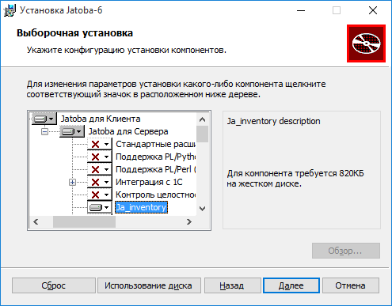
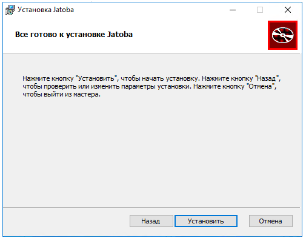
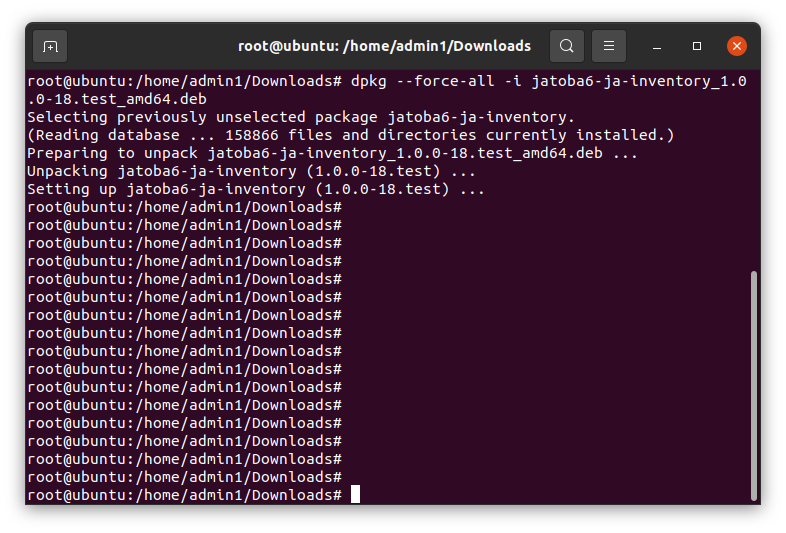
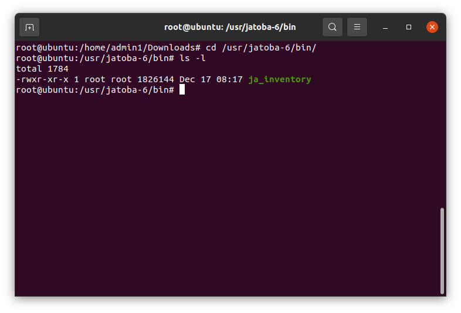
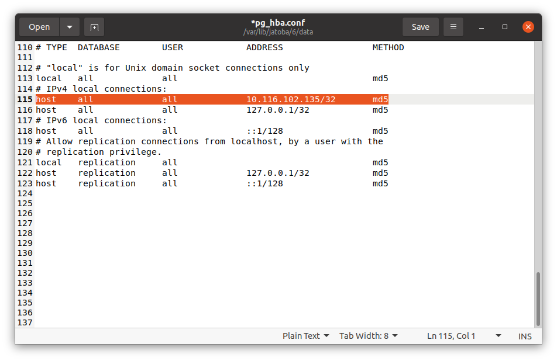
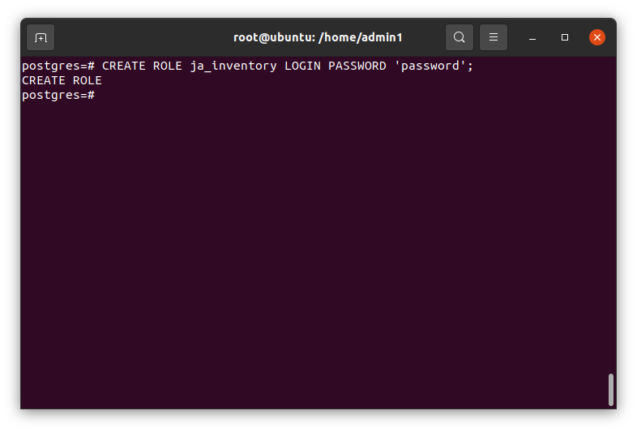
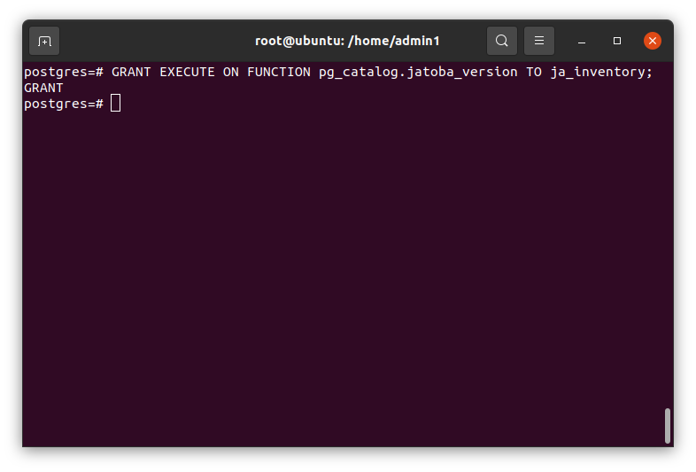
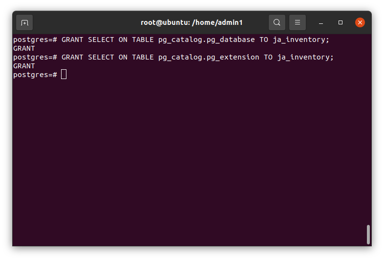
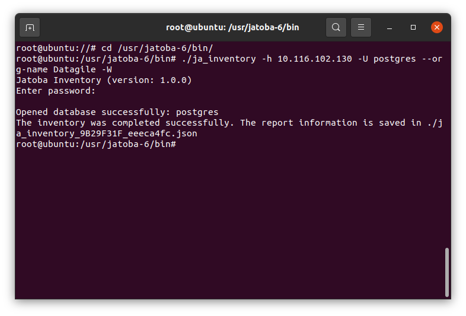
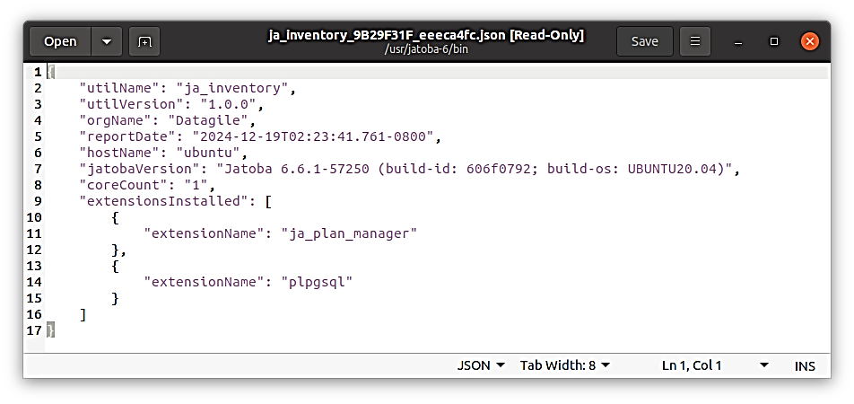

import Tabs from '@theme/Tabs';
import TabItem from '@theme/TabItem';
import TOCInline from '@theme/TOCInline';
<table>
<colgroup>
<col style="width: 49%" />
<col style="width: 50%" />
</colgroup>
<thead>
<tr class="header">
<th>
УТВЕРЖДЕН

643.72410666.00067-07 98 01-ЛУ
</th>
<th></th>
</tr>
</thead>
<tbody>
<tr class="odd">
<td colspan="2">
ЗАЩИЩЕННАЯ СИСТЕМА УПРАВЛЕНИЯ 
БАЗАМИ ДАННЫХ «JATOBA»

<strong>Руководство по настройке. Часть 23. 
Инвентаризация СУБД. 
Компонент «ja_Inventory»</strong>
</td>
</tr>
<tr class="even">
<td colspan="2"><strong>643.72410666.00067-07 98 01-23</strong></td>
</tr>
<tr class="odd">
<td></td>
<td></td>
</tr>
<tr class="even">
<td colspan="2">Листов 17</td>
</tr>
<tr class="odd">
<td></td>
<td></td>
</tr>
<tr class="even">
<td colspan="2">2025</td>
</tr>
<tr class="odd">
<td></td>
<td>Литера О1</td>
</tr>
</tbody>
</table>

**АННОТАЦИЯ**

В документе приведены сведения, необходимые для установки и эксплуатации
компонента «ja_Inventory» (далее по тексту – «компонент» или
ja_inventory), предназначенного для формирования файла отчета об
установленной СУБД «Jatoba».

Настоящее руководство предназначено для администраторов СУБД.

:::info[]
Все примеры в данном документе приведены для СУБД «Jatoba» версии
ядра 6.x, для других версий все шаги выполняются аналогично, разница
состоит в именах директорий.
Например, СУБД «Jatoba» версии 4.x по умолчанию устанавливается в
директорию:
- ОС Windows – «C:\Program Files\GIS\Jatoba\4\bin»;
- ОС Linux – «/usr/jatoba-4/bin».Версия компонента — 1.0
:::

Степени важности примечаний, применяемые в документе:

|   | **Важная информация** – указания, требующие особого внимания |
|---------------------------------------------|--------------------------------------------------------------|

|     | **Дополнительная информация** – указания, позволяющие упростить работу с изделием |
|-----------------------------------------|-----------------------------------------------------------------------------------|

<table>
<colgroup>
<col style="width: 11%" />
<col style="width: 88%" />
</colgroup>
<thead>
<tr class="header">
<th></th>
<th>
<strong>Важная информация</strong>

Для сертифицированной версии СУБД «Jatoba» поддерживается работа
только на ОС, указанных в формуляре на поставку!
</th>
</tr>
</thead>
<tbody>
</tbody>
</table>

**СОДЕРЖАНИЕ**

- [Назначение компонента](#назначение-компонента)
  - [версии СУБД;количествах ядер сервера;используемых расширениях.Условия применения](#версии-субдколичествах-ядер-сервераиспользуемых-расширенияхусловия-применения)
- [Установка и настройка](#установка-и-настройка)
  - [Установка компонента «ja\_Inventory» на ОС Windows](#установка-компонента-ja_inventory-на-ос-windows)
  - [Установка компонента «ja\_Inventory» в ОС GNU/Linux](#установка-компонента-ja_inventory-в-ос-gnulinux)
  - [Настройка конфигурационного файла «pg\_hba.conf»](#настройка-конфигурационного-файла-pg_hbaconf)
- [Функциональные возможности компонента](#функциональные-возможности-компонента)
  - [Синтаксис команды подключения](#синтаксис-команды-подключения)
  - [Параметры подключения](#параметры-подключения)
  - [Права пользователя СУБД](#права-пользователя-субд)
  - [Пример подключения к целевой СУБД и получения отчета](#пример-подключения-к-целевой-субд-и-получения-отчета)
- [Отчет в формате JSON](#отчет-в-формате-json)
- [Термины и определения](#термины-и-определения)
- 

# Назначение компонента

Компонент «ja_Inventory» предназначен для сбора на серверах Заказчика
информации об установленных СУБД «Jatoba» в форме отчета в формате JSON.
В отчет включается информация о:

-   
-   
-   

## версии СУБД;количествах ядер сервера;используемых расширениях.Условия применения

Компонент «ja_Inventory» может использоваться с СУБД «Jatoba» версий 4.x
и выше, под управлением операционных систем Windows и GNU/Linux.

Компонент выполнен в форме внешней утилиты и не имеет ограничений по
совместимости с другими компонентами.

# Установка и настройка

Установка компонента должна производится от имени пользователя,
обладающего административными привилегиями в системе.

Так как компонент выполнен в форме внешней утилиты, то для выполнения
своих функциональных возможностей не требует установленной СУБД, но
входит в дистрибутив. В силу этой особенности компонент возможно
установить:

-   
-   

в составе СУБД (см. документ «Защищенная система управления базами
данных «Jatoba». Руководство по установке);отдельно от СУБД.Данный
компонент штатным образом может быть установлен только с СУБД «Jatoba».

Установка компонента под управлением ОС Windows и ОС GNU/Linux приведено
ниже.

## Установка компонента «ja_Inventory» на ОС Windows

В ОС Windows нет способа отдельной установки компонента, т.к. компонент
включен в состав дистрибутива и устанавливается через инсталлятор.

Для установки компонента требуется выполнить следующие шаги:

1)  в окне «Выбор типа установки» следует выбрать тип установки «Выборочная» (см. рис. Рисунок 2.1);

Рисунок . – Окно выбора типа установки

2)  

в окне «Выборочная установка», выбрать «ja_Inventory» (см. рис. Рисунок
2.2);Остальные компоненты при ненадобности доступно отключить.

Рисунок . – Выбор устанавливаемых компонент

3)  

в открывшемся окне «Все готово к установке Jatoba» запустить процесс
установки, нажав кнопку «Установить» (см. рис. Рисунок
2.3);

Рисунок 2.3 – Окно «Все готово к установке Jatoba»

## Установка компонента «ja_Inventory» в ОС GNU/Linux

Пакет компонента входит в состав дистрибутива, однако может
функционировать, как в составе СУБД, так и на отдельном хосте. Поскольку
выполнен в виде внешней утилиты.

Установка в составе СУБД описана в документе «Защищенная система
управления базами данных «Jatoba». Руководство по установке.

Для функционирования компонента не требуется установка СУБД.

Установка на отдельном хосте без установки зависимостей

-   

> DEB пакета для ОС GNU/Linux выполняется командой:dpkg --force-all –i

Например

> dpkg --force-all -i jatoba6-ja-inventory_1.0.0-18.\_amd64.deb

Рисунок . – Установка пакета компонента

-   

> RPM пакета для ОС GNU/Linux выполняется командой:rpm -i
> jatoba6-ja-inventory\*.rpm --nodeps

В результате в каталоге СУБД будет находится единственный файл с
утилитой.

Рисунок . – Содержание каталога СУБД

Удаление модуля осуществляется средствами пакетного менеджера ОС. Вместо
команды install нужно использовать соответствующую данному пакетному
менеджеру команду удаления (remove, purge, erase и т.п.).

Для получения детальной информации по пакетному менеджеру рекомендуется
обратиться к документации по ОС.

## Настройка конфигурационного файла «pg_hba.conf»

Для подключения компонента «ja_Inventory» к целевой СУБД «Jatoba» в
конфигурационном файле «pg_hba.conf» должно быть разрешено подключение
от конкретного IP-адреса или подсти.

> host all all \<the_first_computer_IP_address\>/32 md5

В рассматриваемом примере:

-   
-   

компонента «ja_Inventory» находится на хосте с IP-адресом -
10.116.102.135;целевая СУБД находится на хосте с IP-адресом
-10.116.102.130При разрешении подключения с конкретного IP-адреса,
строка разрешения подключения может иметь вид, как представлено на
рисунке Рисунок 2.6.

Рисунок . - Вид конфигурационного файла «pg_hba.conf»

# Функциональные возможности компонента

Подключение к целевой СУБД компонентом «ja_Inventory» выполняется
аналогично, подключению интерактивным терминалом psql и используется
часть параметров подключения.

## Синтаксис команды подключения

Применяется следующий синтаксис команды подключения:

> ja_inventory {–n \| --org-name } Datagile {–h \| --host} IP-address
> {–U \| --user} user_name {–d \| --db_name} database {–o \|
> --output-dir} /temp/db {–W\|-w}

## Параметры подключения

Компонент «ja_Inventory» использует параметры подключения приведенные в
таблице Таблица 3.1. Используются типчные параметры подключения к СУБД
и введены дополнительные.

Таблица . – Параметры подключения компонента

<table>
<colgroup>
<col style="width: 6%" />
<col style="width: 16%" />
<col style="width: 53%" />
<col style="width: 11%" />
<col style="width: 11%" />
</colgroup>
<thead>
<tr class="header">
<th colspan="2"><strong>Параметр</strong></th>
<th><strong>Описание</strong></th>
<th><strong>Уник-й пар-р</strong></th>
<th><strong>Обяз-й пар-р</strong></th>
</tr>
</thead>
<tbody>
<tr class="odd">
<td>- h</td>
<td>--host</td>
<td>Хост СУБД</td>
<td></td>
<td>X</td>
</tr>
<tr class="even">
<td>-p</td>
<td>--port</td>
<td>Порт подключения</td>
<td></td>
<td></td>
</tr>
<tr class="odd">
<td>-d</td>
<td>--db_name</td>
<td>Название БД</td>
<td></td>
<td></td>
</tr>
<tr class="even">
<td>-U</td>
<td>--user</td>
<td>Пользователь СУБД</td>
<td></td>
<td></td>
</tr>
<tr class="odd">
<td>–o</td>
<td>--output-dir</td>
<td>Директория сохранения файла отчета</td>
<td>X</td>
<td></td>
</tr>
<tr class="even">
<td>-W</td>
<td></td>
<td>Принудительный ввод пароля пользователя</td>
<td></td>
<td></td>
</tr>
<tr class="odd">
<td>-w</td>
<td></td>
<td>
Не запрашивать пароль.

Если пароль требуется серверу, то будет ошибка:

no password supplied
</td>
<td></td>
<td></td>
</tr>
<tr class="even">
<td>–n</td>
<td>--org-name</td>
<td>Ввод имения организации</td>
<td>X</td>
<td>X</td>
</tr>
</tbody>
</table>

## Права пользователя СУБД

Файл отчета может быть получен от имени и с правами привилегированного
пользователя СУБД (SUPERUSER). В этом случае не требуется дополнительных
разрешений. Данный способ подключения менее трудозатратен, но не
является безопасным.

Целесообразнее использовать специальную учетную запись в СУБД, наделив
ее минимально достаточными привилегиями.

Такого пользователя и его привилегии Администратор СУБД должен создать
самостоятельно. Набор привилегий такого пользователя должен
распространяться на все БД в СУБД, в том числе права на подключение, а
также включать следующее:

-   

выделенный пользователь должен иметь атрибут LOGIN;CREATE ROLE
ja_inventory LOGIN PASSWORD 'password';

Рисунок 3.1 – Создание пользователя

-   

> выделенный пользователь должен уметь запускать функцию jatoba_version
> и получать результаты выполнения этой
> функции;GRANT EXECUTE ON FUNCTION pg_catalog.jatoba_version TO ja_inventory;

Рисунок . – SQL- команда наделения правом пользователя на выполнение
функции jatoba_version

|     | Разрешение применяется для всех БД |
|-----------------------------------------|------------------------------------|

-   
-   

> выделенный пользователь должен уметь читать таблицу pg_database в
> схеме pg_catalog;выделенный пользователь должен уметь читать таблицу
> pg_extension в схеме pg_catalog;GRANT SELECT ON TABLE
> pg_catalog.pg_database TO ja_inventory;

|     | Разрешение применяется для всех БД |
|-----------------------------------------|------------------------------------|

> GRANT SELECT ON TABLE pg_catalog.pg_extension TO ja_inventory;

Рисунок . – SQL – команды наделения правом пользователя на чтение таблиц

## Пример подключения к целевой СУБД и получения отчета

Запуск компонента выполняется из каталога СУБД, для чего требуется
перейти в него командой:

> cd /usr/jatoba-6/bin/

Команда получения фала отчета выполняется от имени и с правами
привилегированного пользователя ОС и имеет вид:

> ./ja_inventory -h 10.116.102.130 -U postgres --org-name Datagile –W

Рисунок . – Команда получения файла отчета

Компонент запросит пароль указанного в строке подключения пользователя и
если не указана директория сохранения файла отчета, то он будет сохранен
в текущей директории.

# Отчет в формате JSON

Получаемый отчет имеет формат JSON с реквизитами и атрибутами
приведенными в таблице Таблица 4.1.

Таблица . - Перечень реквизитов и атрибутов JSON

| **Реквизит**             | **Атрибут json** |
|--------------------------|------------------|
| Название утилиты         | utilName         |
| Версия утилиты           | utilVersion      |
| Наименование организации | orgName          |
| Дата формирования отчета | reportDate       |
| Имя хоста                | hostName         |
| Версия Jatoba            | jatobaVersion    |
| Ядра                     | coreCount        |
| Расширение               | extensionName    |

Отчет имеет вид представленный на рисунке Рисунок 4.1.

Рисунок . – Вид отчета о хосте

В процессе формирования отчета компонент:

-   
-   
-   

формирует значения атрибутов, описанных выше;рассчитывает контрольную
сумму (далее – КС) хеш-суммы по алгоритму CRC32.КС включается в имя
файла отчета и не может быть изменена;Пример названия файла отчета:

> ja_inventory_ABCDEF12_123456AB.json

# Термины и определения

**Администратор СУБД** – субъект доступа, выполняющий
административные функции в СУБД и наделенный правами:

-   
-   
-   
-   
-   

создавать учетные записи пользователей системы управления базами
данных;модифицировать, блокировать и удалять учетные записи
пользователей системы управления базами данных;назначать права доступа
пользователям системы управления базами данных к объектам доступа
системы управления базами данных;управлять конфигурацией системы
управления базами данных;создавать, подключать базы данных.Администратор
СУБД имеет атрибут SUPERUSER и/или обладает системной учетной записью
«postgres».

**Целевая СУБД** – СУБД являющаяся целью мониторинга.

**Пользователь БД** - субъект доступа, имеющий доступ к ограниченному
перечню БД и объектов БД. Имеющий следующий набор привилегий:

- создавать и манипулировать объектами доступа БД (таблица, запись или столбец, поле, представление и иные объекты доступа);
- выполнять процедуры (программный код), хранимые в БД.Пользователь БД имеет обязательный атрибут LOGIN.

# 

| Перечень сокращенийSQL | –   | Structured Query Language        |
|-----------------------------------------------------------------------|-----|----------------------------------|
| БД                                                                    | –   | База данных                      |
| КС                                                                    | –   | Контрольные суммы                |
| ОС                                                                    | –   | Операционная система             |
| СУБД                                                                  | –   | Система управления базами данных |

