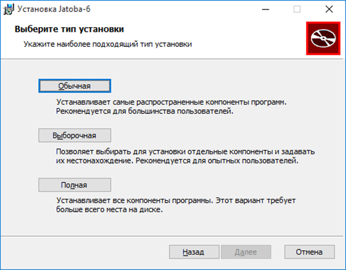
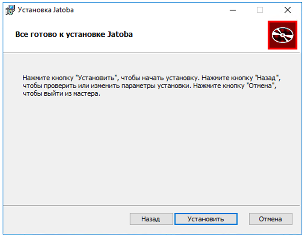
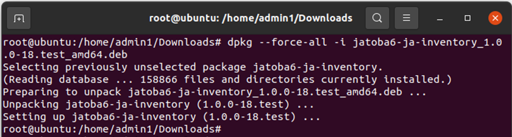
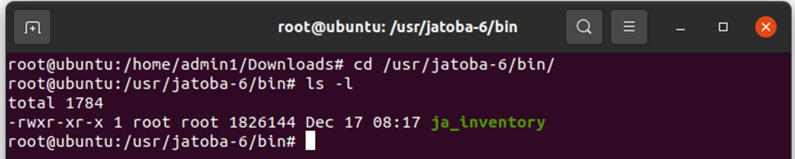
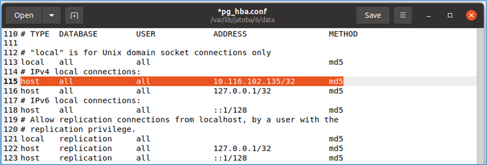

- [1. НАЗНАЧЕНИЕ КОМПОНЕНТА](#1-назначение-компонента)
  - [1.1. Условия применения](#11-условия-применения)
- [2. УСТАНОВКА И НАСТРОЙКА](#2-установка-и-настройка)
  - [2.1. Установка компонента «ja\_Inventory» на ОС Windows](#21-установка-компонента-ja_inventory-на-ос-windows)
  - [2.2. Установка компонента «ja\_Inventory» в ОС GNU/Linux](#22-установка-компонента-ja_inventory-в-ос-gnulinux)
  - [2.3. Настройка конфигурационного файла «pg\_hba.conf»](#23-настройка-конфигурационного-файла-pg_hbaconf)
- [3. ФУНКЦИОНАЛЬНЫЕ ВОЗМОЖНОСТИ КОМПОНЕНТА](#3-функциональные-возможности-компонента)
  - [3.1. Синтаксис команды подключения](#31-синтаксис-команды-подключения)


:::tip[test tip]
tip tip tip
:::

## 1. НАЗНАЧЕНИЕ КОМПОНЕНТА

Компонент «ja_Inventory» предназначен для сбора на серверах Заказчика информации об установленных СУБД «Jatoba» в форме отчета в формате JSON. В отчет включается информация о:

- версии СУБД;
- количествах ядер сервера;
- используемых расширениях.

### 1.1. Условия применения
Компонент «ja_Inventory» может использоваться с СУБД «Jatoba» версий 4.x и выше, под управлением операционных систем Windows и GNU/Linux.
Компонент выполнен в форме внешней утилиты и не имеет ограничений по совместимости с другими компонентами.

## 2. УСТАНОВКА И НАСТРОЙКА

:::note[test note]
tip tip tip
:::

Установка компонента должна производится от имени пользователя, обладающего административными привилегиями в системе. 

Так как компонент выполнен в форме внешней утилиты, то для выполнения своих функциональных возможностей не требует установленной СУБД, но входит в дистрибутив. В силу этой особенности компонент возможно установить: 
- в составе СУБД (см. документ «Защищенная система управления базами данных «Jatoba». Руководство по установке);
- отдельно от СУБД.

Данный компонент штатным образом может быть установлен только с СУБД «Jatoba».

Установка компонента под управлением ОС Windows и ОС GNU/Linux приведена ниже.

### 2.1. Установка компонента «ja_Inventory» на ОС Windows

В ОС Windows нет способа отдельной установки компонента, т.к. компонент включен в состав дистрибутива и устанавливается через инсталлятор. 

Для установки компонента требуется выполнить следующие шаги:
1. в окне «Выбор типа установки» следует выбрать тип установки «Выборочная» (см. рис. 2.1);



Рисунок 2.1 – Окно выбора типа установки

2. в открывшемся окне «Все готово к установке Jatoba» запустить процесс установки, нажав кнопку «Установить» (см. рис. 2.3);



Рисунок 2.3 – Окно «Все готово к установке Jatoba»

:::note[Title]
Content goes here
:::

### 2.2. Установка компонента «ja_Inventory» в ОС GNU/Linux

Пакет компонента входит в состав дистрибутива, однако может функционировать, как в составе СУБД, так и на отдельном хосте. Поскольку выполнен в виде внешней утилиты. 

Установка в составе СУБД описана в документе «Защищенная система управления базами данных «Jatoba». Руководство по установке.

Для функционирования компонента не требуется установка СУБД.

Установка на отдельном хосте без установки зависимостей 

- DEB пакета для ОС GNU/Linux выполняется командой:

```shell
dpkg --force-all -i
```

Например

```shell
dpkg --force-all -i jatoba6-ja-inventory_1.0.0-18._amd64.deb
```



Рисунок 2.4 - Установка пакета компонента

- RPM пакета для ОС GNU/Linux выполняется командой:

```shell
rpm -i jatoba6-ja-inventory*.rpm --nodeps
```

В результате в каталоге СУБД будет находится единственный файл с утилитой.



Рисунок 2.5 – Содержание каталога СУБД

Удаление модуля осуществляется средствами пакетного менеджера ОС. Вместо команды install нужно использовать соответствующую данному пакетному менеджеру команду удаления (remove, purge, erase и т.п.).

Для получения детальной информации по пакетному менеджеру рекомендуется обратиться к документации по ОС.

### 2.3. Настройка конфигурационного файла «pg_hba.conf»

Для подключения компонента «ja_Inventory» к целевой СУБД «Jatoba» в конфигурационном файле «pg_hba.conf» должно быть разрешено подключение от конкретного IP-адреса или подсети.

```shell
host all all <the_first_computer_IP_address>/32 md5
```

В рассматриваемом примере:
- компонента «ja_Inventory» находится на хосте с IP-адресом - 10.116.102.135;
- целевая СУБД находится на хосте с IP-адресом -10.116.102.130
  
При разрешении подключения с конкретного IP-адреса, строка разрешения подключения может иметь вид, как представлено на рисунке 2.6.


Рисунок 2.6 - Вид конфигурационного файла «pg_hba.conf»

## 3. ФУНКЦИОНАЛЬНЫЕ ВОЗМОЖНОСТИ КОМПОНЕНТА

Подключение к целевой СУБД компонентом «ja_Inventory» выполняется аналогично, подключению интерактивным терминалом psql и используется часть параметров подключения. 

### 3.1. Синтаксис команды подключения

Применяется следующий синтаксис команды подключения:	

```shell
ja_inventory {–n | --org-name } Datagile {–h | --host} IP-address {–U | --user} user_name {–d | --db_name} database {–o | --output-dir} /temp/db {–W|-w}
```
